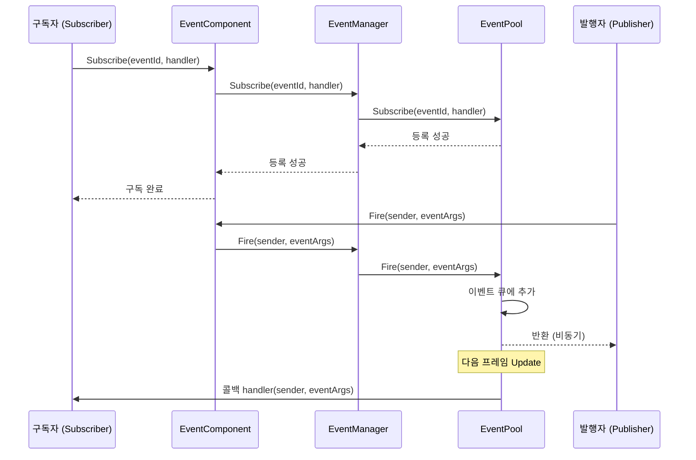
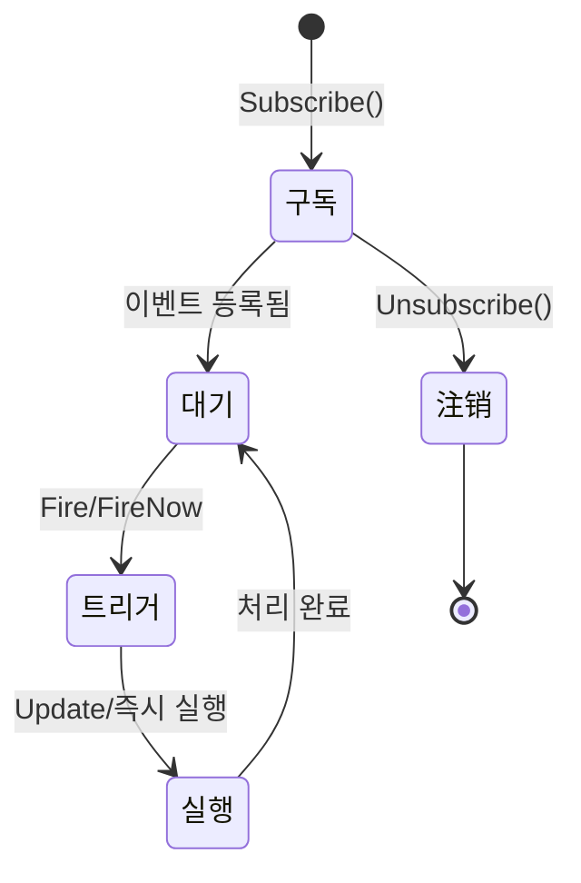
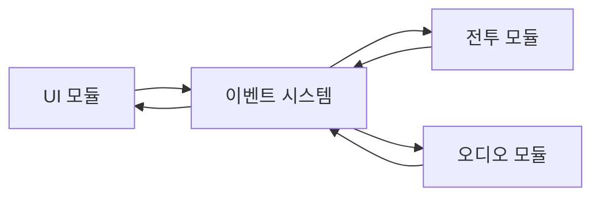
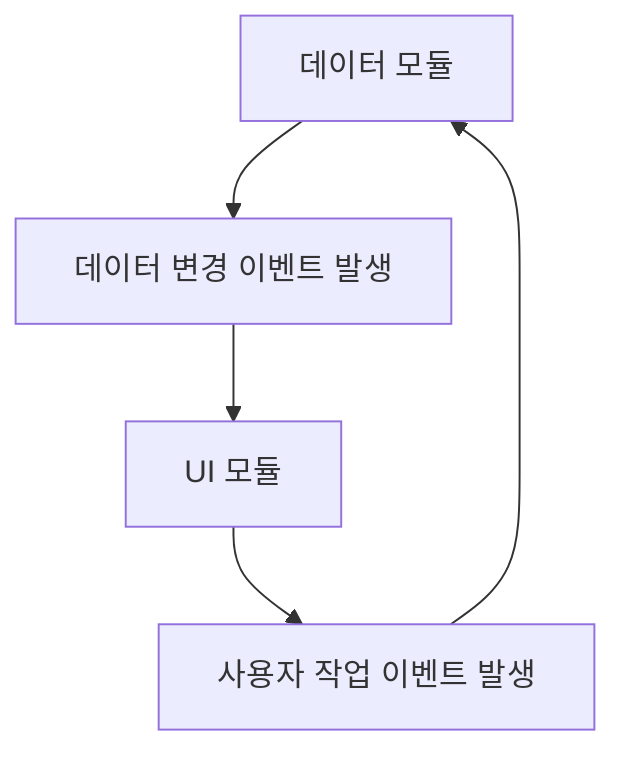

# 이벤트 시스템 아키텍처

GameFrameX 이벤트 시스템은 发布-구독(Pub-Sub) 모드를 기반으로 하는事件驱动 프레임워크로, 스레드 안전한 비동기 이벤트 배포 메커니즘을 제공합니다. 이 시스템은 GameFrameX 아키텍처의 핵심 컴포넌트 중 하나로, 게임 개발의 분리 및 이벤트 통신을 지원합니다.

## 개요

이벤트 시스템은 게임 개발의 컴포넌트 통신 문제를 해결하기 위해 설계되었습니다. 게임 개발에서 서로 다른 모듈(UI, 전투, 시스템 등)은 서로 통신해야 하지만 직접 호출하면 긴밀한 결합이 발생합니다. 이벤트 시스템은 이벤트 채널을 도입하여 모듈 간 느슨한 결합 통신을 가능하게 합니다:

- **발행자(Publisher)**: 이벤트를 발생시키며 누가 수신하는지 신경 쓰지 않음
- **구독자(Subscriber)**: 이벤트를 리스닝하고 처리하며 누가 발생하는지 신경 쓰지 않음
- **이벤트 채널**: 이벤트를 발행자로부터 구독자에게 전달하는 역할 담당

### 핵심 특성

| 특성 | 설명 |
|------|------|
| 스레드 안전성 | `Fire` 메서드가跨스레드 호출 지원, 메인 스레드에서 콜백 자동 처리 |
| 지연 배포 | 비동기 이벤트가 다음 프레임에서 배포되어 로직 동기화 문제 회피 |
| 즉시 배포 | `FireNow` 메서드가 즉시 콜백 실행 (스레드 안전성 주의 필요) |
| 다중 캐스트 지원 |同一 이벤트에 여러 처리 함수 바인딩 가능 |
| 기본 처리 | 미구독 이벤트 캡처를 위한 기본 핸들러 설정 지원 |
| 객체 풀 | EventPool을 사용하여 메모리 할당 감소 |

## 아키텍처 설계

### 컴포넌트 계층 구조

```mermaid
flowchart TB
    subgraph Unity["Unity 엔진层"]
        Mono[MonoBehaviour 스크립트]
    end

    subgraph Component["Component 캡슐화层"]
        EC[EventComponent]
    end

    subgraph Interface["인터페이스 추상화层"]
        IEM[IEventManager]
    end

    subgraph Implementation["구현层"]
        EM[EventManager]
        EP[EventPool]
    end

    subgraph Runtime["런타임 의존성"]
        Pool[EventPool 핵심]
    end

    Mono --> EC
    EC --> IEM
    IEM <|.. EM
    EM --> EP
    EP --> Pool
```

### 핵심 컴포넌트 설명

#### 1. EventComponent

Unity 컴포넌트로, `GameFrameworkComponent`를 상속하여 Unity 지향 이벤트 인터페이스를 제공합니다.

```csharp
public sealed class EventComponent : GameFrameworkComponent
{
    private IEventManager m_EventManager = null;

    protected override void Awake()
    {
        ImplementationComponentType = Utility.Assembly.GetType(componentType);
        InterfaceComponentType = typeof(IEventManager);
        base.Awake();
        m_EventManager = GameFrameworkEntry.GetModule<IEventManager>();
    }

    public void Fire(object sender, GameEventArgs e);
    public void FireNow(object sender, GameEventArgs e);
    public void Subscribe(string id, EventHandler<GameEventArgs> handler);
    public void Unsubscribe(string id, EventHandler<GameEventArgs> handler);
}
```
> Source: [EventComponent.cs](https://github.com/GameFrameX/com.gameframex.unity.event/blob/main/Runtime/EventComponent.cs#L1-L155)

#### 2. IEventManager

이벤트 관리자 인터페이스로, 이벤트 시스템의 핵심 조작 계약을 정의합니다:

```csharp
public interface IEventManager
{
    int EventHandlerCount { get; }
    int EventCount { get; }

    void Subscribe(string id, EventHandler<GameEventArgs> handler);
    void Unsubscribe(string id, EventHandler<GameEventArgs> handler);
    void Fire(object sender, GameEventArgs e);
    void FireNow(object sender, GameEventArgs e);
    void SetDefaultHandler(EventHandler<GameEventArgs> handler);
}
```
> Source: [IEventManager.cs](https://github.com/GameFrameX/com.gameframex.unity.event/blob/main/Runtime/Event/IEventManager.cs#L1-L77)

#### 3. EventManager

`IEventManager`의 구현 클래스로, 내부적으로 `EventPool`을 사용하여 이벤트를 관리합니다:

```csharp
public sealed class EventManager : GameFrameworkModule, IEventManager
{
    private readonly EventPool<GameEventArgs> m_EventPool;

    public EventManager()
    {
        m_EventPool = new EventPool<GameEventArgs>(
            EventPoolMode.AllowNoHandler | EventPoolMode.AllowMultiHandler);
    }

    public void Fire(object sender, GameEventArgs e)
    {
        m_EventPool.Fire(sender, e);
    }

    public void FireNow(object sender, GameEventArgs e)
    {
        m_EventPool.FireNow(sender, e);
    }
}
```
> Source: [EventManager.cs](https://github.com/GameFrameX/com.gameframex.unity.event/blob/main/Runtime/Event/EventManager.cs#L1-L142)

#### 4. EventPool (GameFrameX.Runtime 의존)

이벤트 풀은 하층 구현으로 다음을 담당합니다:
- 이벤트 구독 관계 저장
- 이벤트 객체 관리 (GC 감소를 위한 객체 풀 사용)
- 처리 함수에 이벤트 배포

### 클래스 상속 관계

```mermaid
classDiagram
    class BaseEventArgs {
        <<abstract>>
        +Id: string { get; }
        +Clear() void
    }

    class GameEventArgs {
        <<abstract>>
    }

    class EmptyEventArgs {
        -_eventId: string
        +Create(eventId): EmptyEventArgs
    }

    BaseEventArgs <|-- GameEventArgs
    GameEventArgs <|-- EmptyEventArgs
```

### 이벤트 파라미터 체계

**GameEventArgs**는 모든 게임 이벤트의 基类입니다:

```csharp
public abstract class GameEventArgs : BaseEventArgs
{
}
```
> Source: [GameEventArgs.cs](https://github.com/GameFrameX/com.gameframex.unity.event/blob/main/Runtime/EventArgs/GameEventArgs.cs#L1-L19)

**EmptyEventArgs**는 데이터 전달이 필요 없는 단순 이벤트에 사용됩니다:

```csharp
public sealed class EmptyEventArgs : GameEventArgs
{
    public static EmptyEventArgs Create(string eventId)
    {
        var eventArgs = ReferencePool.Acquire<EmptyEventArgs>();
        eventArgs.SetEventId(eventId);
        return eventArgs;
    }
}
```
> Source: [EmptyEventArgs.cs](https://github.com/GameFrameX/com.gameframex.unity.event/blob/main/Runtime/EventArgs/EmptyEventArgs.cs#L1-L47)

## 이벤트 흐름

### 구독 및 배포 흐름



### 두 가지 배포 모드 비교

| 모드 | 메서드 | 스레드 안전성 | 실행时机 | 적용 시나리오 |
|------|------|----------|----------|----------|
| 지연 배포 | `Fire()` | ✅ 안전 | 다음 프레임 | 비동기 로직,跨스레드 호출 |
| 즉시 배포 | `FireNow()` | ⚠️ 주의 | 즉시 | 동기 로직, 메인 스레드 확정 |

**설계 의도:**

- **Fire 메서드**: 지연 배포를 채택하여 백그라운드 스레드에서 이벤트를 발생시키더라도 콜백이 메인 스레드에서 실행되도록 보장합니다. 이는 Unity 개발에非常重要하며, 동시에 현재 프레임에서 예기치 않은 계산이 발생하는 것을 방지하기 위해 다음 프레임으로 지연합니다.

- **FireNow 메서드**: 즉시 콜백을 실행하여 성능이 더 높지만, 호출자는 메인 스레드에서 실행되고 콜백 실행이 문제를 일으키지 않음을確保해야 합니다.

### 이벤트 생명주기



## 사용 예시

### 기본 구독 및 배포

```csharp
public class Player : MonoBehaviour
{
    private EventComponent _eventComponent;

    private void Start()
    {
        // 이벤트 컴포넌트 획득
        _eventComponent = UnityEngine.Component.FindObjectOfType<EventComponent>();

        // 이벤트 구독
        _eventComponent.CheckSubscribe("OnPlayerDead", OnPlayerDead);
    }

    private void OnPlayerDead(object sender, GameEventArgs e)
    {
        UnityEngine.Debug.Log("플레이어 사망!");
    }

    private void OnCollisionEnter(UnityEngine.Collision collision)
    {
        // 이벤트 발생
        _eventComponent.Fire(this, EmptyEventArgs.Create("OnPlayerDead"));
    }
}
```
> Source: [EventComponent.cs](https://github.com/GameFrameX/com.gameframex.unity.event/blob/main/Runtime/EventComponent.cs#L80-L114)

### 自定义 이벤트 파라미터

```csharp
// 自定义 이벤트 파라미터 정의
public class DamageEventArgs : GameEventArgs
{
    public int Damage { get; set; }
    public UnityEngine.Vector3 Position { get; set; }
}

// 데이터를 포함한 이벤트 발생
var args = ReferencePool.Acquire<DamageEventArgs>();
args.Damage = 100;
args.Position = transform.position;
eventComponent.Fire(this, args);
```

### 기본 핸들러

```csharp
// 미구독 이벤트를 캡처하기 위한 기본 핸들러 설정
eventComponent.SetDefaultHandler((sender, e) =>
{
    UnityEngine.Debug.Log($"미처리된 이벤트: {e.Id}");
});
```
> Source: [EventManager.cs](https://github.com/GameFrameX/com.gameframex.unity.event/blob/main/Runtime/Event/EventManager.cs#L113-L120)

## 설정 및 확인

### 이벤트 통계

```csharp
// 이벤트 처리 함수 수 획득
int handlerCount = eventComponent.EventHandlerCount;

// 이벤트 타입 수 획득
int eventCount = eventComponent.EventCount;
```
> Source: [EventComponentInspector.cs](https://github.com/GameFrameX/com.gameframex.unity.event/blob/main/Editor/Inspector/EventComponentInspector.cs#L27-L33)

### 구독 상태 확인

```csharp
// 특정 이벤트 처리 함수가是否存在 확인
bool exists = eventComponent.Check("OnPlayerDead", OnPlayerDeadHandler);
```
> Source: [EventComponent.cs](https://github.com/GameFrameX/com.gameframex.unity.event/blob/main/Runtime/EventComponent.cs#L72-L75)

## 일반적인 사용 모드

### 모드 1: 모듈 간 분리



UI 모듈은 전투 모듈의存在를 알지 못하며, 단지 "전투 시작" 이벤트를 구독합니다. 전투 모듈은 누가 수신하는지 신경 쓰지 않고 단지 이벤트를 발생시킵니다.

### 모드 2: 데이터驱动 UI



데이터 변화 시 이벤트를 발생시키고 UI가 자동으로 대응 업데이트합니다. 사용자 작업은 이벤트를 통해 데이터 모듈에 통지하여 처리합니다.

### 모드 3: 시스템 간 통신

게임의 각 시스템(달성 시스템, 퀘스트 시스템, 로그 시스템)이同一 이벤트를 구독하여 서로 다른 대응을 구현할 수 있습니다:

```csharp
// 달성 시스템
achievementComponent.Subscribe("LevelComplete", OnLevelComplete);

// 퀘스트 시스템
questComponent.Subscribe("LevelComplete", OnLevelComplete);

// 로그 시스템
logComponent.Subscribe("LevelComplete", OnLevelComplete);

// 레벨 완료 시 모든 시스템이 통지를 받습니다
levelComponent.Fire(this, new LevelCompleteEventArgs { Level = 5 });
```

## 설계 장점

1. **느슨한 결합**: 발행자와 구독자가 직접 의존하지 않음
2. **확장 가능**: 새 구독자 추가 시 발행자 코드 수정 불필요
3. **스레드 안전성**:跨스레드 이벤트 배포 지원
4. **성능 최적화**: 객체 풀을 사용하여 GC 감소
5. **유연한 제어**: 지연 배포 및 즉시 배포 두 가지 모드 지원

## 주의 사항

1. **메모리 누수 방지**: 컴포넌트 파괴 시 반드시 구독 취소
2. **Fire vs FireNow**: 명확하게 메인 스레드에 있지 않으면 `Fire` 사용
3. **이벤트 ID 관리**: 상수 또는 열거형을 사용하여 이벤트 ID 관리 권장, 문자열 하드 코딩 회피
4. **콜백 성능**: 콜백에서 시간 소모 operation 실행 금지

## 관련 링크

- [EventComponent API 참고](./05.event-component.md)
- [EventManager API 참고](./06.event-manager.md)
- [GameEventArgs API 참고](./07.game-event-args.md)
- [빠른 시작](./03.getting-started.md)
- [자주 묻는 질문](./08.troubleshooting.md)