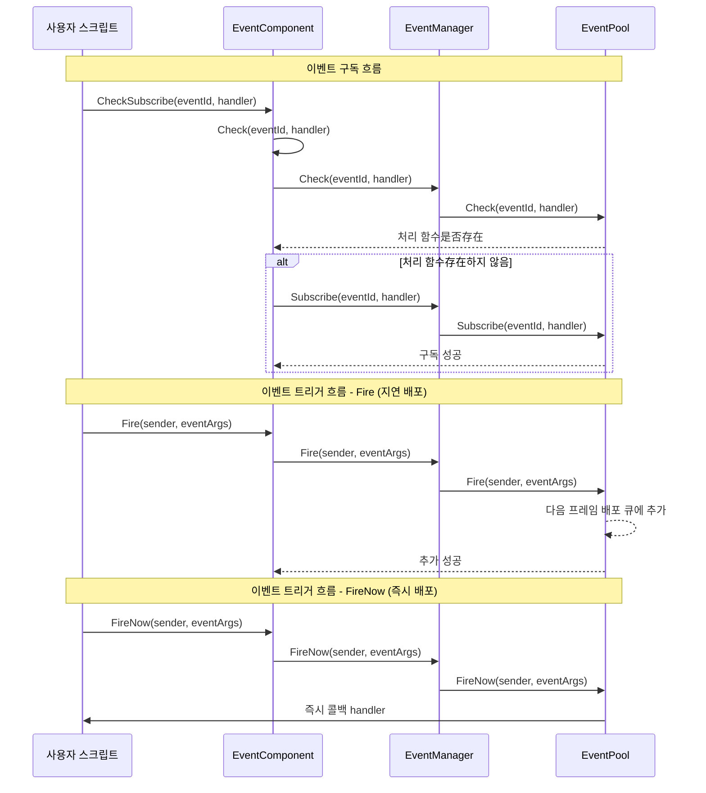

# EventComponent

EventComponent는 Game Frame X 이벤트 시스템의 Unity 컴포넌트 层로, 옵저버 모드를 기반으로 한 이벤트 구독 및 发布 기능을 제공합니다.

## 개요

EventComponent는 게임 프레임워크의 핵심 이벤트 컴포넌트로, `GameFrameworkComponent`를 상속합니다. Unity 게임 객체 컴포넌트로, 구성 가능한易于使用的事件 시스템 인터페이스를 제공합니다.

### 핵심 책임

- **이벤트 구독**: 스크립트가 특정 이벤트 ID의 처리 함수 구독 허용
- **이벤트 구독 취소**: 스크립트가 특정 이벤트의 구독 취소 허용
- **이벤트 트리거**: 두 가지 모드(지연 배포 및 즉시 배포)로 이벤트 트리거 지원
- **스레드 안전성**:跨스레드 이벤트 트리거 시 메인 스레드 콜백 보장

### 컴포넌트 특성

- `GameFrameworkComponent`를 상속하여 프레임워크 컴포넌트 규범 따름
- `[DisallowMultipleComponent]` 특성을 사용하여 중복 추가 방지
- `[AddComponentMenu]`를 사용하여 Unity 편집기에 컴포넌트 메뉴 항목 추가
- 다중 핸들러(MultiHandler) 및 무 핸들러(NoHandler) 모드 지원

## 아키텍처

EventComponent는 이벤트 시스템에서의 위치 및 상호작용 관계:

```mermaid
flowchart TD
    subgraph UnityLayer["Unity 게임层"]
        EventComp[EventComponent]
    end

    subgraph FrameworkLayer["Game Framework 핵심层"]
        GFComponent[GameFrameworkComponent]
        GFEntry[GameFrameworkEntry]
    end

    subgraph EventLayer["이벤트 시스템层"]
        IEventMgr[IEventManager]
        EventMgr[EventManager]
        EventPool[EventPool<GameEventArgs>]
    end

    subgraph UserLayer["사용자 스크립트层"]
        ScriptA[사용자 스크립트 A]
        ScriptB[사용자 스크립트 B]
    end

    EventComp -->|"상속"| GFComponent
    EventComp -->|"모듈 획득"| GFEntry
    GFEntry -->|"반환"| IEventMgr
    IEventMgr <|.구현.| EventMgr
    EventMgr -->|"사용"| EventPool
    
    ScriptA -->|"이벤트 구독"| EventComp
    ScriptB -->|"이벤트 구독"| EventComp
    EventComp -->|"이벤트 트리거"| EventPool
    EventPool -.->|"콜백"| ScriptA
    EventPool -.->|"콜백"| ScriptB
```

### 이벤트 시스템 아키텍처 설명

| 层 | 컴포넌트 | 책임 |
|------|------|------|
| Unity层 | EventComponent | Unity 컴포넌트 인터페이스 제공, 하층 모듈 캡슐화 |
| 프레임워크 핵심层 | GameFrameworkEntry | 모듈 초기화 및 의존성 주입 |
| 이벤트 시스템层 | IEventManager | 이벤트 관리자 인터페이스 정의 |
| 이벤트 시스템层 | EventManager | 이벤트 관리자 구현 |
| 이벤트 시스템层 | EventPool | 이벤트 저장 및 배포 담당 |

## 핵심 흐름

이벤트 구독 및 트리거의 완전한 흐름:



### 이벤트 배포 모드 비교

| 모드 | 메서드 | 스레드 안전성 | 배포时机 | 적용 시나리오 |
|------|------|----------|----------|----------|
| 지연 배포 | `Fire()` | ✅ 예 | 다음 프레임 | 대부분의情况, 특히跨스레드 트리거 |
| 즉시 배포 | `FireNow()` | ❌ 아니오 | 즉시 | 확정성 요구가 높은 동기 시나리오 |

## 사용 예시

### 기본 사용 - 이벤트 구독 및 트리거

```csharp
using GameFrameX.Event.Runtime;

// 이벤트 파라미터 클래스 정의
public class PlayerDeadEventArgs : GameEventArgs
{
    public int PlayerId { get; set; }
    public string Reason { get; set; }
    
    public override void Clear()
    {
        PlayerId = 0;
        Reason = string.Empty;
    }

    public override string Id => "player.dead";
}

// 이벤트를 리스닝해야 하는 스크립트에서
public class PlayerController : MonoBehaviour
{
    private EventComponent _eventComponent;

    private void Start()
    {
        // EventComponent 컴포넌트 획득
        _eventComponent = UnityEngine.GameObject.FindObjectOfType<EventComponent>();
        
        // 이벤트 구독 - CheckSubscribe를 사용하여 중복 구독 자동 확인
        _eventComponent.CheckSubscribe(PlayerDeadEventArgs args => OnPlayerDead(args));
    }

    private void OnPlayerDead(PlayerDeadEventArgs args)
    {
        UnityEngine.Debug.Log($"플레이어 {args.PlayerId} 사망: {args.Reason}");
    }

    private void OnDestroy()
    {
        // 이벤트 구독 취소
        if (_eventComponent != null)
        {
            _eventComponent.Unsubscribe("player.dead", OnPlayerDead);
        }
    }
}

// 이벤트를 트리거하는 스크립트에서
public class GameManager : MonoBehaviour
{
    private EventComponent _eventComponent;

    private void Start()
    {
        _eventComponent = UnityEngine.GameObject.FindObjectOfType<EventComponent>();
    }

    public void KillPlayer(int playerId)
    {
        // 이벤트 파라미터 생성
        var eventArgs = ReferencePool.Acquire<PlayerDeadEventArgs>();
        eventArgs.PlayerId = playerId;
        eventArgs.Reason = "괴물에게 살해됨";

        // 이벤트 트리거
        _eventComponent.Fire(this, eventArgs);
        
        // 이벤트 파라미터는 자동 회수됨
    }
}
```
> Source: [EventComponent.cs](https://github.com/GameFrameX/com.gameframex.unity.event/blob/main/Runtime/EventComponent.cs#L1-L155)
> Source: [GameEventArgs.cs](https://github.com/GameFrameX/com.gameframex.unity.event/blob/main/Runtime/EventArgs/GameEventArgs.cs#L1-L19)

### 간소화된 이벤트 - 빈 이벤트 파라미터 사용

데이터 전달이 필요 없고 이벤트 ID만 전달하면 되는 경우:

```csharp
// 단순 이벤트 트리거
_eventComponent.Fire(this, "player.respawn");

// 단순 이벤트 구독
_eventComponent.CheckSubscribe("player.respawn", args => 
{
    UnityEngine.Debug.Log("플레이어 재시작");
});
```
> Source: [EventComponent.cs](https://github.com/GameFrameX/com.gameframex.unity.event/blob/main/Runtime/EventComponent.cs#L140-L144)

### 기본 이벤트 핸들러 사용

모든 미처리 이벤트에 대한 기본 핸들러를 설정할 수 있습니다:

```csharp
// 기본 핸들러 설정
_eventComponent.SetDefaultHandler((sender, args) =>
{
    UnityEngine.Debug.Log($"미처리된 이벤트: {args.Id}");
});
```
> Source: [EventComponent.cs](https://github.com/GameFrameX/com.gameframex.unity.event/blob/main/Runtime/EventComponent.cs#L120-L123)

## API 참고

### 속성

#### `EventHandlerCount`

```csharp
public int EventHandlerCount { get; }
```

구독된 이벤트 처리 함수의 총 수를 획득합니다.

**반환:** 이벤트 처리 함수의 총 수

---

#### `EventCount`

```csharp
public int EventCount { get; }
```

구독된 이벤트 타입의 총 수를 획득합니다.

**반환:** 이벤트 타입의 총 수

---

### 메서드

#### `Count(id: string): int`

```csharp
public int Count(string id)
```

지정된 이벤트 ID의 이벤트 처리 함수 수를 획득합니다.

**파라미터:**
- `id` (string): 이벤트 타입 번호

**반환:** 해당 이벤트 ID에 연결된 이벤트 처리 함수의 수

---

#### `Check(id: string, handler: EventHandler<GameEventArgs>): bool`

```csharp
public bool Check(string id, EventHandler<GameEventArgs> handler)
```

지정된 이벤트 ID에 특정 이벤트 처리 함수가是否存在 확인합니다.

**파라미터:**
- `id` (string): 이벤트 타입 번호
- `handler` (EventHandler<GameEventArgs>): 확인할 이벤트 처리 함수

**반환:** 해당 이벤트 처리 함수가是否存在 여부

---

#### `CheckSubscribe(id: string, handler: EventHandler<GameEventArgs>): void`

```csharp
public void CheckSubscribe(string id, EventHandler<GameEventArgs> handler)
```

이벤트 처리 함수를 확인하고 구독합니다. 처리 함수가存在하지 않으면 자동으로 구독합니다.

**설계 의도:** 이 메서드는 중복 구독 문제를 해결합니다. Unity 개발에서 Start() 또는 OnEnable()에서 이벤트를 구독하는 경우가 많은데, 이러한 메서드가 여러 번 호출되면同一 처리 함수가 중복 구독됩니다. 이 메서드는 구독 전 확인하여 중복 구독을 방지합니다.

**파라미터:**
- `id` (string): 이벤트 타입 번호
- `handler` (EventHandler<GameEventArgs>): 구독할 이벤트 처리 콜백 함수

---

#### `Subscribe(id: string, handler: EventHandler<GameEventArgs>): void`

```csharp
[Obsolete("Use CheckSubscribe instead.")]
public void Subscribe(string id, EventHandler<GameEventArgs> handler)
```

> ⚠️ 已废弃, CheckSubscribe 사용을 권장합니다.

이벤트 처리 콜백 함수를 구독합니다.

**파라미터:**
- `id` (string): 이벤트 타입 번호
- `handler` (EventHandler<GameEventArgs>): 구독할 이벤트 처리 콜백 함수

---

#### `Unsubscribe(id: string, handler: EventHandler<GameEventArgs>): void`

```csharp
public void Unsubscribe(string id, EventHandler<GameEventArgs> handler)
```

이벤트 처리 콜백 함수의 구독을 취소합니다.

**설계 의도:** Unity에서 스크립트가 파괴될 때(장면 전환, 객체 파괴 등) 반드시 이벤트 구독을 취소하여 null 참조 예외를 방지해야 합니다. 일반적으로 OnDestroy() 또는 OnDisable()에서 호출합니다.

**파라미터:**
- `id` (string): 이벤트 타입 번호
- `handler` (EventHandler<GameEventArgs>): 구독 취소할 이벤트 처리 콜백 함수

---

#### `SetDefaultHandler(handler: EventHandler<GameEventArgs>): void`

```csharp
public void SetDefaultHandler(EventHandler<GameEventArgs> handler)
```

기본 이벤트 처리 함수를 설정합니다. 미구독자가 있는 이벤트가 트리거될 때 기본 핸들러가 호출됩니다.

**파라미터:**
- `handler` (EventHandler<GameEventArgs>): 설정할 기본 이벤트 처리 함수

---

#### `Fire(sender: object, e: GameEventArgs): void`

```csharp
public void Fire(object sender, GameEventArgs e)
```

이벤트를 발생시킵니다 (지연 배포 모드).

**설계 의도:** 이 메서드는 스레드 안전합니다. 백그라운드 스레드에서 `Fire()`를 호출하더라도 이벤트 콜백은 메인 스레드의 다음 프레임에서만 실행됩니다. 이는 권장되는 이벤트 트리거 방식으로, 네트워크 메시지 콜백, 비동기 작업 완료 통지 등의 시나리오에 특히 적합합니다.

**파라미터:**
- `sender` (object): 이벤트 발신자, 일반적으로 `this` 전달
- `e` (GameEventArgs): 이벤트 파라미터 객체

---

#### `Fire(sender: object, eventId: string): void`

```csharp
public void Fire(object sender, string eventId)
```

이벤트를 발생시킵니다 (빈 이벤트 파라미터 사용).

**설계 의도:** 추가 데이터 전달이 필요 없고 이벤트 ID만 전달하면 되는 간소화된 이벤트 트리거 방식을 제공합니다.

**파라미터:**
- `sender` (object): 이벤트 발신자
- `eventId` (string): 이벤트 번호

---

#### `FireNow(sender: object, e: GameEventArgs): void`

```csharp
public void FireNow(object sender, GameEventArgs e)
```

이벤트를 발생시킵니다 (즉시 배포 모드).

**설계 의도:** 이 메서드는 스레드 안전하지 않으며 이벤트가 즉시 동기 배포됩니다. 확정적 실행 순서가 필요한 시나리오에 적합합니다 (예:某些 프레임 동기 로직 또는 디버깅 시 즉시 결과를 확인해야 하는 경우). **주의:** 백그라운드 스레드에서 이 메서드를 호출하지 마세요.

**파라미터:**
- `sender` (object): 이벤트 발신자
- `e` (GameEventArgs): 이벤트 파라미터 객체

---

## 설정 옵션

EventComponent는 Unity 컴포넌트로, 추가 설정이 필요하지 않습니다. 프레임워크의 `GameFrameworkEntry`를 통해 자동으로 `IEventManager` 모듈을 획득합니다.

| 설정 항목 | 타입 | 기본값 | 설명 |
|--------|------|--------|------|
| Component Menu | string | "Game Framework/Event" | Unity 편집기의 컴포넌트 메뉴 위치 |

---

## 관련 링크

- [EventManager](./06.event-manager.md) - 이벤트 관리자 하층 구현
- [GameEventArgs](./07.game-event-args.md) - 이벤트 파라미터 基类
- [핵심 개념: 이벤트 시스템 아키텍처](../04.features.md) - 이벤트 시스템 설계 원리 이해
- [빠른 시작](../03.getting-started.md) - 이벤트 시스템 사용 시작