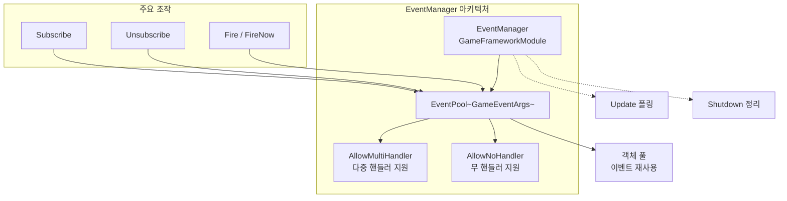
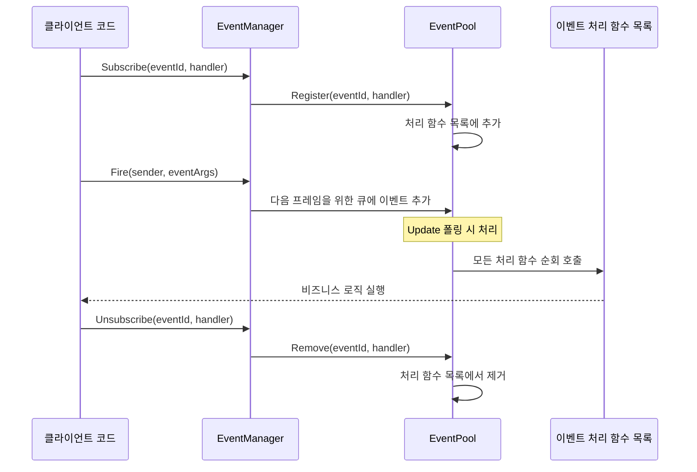
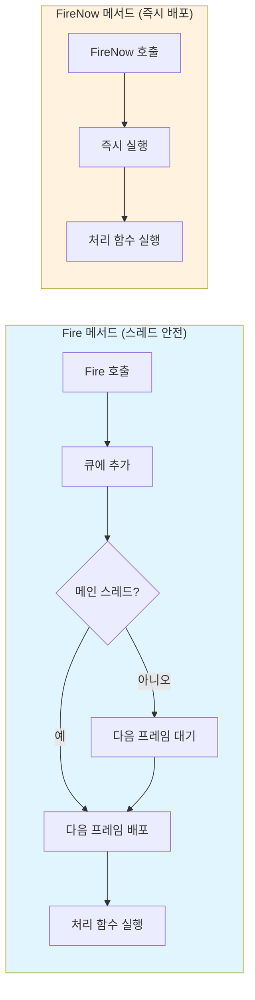

# EventManager

EventManager는 GameFrameX 이벤트 시스템의 핵심 관리자로, 게임 이벤트의 구독, 구독 취소 및 배포 관리를 담당합니다. EventPool을 기반으로 구현되며, 스레드 안전 이벤트 배포 및 다중 핸들러 모드를 지원합니다.

## 개요

EventManager는 GameFrameX 이벤트 시스템의 핵심 컴포넌트로, `GameFrameworkModule`를 상속하고 `IEventManager` 인터페이스를 구현합니다. 강력한 이벤트 시스템을 제공하여 게임의 서로 다른 모듈이 이벤트를 통해 느슨하게 통신할 수 있게 합니다.

EventManager의 핵심 기능:
- **이벤트 구독 및 구독 취소**: 이벤트 ID를 통해 이벤트 처리 함수 등록 또는 제거
- **이벤트 배포**: 스레드 안전한 지연 배포(`Fire`) 및 즉시 배포(`FireNow`) 두 가지 모드 지원
- **이벤트 통계**: 현재 구독된 이벤트 처리 함수 수 및 이벤트 수 조회 제공
- **기본 핸들러**: 미구독 이벤트를 캡처하기 위한 기본 이벤트 처리 함수 설정 지원

> **주의**: EventManager는 일반적으로 Unity 장면에서 EventComponent를 통해 사용됩니다. EventComponent는 EventManager의 Unity 컴포넌트 캡슐화로, 더 친숙한 Unity 통합 인터페이스를 제공합니다.
> 
> EventComponent의 자세한 정보는 [EventComponent](./05.event-component.md) 문서를 참조하세요.
> 
> GameEventArgs의 자세한 정보는 [GameEventArgs](./07.game-event-args.md) 문서를 참조하세요.

## 아키텍처

EventManager는 이벤트 풀(EventPool)을 기반으로 구현되었으며, 이는高效적인 이벤트 관리 모드입니다. EventPool은 다음 특성을 지원합니다:



### 설계 모드

EventManager는 다음 설계 모드를 채택합니다:

| 모드 | 적용 | 장점 |
|------|------|------|
| **객체 풀 모드** | EventPool이 GameEventArgs 재사용 | GC 감소, 성능 최적화 |
| **옵저버 모드** | Subscribe/Publish 메커니즘 | 이벤트 발행자와 구독자 분리 |
| **지연 실행 모드** | Fire가 다음 프레임으로 지연 | 스레드 안전성 보장 |

## 핵심 흐름

### 이벤트 구독 및 배포 흐름



### 이벤트 배포 모드 비교



## 사용 예시

### 기본 사용

```csharp
// 自定义 이벤트 파라미터 정의
public class PlayerDeathEventArgs : GameEventArgs
{
    public int PlayerId { get; set; }
    public string Reason { get; set; }
    public override void Clear()
    {
        PlayerId = 0;
        Reason = string.Empty;
    }
}

// 이벤트 구독
EventComponent eventComponent = UnityEngine.Object.FindObjectOfType<EventComponent>();
eventComponent.CheckSubscribe("player_death", OnPlayerDeath);

// 이벤트 처리 함수
private void OnPlayerDeath(object sender, GameEventArgs e)
{
    var args = (PlayerDeathEventArgs)e;
    UnityEngine.Debug.Log($"플레이어 {args.PlayerId} 사망: {args.Reason}");
}

// 이벤트 발생
eventComponent.Fire(this, new PlayerDeathEventArgs 
{ 
    PlayerId = 1001, 
    Reason = "괴물에게 살해됨" 
});

// 구독 취소
eventComponent.Unsubscribe("player_death", OnPlayerDeath);
```
> Source: [EventManager.cs](https://github.com/GameFrameX/com.gameframex.unity.event/blob/main/Runtime/Event/EventManager.cs#L98-L101)

### 빈 이벤트 사용 (데이터 불필요)

```csharp
// 데이터 전달이 필요 없는 단순 이벤트 구독 (필요 없음)
eventComponent.CheckSubscribe("game_start", OnGameStart);

// 단순 이벤트 발생
eventComponent.Fire(this, "game_start");

// 이벤트 처리 함수
private void OnGameStart(object sender, GameEventArgs e)
{
    UnityEngine.Debug.Log("게임 시작!");
}
```
> Source: [EventComponent.cs](https://github.com/GameFrameX/com.gameframex.unity.event/blob/main/Runtime/EventComponent.cs#L140-L144)

### 기본 핸들러 설정

```csharp
// 모든 미구독 이벤트를 캡처하기 위한 기본 핸들러 설정
eventComponent.SetDefaultHandler(OnDefaultEvent);

// 기본 이벤트 처리 함수
private void OnDefaultEvent(object sender, GameEventArgs e)
{
    UnityEngine.Debug.Log($"미처리 이벤트 수신: {e.Id}");
}
```
> Source: [EventManager.cs](https://github.com/GameFrameX/com.gameframex.unity.event/blob/main/Runtime/Event/EventManager.cs#L117-L120)

## API 참고

### 속성

#### `EventHandlerCount`

```csharp
public int EventHandlerCount { get; }
```

구독된 이벤트 처리 함수의 총 수를 획득합니다.

**반환값:** 이벤트 처리 함수의 수.

---

#### `EventCount`

```csharp
public int EventCount { get; }
```

구독된 이벤트 타입 수 (다른 이벤트 ID의 수)를 획득합니다.

**반환값:** 이벤트 타입의 수.

---

### 메서드

#### `Count`

```csharp
public int Count(string id)
```

지정된 이벤트 ID의 이벤트 처리 함수 수를 획득합니다.

**파라미터:**
- `id` (string): 이벤트 타입 번호

**반환값:** 지정된 이벤트 ID의 이벤트 처리 함수 수.

> Source: [EventManager.cs#L77-L80](https://github.com/GameFrameX/com.gameframex.unity.event/blob/main/Runtime/Event/EventManager.cs#L77-L80)

---

#### `Check`

```csharp
public bool Check(string id, EventHandler<GameEventArgs> handler)
```

지정된 이벤트 처리 함수가是否存在 확인합니다.

**파라미터:**
- `id` (string): 이벤트 타입 번호
- `handler` (`EventHandler<GameEventArgs>`): 확인할 이벤트 처리 함수

**반환값:** 지정된 이벤트 처리 함수가是否存在 여부.

> Source: [EventManager.cs#L88-L91](https://github.com/GameFrameX/com.gameframex.unity.event/blob/main/Runtime/Event/EventManager.cs#L88-L91)

---

#### `Subscribe`

```csharp
public void Subscribe(string id, EventHandler<GameEventArgs> handler)
```

지정된 이벤트 ID의 이벤트 처리 함수를 구독합니다.

**파라미터:**
- `id` (string): 이벤트 타입 번호
- `handler` (`EventHandler<GameEventArgs>`): 구독할 이벤트 처리 함수

**설명:** 
-同一 이벤트 ID에 여러 처리 함수 구독 가능
- 이벤트 트리거 시 모든 구독된 처리 함수가 호출됨

> Source: [EventManager.cs#L98-L101](https://github.com/GameFrameX/com.gameframex.unity.event/blob/main/Runtime/Event/EventManager.cs#L98-L101)

---

#### `Unsubscribe`

```csharp
public void Unsubscribe(string id, EventHandler<GameEventArgs> handler)
```

지정된 이벤트 ID의 이벤트 처리 함수의 구독을 취소합니다.

**파라미터:**
- `id` (string): 이벤트 타입 번호
- `handler` (`EventHandler<GameEventArgs>`): 구독 취소할 이벤트 처리 함수

**설명:** 이벤트 처리 함수가存在하지 않으면 아무런 조작도 실행하지 않습니다.

> Source: [EventManager.cs#L108-L111](https://github.com/GameFrameX/com.gameframex.unity.event/blob/main/Runtime/Event/EventManager.cs#L108-L111)

---

#### `SetDefaultHandler`

```csharp
public void SetDefaultHandler(EventHandler<GameEventArgs> handler)
```

기본 이벤트 처리 함수를 설정합니다.

**파라미터:**
- `handler` (`EventHandler<GameEventArgs>`): 설정할 기본 이벤트 처리 함수

**설명:** 기본 이벤트 처리 함수는 이벤트에 대응하는 구독 처리 함수를 찾지 못했을 때 호출됩니다.

> Source: [EventManager.cs#L117-L120](https://github.com/GameFrameX/com.gameframex.unity.event/blob/main/Runtime/Event/EventManager.cs#L117-L120)

---

#### `Fire`

```csharp
public void Fire(object sender, GameEventArgs e)
```

이벤트를 발생시킵니다 (스레드 안전 모드).

**파라미터:**
- `sender` (object): 이벤트 발신자
- `e` (GameEventArgs): 이벤트 파라미터

**설명:** 
- 이 메서드는 스레드 안전합니다
- 비주 스레드에서 호출해도 이벤트 콜백이 메인 스레드에서 실행됨을 보장합니다
- 이벤트는 발생 후 다음 프레임에 배포됩니다

> Source: [EventManager.cs#L127-L130](https://github.com/GameFrameX/com.gameframex.unity.event/blob/main/Runtime/Event/EventManager.cs#L127-L130)

---

#### `FireNow`

```csharp
public void FireNow(object sender, GameEventArgs e)
```

이벤트를 발생시킵니다 (즉시 모드).

**파라미터:**
- `sender` (object): 이벤트 발신자
- `e` (GameEventArgs): 이벤트 파라미터

**설명:** 
- 이 메서드는 스레드 안전하지 않습니다
- 이벤트가 즉시 배포되어 즉시 모든 구독 처리 함수를 호출합니다
- 호출 스레드 안전을確保하는 경우에만 사용합니다

> Source: [EventManager.cs#L137-L140](https://github.com/GameFrameX/com.gameframex.unity.event/blob/main/Runtime/Event/EventManager.cs#L137-L140)

---

## 스레드 안전성

EventManager는 서로 다른 요구를 충족하기 위해 두 가지 이벤트 배포 모드를 제공합니다:

| 메서드 | 스레드 안전성 | 배포时机 | 적용 시나리오 |
|------|----------|----------|----------|
| `Fire` | ✅ 안전 | 다음 프레임 |跨스레드 이벤트, 백엔드에서 프론트엔드 통지 |
| `FireNow` | ❌ 안전하지 않음 | 즉시 |同一 스레드 내 동기 로직 |

**모범 사례:**
- 하위 스레드에서 이벤트를 트리거할 때 `Fire`를 사용하여 콜백이 메인 스레드에서 실행되도록 보장합니다
- 메인 스레드에서 즉시 응답이 필요할 때 `FireNow`를 사용합니다
- `FireNow`의 이벤트 처리 함수에서 시간 소모 operation을 실행하지 않도록 주의합니다

## 성능 최적화 권장 사항

1. **객체 풀 사용**: 自定义 이벤트 클래스는 `GameEventArgs`를 상속하고 객체 풀 인터페이스를 구현하여 빈번한 객체 생성 회피
2. **적시에 구독 취소**: 더 이상 필요하지 않은 이벤트는 즉시 구독 취소하여 순회 오버헤드 감소
3. **`CheckSubscribe` 사용 권장**: `CheckSubscribe` 메서드를 사용하여 중복 구독 문제를 자동으로 처리합니다
4. **빈번한 배포 회피**:高频 이벤트(예: 매 프레임 업데이트)의 경우 병합 또는 스로틀，考虑してください

## 관련 링크

- [EventComponent](./05.event-component.md) - Unity 컴포넌트 캡슐화
- [GameEventArgs](./07.game-event-args.md) - 이벤트 파라미터 基类
- [핵심 개념: 이벤트 시스템 아키텍처](../04.features.md) - 더 많은 설계 원리 이해
- [빠른 시작](../03.getting-started.md) - 이벤트 시스템 사용 시작