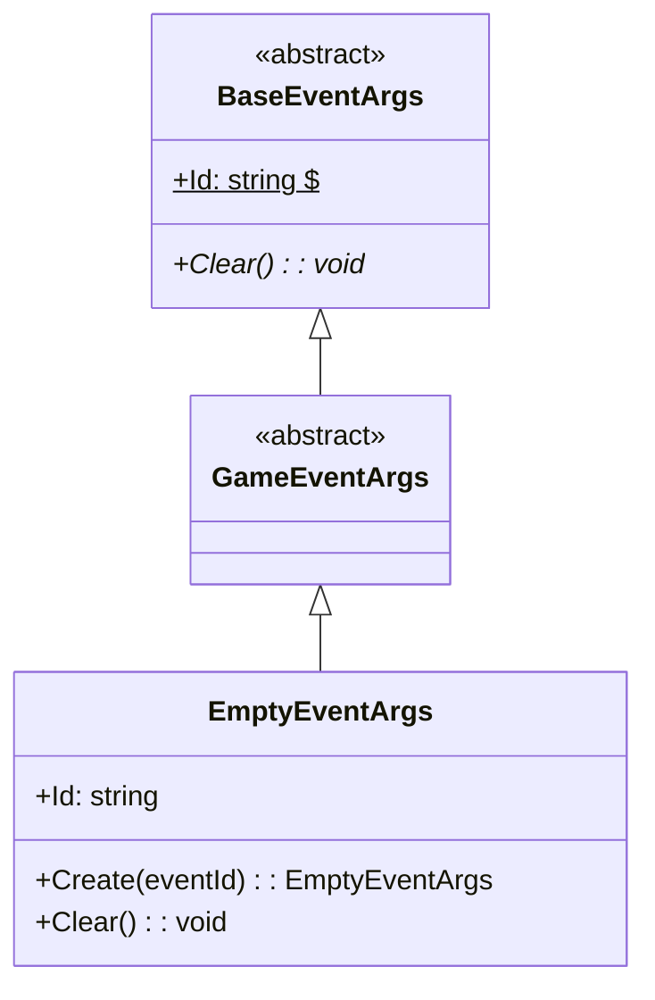
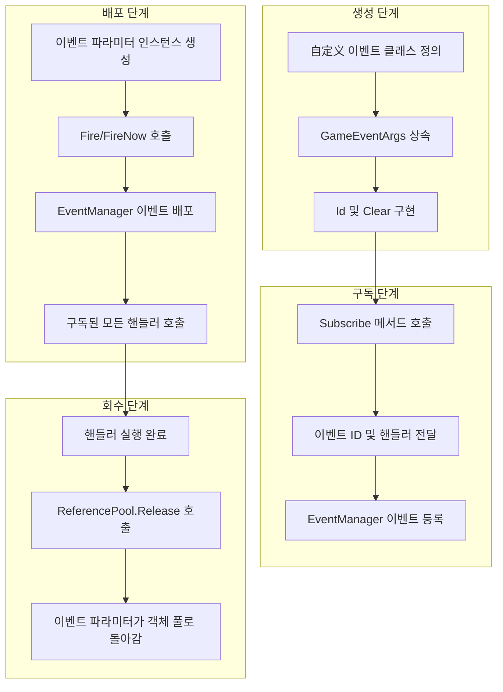

# GameEventArgs

게임 이벤트 파라미터 基类로, 게임 프레임워크에서 모든 이벤트의 基类를 정의하는 데 사용됩니다.

## 개요

GameEventArgs는 GameFrameX 이벤트 시스템의 핵심 基类로, 모든 自定义 게임 이벤트는 이 클래스를 상속해야 합니다. BaseEventArgs를 상속하여 이벤트 시스템의 기본 구조 및 인터페이스 규범을 제공합니다.

**설계 의도**: 통합된 이벤트 파라미터 基类를 구축함으로써 이벤트 시스템이 타입 안전한 방식으로 다양한 게임 이벤트를 처리할 수 있으며, 동시에 이벤트 구독 및 배포의 유연성을 유지할 수 있습니다.

## 클래스 계층 구조



## 핵심 개념

### 이벤트 ID

각 이벤트 파라미터는 고유한 이벤트 식별자(Event ID)를 가져야 하며, 이벤트 구독 및 인식을 위해 사용됩니다. 이벤트 ID는 일반적으로 문자열 타입을 사용하며 다음 형태일 수 있습니다:

- 사전 정의된 상수 문자열
- 타입의 완전한 이름 (`typeof(T).FullName`)
- 自定义 비즈니스 로직 식별자

### 객체 풀

GameEventArgs는 성능 최적화를 위해 객체 풀 모드를 지원하도록 설계되었습니다. 실제 사용에서 이벤트 파라미터는 일반적으로 `ReferencePool`을 통해 획득 및 회수됩니다:

```csharp
var eventArgs = ReferencePool.Acquire<EmptyEventArgs>();
// ... 이벤트 파라미터 사용
ReferencePool.Release(eventArgs);
```

> Source: [EmptyEventArgs.cs](https://github.com/GameFrameX/com.gameframex.unity.event/blob/main/Runtime/EventArgs/EmptyEventArgs.cs#L32-L37)

## 自定义 이벤트 파라미터 생성

自定义 이벤트 파라미터 클래스를 생성하려면 GameEventArgs를 상속하고 필요한 멤버를 구현해야 합니다. 다음은 EmptyEventArgs의 완전한 구현 예시입니다:

```csharp
using GameFrameX.Runtime;

namespace GameFrameX.Event.Runtime
{
    /// <summary>
    /// 빈 이벤트
    /// </summary>
    public sealed class EmptyEventArgs : GameEventArgs
    {
        private string _eventId = typeof(EmptyEventArgs).FullName;

        public override void Clear()
        {
        }

        public override string Id
        {
            get { return _eventId; }
        }

        /// <summary>
        /// 빈 이벤트 생성
        /// </summary>
        /// <param name="eventId">이벤트 번호</param>
        /// <returns>빈 이벤트 객체</returns>
        public static EmptyEventArgs Create(string eventId)
        {
            var eventArgs = ReferencePool.Acquire<EmptyEventArgs>();
            eventArgs.SetEventId(eventId);
            return eventArgs;
        }

        /// <summary>
        /// 이벤트 번호 설정
        /// </summary>
        /// <param name="eventId"></param>
        private void SetEventId(string eventId)
        {
            _eventId = eventId;
        }
    }
}
```

> Source: [EmptyEventArgs.cs](https://github.com/GameFrameX/com.gameframex.unity.event/blob/main/Runtime/EventArgs/EmptyEventArgs.cs#L1-L48)

### 구현 포인트

1. **Id 속성** (필수): 이벤트의 고유 식별자 반환
2. **Clear 메서드** (필수): 이벤트 파라미터 상태 초기화, 객체 회수 시 데이터 정리용
3. **Create 정적 메서드** (권장): 팩토리 메서드를 제공하여 객체 풀 지원

## 이벤트 파라미터 및 이벤트 시스템

이벤트 시스템에서의 GameEventArgs 사용 흐름:



## 완전한 이벤트 예시

다음은 데이터 페이로드가 포함된 自定义 이벤트 파라미터 예시입니다:

```csharp
// 가정의 自定义 이벤트 파라미터 예시 (모드 표시)
public class PlayerDieEventArgs : GameEventArgs
{
    private int _playerId;
    private string _deathReason;
    private Vector3 _deathPosition;

    public override void Clear()
    {
        _playerId = 0;
        _deathReason = string.Empty;
        _deathPosition = Vector3.zero;
    }

    public override string Id => "PlayerDie";

    public int PlayerId => _playerId;
    public string DeathReason => _deathReason;
    public Vector3 DeathPosition => _deathPosition;

    public static PlayerDieEventArgs Create(int playerId, string reason, Vector3 position)
    {
        var args = ReferencePool.Acquire<PlayerDieEventArgs>();
        args._playerId = playerId;
        args._deathReason = reason;
        args._deathPosition = position;
        return args;
    }
}
```

> 注: 위 예시는 自定义 이벤트 파라미터 생성 모드를 보여주며, 실제 코드는 구체적인 요구 사항에 따라 구현해야 합니다

## 이벤트 배포 방식

이벤트 시스템은 두 가지 배포 방식을 제공합니다:

| 방식 | 메서드 | 스레드 안전성 | 특징 |
|------|------|----------|------|
| 지연 배포 | `Fire(sender, args)` | ✅ 안전 | 다음 프레임에서 배포,跨스레드 호출에 적합 |
| 즉시 배포 | `FireNow(sender, args)` | ❌ 안전하지 않음 | 즉시 배포, 성능이 더 높지만 스레드 안전하지 않음 |

```csharp
// 지연 배포 (스레드 안전)
eventComponent.Fire(this, EmptyEventArgs.Create("game_start"));

// 즉시 배포
eventComponent.FireNow(this, EmptyEventArgs.Create("game_start"));
```

> Source: [EventComponent.cs](https://github.com/GameFrameX/com.gameframex.unity.event/blob/main/Runtime/EventComponent.cs#L130-L154)

## API 참고

### `GameEventArgs`

게임 로직 이벤트 基类입니다.

**네임스페이스**: `GameFrameX.Event.Runtime`

**상속**: `BaseEventArgs`

**서브클래스**:

- `EmptyEventArgs`: 빈 이벤트 구현

#### 멤버

| 멤버 | 타입 | 설명 |
|------|------|------|
| `Id` | `string` | 이벤트 고유 식별자 획득 (추상 속성) |
| `Clear()` | `void` | 이벤트 상태 초기화 (추상 메서드) |

### `EmptyEventArgs`

데이터 전달이 필요 없는 이벤트 구현입니다.

**네임스페이스**: `GameFrameX.Event.Runtime`

**상속**: `GameEventArgs`

#### 메서드

| 메서드 | 반환 타입 | 설명 |
|--------|----------|------|
| `Create(eventId)` | `EmptyEventArgs` | 빈 이벤트 인스턴스 생성 |

## 관련 링크

- [EventComponent](./05.event-component.md)
- [EventManager](./06.event-manager.md)
- [이벤트 시스템 아키텍처](./04.features.md)
- [빠른 시작](./03.getting-started.md)