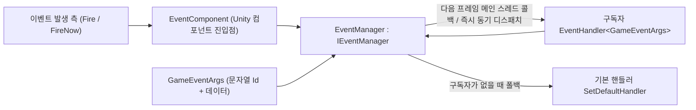

# 패키지 개요: GameFrameX Event란 무엇인가

GameFrameX Event(패키지명 `com.gameframex.unity.event`)는 GameFrameX 프레임워크의 이벤트 시스템 컴포넌트입니다. 모듈 간 디커플링 통신을 위한 **문자열 ID** 기반 이벤트 버스입니다. 스레드 안전한 지연 디스패치(`Fire`, 다음 프레임에 메인 스레드에서 콜백)와 즉시 디스패치(`FireNow`)를 지원하며, 기본 핸들러로 구독되지 않은 이벤트를 폴백 처리할 수 있습니다. 이 패키지는 의존 패키지가 전혀 없습니다.

제공하는 기능:

- 문자열 ID 기반 이벤트 구독 / 구독 해제
- `Fire` — 스레드 안전한 지연 디스패치(다음 프레임 메인 스레드 콜백)
- `FireNow` — 즉시 동기 디스패치
- `Fire(sender, eventId)` — 커스텀 이벤트 인자가 필요 없는 간편 호출 방식
- `Check` / `CheckSubscribe` / `CheckUnsubscribe` — 존재 여부 확인, 존재하지 않을 때 자동 구독, 존재할 때 안전하게 구독 해제
- `Count` / `EventHandlerCount` / `EventCount` — 핸들러 통계
- 기본 핸들러로 구독되지 않은 이벤트 폴백 처리

## 빠른 시작

1. 패키지 설치(아래 방법 중 하나 선택): Unity 프로젝트의 `Packages/manifest.json`을 편집하여 scoped registry를 추가하고 의존성을 선언합니다. 또는 `dependencies` 노드 아래에 직접 Git URL을 추가해도 됩니다. Unity `Package Manager`에서 Git URL로 추가하거나, 저장소를 다운로드하여 `Packages` 디렉터리에 넣는 방법도 있습니다.

   ```json
   {
     "scopedRegistries": [
       {
         "name": "GameFrameX",
         "url": "https://gameframex.upm.alianblank.uk",
         "scopes": [
           "com.gameframex"
         ]
       }
     ],
     "dependencies": {
       "com.gameframex.unity.event": "1.1.1"
     }
   }
   ```

   출처: [README.zh-CN.md](https://github.com/GameFrameX/com.gameframex.unity.event/blob/main/README.zh-CN.md#L42-L67)

2. 커스텀 이벤트 인자 클래스를 정의합니다. `GameEventArgs`를 상속받고, `Id`에서 문자열 이벤트 ID를 반환하며, 참조 풀과 함께 재사용하도록 작성합니다:

   ```csharp
   public class LevelUpEventArgs : GameEventArgs
   {
       public override string Id => "level_up";
       public int Level { get; private set; }

       public static LevelUpEventArgs Create(int level)
       {
           var args = ReferencePool.Acquire<LevelUpEventArgs>();
           args.Level = level;
           return args;
       }

       public override void Clear()
       {
           base.Clear();
           Level = 0;
       }
   }
   ```

   출처: [README.zh-CN.md](https://github.com/GameFrameX/com.gameframex.unity.event/blob/main/README.zh-CN.md#L75-L94)

3. `EventComponent`(아래 예시의 `eventComponent`는 해당 컴포넌트에 대한 참조)를 통해 구독 및 구독 해제를 수행합니다:

   ```csharp
   eventComponent.Subscribe("level_up", OnLevelUp);
   eventComponent.Unsubscribe("level_up", OnLevelUp);

   void OnLevelUp(object sender, GameEventArgs e)
   {
       var args = (LevelUpEventArgs)e;
       Debug.Log($"升级到 {args.Level} 级");
   }
   ```

   출처: [README.zh-CN.md](https://github.com/GameFrameX/com.gameframex.unity.event/blob/main/README.zh-CN.md#L99-L107)

4. 이벤트를 발생시킵니다 — 지연 모드(스레드 안전, 다음 프레임 메인 스레드 콜백), 즉시 모드(메인 스레드에서만 사용), 간편 방식(커스텀 인자 불필요) 세 가지 중 선택합니다:

   ```csharp
   eventComponent.Fire(this, LevelUpEventArgs.Create(5));      // 지연 모드
   eventComponent.FireNow(this, LevelUpEventArgs.Create(5));   // 즉시 모드
   eventComponent.Fire(this, "level_up");                      // 간편 방식
   ```

   출처: [README.zh-CN.md](https://github.com/GameFrameX/com.gameframex.unity.event/blob/main/README.zh-CN.md#L122-L140)

5. (선택 사항) 기본 핸들러를 설정하여 어떤 핸들러에게도 구독되지 않은 이벤트를 폴백 처리합니다:

   ```csharp
   eventComponent.SetDefaultHandler(OnDefaultEvent);

   void OnDefaultEvent(object sender, GameEventArgs e)
   {
       Debug.Log($"未处理的事件: {e.Id}");
   }
   ```

   출처: [README.zh-CN.md](https://github.com/GameFrameX/com.gameframex.unity.event/blob/main/README.zh-CN.md#L142-L151)

자주 사용하는 API(`IEventManager` 인터페이스에 정의되어 있으며, `EventComponent`가 동일한 이름의 호출 진입점을 외부에 노출합니다):

| 멤버 | 시그니처 | 설명 |
|------|------|------|
| `EventHandlerCount` | `int { get; }` | 이벤트 핸들러의 총 개수를 가져옵니다 |
| `EventCount` | `int { get; }` | 이벤트 개수를 가져옵니다 |
| `Count` | `int Count(string id)` | 지정한 이벤트의 핸들러 개수를 가져옵니다 |
| `Check` | `bool Check(string id, EventHandler<GameEventArgs> handler)` | 이벤트 핸들러가 존재하는지 확인합니다 |
| `Subscribe` | `void Subscribe(string id, EventHandler<GameEventArgs> handler)` | 이벤트 핸들러를 구독합니다 |
| `Unsubscribe` | `void Unsubscribe(string id, EventHandler<GameEventArgs> handler)` | 이벤트 핸들러의 구독을 해제합니다 |
| `CheckUnsubscribe` | `void CheckUnsubscribe(string id, EventHandler<GameEventArgs> handler)` | 확인 후 구독을 해제합니다; handler가 존재하지 않으면 아무 작업도 수행하지 않습니다 |
| `SetDefaultHandler` | `void SetDefaultHandler(EventHandler<GameEventArgs> handler)` | 기본 이벤트 핸들러를 설정합니다 |
| `Fire` | `void Fire(object sender, GameEventArgs e)` | 스레드 안전한 지연 발생입니다; 메인 스레드가 아닌 곳에서 발생시켜도 메인 스레드에서 콜백이 보장되며, 이벤트는 다음 프레임에 디스패치됩니다 |
| `FireNow` | `void FireNow(object sender, GameEventArgs e)` | 즉시 발생하여 동기 디스패치합니다; 스레드 안전하지 않습니다 |

출처: [IEventManager.cs](https://github.com/GameFrameX/com.gameframex.unity.event/blob/main/Runtime/Event/IEventManager.cs#L38-L105)

## 작동 원리 요약

이벤트는 `EventComponent`(Unity 컴포넌트 진입점)에서 이벤트 관리자인 `EventManager`(`IEventManager`의 구현)로 전달되어 일괄 처리됩니다. 구독자는 문자열 ID로 `EventHandler<GameEventArgs>`를 등록하고, 이벤트를 발생시키는 쪽은 데이터를 담은 `GameEventArgs`를 이벤트 버스에 넘깁니다. `Fire`는 스레드 안전한 지연 큐를 거쳐 다음 프레임에 메인 스레드에서 디스패치되고, `FireNow`는 즉시 동기 디스패치되며, 구독자가 없는 이벤트는 기본 핸들러가 폴백 처리합니다.



저장소 소스 구조 한눈에 보기:

| 경로 | 용도 |
|------|------|
| `Runtime/EventComponent.cs` | Unity 컴포넌트 진입점, 구독 / 발생 등의 호출을 외부에 노출 |
| `Runtime/Event/EventManager.cs` | 이벤트 관리자 구현 |
| `Runtime/Event/IEventManager.cs` | 이벤트 관리자 인터페이스(API 계약) |
| `Runtime/EventArgs/GameEventArgs.cs` | 이벤트 인자 기본 클래스(문자열 `Id`) |
| `Runtime/EventArgs/EmptyEventArgs.cs` | 빈 이벤트 인자 |
| `Runtime/GameFrameXEventCroppingHelper.cs` | 트리밍(코드 트리밍) 보조 |
| `Editor/Inspector/EventComponentInspector.cs` | 에디터에서 `EventComponent`의 Inspector |

출처: [IEventManager.cs](https://github.com/GameFrameX/com.gameframex.unity.event/blob/main/Runtime/Event/IEventManager.cs#L38-L105)

## 자주 발생하는 실수

- **메인 스레드가 아닌 스레드에서 `FireNow` 호출**: `FireNow`는 스레드 안전하지 않으며 즉시 동기 디스패치됩니다. 스레드 간 이벤트 발생 시에는 `Fire`를 사용하세요. 메인 스레드에서의 콜백이 보장됩니다(다음 프레임에 디스패치).
- **서브 스레드에서 `Fire`로 이벤트를 발생시킨 직후 같은 프레임에 부수 효과를 읽는 경우**: `Fire`는 지연 디스패치이므로 이벤트는 발생 후 **다음 프레임**에 콜백됩니다. 발생 직후 핸들러가 이미 실행되었다고 가정하지 마세요.
- **존재하지 않는 핸들러에 대한 중복 구독 / 구독 해제**: `Check`로 존재 여부를 확인하거나, `CheckSubscribe`(존재하지 않을 때만 구독), `CheckUnsubscribe`(존재할 때만 해제하며 존재하지 않으면 아무 작업도 하지 않음)를 사용해 예외를 피하세요.
- **이벤트 인자의 재사용 구현을 잊는 경우**: `GameEventArgs`는 참조 풀과 함께 사용합니다. 예시에서처럼 `Create`에서는 `ReferencePool.Acquire`, `Clear`에서는 필드를 초기화하면, 발생 후 프레임워크가 이를 회수하여 재사용합니다.

출처: [README.zh-CN.md](https://github.com/GameFrameX/com.gameframex.unity.event/blob/main/README.zh-CN.md#L109-L159)

## 다음 단계

- 각 API의 자세한 시그니처와 설명은 [IEventManager.cs](https://github.com/GameFrameX/com.gameframex.unity.event/blob/main/Runtime/Event/IEventManager.cs#L38-L105) 인터페이스 소스 코드를 참고하세요.
- 전체 사용 예시(확인 / 통계 / 기본 핸들러)는 [README.zh-CN.md](https://github.com/GameFrameX/com.gameframex.unity.event/blob/main/README.zh-CN.md#L71-L159)를 참고하세요.
- 공식 문서: <https://gameframex.doc.alianblank.com>; 변경 이력은 [Releases](https://github.com/gameframex/com.gameframex.unity.event/releases)에서 확인하세요.