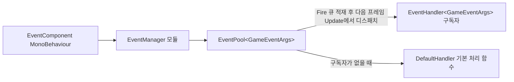

# 작동 원리: 이벤트 디스패치와 모듈 라이프사이클

이 페이지는 Event 모듈 내부에서 이벤트 디스패치가 어떻게 완료되는지, 그리고 `EventManager`가 프레임워크 모듈로서 거치는 초기화, 폴링, 종료 흐름을 설명합니다. 핵심 결론: `Fire`는 큐에 적재하고 다음 프레임에 `Update`에서 디스패치합니다(스레드 안전); `FireNow`는 즉시 동기적으로 디스패치합니다(스레드 안전하지 않음); 모든 전달은 `EventComponent` → `EventManager` → `EventPool<GameEventArgs>`의 세 계층을 거쳐 완료됩니다.

## 이벤트 디스패치 흐름

한 번의 `Fire`가 거치는 전체 경로는 단 네 단계입니다:

1. 비즈니스 코드가 `EventComponent.Fire(sender, e)`를 호출하면, 컴포넌트는 요청을 그대로 내부의 `IEventManager`에 전달합니다(`GameFrameworkEntry.GetModule<IEventManager>()`를 통해 획득, `EventComponent.Awake` 참조).
2. `EventManager.Fire`는 이벤트를 내부의 `EventPool<GameEventArgs>` 큐에 밀어 넣으며, **어떠한 처리 함수도 즉시 콜백하지 않습니다**.
3. 프레임워크가 매 프레임 모듈을 폴링할 때 `EventManager.Update`는 `m_EventPool.Update(elapseSeconds, realElapseSeconds)`를 호출하여, 큐에 있는 이벤트를 큐에 들어온 순서대로 **메인 스레드**에서 해당 `id`의 구독자에게 디스패치합니다.
4. 디스패치가 완료되면 이벤트 인자는 참조 풀에 반납됩니다(`GameEventArgs`는 `BaseEventArgs`에서 파생되며, 빈 이벤트는 `ReferencePool.Acquire<EmptyEventArgs>()`로 생성됨).



두 계층 전달의 실제 코드는 다음과 같습니다 — 컴포넌트 계층은 위임만 담당하고, 매니저 계층이 실제 `EventPool`을 보유합니다:

```csharp
public void Fire(object sender, GameEventArgs e)
{
    m_EventManager.Fire(sender, e);
}
```

Source: [EventComponent.cs](https://github.com/GameFrameX/com.gameframex.unity.event/blob/main/Runtime/EventComponent.cs#L147-L150)

```csharp
public sealed class EventManager : GameFrameworkModule, IEventManager
{
    private readonly EventPool<GameEventArgs> m_EventPool;

    public EventManager()
    {
        m_EventPool = new EventPool<GameEventArgs>(EventPoolMode.AllowNoHandler | EventPoolMode.AllowMultiHandler);
    }
```

Source: [EventManager.cs](https://github.com/GameFrameX/com.gameframex.unity.event/blob/main/Runtime/Event/EventManager.cs#L39-L49)

생성 시 전달되는 `EventPoolMode` 플래그 조합이 이 모듈의 디스패치 동작을 결정합니다: `AllowNoHandler`는 이벤트에 구독자가 하나도 없어도 오류를 내지 않도록 허용하고, `AllowMultiHandler`는 동일한 `id`에 여러 처리 함수를 등록하는 것을 허용합니다.

## 두 가지 발생 방식의 차이

| 방법 | 디스패치 시점 | 스레드 안전 | 적용 시나리오 |
|------|----------|----------|----------|
| `Fire(sender, e)` | 발생 후 다음 프레임 | 예(서브 스레드에서 발생해도 메인 스레드 콜백 보장) | 일반 게임 로직 이벤트 |
| `FireNow(sender, e)` | 즉시 동기 디스패치 | 아니요(메인 스레드에서만 호출) | 즉석에서 콜백 결과를 받아야 하는 시나리오 |
| `Fire(sender, eventId)` | `Fire`와 동일 | 예 | 인자 없는 이벤트, 내부에서 자동으로 `EmptyEventArgs` 구성 |

`Fire(object sender, string eventId)` 오버로드는 이벤트 ID가 비어 있지 않은지 검증하고, 참조 풀에서 빈 이벤트 객체를 하나 가져옵니다:

```csharp
public void Fire(object sender, string eventId)
{
    GameFrameworkGuard.NotNullOrEmpty(eventId, nameof(eventId));
    m_EventManager.Fire(sender, EmptyEventArgs.Create(eventId));
}
```

Source: [EventComponent.cs](https://github.com/GameFrameX/com.gameframex.unity.event/blob/main/Runtime/EventComponent.cs#L157-L161)

`EmptyEventArgs.Create`의 구현이 참조 풀 경로를 확인해 줍니다:

```csharp
public static EmptyEventArgs Create(string eventId)
{
    var eventArgs = ReferencePool.Acquire<EmptyEventArgs>();
    eventArgs.SetEventId(eventId);
    return eventArgs;
}
```

Source: [EmptyEventArgs.cs](https://github.com/GameFrameX/com.gameframex.unity.event/blob/main/Runtime/EventArgs/EmptyEventArgs.cs#L33-L38)

## 모듈 라이프사이클

`EventManager`는 `GameFrameworkModule`을 상속하며, `GameFrameworkEntry`에 의해 통일적으로 구동됩니다. 세 가지 핵심 라이프사이클 지점은 모두 `EventPool`에 대한 단순 전달일 뿐입니다:

| 라이프사이클 단계 | 트리거 주체 | EventManager 내 구현 |
|--------------|--------|----------------------|
| 초기화 | 생성자 | `EventPool<GameEventArgs>`를 생성하고 `EventPoolMode` 설정 |
| 매 프레임 폴링 | 프레임워크 메인 루프 | `Update`가 `m_EventPool.Update(...)`를 호출하여 밀려 있는 이벤트를 디스패치 |
| 종료 | 프레임워크 종료 흐름 | `Shutdown`이 `m_EventPool.Shutdown()`을 호출하여 구독과 큐를 비움 |

```csharp
/// <summary>게임 프레임워크 모듈 우선순위를 가져옵니다.</summary>
/// <remarks>우선순위가 높은 모듈은 먼저 폴링되며, 종료 작업은 나중에 수행됩니다.</remarks>
protected override int Priority
{
    get { return 7; }
}

protected override void Update(float elapseSeconds, float realElapseSeconds)
{
    m_EventPool.Update(elapseSeconds, realElapseSeconds);
}

protected override void Shutdown()
{
    m_EventPool.Shutdown();
}
```

Source: [EventManager.cs](https://github.com/GameFrameX/com.gameframex.unity.event/blob/main/Runtime/Event/EventManager.cs#L67-L92)

우선순위는 **7**입니다: 값이 클수록 더 일찍 폴링되고 더 늦게 종료됩니다. 동시에 씬의 `EventComponent`에는 `[GameFrameXAutoComponent(-7000)]` 표시가 있어 Unity 측의 MonoBehaviour와 이 모듈을 이어 주는 브리지 역할을 합니다; 이 컴포넌트는 `Awake`에서 `GameFrameworkEntry.GetModule<IEventManager>()`를 통해 매니저 인스턴스를 획득하며, 획득하지 못하면 `Log.Fatal("Event manager is invalid.")`를 출력합니다.

```csharp
protected override void Awake()
{
    ImplementationComponentType = Utility.Assembly.GetType(componentType);
    InterfaceComponentType = typeof(IEventManager);
    base.Awake();
    m_EventManager = GameFrameworkEntry.GetModule<IEventManager>();
    if (m_EventManager == null)
    {
        Log.Fatal("Event manager is invalid.");
        return;
    }
}
```

Source: [EventComponent.cs](https://github.com/GameFrameX/com.gameframex.unity.event/blob/main/Runtime/EventComponent.cs#L66-L77)

따라서 사용자 입장에서의 전체 시퀀스는 다음과 같습니다: 씬 로드 → `EventComponent.Awake`에서 모듈 획득 → 비즈니스는 임의의 시점에 `Subscribe` / `Fire` → 매 프레임 `Update`에서 디스패치 → 종료 시 `Shutdown`으로 정리.

## 구독 및 구독 해제의 내부 동작

구독, 구독 해제, 확인은 모두 `EventPool`의 처리 함수 테이블을 직접 조작하며, `EventManager` 자체는 어떠한 비즈니스 상태도 보관하지 않습니다:

```csharp
public void Subscribe(string id, EventHandler<GameEventArgs> handler)
{
    m_EventPool.Subscribe(id, handler);
}

public void CheckUnsubscribe(string id, EventHandler<GameEventArgs> handler)
{
    if (m_EventPool.Check(id, handler))
    {
        m_EventPool.Unsubscribe(id, handler);
    }
}
```

Source: [EventManager.cs](https://github.com/GameFrameX/com.gameframex.unity.event/blob/main/Runtime/Event/EventManager.cs#L120-L146)

컴포넌트 계층은 중복 구독 방지를 위한 `CheckSubscribe`를 추가로 제공합니다 — 먼저 `Check`하고 나서 `Subscribe`하여, 동일한 델리게이트가 두 번 등록되어 한 번의 `Fire`가 여러 번의 콜백을 유발하는 것을 방지합니다:

```csharp
public void CheckSubscribe(string id, EventHandler<GameEventArgs> handler)
{
    if (!Check(id, handler))
    {
        m_EventManager.Subscribe(id, handler);
    }
}
```

Source: [EventComponent.cs](https://github.com/GameFrameX/com.gameframex.unity.event/blob/main/Runtime/EventComponent.cs#L105-L111)

또한 `SetDefaultHandler(handler)`를 호출하여 기본 처리 함수를 설정할 수 있습니다: 특정 이벤트 `id`에 구독자가 하나도 없으면 해당 이벤트는 기본 처리 함수에게 전달되며, 디버깅 시 "보냈지만 받는 이가 없는" 이벤트를 추적하는 데 자주 사용됩니다. `EventManager`가 노출하는 `EventHandlerCount` / `EventCount` / `Count(id)`로 런타임에 큐와 구독 규모를 관찰할 수 있습니다.

## 이벤트 인자의 상속 체인

```csharp
public abstract class GameEventArgs : BaseEventArgs
{
}
```

Source: [GameEventArgs.cs](https://github.com/GameFrameX/com.gameframex.unity.event/blob/main/Runtime/EventArgs/GameEventArgs.cs#L38-L40)

디스패치 가능한 모든 이벤트 인자는 반드시 `GameEventArgs`를 상속해야 합니다(그 기반 클래스인 `BaseEventArgs`는 GameFrameX 런타임 라이브러리에 속하며 이 저장소에는 없고, `BaseEventArgs`와 `EventPool`의 전체 구현 세부 소스는 이 저장소에 함께 제공되지 않습니다). 저장소에 포함된 `EmptyEventArgs`는 인자 없는 이벤트에 사용되며, 비즈니스 사용자 정의 이벤트도 마찬가지입니다: `GameEventArgs`를 상속하고 `Id`와 `Clear`를 구현하며, 발생 후 참조 풀에 의해 재사용되어 GC를 피합니다.

## 관련 링크

- 비즈니스 코드에서 이벤트를 구독하고 발생시키는 방법은 《이벤트 구독 및 발생 방법》 작업 페이지(같은 디렉터리)를 참조하세요.
- 컴포넌트 마운트 및 Inspector 정보는 [EventComponent.cs](https://github.com/GameFrameX/com.gameframex.unity.event/blob/main/Runtime/EventComponent.cs)와 [EventComponentInspector.cs](https://github.com/GameFrameX/com.gameframex.unity.event/blob/main/Editor/Inspector/EventComponentInspector.cs)를 참조하세요.
- 매니저의 전체 API는 [IEventManager.cs](https://github.com/GameFrameX/com.gameframex.unity.event/blob/main/Runtime/Event/IEventManager.cs)와 [EventManager.cs](https://github.com/GameFrameX/com.gameframex.unity.event/blob/main/Runtime/Event/EventManager.cs)를 참조하세요.