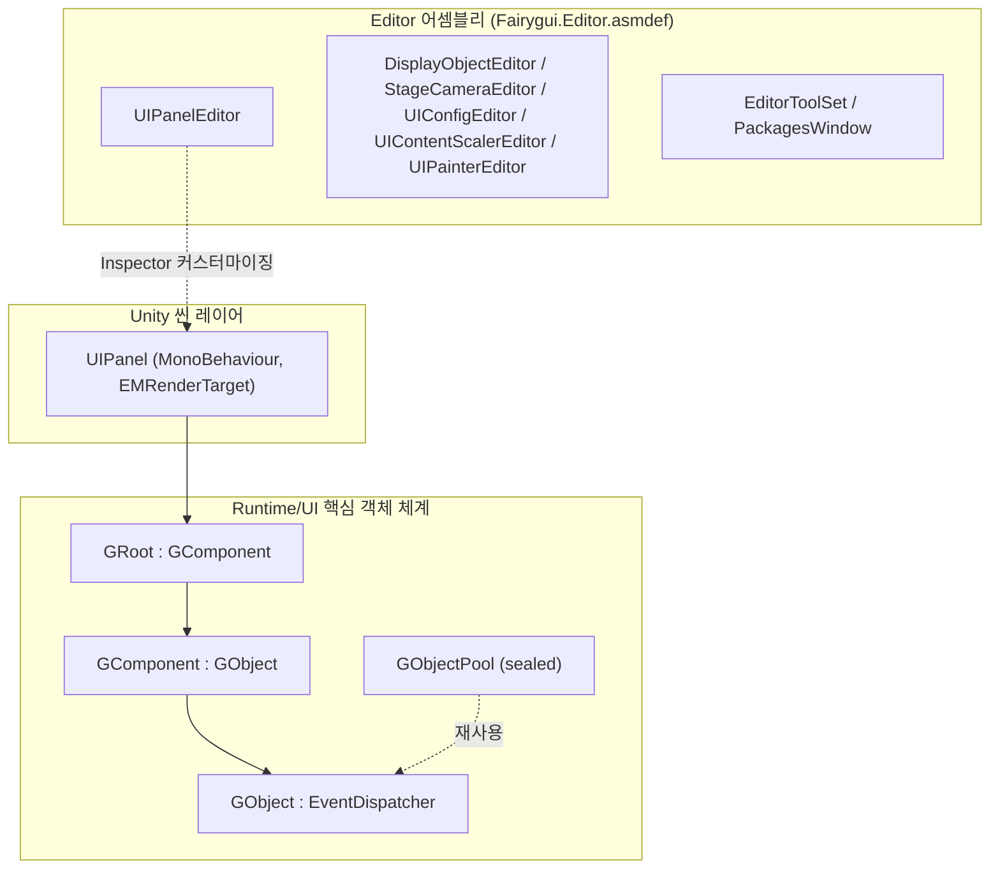

# 작동 원리: 런타임 구조와 모듈 구성

FairyGUI Unity 런타임(패키지명 `com.gameframex.unity.fairygui.unity`, 버전 5.3.5, FairyGUI 공식 소스 코드 기반)은 두 개의 주요 부분으로 구성됩니다: **Runtime** 디렉토리는 순수 C# 기반의 UI 핵심 객체 체계를 담당하고, **Editor** 디렉토리는 Unity 에디터 확장을 담당합니다. UI 객체는 `GObject`를 루트로 하여 `GComponent → GRoot` 순으로 단계별로 조합되며, 최종적으로 Unity 씬의 `UIPanel`(MonoBehaviour)에 마운트되어 표시됩니다.

## 패키지 기본 정보

| 항목 | 값 |
|------|------|
| 패키지명 | `com.gameframex.unity.fairygui.unity` |
| 표시 이름 | FairyGUI |
| 버전 | 5.3.5 |
| 최소 Unity 버전 | 2019.4 |
| Samples | 패키지 내장 Samples 예시(displayName: `Samples`) |

위 정보는 [package.json](https://github.com/GameFrameX/com.gameframex.unity.fairygui.unity/blob/main/package.json#L2-L10)에서 가져왔습니다.

## 디렉토리 및 모듈 구성

| 디렉토리/모듈 | 내용 | 주요 파일 예시 |
|------|------|------|
| `Runtime/UI` | UI 객체 체계의 핵심: 기본 객체, 컴포넌트, 루트 노드, 객체 풀, 패널 마운트 | [GObject.cs](https://github.com/GameFrameX/com.gameframex.unity.fairygui.unity/blob/main/Runtime/UI/GObject.cs) |
| `Editor` | 에디터 확장: 각 컴포넌트의 Inspector 커스터마이징 및 도구 창 | [UIPanelEditor.cs](https://github.com/GameFrameX/com.gameframex.unity.fairygui.unity/blob/main/Editor/UIPanelEditor.cs) |

`Editor` 디렉토리에서 확인된 에디터 확장(모두 네임스페이스 `FairyGUI.Editor`에 위치하며, 독립적인 [Fairygui.Editor.asmdef](https://github.com/GameFrameX/com.gameframex.unity.fairygui.unity/blob/main/Editor/Fairygui.Editor.asmdef)가 어셈블리 경계를 정의함):

- `DisplayObjectEditor` — 표시 객체 Inspector 커스터마이징
- `StageCameraEditor` — 스테이지 카메라 Inspector 커스터마이징
- `UIConfigEditor` — UI 설정 Inspector 커스터마이징
- `UIContentScalerEditor` — 콘텐츠 스케일 설정 Inspector 커스터마이징
- `UIPainterEditor` — UI Painter Inspector 커스터마이징
- `UIPanelEditor` — `UIPanel` 컴포넌트 Inspector 커스터마이징
- `EditorToolSet` / `PackagesWindow` — 에디터 도구 모음 및 패키지 관리 창

## UI 객체 클래스 계층

런타임 UI 객체는 모두 `Runtime/UI`에 위치하며, 상속 관계는 다음과 같습니다(코드는 소스 코드 원문):

```csharp
public class GObject : EventDispatcher
```

출처: [GObject.cs](https://github.com/GameFrameX/com.gameframex.unity.fairygui.unity/blob/main/Runtime/UI/GObject.cs#L7)

```csharp
public class GComponent : GObject
```

출처: [GComponent.cs](https://github.com/GameFrameX/com.gameframex.unity.fairygui.unity/blob/main/Runtime/UI/GComponent.cs#L14)

```csharp
public class GRoot : GComponent
```

출처: [GRoot.cs](https://github.com/GameFrameX/com.gameframex.unity.fairygui.unity/blob/main/Runtime/UI/GRoot.cs#L10)

```csharp
public sealed class GObjectPool
```

출처: [GObjectPool.cs](https://github.com/GameFrameX/com.gameframex.unity.fairygui.unity/blob/main/Runtime/UI/GObjectPool.cs#L10)

계층의 의미:

- **`GObject`**: 모든 UI 객체의 기본 클래스이며, 이벤트 디스패처 `EventDispatcher`를 상속받아 이벤트 처리를 통일합니다.
- **`GComponent`**: 컨테이너 컴포넌트로, 하위 `GObject`를 포함하고 관리할 수 있으며, 컴포지션 트리의 중간 계층을 구성합니다.
- **`GRoot`**: 루트 컨테이너로, `GComponent`를 상속받으며, UI 트리의 최상위 진입점입니다.
- **`GObjectPool`**(sealed): 객체 풀로, UI 객체의 재사용에 사용됩니다.

## Unity 씬 마운트: UIPanel

`Runtime`의 UI 객체 트리를 Unity 씬에 표시하려면 MonoBehaviour 컴포넌트인 `UIPanel`을 통해 GameObject에 마운트해야 합니다:

```csharp
[AddComponentMenu("FairyGUI/UI Panel")]
public class UIPanel : MonoBehaviour, EMRenderTarget
```

출처: [UIPanel.cs](https://github.com/GameFrameX/com.gameframex.unity.fairygui.unity/blob/main/Runtime/UI/UIPanel.cs#L25-L27)

요점:

- `UIPanel`은 동시에 `EMRenderTarget` 인터페이스를 구현하여 렌더링 대상으로서 프레임워크의 렌더링 파이프라인에 참여할 수 있습니다.
- 메뉴 경로는 `FairyGUI/UI Panel`이며, Unity 컴포넌트 메뉴 `Add Component → FairyGUI/UI Panel`에서 추가합니다.
- 이에 대응하는 에디터 커스터마이징은 `FairyGUI.UIPanelEditor`입니다(`[CustomEditor(typeof(FairyGUI.UIPanel))]`, [UIPanelEditor.cs](https://github.com/GameFrameX/com.gameframex.unity.fairygui.unity/blob/main/Editor/UIPanelEditor.cs#L12-L14) 참조).

## 모듈 구조 개요



## 관련 링크

- UI 기본 클래스 구현: [GObject.cs](https://github.com/GameFrameX/com.gameframex.unity.fairygui.unity/blob/main/Runtime/UI/GObject.cs)
- 컨테이너 컴포넌트: [GComponent.cs](https://github.com/GameFrameX/com.gameframex.unity.fairygui.unity/blob/main/Runtime/UI/GComponent.cs)
- 루트 컨테이너: [GRoot.cs](https://github.com/GameFrameX/com.gameframex.unity.fairygui.unity/blob/main/Runtime/UI/GRoot.cs)
- Unity 마운트 컴포넌트: [UIPanel.cs](https://github.com/GameFrameX/com.gameframex.unity.fairygui.unity/blob/main/Runtime/UI/UIPanel.cs)
- 에디터 확장: [Editor 디렉토리](https://github.com/GameFrameX/com.gameframex.unity.fairygui.unity/blob/main/Editor)
- 패키지 설명 파일: [package.json](https://github.com/GameFrameX/com.gameframex.unity.fairygui.unity/blob/main/package.json)