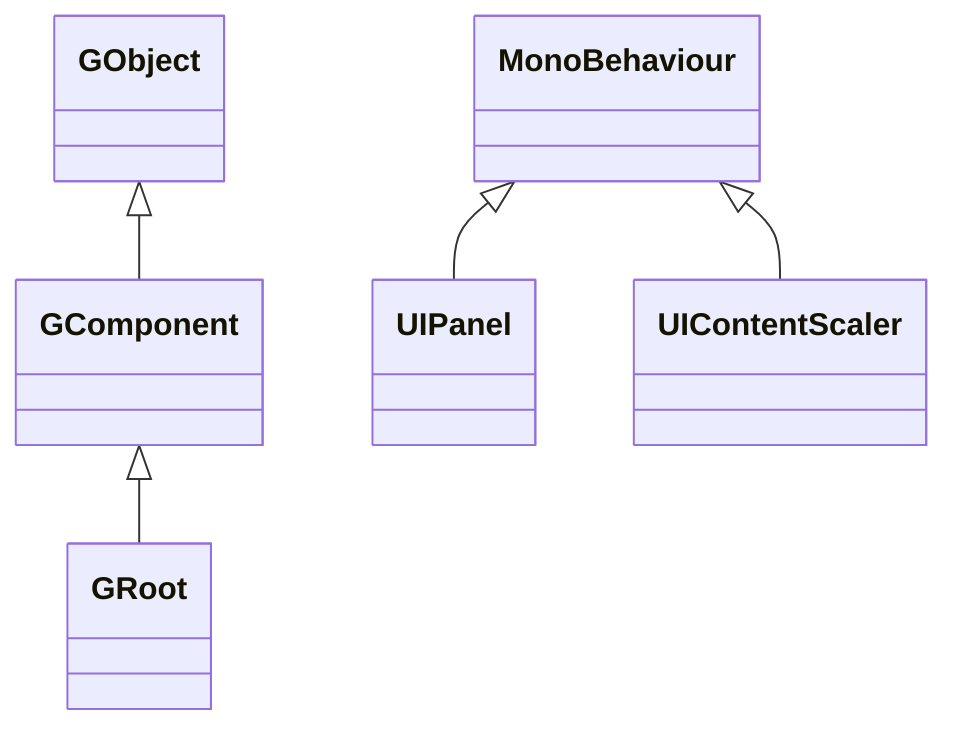

# FairyGUI for Unity 패키지 소개

본 패키지는 [FairyGUI](https://www.fairygui.com/product.html)의 GameFrameX용 Unity 래핑 버전입니다: FairyGUI는 크로스 플랫폼 UI 에디터이자 UI 프레임워크이며, 본 패키지는 이를 Unity Package(UPM)로 패키징하고 크로핑 방지, 미니게임 키보드 대응, 에디터 바로가기 메뉴 등 게임 프레임워크 통합에 필요한 변경사항을 추가했습니다. 이 패키지를 설치하면 FairyGUI 에디터에서 내보낸 UI 리소스를 사용하여 Unity에서 UI를 구축할 수 있습니다.

## 빠른 시작

### 1. 패키지 설치

Unity 프로젝트의 `Packages/manifest.json`에 `scopedRegistries`와 종속성을 추가합니다(네 가지 설치 방법 중 하나 선택):

```json
{
  "scopedRegistries": [
    {
      "name": "GameFrameX",
      "url": "https://gameframex.upm.alianblank.uk",
      "scopes": [
        "com.gameframex"
      ]
    }
  ],
  "dependencies": {
    "com.gameframex.unity.fairygui.unity": "5.3.3"
  }
}
```

Source: [README.md](https://github.com/GameFrameX/com.gameframex.unity.fairygui.unity/blob/main/README.md#L88-L104)

`scopes`는 어떤 패키지가 이 registry에서 해석되는지 결정합니다: `com.gameframex`로 시작하는 패키지만 여기서 가져옵니다.

다른 세 가지 방법:

- `manifest.json`의 `dependencies`에 Git 주소를 직접 작성: `"com.gameframex.unity.fairygui.unity": "https://github.com/gameframex/com.gameframex.unity.fairygui.unity.git"`
- Unity의 **Package Manager**에서 **Git URL**로 추가: `https://github.com/gameframex/com.gameframex.unity.fairygui.unity.git`
- 저장소를 Unity 프로젝트의 `Packages` 디렉터리에 클론하면 자동으로 로드됩니다

Source: [README.md](https://github.com/GameFrameX/com.gameframex.unity.fairygui.unity/blob/main/README.md#L108-L115)

### 2. 설치 확인

Unity로 돌아와 메뉴바에 `Tools > FairyGUI`가 나타나면 설치가 성공한 것입니다. 이것은 본 패키지에서 새로 추가한 에디터 바로가기 토글 진입점입니다(각 컴파일 매크로 전환용).

### 3. UI 사용

- [FairyGUI 공식 웹사이트](https://www.fairygui.com/product.html)에서 에디터를 다운로드하여 UI를 제작하고, 리소스를 Unity 프로젝트로 내보냅니다;
- 씬에서 `UIPanel`(FairyGUI/UI Panel 컴포넌트)을 통해 UI를 마운트하거나, `GRoot`를 UI 루트 컴포넌트로 사용하여 코드에서 동적으로 생성합니다;
- `UIContentScaler`(FairyGUI/UI Content Scaler 컴포넌트)로 해상도 대응을 구성합니다.

본 패키지는 Unity 2019.4 이상 버전에서 사용 가능하며, 다른 종속성 패키지는 없습니다.

## 작동 원리 요약

패키지 내 코드는 세 개의 레이어로 나뉩니다(Unity Package 표준 디렉터리):

| 디렉터리 | 내용 | 핵심 타입 |
|------|------|----------|
| `Runtime/UI` | 컴포넌트 레이어: GObject 컴포넌트 체계, UIPackage 리소스 패키지, UIPanel/UIContentScaler의 MonoBehaviour 브리지 | `GObject`, `GComponent`, `GRoot`, `GList`, `GButton`, `GLoader`, `UIPanel`, `UIPackage` |
| `Runtime/Core` | 디스플레이 레이어: 디스플레이 오브젝트, 렌더링 메시, 클릭 감지, 블렌드 모드 | `DisplayObject`, `Container`, `Image`, `MeshFactory`, `PixelHitTest` |
| `Editor` | 에디터 확장: Inspector 확장, 매크로 토글 메뉴 | `UIPanelEditor`, `UIConfigEditor`, `EditorToolSet` |

컴포넌트 레이어 상속 관계(소스 코드 확인):



- `GObject`는 모든 UI 컴포넌트의 기본 클래스입니다; `GComponent`는 자식 오브젝트를 담을 수 있는 컨테이너입니다; `GRoot`는 UI 트리의 루트 노드입니다([GObject.cs](https://github.com/GameFrameX/com.gameframex.unity.fairygui.unity/blob/main/Runtime/UI/GObject.cs), [GComponent.cs](https://github.com/GameFrameX/com.gameframex.unity.fairygui.unity/blob/main/Runtime/UI/GComponent.cs#L14), [GRoot.cs](https://github.com/GameFrameX/com.gameframex.unity.fairygui.unity/blob/main/Runtime/UI/GRoot.cs#L10))
- `UIPanel`과 `UIContentScaler`는 Unity GameObject에 부착되는 `MonoBehaviour`로, FairyGUI 컴포넌트 트리를 Unity 씬과 렌더링에 연결하는 역할을 담당합니다([UIPanel.cs](https://github.com/GameFrameX/com.gameframex.unity.fairygui.unity/blob/main/Runtime/UI/UIPanel.cs#L26), [UIContentScaler.cs](https://github.com/GameFrameX/com.gameframex.unity.fairygui.unity/blob/main/Runtime/UI/UIContentScaler.cs#L10))

FairyGUI는 `FairyBatching` DrawCall 최적화 기술을 자체 내장하고 있으며, 텍스트·이미지 혼합 배치, emoji 입력, 가상 리스트/순환 리스트, 픽셀 단위 클릭 감지, 아치형 UI, 제스처, 타이프라이터 효과 등 일반적인 UI 기능을 내장하고 있습니다; 마우스, 단일 터치, 멀티 터치, VR 컨트롤러 등의 입력은 하나의 인터랙션 코드 체계로 통일되어 캡슐화되어 있습니다.

## 공식 버전 대비 변경사항

본 패키지는 FairyGUI 공식 Unity 버전을 기반으로 다음과 같은 조정을 했습니다([README.md](https://github.com/GameFrameX/com.gameframex.unity.fairygui.unity/blob/main/README.md#L28-L38)):

1. Unity Package Manager 지원 추가
2. `FairyGUICroppingHelper` 크로핑 방지 스크립트 추가
3. `link.xml` 스트리핑 필터 추가
4. 비동기 AssetBundle 로드 시 콜백이 없는 버그 수정
5. 위챗 미니게임, 더우인 미니게임 키보드 입력 대응 추가
6. `ENABLE_WECHAT_MINI_GAME` 매크로 추가(위챗 미니게임 키보드 대응, 더우인과 동시에 활성화하지 마세요)
7. `ENABLE_DOUYIN_MINI_GAME` 매크로 추가(더우인 미니게임 키보드 대응, 위챗과 동시에 활성화하지 마세요)
8. Unity 에디터 바로가기 토글 추가: `Tools > FairyGUI` 해당 메뉴
9. 이미지 픽셀화 기능 추가

## 관련 링크

- [FairyGUI 공식 튜토리얼](https://www.fairygui.com/docs/guide/index.html)
- [GameFrameX 문서](https://gameframex.doc.alianblank.com)
- [릴리스 기록 / Changelog](https://github.com/GameFrameX/com.gameframex.unity.fairygui.unity/releases)
- 픽셀화 기능의 활성화 및 파라미터 조정에 대해서는 [README.md](https://github.com/GameFrameX/com.gameframex.unity.fairygui.unity/blob/main/README.md#L40-L70)를 참조하세요
- QQ 교류 그룹: 467608841 / 233840761