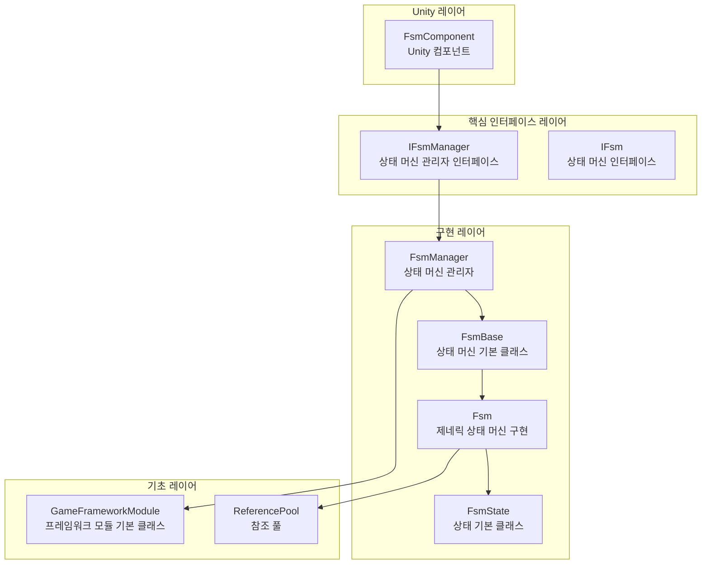
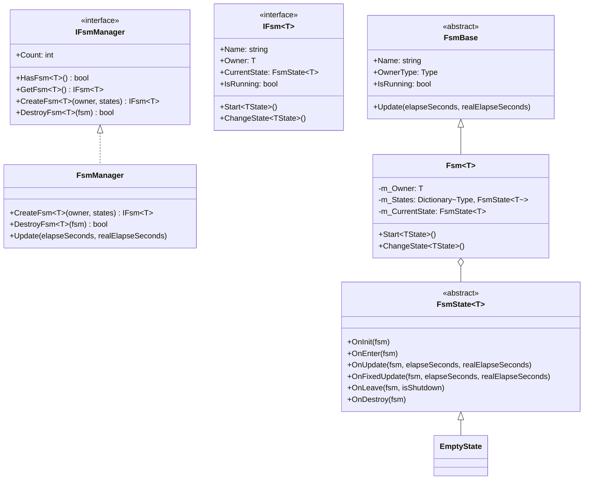
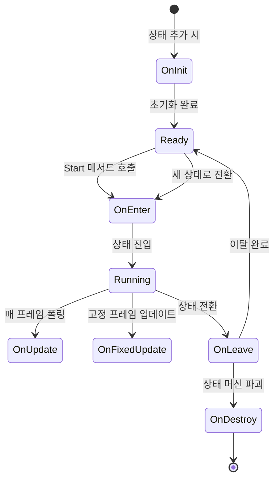
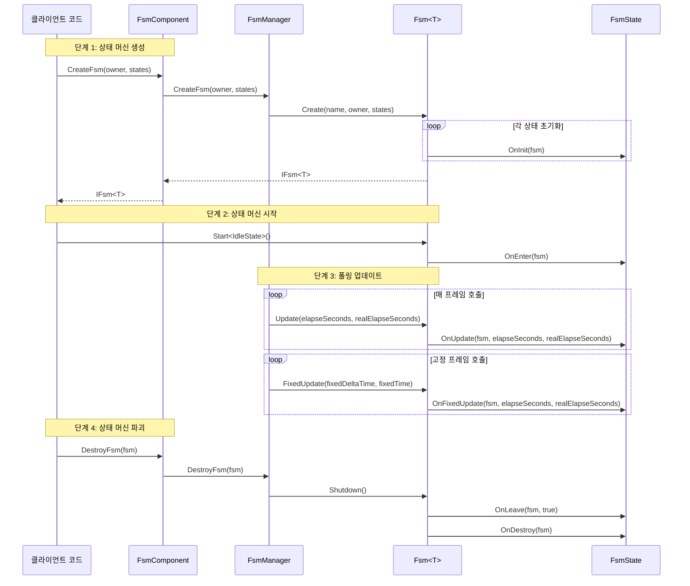

# 개요

GameFrameX 유한 상태 머신(FSM) 컴포넌트는 GameFrameX 게임 프레임워크의 핵심 모듈 중 하나로, 게임 객체의 동작 상태 전환을 관리하기 위한 완전한 유한 상태 머신 구현을 제공합니다. 이 컴포넌트는 Game Framework를 기반으로 개발되었으며, 제네릭 타입 제약 조건을 지원하고 상태 수명 주기 관리, 상태 데이터 저장, 상태 전환 등의 핵심 기능을 제공합니다.

## 프로젝트 소개

유한 상태 머신은 동작 디자인 패턴으로, 객체의 내부 상태가 변경될 때 객체의 동작이 변경되도록 허용합니다. FSM 컴포넌트는 객체의 상태를 독립적인 상태 클래스로 캡슐화하여 상태 전환 로직을 명확하고 제어 가능하게 만들어, 게임 내 캐릭터 동작, AI 상태 머신, UI 흐름 제어 등의 시나리오에 매우 적합합니다.

**핵심 기능:**

- **제네릭 상태 머신**: 임의의 참조 타입을 상태 머신 소유자로 지원
- **완전한 수명 주기**: 상태 초기화, 진입, 업데이트, 고정 업데이트, 이탈, 파괴 등의 콜백 제공
- **데이터 저장**: 상태 머신에서 상태 관련 데이터 저장 및 검색 지원
- **상태 전환**: 타입 안전하고 유연한 상태 전환 메커니즘 제공
- **고정 프레임 업데이트**: FixedUpdate 물리 업데이트 지원
- **오브젝트 풀 통합**: 참조 풀 기술을 사용하여 메모리 할당 최적화

## 시스템 아키텍처

FSM 컴포넌트는 계층화된 아키텍처 설계로, 인터페이스 추상을 통해 분리됩니다.



**아키텍처 설명:**

| 레이어 | 컴포넌트 | 책임 |
|------|------|------|
| Unity 레이어 | FsmComponent | Unity MonoBehaviour 래핑 제공, Unity 수명 주기에 통합 |
| 핵심 인터페이스 레이어 | IFsmManager, IFsm | 상태 머신 관리 및 상태 머신의 추상 인터페이스 정의 |
| 구현 레이어 | FsmManager, Fsm, FsmState | 상태 머신 관리자, 제네릭 상태 머신, 상태 기본 클래스의 구체적 구현 |
| 기초 레이어 | GameFrameworkModule, ReferencePool | 프레임워크 기초 모듈 및 오브젝트 풀 지원 |

## 핵심 컴포넌트

FSM 컴포넌트는 다음과 같은 핵심 타입으로 구성됩니다:



**컴포넌트 책임:**

| 타입 | 설명 |
|------|------|
| **FsmComponent** | Unity 컴포넌트, FsmManager 래핑, 에디터 및 런타임 액세스 제공 |
| **FsmManager** | 상태 머신 관리자, 모든 상태 머신 인스턴스의 생성, 가져오기, 파괴 관리 |
| **Fsm** | 제네릭 상태 머신 구현 클래스, 상태 집합, 상태 데이터, 상태 전환 관리 |
| **FsmState** | 상태 기본 클래스, 상태의 수명 주기 콜백 메서드 정의 |
| **FsmBase** | 상태 머신 추상 기본 클래스, 일반 속성 및 메서드 정의 |

## 상태 수명 주기

상태 머신의 각 상태는 완전한 수명 주기 콜백을 가집니다:



**수명 주기 콜백:**

| 콜백 메서드 | 호출时机 | 용도 |
|----------|----------|------|
| `OnInit` | 상태가 상태 머신에 추가될 때 | 상태 데이터 초기화, 상태 매개변수 구성 |
| `OnEnter` | 상태 진입 시 | 애니메이션 재생, 사운드 효과 재생 등 상태 진입 로직 |
| `OnUpdate` | 매 프레임 폴링 시 | 상태 동작 로직, 조건 판단, 상태 전환 검사 |
| `OnFixedUpdate` | 고정 프레임 업데이트 시 | 물리 관련 로직 |
| `OnLeave` | 상태 이탈 시 | 상태 종료 정리, 리소스 해제 |
| `OnDestroy` | 상태 머신 파괴 시 | 최종 정리 작업 |

## 빠른 시작

다음은 FSM 컴포넌트 기본 사용 예시입니다:

### 상태 정의

먼저 구체적인 상태 클래스를 `FsmState<T>`에서 상속하여 정의합니다:

```csharp
using GameFrameX.Fsm.Runtime;

// 캐릭터 클래스를 상태 머신 소유자로 정의
public class Character
{
    public string Name;
}

// 유휴 상태
public class IdleState : FsmState<Character>
{
    protected internal override void OnEnter(IFsm<Character> fsm)
    {
        base.OnEnter(fsm);
        UnityEngine.Debug.Log("유휴 상태 진입");
    }

    protected internal override void OnUpdate(IFsm<Character> fsm, float elapseSeconds, float realElapseSeconds)
    {
        base.OnUpdate(fsm, elapseSeconds, realElapseSeconds);
        // 이동 상태로 진입해야 하는지 감지
    }
}

// 이동 상태
public class MoveState : FsmState<Character>
{
    protected internal override void OnEnter(IFsm<Character> fsm)
    {
        base.OnEnter(fsm);
        UnityEngine.Debug.Log("이동 상태 진입");
    }

    protected internal override void OnLeave(IFsm<Character> fsm, bool isShutdown)
    {
        base.OnLeave(fsm, isShutdown);
        UnityEngine.Debug.Log("이동 상태 이탈");
    }
}
```

> Source: [README.md](https://github.com/GameFrameX/com.gameframex.unity.fsm/blob/main/README.md#L43-L78)

### 상태 머신 생성 및 사용

```csharp
// 캐릭터 생성
var character = new Character { Name = "Hero" };

// FsmComponent를 통해 상태 머신 생성
var fsm = fsmComponent.CreateFsm(character,
    new IdleState(),
    new MoveState());

// 상태 머신 시작, 유휴 상태부터 시작
fsm.Start<IdleState>();

// 상태 내부에서 다른 상태로 전환
// MoveState newState = fsm.GetState<MoveState>();
// newState.ChangeState<MoveState>(fsm);

// 상태 머신 파괴
fsmComponent.DestroyFsm(fsm);
```

> Source: [README.md](https://github.com/GameFrameX/com.gameframex.unity.fsm/blob/main/README.md#L40-L65)

## 핵심 흐름

FSM 컴포넌트의 워크플로우는 생성, 폴링, 파괴의 세 가지 주요 단계로 구성됩니다:



## 상태 데이터 관리

FSM 컴포넌트는 상태 머신에서 데이터를 저장하고 검색할 수 있는 상태 데이터 저장 기능을 제공합니다:

```csharp
// 데이터 설정
fsm.SetData("Health", new VarInt(100));
fsm.SetData("Speed", new VarFloat(5.0f));

// 데이터 가져오기
VarInt health = fsm.GetData<VarInt>("Health");
int healthValue = health.Value;

// 데이터 존재 확인
if (fsm.HasData("Speed"))
{
    // 데이터 존재
}

// 데이터 제거
fsm.RemoveData("Health");
```

> Source: [Fsm.cs](https://github.com/GameFrameX/com.gameframex.unity.fsm/blob/main/Runtime/Fsm/Fsm.cs#L445-L507)

## Unity 통합

FsmComponent는 Unity 컴포넌트로 게임 씬에 통합되어, 상태 머신의 수명 주기를 자동으로 관리합니다:

```csharp
[DisallowMultipleComponent]
[AddComponentMenu("Game Framework/FSM")]
public sealed class FsmComponent : GameFrameworkComponent
{
    private IFsmManager m_FsmManager = null;

    protected override void Awake()
    {
        base.Awake();
        m_FsmManager = GameFrameworkEntry.GetModule<IFsmManager>();
    }

    private void FixedUpdate()
    {
        m_FsmManager.FixedUpdate(Time.fixedDeltaTime, Time.fixedTime);
    }
}
```

> Source: [FsmComponent.cs](https://github.com/GameFrameX/com.gameframex.unity.fsm/blob/main/Runtime/Fsm/FsmComponent.cs#L22-L53)

## 관련 링크

- [설치 가이드](./2-installation)
- [빠른 시작](./3-getting-started)
- [핵심 개념](./04.features.md)
- [API 참조](./5-api-reference)
- [자주 묻는 질문](./6-troubleshooting)
- [GitHub 저장소](https://github.com/GameFrameX/com.gameframex.unity.fsm.git)
- [GameFrameX 공식 웹사이트](https://gameframex.doc.alianblank.com)