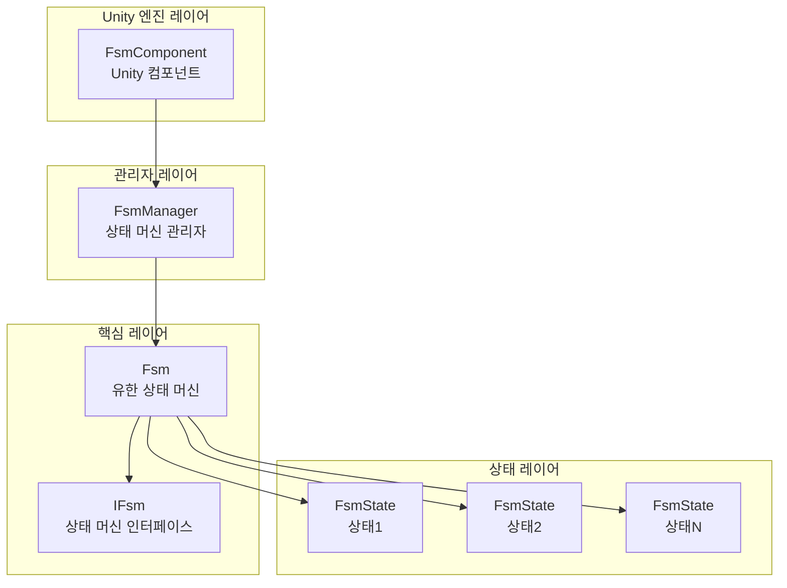
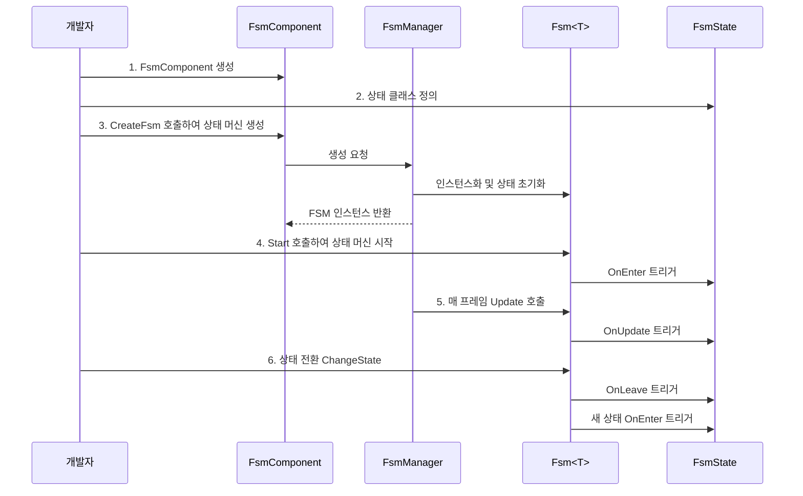

# 빠른 시작

이 가이드는 GameFrameX FSM 유한 상태 머신 컴포넌트를 빠르게 시작할 수 있도록 도와줍니다. 몇 가지 간단한 단계를 통해 Unity 프로젝트에서 유한 상태 머신을 생성하고 관리할 수 있습니다.

## 개요

GameFrameX FSM은 Unity 게임 개발을 위해 설계된 경량이지만 기능이 강력한 유한 상태 머신 시스템입니다. 구조화된 방식으로 게임 객체의 상태 전환을 관리할 수 있으며, 다음과 같은 시나리오에 특히 적합합니다:
- 캐릭터 동작 상태 머신 (대기, 걷기, 공격, 사망 등)
- UI 인터페이스 상태 관리
- 게임 흐름 제어
- AI 동작 로직

## 핵심 개념

시작하기 전에 다음 핵심 개념을 이해하면 도움이 됩니다:

| 개념 | 설명 |
|------|------|
| **FsmComponent** | 씬에서 상태 머신을 관리하는 Unity 컴포넌트 |
| **FsmManager** | 모든 상태 머신의 생성, 파괴 및 업데이트를 관리하는 상태 머신 관리자 |
| **`FsmState<T>`** | 상태의 수명 주기 훅을 정의하는 상태 기본 클래스 |
| **`IFsm<T>`** | 상태 머신 작업 메서드를 제공하는 상태 머신 인터페이스 |
| **Owner** | 상태 머신의 소유자로,通常是 게임 객체 또는 관리자 클래스 |

## 시스템 아키텍처



### 컴포넌트 책임

| 컴포넌트 | 책임 |
|------|------|
| **FsmComponent** | Unity 컴포넌트로, FsmManager의 초기화 및 Update 폴링을 제공 |
| **FsmManager** | 모든 FSM 인스턴스를 관리하고 생성, 가져오기, 파괴 메서드를 제공 |
| **`Fsm<T>`** | 구체적인 상태 머신 구현으로, 상태 집합 및 상태 전환 관리 |
| **`FsmState<T>`** | 상태의 콜백 메서드를 정의하고, 하위 클래스에서 구체적인 로직 구현 |

## 사용 흐름



## 빠른 예시

### 단계 1: FsmComponent 추가

Unity 씬에서 빈 오브젝트를 생성한 다음 `FsmComponent` 컴포넌트를 추가합니다:

```csharp
// FsmComponent는 Unity 컴포넌트로, GameObject에 붙여서 사용
// Unity 에디터에서: GameObject -> Add Component -> Game Framework -> FSM
```
> Source: [FsmComponent.cs](https://github.com/GameFrameX/com.gameframex.unity.fsm/blob/main/Runtime/Fsm/FsmComponent.cs#L20-L22)

### 단계 2: 상태 클래스 정의

구체적인 상태 클래스를 생성하여 `FsmState<T>`를 상속합니다:

```csharp
using GameFrameX.Fsm.Runtime;

// 상태 머신 소유자 타입 정의
public class Player
{
    public string Name;
}

// 유휴 상태
public class IdleState : FsmState<Player>
{
    protected internal override void OnEnter(IFsm<Player> fsm)
    {
        base.OnEnter(fsm);
        UnityEngine.Debug.Log("플레이어 유휴 상태 진입");
    }

    protected internal override void OnUpdate(IFsm<Player> fsm, float elapseSeconds, float realElapseSeconds)
    {
        base.OnUpdate(fsm, elapseSeconds, realElapseSeconds);
        // 여기서 다른 상태로 전환해야 하는지 감지
        // 예: 이동 입력 감지 시 걷기 상태로 전환
    }

    protected internal override void OnLeave(IFsm<Player> fsm, bool isShutdown)
    {
        base.OnLeave(fsm, isShutdown);
        UnityEngine.Debug.Log("플레이어 유휴 상태 이탈");
    }
}

// 걷기 상태
public class RunState : FsmState<Player>
{
    protected internal override void OnEnter(IFsm<Player> fsm)
    {
        base.OnEnter(fsm);
        UnityEngine.Debug.Log("플레이어 걷기 상태 진입");
    }

    protected internal override void OnLeave(IFsm<Player> fsm, bool isShutdown)
    {
        base.OnLeave(fsm, isShutdown);
        UnityEngine.Debug.Log("플레이어 걷기 상태 이탈");
    }
}
```
> Source: [FsmState.cs](https://github.com/GameFrameX/com.gameframex.unity.fsm/blob/main/Runtime/Fsm/FsmState.cs#L17-L77)

### 단계 3: 상태 머신 생성 및 시작

```csharp
using UnityEngine;
using GameFrameX.Fsm.Runtime;

public class PlayerController : MonoBehaviour
{
    private FsmComponent fsmComponent;
    private IFsm<Player> playerFsm;
    private Player player;

    private void Start()
    {
        // FsmComponent 컴포넌트 가져오기
        fsmComponent = GetComponent<FsmComponent>();
        
        // 플레이어 객체 생성
        player = new Player { Name = "Hero" };
        
        // 상태 머신 생성 (params 파라미터 사용)
        playerFsm = fsmComponent.CreateFsm(player, 
            new IdleState(), 
            new RunState());
        
        // 상태 머신 시작, 첫 번째 상태로 진입
        playerFsm.Start<IdleState>();
    }

    private void Update()
    {
        // 상태 머신은 FsmComponent에 의해 자동으로 업데이트됨
        // 여기서 외부 입력을 처리하고 상태 전환을 트리거할 수 있음
    }

    // 걷기 상태로 전환
    public void StartRun()
    {
        ChangeState<RunState>(playerFsm);
    }

    // 유휴 상태로 전환
    public void StopRun()
    {
        ChangeState<IdleState>(playerFsm);
    }

    private void OnDestroy()
    {
        // 씬 파괴 시 상태 머신 정리
        if (fsmComponent != null && playerFsm != null)
        {
            fsmComponent.DestroyFsm(playerFsm);
        }
    }
}
```
> Source: [Fsm.cs](https://github.com/GameFrameX/com.gameframex.unity.fsm/blob/main/Runtime/Fsm/Fsm.cs#L230-L249)

### 단계 4: 상태 내부에서 상태 전환

상태 클래스 내부에서 상태 전환:

```csharp
public class IdleState : FsmState<Player>
{
    protected internal override void OnUpdate(IFsm<Player> fsm, float elapseSeconds, float realElapseSeconds)
    {
        base.OnUpdate(fsm, elapseSeconds, realElapseSeconds);
        
        // 이동 입력 감지 방법 가정
        if (Input.GetKey(KeyCode.W))
        {
            // 걷기 상태로 전환
            ChangeState<RunState>(fsm);
        }
    }
}
```
> Source: [FsmState.cs](https://github.com/GameFrameX/com.gameframex.unity.fsm/blob/main/Runtime/Fsm/FsmState.cs#L84-L93)

## 고급 사용법

### 데이터 저장 사용

FSM은 키-값 쌍 데이터 저장 시스템을 제공하여, 상태 머신에서 데이터를 저장하고 읽을 수 있습니다:

```csharp
// 데이터 설정
playerFsm.SetData("LastAttackTime", 0f);
playerFsm.SetData("Health", 100);

// 데이터 읽기
float lastAttackTime = playerFsm.GetData<float>("LastAttackTime");
int health = playerFsm.GetData<int>("Health");

// 데이터 존재 확인
if (playerFsm.HasData("Health"))
{
    // 데이터 존재
}
```
> Source: [Fsm.cs](https://github.com/GameFrameX/com.gameframex.unity.fsm/blob/main/Runtime/Fsm/Fsm.cs#L390-L481)

### 현재 상태 정보 가져오기

```csharp
// 현재 상태 이름 가져오기
string currentStateName = playerFsm.CurrentStateName;

// 현재 상태 지속 시간 가져오기
float stateTime = playerFsm.CurrentStateTime;

// 현재 상태 인스턴스 가져오기
FsmState<Player> currentState = playerFsm.CurrentState;

// 상태 머신이 실행 중인지 확인
bool isRunning = playerFsm.IsRunning;

// 상태 수 가져오기
int stateCount = playerFsm.FsmStateCount;
```
> Source: [Fsm.cs](https://github.com/GameFrameX/com.gameframex.unity.fsm/blob/main/Runtime/Fsm/Fsm.cs#L56-L102)

### 상태 머신 파괴

```csharp
// 방법 1: 제네릭으로 파괴
fsmComponent.DestroyFsm<Player>();

// 방법 2: 인스턴스로 파괴
fsmComponent.DestroyFsm(playerFsm);

// 방법 3: 이름으로 파괴
fsmComponent.DestroyFsm<Player>("MyFsm");
```
> Source: [FsmComponent.cs](https://github.com/GameFrameX/com.gameframex.unity.fsm/blob/main/Runtime/Fsm/FsmComponent.cs#L206-L267)

## 일반 예시: 캐릭터 상태 머신

다음은 일반적인 캐릭터 상태 머신의 완전한 예시입니다:

```csharp
// 캐릭터 클래스
public class Character
{
    public string Name;
    public int Health = 100;
}

// 상태 정의
public class CharacterIdleState : FsmState<Character> { }
public class CharacterWalkState : FsmState<Character> { }
public class CharacterAttackState : FsmState<Character> { }
public class CharacterDeadState : FsmState<Character> { }

// 사용
public class CharacterController : MonoBehaviour
{
    private FsmComponent fsmComponent;
    private IFsm<Character> characterFsm;

    private void Start()
    {
        fsmComponent = GetComponent<FsmComponent>();
        var character = new Character { Name = "Hero" };
        
        // 모든 상태를 포함하는 상태 머신 생성
        characterFsm = fsmComponent.CreateFsm(character,
            new CharacterIdleState(),
            new CharacterWalkState(),
            new CharacterAttackState(),
            new CharacterDeadState());
        
        // 초기 상태 시작
        characterFsm.Start<CharacterIdleState>();
    }

    private void Update()
    {
        // 외부 제어 상태 전환
        if (Input.GetKeyDown(KeyCode.W))
            ChangeState<CharacterWalkState>(characterFsm);
        else if (Input.GetKeyDown(KeyCode.J))
            ChangeState<CharacterAttackState>(characterFsm);
        else if (Input.GetKeyDown(KeyCode.K))
            ChangeState<CharacterDeadState>(characterFsm);
    }
}
```
> Source: [FsmComponent.cs](https://github.com/GameFrameX/com.gameframex.unity.fsm/blob/main/Runtime/Fsm/FsmComponent.cs#L156-L204)

## 모범 사례

### 1. 상태 수 제한

각 상태 머신의 상태 수는 5-10개 이하로 유지하는 것을 권장합니다. 상태가 너무 많으면 여러 개의 독립적인 상태 머신으로 분할하는 것을 고려하세요.

### 2. 상태 전환 로직

- **외부 전환**: MonoBehaviour의 Update에서 입력에 따라 상태 전환
- **내부 전환**: FsmState의 OnUpdate에서 조건에 따라 자동 전환

### 3. 데이터 관리

FSM의 데이터 저장 기능을 사용하여 MonoBehaviour에서 상태 관련 데이터를 저장하지 마세요. 이렇게 하면:
- 상태 로직의 완전성 유지
- 상태 전환 시 데이터 전달 용이
- 디버깅 및 추적 용이

### 4. 리소스 정리

OnDestroy 또는 씬 전환 시 더 이상 사용하지 않는 상태 머신을 파괴하세요:

```csharp
private void OnDestroy()
{
    if (fsmComponent != null && playerFsm != null)
    {
        fsmComponent.DestroyFsm(playerFsm);
    }
}
```

## 관련 링크

- [핵심 개념](./04.features.md) - FSM의 핵심 설계 심층 이해
- [API 참조](./5-api-reference) - 완전한 API 문서
- [설치 가이드](./2-installation) - 설치 및 구성
- [개요](./1-overview) - 프로젝트 전체 소개