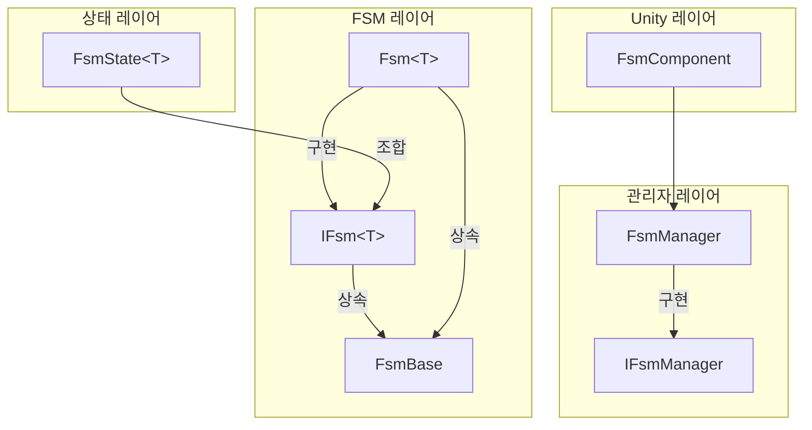
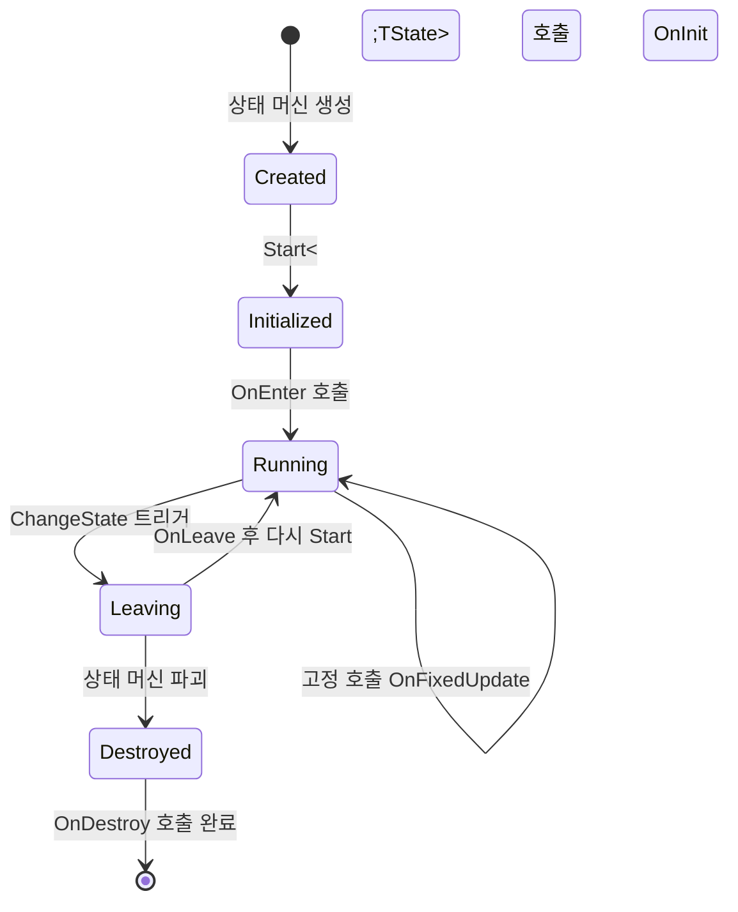
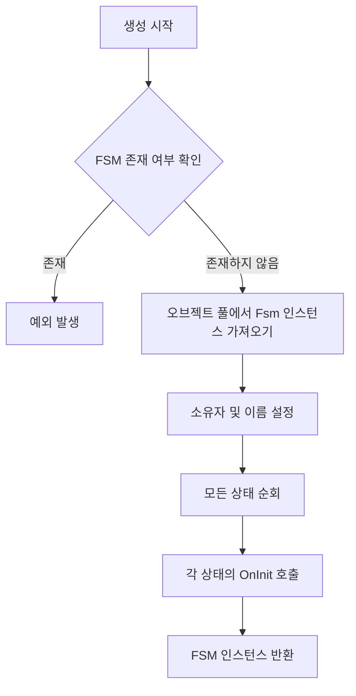

# 핵심 개념

이 문서는 GameFrameX 유한 상태 머신(FSM) 컴포넌트의 핵심 개념, 아키텍처 설계 및 주요 메커니즘을 상세히 설명합니다. FSM 컴포넌트는 Unity 게임 개발을 위한 강력한 상태 관리 기능을 제공하며, 상태 수명 주기 관리, 상태 전환 및 데이터 저장等功能을 지원합니다.

## 개요

유한 상태 머신(Finite State Machine, FSM)은 객체가有限개의 상태 사이에서切换할 수 있도록 허용하는 동작 디자인 패턴입니다. 게임 개발에서 FSM은 AI 동작 관리, 게임 흐름 제어, 캐릭터 상태 전환 등에广泛应用됩니다.

GameFrameX FSM 컴포넌트는 Game Framework 아키텍처를 기반으로 다음 핵심 기능을 제공합니다:

- **제네릭 상태 머신** - 강타입的状态机 정의, 컴파일 시 타입 검사
- **상태 수명 주기 관리** - 완전한 상태 초기화, 진입, 업데이트, 이탈, 파괴 콜백
- **상태 데이터 저장** - 내장 키-값 쌍 데이터 저장 메커니즘
- **오브젝트 풀 지원** - 자동 메모리 관리 및 오브젝트 재사용
- **Unity 컴포넌트 통합** - Unity 씬에서 사용하기 편리한 FsmComponent 제공

## 시스템 아키텍처

GameFrameX FSM은分层 아키텍처 설계를 채택하여, 하위에서 상위 순서대로: 상태 레이어, FSM 레이어, 관리자 레이어입니다. 이러한分层 설계는 책임 분리 및 코드 유지보수성을 보장합니다.



### 각 레이어 책임

**상태 레이어 (FsmState<T>)**는 상태의 구체적인 구현 기본 클래스입니다. 개발자는 이 클래스를 상속하여 구체적인 상태를 정의하며, 각 상태는 자체 비즈니스 로직을 구현합니다. 상태 레이어는 상태의 6가지 수명 주기 콜백 메서드를 정의하여 상태 머신의 다양한 이벤트에 응답합니다.

**FSM 레이어 (IFsm<T> 및 Fsm<T>)**는 상태 머신의 핵심 구현입니다. IFsm<T> 인터페이스는 상태 머신의 모든 작업을 정의하며, 상태 쿼리, 상태 전환, 데이터 접근 등을 포함합니다. Fsm<T>는 이 인터페이스의 제네릭 구현으로, 상태 집합, 현재 상태, 상태 지속 시간 등의 런타임 데이터를 관리합니다.

**관리자 레이어 (IFsmManager 및 FsmManager)**는 전체 시스템의 FSM 인스턴스를 관리합니다. FsmManager는 GameFrameworkModule에서 상속하여 게임 프레임워크의 모듈로 서비스를 제공합니다. 모든 FSM 인스턴스의 참조를 관리하고 생성, 쿼리, 파괴 및 폴링 업데이트를 담당합니다.

## 핵심 컴포넌트

### FsmState<T> 상태 기본 클래스

FsmState<T>는 모든 구체적인 상태의 추상 기본 클래스입니다. 상태의 6가지 수명 주기 콜백 메서드를 정의하며, 상태 머신이 적절한 시기에 자동으로 호출합니다. 개발자는 필요한 메서드만 재정의하면 되며, 호출 시기를 고려할 필요 없습니다.

```csharp
public abstract class FsmState<T> where T : class
{
    // 상태 초기화 시 호출
    protected internal virtual void OnInit(IFsm<T> fsm) { }
    
    // 상태 진입 시 호출
    protected internal virtual void OnEnter(IFsm<T> fsm) { }
    
    // 상태 매 프레임 업데이트 시 호출
    protected internal virtual void OnUpdate(IFsm<T> fsm, float elapseSeconds, float realElapseSeconds) { }
    
    // 상태 고정 업데이트 시 호출 (물리 관련)
    protected internal virtual void OnFixedUpdate(IFsm<T> fsm, float elapseSeconds, float realElapseSeconds) { }
    
    // 상태 이탈 시 호출
    protected internal virtual void OnLeave(IFsm<T> fsm, bool isShutdown) { }
    
    // 상태 파괴 시 호출
    protected internal virtual void OnDestroy(IFsm<T> fsm) { }
    
    // 다른 상태로 전환
    public void ChangeToState<TState>(IFsm<T> fsm) where TState : FsmState<T>
    protected void ChangeState<TState>(IFsm<T> fsm) where TState : FsmState<T>
}
```

> Source: [FsmState.cs](https://github.com/GameFrameX/com.gameframex.unity.fsm/blob/main/Runtime/Fsm/FsmState.cs#L17-L136)

**설계 의도**: 템플릿 메서드 패턴을 사용하여 상태의 표준 동작 프레임워크를 정의합니다. 각 상태는 자신의 특정 로직에만 집중하면 되고, 상태 머신이 올바른 시기에 올바른 메서드를 호출할 책임을 집니다. 이러한 설계는 상태의 일반적인 동작을 기본 클래스로 추상화하고 구체적인 동작은 하위 클래스에서 구현합니다.

### IFsm<T> 상태 머신 인터페이스

IFsm<T> 인터페이스는 상태 머신의 완전한 작업 집합을 정의합니다. 제네릭 매개변수 T를 통해 상태 머신은 임의의 타입의 객체를 타입 안전하게 보유할 수 있습니다.

```csharp
public interface IFsm<T> where T : class
{
    // 속성
    string Name { get; }
    string FullName { get; }
    T Owner { get; }
    int FsmStateCount { get; }
    bool IsRunning { get; }
    bool IsDestroyed { get; }
    FsmState<T> CurrentState { get; }
    float CurrentStateTime { get; }
    
    // 메서드
    void Start<TState>() where TState : FsmState<T>;
    void Start(Type stateType);
    bool HasState<TState>() where TState : FsmState<T>;
    TState GetState<TState>() where TState : FsmState<T>;
    FsmState<T>[] GetAllStates();
    bool HasData(string name);
    TData GetData<TData>(string name) where TData : Variable;
    void SetData<TData>(string name, TData data) where TData : Variable;
    bool RemoveData(string name);
}
```

> Source: [IFsm.cs](https://github.com/GameFrameX/com.gameframex.unity.fsm/blob/main/Runtime/Fsm/IFsm.cs#L18-L179)

**설계 의도**: 인터페이스 분리 원칙의 전형적인 응용입니다. IFsm<T> 인터페이스를 통해 상태는 런타임에 상태 머신의 완전한 제어권을 가져올 수 있으며, 상태 전환, 데이터 저장 등을 포함합니다. 이러한 설계는 상태 클래스가 상태 머신의 동작을 완전히 제어할 수 있게 합니다.

### FsmManager 상태 머신 관리자

FsmManager는 시스템의 핵심 관리자로, 모든 FSM 인스턴스의 수명 주기를 관리합니다.

```csharp
public sealed class FsmManager : GameFrameworkModule, IFsmManager
{
    // 상태 머신 생성
    public IFsm<T> CreateFsm<T>(T owner, params FsmState<T>[] states) where T : class;
    public IFsm<T> CreateFsm<T>(string name, T owner, params FsmState<T>[] states) where T : class;
    
    // 상태 머신 가져오기
    public IFsm<T> GetFsm<T>() where T : class;
    public IFsm<T> GetFsm<T>(string name) where T : class;
    
    // 상태 머신 존재 확인
    public bool HasFsm<T>() where T : class;
    
    // 상태 머신 파괴
    public bool DestroyFsm<T>(IFsm<T> fsm) where T : class;
    
    // 폴링 업데이트
    public void FixedUpdate(float fixedDeltaTime, float fixedTime);
}
```

> Source: [FsmManager.cs](https://github.com/GameFrameX/com.gameframex.unity.fsm/blob/main/Runtime/Fsm/FsmManager.cs#L18-L436)

**설계 의도**: 싱글톤 관리자 패턴의 게임 개발에서의 전형적인 응용입니다. FsmManager는 게임 프레임워크의 모듈로, 게임 프레임워크 초기화 및 종료 흐름에 자동으로 참여합니다. GameFrameworkEntry를 통해 모듈 인스턴스를 가져와 시스템에서 글로벌하게 유일하도록 보장합니다.

### FsmComponent Unity 컴포넌트

FsmComponent는 Unity 엔진용 컴포넌트 래핑으로, 에디터에 친숙한 상태 머신 관리 방법을 제공합니다.

```csharp
[DisallowMultipleComponent]
[AddComponentMenu("Game Framework/FSM")]
public sealed class FsmComponent : GameFrameworkComponent
{
    // 모든 작업은 m_FsmManager에 위임
    private IFsmManager m_FsmManager = null;
    
    protected override void Awake()
    {
        base.Awake();
        m_FsmManager = GameFrameworkEntry.GetModule<IFsmManager>();
    }
    
    private void FixedUpdate()
    {
        m_FsmManager.FixedUpdate(Time.fixedDeltaTime, Time.fixedTime);
    }
}
```

> Source: [FsmComponent.cs](https://github.com/GameFrameX/com.gameframex.unity.fsm/blob/main/Runtime/Fsm/FsmComponent.cs#L22-L53)

**설계 의도**: 어댑터 패턴의 체현입니다. FsmComponent는 하위 FsmManager 기능을 Unity 컴포넌트 형식으로 어댑터화하여, 개발자가 Unity 에디터에서 직접 상태 머신 컴포넌트를 추가하고 관리할 수 있으며, 초기화 코드를 수동으로 작성할 필요가 없습니다.

## 상태 수명 주기

상태의 6가지 수명 주기 콜백을 이해하는 것이 FSM을 올바르게 사용하는 핵심입니다. 각 콜백에는 특정 설계 목적과 호출 시기가 있습니다.



### 수명 주기 상세

**OnInit - 초기화 단계**

상태 머신 생성 시 모든 상태가 한 번 OnInit 메서드를 호출합니다. 이때 상태 머신이 아직 시작되지 않았고 현재 상태가 null입니다. 이 단계는 상태의 정적 초기화에 적합하며, 예를 들어 다른 상태의 참조를 캐싱합니다.

```csharp
protected internal override void OnInit(IFsm<Character> fsm)
{
    // 상주 상태 참조 캐싱
    var idleState = fsm.GetState<IdleState>();
    var runState = fsm.GetState<RunState>();
    // ...
}
```

**OnEnter - 진입 단계**

상태가 현재 상태로 설정될 때 호출됩니다. 상태 전환 완료 후 새 상태가 실행되기 전에 호출됩니다. 애니메이션 재생, 매개변수 설정 등 상태 진입 로직을 실행하기에 적합합니다.

```csharp
protected internal override void OnEnter(IFsm<Character> fsm)
{
    // 진입 애니메이션 재생
    Owner.PlayAnimation("Idle");
    // 상태 데이터 리셋
    fsm.SetData("AttackCount", 0);
}
```

**OnUpdate - 업데이트 단계**

매 프레임 한 번 호출되며, 논리 경과 시간(elapseSeconds)과 실제 경과 시간(realElapseSeconds)을 수신합니다. 입력 감지, AI 의사 결정 등 매 프레임 실행해야 하는 로직을 배치하기에 적합합니다.

```csharp
protected internal override void OnUpdate(IFsm<Character> fsm, float elapseSeconds, float realElapseSeconds)
{
    // 상태 전환 필요 여부 감지
    if (fsm.GetData<bool>("IsHurt"))
    {
        ChangeState<HurtState>(fsm);
    }
}
```

**OnFixedUpdate - 고정 업데이트 단계**

OnUpdate와 유사하지만 고정 시간 간격으로 호출되며 물리 관련 로직에 적합합니다.

**OnLeave - 이탈 단계**

상태가 떠나려 할 때 호출됩니다. 매개변수 isShutdown은 정상 상태 전환(false)인지 상태 머신 종료(true)인지를 나타냅니다. 정리 작업, 애니메이션 중지, 상태 저장 등에 적합합니다.

```csharp
protected internal override void OnLeave(IFsm<Character> fsm, bool isShutdown)
{
    // 상태 데이터 저장
    var attackCount = fsm.GetData<int>("AttackCount");
    // 현재 애니메이션 중지
    Owner.StopAnimation();
}
```

**OnDestroy - 파괴 단계**

상태 머신이 파괴될 때 호출됩니다. 이것은 상태의 마지막 수명 주기 콜백으로, 최종 정리 작업 실행 및 모든 리소스 해제에 적합합니다.

## 상태 전환 메커니즘

상태 전환은 FSM의 핵심 기능입니다. FsmState<T>는 세 가지 상태 전환 메서드를 제공하며, 다양한 사용 시나리오에 적용됩니다.

```mermaid
sequenceDiagram
    participant StateA as 현재 상태
    participant FSM as Fsm<T>
    participant StateB as 목표 상태
    
    StateA->>FSM: OnUpdate 전환 조건 감지
    StateA->>FSM: ChangeState&lt;TargetState&gt;(fsm)
    FSM->>StateA: OnLeave(this, false)
    FSM->>FSM: CurrentStateTime 리셋
    FSM->>FSM: CurrentState 업데이트
    FSM->>StateB: OnEnter(this)
```

### 상태 전환 메서드

**공개 메서드 (외부 호출자에게 공개)**

```csharp
// FsmState 내부에서 호출
public void ChangeToState<TState>(IFsm<T> fsm) where TState : FsmState<T>
```

> Source: [FsmState.cs](https://github.com/GameFrameX/com.gameframex.unity.fsm/blob/main/Runtime/Fsm/FsmState.cs#L84-L93)

이 메서드는 상태 내부에서 상태 전환을 트리거할 수 있도록 허용합니다. 먼저 이전 상태의 OnLeave 메서드를 호출한 다음 현재 상태 참조를 업데이트하고 마지막으로 새 상태의 OnEnter 메서드를 호출합니다.

**보호 메서드 (하위 클래스 호출용)**

```csharp
// 하위 클래스에서 OnUpdate 등의 메서드에서 호출
protected void ChangeState<TState>(IFsm<T> fsm) where TState : FsmState<T>
```

가장 일반적인 상태 전환 방식입니다. 개발자는 일반적으로 OnUpdate 메서드에서 전환 조건을 감지한 다음 이 메서드를 호출하여 다음 상태로 전환합니다.

**타입 매개변수 메서드**

```csharp
// Type 객체를 통해 상태 전환
protected void ChangeState(IFsm<T> fsm, Type stateType)
```

구성표나 런타임 데이터에 따라 상태 타입을 동적으로 결정해야 하는 시나리오에 적합합니다.

## 상태 데이터 저장

FSM은 상태 머신과 상태 사이에서 데이터를 공유할 수 있는 내장 키-값 쌍 데이터 저장 메커니즘을 제공합니다. 이러한 설계는 전역 변수나 추가 데이터 전달 메커니즘 사용을 피합니다.

### 데이터 저장 인터페이스

```csharp
// 데이터 존재 확인
bool HasData(string name);

// 데이터 가져오기
TData GetData<TData>(string name) where TData : Variable;
Variable GetData(string name);

// 데이터 설정
void SetData<TData>(string name, TData data) where TData : Variable;
void SetData(string name, Variable data);

// 데이터 제거
bool RemoveData(string name);
```

> Source: [IFsm.cs](https://github.com/GameFrameX/com.gameframex.unity.fsm/blob/main/Runtime/Fsm/IFsm.cs#L136-L178)

### 사용 예시

```csharp
// 데이터 저장
fsm.SetData("Score", new Variable<int>(100));
fsm.SetData("PlayerName", new Variable<string>("Hero"));

// 데이터 읽기
var score = fsm.GetData<Variable<int>>("Score");
var playerName = fsm.GetData<Variable<string>>("PlayerName");

// 존재 확인
if (fsm.HasData("Power"))
{
    var power = fsm.GetData<Variable<int>>("Power");
}
```

**설계 의도**: Variable로 원시 타입을 래핑하여 더 유연한 데이터 저장을 실현합니다. ReferencePool을 통해 데이터 객체는 사용 완료 후 회수되어 재사용되며, 가비지 컬렉션 부담을 줄입니다.

## 상태 머신 생성 흐름

상태 머신 생성은 FSM 사용의 첫 단계입니다. 생성 흐름을 이해하면 상태 머신을 올바르게 초기화하는 데 도움이 됩니다.



### 생성 코드 예시

```csharp
// 방식 1: 이름 지정 안 함
IFsm<Character> fsm = FsmManager.Instance.CreateFsm(character,
    new IdleState(),
    new RunState(),
    new JumpState(),
    new AttackState());

// 방식 2: 이름 지정 (동일 타입 여러 FSM용)
IFsm<Character> fsm = FsmManager.Instance.CreateFsm("PlayerFSM", character,
    new IdleState(),
    new RunState(),
    new JumpState(),
    new AttackState());

// 방식 3: List 사용
var states = new List<FsmState<Character>>
{
    new IdleState(),
    new RunState(),
    new JumpState()
};
IFsm<Character> fsm = FsmManager.Instance.CreateFsm(character, states);

// 상태 머신 시작
fsm.Start<IdleState>();
```

> Source: [FsmManager.cs](https://github.com/GameFrameX/com.gameframex.unity.fsm/blob/main/Runtime/Fsm/FsmManager.cs#L268-L325)

**중요한 알림**: 상태 머신 생성 시 반드시 최소 하나의 상태를 추가해야 하며, 그렇지 않으면 예외가 발생합니다. 상태 머신 생성 후 Start 메서드를 명시적으로 호출해야 시작할 수 있습니다.

## 메모리 관리

GameFrameX FSM 컴포넌트는 오브젝트 풀 기술을 사용하여 메모리를 최적화하고, 게임 실행 시 가비지 컬렉션 부담을 줄입니다.

### 오브젝트 풀 메커니즘

FSM 인스턴스와 상태 데이터는 모두 ReferencePool을 통해 관리됩니다:

```csharp
// 생성 시 오브젝트 풀에서 가져오기
Fsm<T> fsm = ReferencePool.Acquire<Fsm<T>>();

// 파괴 시 오브젝트 풀에 반환
internal override void Shutdown()
{
    ReferencePool.Release(this);
}
```

> Source: [Fsm.cs](https://github.com/GameFrameX/com.gameframex.unity.fsm/blob/main/Runtime/Fsm/Fsm.cs#L123-L145)

### 정리 흐름

```csharp
public void Clear()
{
    // 1. 현재 상태의 OnLeave 호출 (shutdown이 true)
    if (m_CurrentState != null)
    {
        m_CurrentState.OnLeave(this, true);
    }
    
    // 2. 모든 상태의 OnDestroy 호출
    foreach (KeyValuePair<Type, FsmState<T>> state in m_States)
    {
        state.Value.OnDestroy(this);
    }
    
    // 3. 데이터 정리 (오브젝트 풀에 반환)
    if (m_Datas != null)
    {
        foreach (KeyValuePair<string, Variable> data in m_Datas)
        {
            ReferencePool.Release(data.Value);
        }
    }
    
    // 4. FSM 인스턴스를 오브젝트 풀에 반환
    ReferencePool.Release(this);
}
```

> Source: [Fsm.cs](https://github.com/GameFrameX/com.gameframex.unity.fsm/blob/main/Runtime/Fsm/Fsm.cs#L193-L227)

**설계 의도**: 올바른 리소스 정리는长时间 실행 게임에 매우 중요합니다. FSM은 정리 시 모든 상태의 파괴 콜백을 순회 호출하여 리소스가 올바르게 해제되도록 합니다. 동시에 오브젝트 풀을 통해 객체를 재사용하여 빈번한 메모리 할당 및 가비지 컬렉션을 피합니다.

## 사용 시나리오 및 모범 사례

### 일반 사용 시나리오

**캐릭터 AI 상태 관리**

FSM의 가장 전형적인 사용 시나리오는 캐릭터 AI 동작 제어입니다. 각 동작 상태(유휴, 순찰, 추격, 공격, 후퇴 등)가 FsmState 하위 클래스에 대응하며, 상태 머신이 상태 사이의 전환 로직을 관리합니다.

```csharp
// 캐릭터 상태 머신 예시
public class CharacterAI : MonoBehaviour
{
    private IFsm<Character> _fsm;
    
    void Start()
    {
        _fsm = FsmManager.Instance.CreateFsm(this,
            new IdleState(),
            new PatrolState(),
            new ChaseState(),
            new AttackState());
        _fsm.Start<IdleState>();
    }
    
    void Update()
    {
        // FsmManager가 자동으로 Update 호출
    }
}
```

**게임 흐름 제어**

FSM은 게임 전체 흐름 관리에도 사용할 수 있으며, 예를 들어 메인 메뉴, 게임 시작, 일시 중지, 정산 등의 상태 전환을 관리합니다.

**UI 인터페이스 상태 관리**

복잡한 UI 인터페이스는 FSM을 사용하여 다양한 표시 상태를 관리하여 상태 전환이有序하게 진행되도록 보장합니다.

### 모범 사례

**1. 상태 수 제어**

각 FSM이 관리하는 상태 수는 10개 이하로 유지하는 것을 권장합니다. 상태가 너무 많으면 여러 FSM으로 분할하는 것을 고려하세요.

**2. 상태 책임 단일화**

각 상태는 하나의 동작 로직만 담당해야 합니다. 복잡한 로직은 여러 상태로 분할해야 합니다.

**3. OnUpdate에서 대량 계산 피하기**

OnUpdate는 매 프레임 호출되므로 가벼운 상태를 유지해야 합니다. 복잡한 계산은 다른 타이밍에 배치해야 합니다.

**4. 상태 전환 조건 올바르게 구현**

상태 전환 조건은 명확해야 하며, 조건 중복으로 인한 상태 불확실성 문제를 피해야 합니다.

**5. 필요하지 않은 FSM을 제때 파괴**

더 이상 필요하지 않은 상태 머신은 DestroyFsm 메서드를 호출하여 리소스를 해제해야 합니다.

```csharp
// 상태 머신 파괴
FsmManager.Instance.DestroyFsm(fsm);
```

## 관련 링크

- [빠른 시작](./3-getting-started) - FSM 컴포넌트 빠르게 시작
- [API 참조](./5-api-reference) - 완전한 API 문서
- [설치 가이드](./2-installation) - FSM 컴포넌트 설치 및 구성
- [자주 묻는 질문](./6-troubleshooting) - 자주 묻는 질문 및 답변