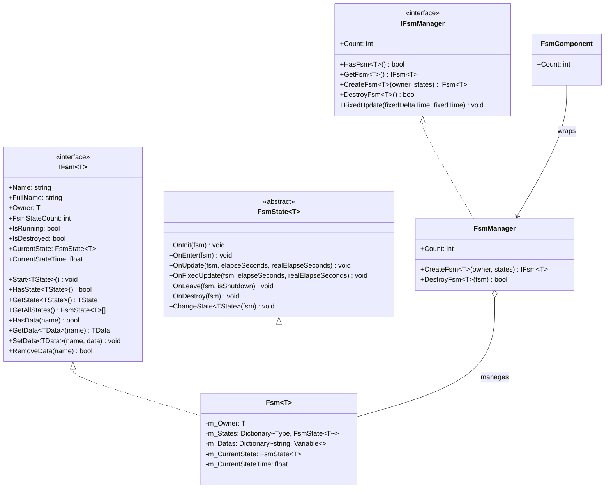

# API 참조

이 문서는 GameFrameX Unity FSM 유한 상태 머신 시스템의 완전한 API 인터페이스, 클래스 및 메서드를 상세히 나열합니다.

## 개요

FSM(유한 상태 머신) 모듈은 게임 상태 관리 기능을 제공합니다:
- 제네릭 타입 안전 유한 상태 머신 구현
- 상태 수명 주기 관리 (초기화, 진입, 업데이트, 이탈, 파괴)
- 상태 간 데이터 공유 메커니즘
- Unity 컴포넌트 통합

## 핵심 인터페이스

### `IFsm<T>`

유한 상태 머신 인터페이스로, 상태 머신의 핵심 연산을 정의합니다.

> Source: [IFsm.cs](https://github.com/GameFrameX/com.gameframex.unity.fsm/blob/main/Runtime/Fsm/IFsm.cs#L18-L179)

#### 속성

| 속성 | 타입 | 설명 |
|------|------|------|
| `Name` | `string` | 유한 상태 머신 이름 가져오기 |
| `FullName` | `string` | 유한 상태 머신 전체 이름 가져오기 (소유자 타입과 이름 포함) |
| `Owner` | `T` | 유한 상태 머신 소유자 객체 가져오기 |
| `FsmStateCount` | `int` | 유한 상태 머신 내 상태 수 가져오기 |
| `IsRunning` | `bool` | 유한 상태 머신이 실행 중인지 여부 |
| `IsDestroyed` | `bool` | 유한 상태 머신이 파괴되었는지 여부 |
| `CurrentState` | `FsmState<T>` | 현재 유한 상태 머신 상태 가져오기 |
| `CurrentStateTime` | `float` | 현재 상태가 지속된 시간(초) 가져오기 |

#### 메서드

**Start**

```csharp
void Start<TState>() where TState : FsmState<T>
void Start(Type stateType)
```

유한 상태 머신을 시작하여 지정된 상태로 진입합니다.

**HasState**

```csharp
bool HasState<TState>() where TState : FsmState<T>
bool HasState(Type stateType)
```

지정된 상태가 존재하는지 확인합니다.

**GetState**

```csharp
TState GetState<TState>() where TState : FsmState<T>
FsmState<T> GetState(Type stateType)
```

지정된 타입의 상태 인스턴스를 가져옵니다.

**GetAllStates**

```csharp
FsmState<T>[] GetAllStates()
void GetAllStates(List<FsmState<T>> results)
```

유한 상태 머신의 모든 상태를 가져옵니다.

**데이터 연산**

```csharp
bool HasData(string name)
TData GetData<TData>(string name) where TData : Variable
Variable GetData(string name)
void SetData<TData>(string name, TData data) where TData : Variable
void SetData(string name, Variable data)
bool RemoveData(string name)
```

상태 머신 내부 데이터 접근 연산으로, 제네릭 타입의 데이터 저장을 지원합니다.

---

### IFsmManager

유한 상태 머신 관리자 인터페이스로, 모든 유한 상태 머신 인스턴스를 관리합니다.

> Source: [IFsmManager.cs](https://github.com/GameFrameX/com.gameframex.unity.fsm/blob/main/Runtime/Fsm/IFsmManager.cs#L16-L184)

#### 속성

| 속성 | 타입 | 설명 |
|------|------|------|
| `Count` | `int` | 현재 관리 중인 유한 상태 머신 수 가져오기 |

#### 메서드

**HasFsm**

```csharp
bool HasFsm<T>() where T : class
bool HasFsm(Type ownerType)
bool HasFsm<T>(string name) where T : class
bool HasFsm(Type ownerType, string name)
```

지정된 유한 상태 머신이 존재하는지 확인합니다.

**GetFsm**

```csharp
IFsm<T> GetFsm<T>() where T : class
FsmBase GetFsm(Type ownerType)
IFsm<T> GetFsm<T>(string name) where T : class
FsmBase GetFsm(Type ownerType, string name)
```

지정된 유한 상태 머신 인스턴스를 가져옵니다.

**GetAllFsms**

```csharp
FsmBase[] GetAllFsms()
void GetAllFsms(List<FsmBase> results)
```

모든 유한 상태 머신을 가져옵니다.

**CreateFsm**

```csharp
IFsm<T> CreateFsm<T>(T owner, params FsmState<T>[] states) where T : class
IFsm<T> CreateFsm<T>(string name, T owner, params FsmState<T>[] states) where T : class
IFsm<T> CreateFsm<T>(T owner, List<FsmState<T>> states) where T : class
IFsm<T> CreateFsm<T>(string name, T owner, List<FsmState<T>> states) where T : class
```

새로운 유한 상태 머신을 생성합니다.

**DestroyFsm**

```csharp
bool DestroyFsm<T>() where T : class
bool DestroyFsm(Type ownerType)
bool DestroyFsm<T>(string name) where T : class
bool DestroyFsm(Type ownerType, string name)
bool DestroyFsm<T>(IFsm<T> fsm) where T : class
bool DestroyFsm(FsmBase fsm)
```

지정된 유한 상태 머신을 파괴합니다.

**FixedUpdate**

```csharp
void FixedUpdate(float fixedDeltaTime, float fixedTime)
```

모든 유한 상태 머신의 고정 업데이트를 폴링합니다.

---

## 핵심 클래스

### `FsmState<T>`

유한 상태 머신 상태 기본 클래스로, 이 클래스를 상속하여 구체적인 상태 구현을 생성합니다.

> Source: [FsmState.cs](https://github.com/GameFrameX/com.gameframex.unity.fsm/blob/main/Runtime/Fsm/FsmState.cs#L17-L136)

#### 수명 주기 메서드

```csharp
protected internal virtual void OnInit(IFsm<T> fsm)
```

상태 초기화 시 호출되며, 상태 관련 데이터 초기화에 사용됩니다.

```csharp
protected internal virtual void OnEnter(IFsm<T> fsm)
```

상태 진입 시 호출되며, 상태 진입 초기화 로직 실행에 사용됩니다.

```csharp
protected internal virtual void OnUpdate(IFsm<T> fsm, float elapseSeconds, float realElapseSeconds)
```

상태 폴링 시 호출되며, 매 프레임 실행되어 상태 로직 업데이트에 사용됩니다.

- `elapseSeconds`: 로직 경과 시간
- `realElapseSeconds`: 실제 경과 시간

```csharp
protected internal virtual void OnFixedUpdate(IFsm<T> fsm, float elapseSeconds, float realElapseSeconds)
```

상태 고정 폴링 시 호출되며, 고정 시간 간격으로 업데이트합니다.

```csharp
protected internal virtual void OnLeave(IFsm<T> fsm, bool isShutdown)
```

상태 이탈 시 호출됩니다.

- `isShutdown`: 전체 상태 머신 종료 시 트리거되는지 여부

```csharp
protected internal virtual void OnDestroy(IFsm<T> fsm)
```

상태 파괴 시 호출되며, 리소스 정리に使用されます.

#### 상태 전환 메서드

```csharp
public void ChangeToState<TState>(IFsm<T> fsm) where TState : FsmState<T>
protected void ChangeState<TState>(IFsm<T> fsm) where TState : FsmState<T>
protected void ChangeState(IFsm<T> fsm, Type stateType)
```

지정된 상태로 전환합니다.

---

### FsmComponent

Unity 컴포넌트로, Unity 씬에 통합된 상태 머신 관리자입니다.

> Source: [FsmComponent.cs](https://github.com/GameFrameX/com.gameframex.unity.fsm/blob/main/Runtime/Fsm/FsmComponent.cs#L22-L268)

FsmComponent는 Unity GameObject 컴포넌트로, IFsmManager와 동일한 API 인터페이스를 제공하며, Unity 에디터에서 직접 사용할 수 있습니다.

#### 속성

| 속성 | 타입 | 설명 |
|------|------|------|
| `Count` | `int` | 현재 관리 중인 유한 상태 머신 수 가져오기 |

#### 메서드

FsmComponent는 IFsmManager와 완전하게 일치하는 메서드 컬렉션을 제공합니다:

- `HasFsm<T>()`, `HasFsm(Type)`, `HasFsm<T>(string)`, `HasFsm(Type, string)`
- `GetFsm<T>()`, `GetFsm(Type)`, `GetFsm<T>(string)`, `GetFsm(Type, string)`
- `GetAllFsmList()`, `GetAllFsmList(List<FsmBase>)`
- `CreateFsm<T>(T, params FsmState<T>[])`, `CreateFsm<T>(string, T, params FsmState<T>[])`
- `CreateFsm<T>(T, List<FsmState<T>>)`, `CreateFsm<T>(string, T, List<FsmState<T>>)`
- `DestroyFsm<T>()`, `DestroyFsm(Type)`, `DestroyFsm<T>(string)`, `DestroyFsm(Type, string)`
- `DestroyFsm<T>(IFsm<T>)`, `DestroyFsm(FsmBase)`

---

## 데이터 타입

### Variable

유한 상태 머신에서 사용되는 데이터 기본 클래스입니다.

> Source: [IFsm.cs](https://github.com/GameFrameX/com.gameframex.unity.fsm/blob/main/Runtime/Fsm/IFsm.cs#L148-L171)

상태 머신은 `Variable`를 상속하는 임의의 데이터 타입 저장을 지원합니다:

```csharp
void SetData<TData>(string name, TData data) where TData : Variable
TData GetData<TData>(string name) where TData : Variable
```

---

## 아키텍처 다이어그램



---

## 사용 예시

### 상태 머신 생성

FsmComponent를 통해 상태 머신 생성:

```csharp
public class Character : MonoBehaviour
{
    private IFsm<Character> _fsm;

    private void Start()
    {
        var fsmComponent = GetComponent<FsmComponent>();
        _fsmComponent = fsmComponent.CreateFsm<Character>(this,
            new IdleState(),
            new RunState(),
            new JumpState());
        _fsm.Start<IdleState>();
    }

    private void Update()
    {
        // 상태 머신은 FsmComponent에서 자동 업데이트됨
    }
}
```

> Source: [FsmComponent.cs](https://github.com/GameFrameX/com.gameframex.unity.fsm/blob/main/Runtime/Fsm/FsmComponent.cs#L163-L166)

### 상태 정의

사용자 정의 상태 클래스 생성:

```csharp
public class IdleState : FsmState<Character>
{
    protected internal override void OnEnter(IFsm<Character> fsm)
    {
        // 유휴 상태 진입
    }

    protected internal override void OnUpdate(IFsm<Character> fsm, float elapseSeconds, float realElapseSeconds)
    {
        // 상태 전환 필요 여부 감지
        if (Input.GetKeyDown(KeyCode.Space))
        {
            ChangeState<JumpState>(fsm);
        }
    }

    protected internal override void OnLeave(IFsm<Character> fsm, bool isShutdown)
    {
        // 유휴 상태 이탈
    }
}
```

> Source: [FsmState.cs](https://github.com/GameFrameX/com.gameframex.unity.fsm/blob/main/Runtime/Fsm/FsmState.cs#L38-L69)

### 데이터 공유

상태 간 데이터 공유:

```csharp
// 어떤 상태에서 데이터 설정
fsm.SetData("health", new VarInt(100));
fsm.SetData("score", new VarInt(0));

// 다른 상태에서 데이터 읽기
VarInt health = fsm.GetData<VarInt>("health");
int currentHealth = health.Value;
```

> Source: [Fsm.cs](https://github.com/GameFrameX/com.gameframex.unity.fsm/blob/main/Runtime/Fsm/Fsm.cs#L452-L481)

---

## 관련 링크

- [개요](./01.overview.md) - 유한 상태 머신 시스템 개요
- [설치](./02.installation.md) - 설치 및 구성 가이드
- [빠른 시작](./03.getting-started.md) - 빠른 시작 튜토리얼
- [핵심 개념](./04.features.md) - 핵심 개념 상세
- [자주 묻는 질문](./06.troubleshooting.md) - 자주 묻는 질문과 답변