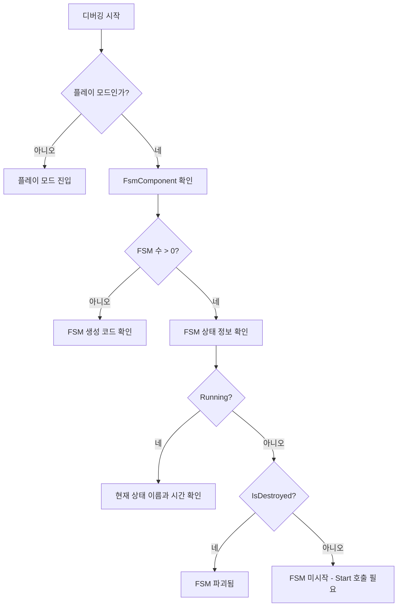

# 자주 묻는 질문

이 문서는 GameFrameX Unity FSM 유한 상태 머신 컴포넌트 사용 시 자주 발생하는 오류 문제와 그 해결책을 수집한 것입니다.

## 개요

FSM(유한 상태 머신) 컴포넌트는 GameFrameX 프레임워크의 핵심 모듈 중 하나로, 게임 객체의 상태 전환을 관리하고 제어하는 역할을 합니다. 사용 과정에서 개발자들이 다양한 오류和问题에 직면할 수 있으며, 이 문서는 이러한 자주 발생하는 문제의 진단 방법과 해결책을 제공하는 것을 목적으로 합니다.

## 일반 오류

### 1. FSM 관리자 초기화되지 않음

**오류 메시지:**
```
FSM manager is invalid.
```

**원인 분석:**
이 오류는 `FsmComponent`가 `GameFrameworkEntry`에서 `IFsmManager` 모듈을 가져올 수 없음을 나타냅니다. 이는 보통 Game Framework 핵심 컴포넌트가 올바르게 초기화되지 않았기 때문입니다.

**해결책:**

1. 씬에 `FsmComponent` 컴포넌트가 추가되었는지 확인:
```csharp
// Unity 에디터에서 Game Framework 메뉴를 통해 추가
// Game Framework -> Add Component -> Fsm
```

2. Game Framework 핵심 컴포넌트가 올바르게 초기화되었는지 확인. `FsmComponent`의 `Awake` 메서드에서 자동으로 FSM 관리자를 가져옵니다:
```csharp
// 소스 위치: Runtime/Fsm/FsmComponent.cs
protected override void Awake()
{
    ImplementationComponentType = Utility.Assembly.GetType(componentType);
    InterfaceComponentType = typeof(IFsmManager);
    base.Awake();
    m_FsmManager = GameFrameworkEntry.GetModule<IFsmManager>();
    if (m_FsmManager == null)
    {
        Log.Fatal("FSM manager is invalid.");
        return;
    }
}
```

> Source: [FsmComponent.cs](https://github.com/GameFrameX/com.gameframex.unity.fsm/blob/main/Runtime/Fsm/FsmComponent.cs#L37-L48)

---

### 2. FSM 생성 시 Owner가 null

**오류 메시지:**
```
FSM owner is invalid.
```

**원인 분석:**
유한 상태 머신을 생성할 때, `null`을 소유자(owner) 매개변수로 전달했습니다. FSM에는 유효한 소유자 객체가 반드시 필요합니다.

**해결책:**

FSM 생성 시 유효한 소유자 객체를 전달해야 합니다:

```csharp
// 오류 예시
IFsm<MyCharacter> fsm = fsmComponent.CreateFsm<MyCharacter>(null, states);

// 올바른 예시
MyCharacter character = GetComponent<MyCharacter>();
IFsm<MyCharacter> fsm = fsmComponent.CreateFsm(character, states);
```

> Source: [Fsm.cs](https://github.com/GameFrameX/com.gameframex.unity.fsm/blob/main/Runtime/Fsm/Fsm.cs#L113-L116)

---

### 3. 상태 배열이 유효하지 않음

**오류 메시지:**
```
FSM states is invalid.
```

**원인 분석:**
FSM 생성 시 상태 배열이 `null`이거나 길이가 0입니다. FSM에는 최소한 하나의 상태가 반드시 포함되어야 합니다.

**해결책:**

FSM 생성 시 최소한 하나의 유효한 상태를 제공해야 합니다:

```csharp
// 오류 예시 - 상태 배열이 비어있음
IFsm<MyCharacter> fsm = fsmComponent.CreateFsm(character);

// 올바른 예시 - 최소한 하나의 상태 포함
IFsm<MyCharacter> fsm = fsmComponent.CreateFsm(character,
    new IdleState(),
    new MoveState()
);
```

> Source: [Fsm.cs](https://github.com/GameFrameX/com.gameframex.unity.fsm/blob/main/Runtime/Fsm/Fsm.cs#L118-L121)

---

### 4. 중복된 상태 타입

**오류 메시지:**
```
FSM 'TypeNamePair' state 'StateType' is already exist.
```

**원인 분석:**
FSM 생성 시 동일한 타입의 상태를 두 번 추가하려고 했습니다. 각 상태 타입은 동일한 FSM에서 하나만 존재할 수 있습니다.

**해결책:**

각 상태 타입이 한 번만 추가되었는지 확인합니다:

```csharp
// 오류 예시 - 동일한 상태 타입 중복 추가
IFsm<MyCharacter> fsm = fsmComponent.CreateFsm(character,
    new IdleState(),  // 첫 번째 추가
    new IdleState()   // 중복 추가 - 오류!
);

// 올바른 예시 - 각 상태 타입을 한 번만 추가
IFsm<MyCharacter> fsm = fsmComponent.CreateFsm(character,
    new IdleState(),
    new MoveState(),
    new AttackState()
);
```

> Source: [Fsm.cs](https://github.com/GameFrameX/com.gameframex.unity.fsm/blob/main/Runtime/Fsm/Fsm.cs#L135-L138)

---

## 상태 머신 실행 오류

### 5. FSM 중복 시작

**오류 메시지:**
```
FSM is running, can not start again.
```

**원인 분석:**
이미 실행 중인 FSM을 시작하려고 했습니다. FSM 실행 중에는 `Start` 메서드를 중복 호출할 수 없습니다.

**해결책:**

1. 시작 전 FSM이 이미 실행 중인지 확인:
```csharp
IFsm<MyCharacter> fsm = fsmComponent.GetFsm<MyCharacter>();
if (fsm != null && !fsm.IsRunning)
{
    fsm.Start<IdleState>();
}
```

2. 다시 시작해야 하는 경우, 먼저 기존 FSM을 파괴합니다:
```csharp
// 기존 FSM 파괴
fsmComponent.DestroyFsm<MyCharacter>();
// 다시 생성
IFsm<MyCharacter> fsm = fsmComponent.CreateFsm(character, new IdleState());
fsm.Start<IdleState>();
```

> Source: [Fsm.cs](https://github.com/GameFrameX/com.gameframex.unity.fsm/blob/main/Runtime/Fsm/Fsm.cs#L235-L238)

---

### 6. 상태가 존재하지 않음

**오류 메시지:**
```
FSM 'TypeNamePair' can not start state 'StateType' which is not exist.
```

**원인 분석:**
존재하지 않는 상태를 시작하거나 전환하려고 했습니다. 해당 상태가 FSM의 상태 목록에 추가되지 않았습니다.

**해결책:**

1. 시작/전환할 상태가 FSM 생성 시 추가되었는지 확인:
```csharp
// FSM 생성 시 필요한 모든 상태 추가
IFsm<MyCharacter> fsm = fsmComponent.CreateFsm(character,
    new IdleState(),
    new MoveState(),
    new AttackState()
);

// 존재하는 상태 시작
fsm.Start<IdleState>();

// 존재하는 상태로 전환 - 올바른 방법
fsm.GetState<AttackState>().ChangeToState<MoveState>(fsm);
```

2. 상태 전환 전 상태가 존재하는지 확인:
```csharp
if (fsm.HasState<MoveState>())
{
    fsm.GetState<AttackState>().ChangeToState<MoveState>(fsm);
}
```

> Source: [Fsm.cs](https://github.com/GameFrameX/com.gameframex.unity.fsm/blob/main/Runtime/Fsm/Fsm.cs#L241-L244)

---

### 7. 유효하지 않은 상태 타입

**오류 메시지:**
```
State type 'StateType' is invalid.
```

**원인 분석:**
전달된 상태 타입이 유효한 `FsmState<T>` 파생 클래스가 아닙니다.

**해결책:**

상태 클래스가 `FsmState<T>`를 상속하는지 확인합니다:

```csharp
// 오류 예시 - 일반 클래스는 상태가 될 수 없음
public class MyClass { }

// 올바른 예시 - 반드시 FsmState<T>를 상속해야 함
public class IdleState : FsmState<MyCharacter>
{
    protected internal override void OnEnter(IFsm<MyCharacter> fsm)
    {
        // 상태 진입 로직
    }

    protected internal override void OnUpdate(IFsm<MyCharacter> fsm, float elapseSeconds, float realElapseSeconds)
    {
        // 상태 업데이트 로직
    }

    protected internal override void OnLeave(IFsm<MyCharacter> fsm, bool isShutdown)
    {
        // 상태 이탈 로직
    }
}
```

> Source: [Fsm.cs](https://github.com/GameFrameX/com.gameframex.unity.fsm/blob/main/Runtime/Fsm/Fsm.cs#L267-L270)

---

### 8. 현재 상태가 유효하지 않아 전환 불가

**오류 메시지:**
```
Current state is invalid.
```

**원인 분석:**
FSM이 시작되지 않았거나 이미 파괴되었을 때 상태를 전환하려고 했습니다.

**해결책:**

상태를 전환하기 전에 FSM이 실행 중인지 확인합니다:

```csharp
// 오류 예시 - FSM이 시작되지 않은 상태에서 전환 시도
IFsm<MyCharacter> fsm = fsmComponent.CreateFsm(character,
    new IdleState(),
    new MoveState()
);
// Start를 호출하지 않고 전환 시도 - 오류!
fsm.GetState<IdleState>().ChangeToState<MoveState>(fsm);

// 올바른 예시 - 먼저 FSM 시작
IFsm<MyCharacter> fsm = fsmComponent.CreateFsm(character,
    new IdleState(),
    new MoveState()
);
fsm.Start<IdleState>();  // 먼저 시작

// 그런 다음 상태 내에서 전환
protected internal override void OnUpdate(IFsm<MyCharacter> fsm, float elapseSeconds, float realElapseSeconds)
{
    if (shouldMove)
    {
        ChangeState<MoveState>(fsm);  // 올바른 방법: 상태 내에서 전환
    }
}
```

> Source: [Fsm.cs](https://github.com/GameFrameX/com.gameframex.unity.fsm/blob/main/Runtime/Fsm/Fsm.cs#L558-L567)

---

## 데이터 관리 오류

### 9. 같은 이름의 FSM 중복 생성

**오류 메시지:**
```
Already exist FSM 'TypeNamePair'.
```

**원인 분석:**
이미 존재하는 FSM(동일한 소유자 타입과 이름)을 생성하려고 했습니다.

**해결책:**

1. 생성 전 FSM이 이미 존재하는지 확인:
```csharp
if (!fsmComponent.HasFsm<MyCharacter>())
{
    IFsm<MyCharacter> fsm = fsmComponent.CreateFsm(character,
        new IdleState(),
        new MoveState()
    );
}
```

2. 또는 기존 FSM을 먼저 파괴합니다:
```csharp
fsmComponent.DestroyFsm<MyCharacter>();
IFsm<MyCharacter> fsm = fsmComponent.CreateFsm(character,
    new IdleState(),
    new MoveState()
);
```

> Source: [FsmManager.cs](https://github.com/GameFrameX/com.gameframex.unity.fsm/blob/main/Runtime/Fsm/FsmManager.cs#L284-L287)

---

### 10. 유효하지 않은 데이터 이름

**오류 메시지:**
```
Data name is invalid.
```

**원인 분석:**
FSM 데이터의 키로 `null` 또는 빈 문자열을 사용했습니다.

**해결책:**

항상 유효한 문자열을 데이터 키로 사용합니다:

```csharp
// 오류 예시
fsm.SetData<string>(null, "value");
fsm.SetData<string>("", "value");

// 올바른 예시
fsm.SetData<string>("health", 100);
fsm.SetData<float>("speed", 5.0f);
```

> Source: [Fsm.cs](https://github.com/GameFrameX/com.gameframex.unity.fsm/blob/main/Runtime/Fsm/Fsm.cs#L396-L399)

---

### 11. 유효하지 않은 결과 매개변수

**오류 메시지:**
```
Results is invalid.
```

**원인 분석:**
결과 저장을 위한 가변 리스트 매개변수로 `null`을 전달했습니다.

**해결책:**

유효한 리스트 객체를 전달해야 합니다:

```csharp
// 오류 예시
List<FsmBase> fsms = null;
fsmComponent.GetAllFsmList(fsms);

// 올바른 예시
List<FsmBase> fsms = new List<FsmBase>();
fsmComponent.GetAllFsmList(fsms);
```

> Source: [Fsm.cs](https://github.com/GameFrameX/com.gameframex.unity.fsm/blob/main/Runtime/Fsm/Fsm.cs#L377-L380)

---

## Unity 에디터 관련 문제

### 12. FsmComponent가 에디터에 표시되지 않음

**문제 설명:**
Unity 에디터에 FsmComponent를 추가했지만, Inspector 패널에서 FSM 정보를 볼 수 없습니다.

**원인 분석:**
`FsmComponentInspector`는 실행 시에만 정보를 표시하며, 게임 객체 계층 구조 내에 있어야 합니다.

**해결책:**

1. **플레이 모드(Play Mode)**에서 확인합니다:
```csharp
// 소스 위치: Editor/Inspector/FsmComponentInspector.cs
public override void OnInspectorGUI()
{
    if (!EditorApplication.isPlaying)
    {
        EditorGUILayout.HelpBox("Available during runtime only.", MessageType.Info);
        return;
    }
    // ...
}
```

2. FsmComponent가 씬의 게임 객체에 연결되어 있는지, 프리팹이 아닌지 확인합니다:
```csharp
// Inspector는 게임 객체가 계층 패널에 있는지 확인
if (IsPrefabInHierarchy(t.gameObject))
{
    // FSM 정보 표시
}
```

> Source: [FsmComponentInspector.cs](https://github.com/GameFrameX/com.gameframex.unity.fsm/blob/main/Editor/Inspector/FsmComponentInspector.cs#L21-L25)

---

## 디버깅 팁

### FsmComponentInspector를 사용하여 FSM 상태 확인

Unity 에디터의 플레이 모드에서 모든 FSM의 실시간 상태를 확인할 수 있습니다:

1. 씬에 `FsmComponent` 컴포넌트 추가
2. 플레이 모드 진입
3. `FsmComponent`가 연결된 게임 객체 선택
4. Inspector에서 FSM 수 및 각 FSM의 상태 확인



### 일반적인 FSM 상태 설명

| 속성 | 설명 |
|------|------|
| `IsRunning` | FSM이 실행 중인지 여부 (Start 호출됨) |
| `IsDestroyed` | FSM이 파괴되었는지 여부 |
| `CurrentStateName` | 현재 상태의 전체 타입 이름 |
| `CurrentStateTime` | 현재 상태가 지속된 시간(초) |

---

## 모범 사례

### 1. 작업 전 항상 FSM 존재 여부 확인

```csharp
// 권장 방법
if (fsmComponent.HasFsm<MyCharacter>())
{
    var fsm = fsmComponent.GetFsm<MyCharacter>();
    // FSM 작업 수행
}
```

### 2. FSM 수명 주기 올바르게 관리

```csharp
// 생성
IFsm<MyCharacter> fsm = fsmComponent.CreateFsm(owner, states);
fsm.Start<IdleState>();

// 사용
// ... 게임 로직 ...

// 파괴
fsmComponent.DestroyFsm(fsm);
```

### 3. FsmState 내장 메서드로 상태 전환

```csharp
// 권장 방법: 상태 클래스에서 보호된 메서드 사용
protected internal override void OnUpdate(IFsm<MyCharacter> fsm, float elapseSeconds, float realElapseSeconds)
{
    // 보호된 ChangeState 메서드 사용
    if (someCondition)
    {
        ChangeState<NextState>(fsm);
    }
}
```

---

## 관련 링크

- [개요](./01.overview.md) - FSM 컴포넌트 개요
- [설치](./02.installation.md) - 설치 및 구성
- [빠른 시작](./03.getting-started.md) - 빠른 시작 가이드
- [핵심 개념](./04.features.md) - 핵심 개념 상세
- [API 참조](./05.api-reference.md) - 완전한 API 문서