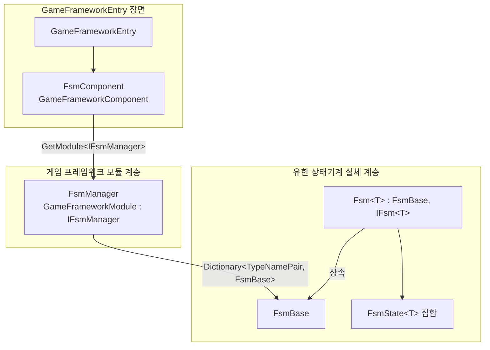

# 동작 원리 둘러보기: 컴포넌트, 매니저, FSM 3계층

GameFrameX FSM은 Unity에서 3계층 구조로 구성됩니다.**컴포넌트 계층(FsmComponent)**은 GameFramework 진입점에 부착되어 외부에서 호출을 담당하고,**관리 계층(FsmManager)**은 `GameFrameworkModule`로서 등록된 모든 FSM을 통합적으로 폴링하며,**상태머신 계층(Fsm<T> / FsmState<T>)**이야말로真正的한持有자, 상태集合, 상태 전환 로직을 가진 실체입니다. 이 세 계층을 이해하면, FSM의 생성, 폴링, 소멸은 컴포넌트 진입점에서 구체적인 상태머신까지 이어지는 표준 경로가 됩니다.

## 빠른 시작

1. GameFramework 시작场景의 `GameFrameworkEntry` 객체에 `GameFrameX/FSM` 컴포넌트를 추가합니다(`[AddComponentMenu("GameFrameX/FSM")]`로 메뉴에 자동 등록됨).
2. `GameEntry.GetComponent<FsmComponent>()`로 컴포넌트를 가져온 뒤, `CreateFsm`을 호출해 유한 상태기계를 생성합니다.
3. `IFsmManager` 인터페이스 또는 `FsmComponent`가 제공하는 `HasFsm`, `GetFsm`, `DestroyFsm` 등의 메서드로 FSM을 조회, 폴링, 소멸시킵니다.

컴포넌트는 `Awake()` 단계에서 `GameFrameworkEntry`를 통해 `IFsmManager` 모듈을 가져와 참조를 캐싱합니다:

```csharp
// Runtime/Fsm/FsmComponent.cs#L63-L74
protected override void Awake()
{
    ImplementationComponentType = Utility.Assembly.GetType(componentType);
    InterfaceComponentType = typeof(IFsmManager);
    base.Awake();
    m_FsmManager = GameFrameworkEntry.GetModule<IFsmManager>();
    if (m_FsmManager == null)
    {
        Log.Fatal("FSM manager is invalid.");
        return;
    }
}
```

출처:[FsmComponent.cs#L63-L74](https://github.com/GameFrameX/com.gameframex.unity.fsm/blob/main/Runtime/Fsm/FsmComponent.cs#L63-L74)

## 동작 원리 둘러보기

세 계층의 각자 책임은 다음과 같으며, 데이터와 호출은 "컴포넌트 → 매니저 → FSM 실체" 방향으로 위에서 아래로 흐릅니다.



| 계층 | 타입 | 핵심 책임 |
|----|------|----------|
| 컴포넌트 계층 | `FsmComponent : GameFrameworkComponent` | `CreateFsm` / `GetFsm` / `DestroyFsm` 등 고수준 API를 노출하고, `FixedUpdate`에서 고정 스텝을 매니저로 전달 |
| 관리 계층 | `FsmManager : GameFrameworkModule, IFsmManager` | `Dictionary<TypeNamePair, FsmBase>`를 유지하고, `Priority`에 따라 폴링에 진입하며, 모든 FSM의 `Update` / `FixedUpdate`를 구동 |
| 실체 계층 | `FsmBase`와 제네릭 서브클래스 `Fsm<T> : IFsm<T>` | owner, 상태 딕셔너리 `m_States`, 데이터 딕셔너리 `m_Datas`, 현재 상태 `m_CurrentState`와 체류 시간 `m_CurrentStateTime`을 보유하고, 상태 전환을 수행 |

- **컴포넌트 계층**: `[GameFrameXAutoComponent(-6000)]`와 `[AddComponentMenu("GameFrameX/FSM")]` 덕분에 GameFramework에 의해 자동으로 로드되고 Inspector 메뉴에 표시됩니다. 모든 외부 진입은 이 컴포넌트를 거치며, 내부적으로 `m_FsmManager`로 전달됩니다.
- **관리 계층**: `Priority`는 `1`을 반환하며(값이 클수록 우선순위가 높음), `Update` / `FixedUpdate`에서 스냅샷(`m_TempFsms` / `m_TempFixedFsms`로 복사)을 순회하며 각 FSM을 호출하여, 순회 중 컬렉션이 수정되는 문제를 피합니다.
- **실체 계층**: 각각의 구체적인 `Fsm<T>`은 자신의 owner 타입 `T`와 `FsmState<T>` 집합을 알고 있으며, `ChangeState<TState>()`을 통해 상태 간에 전환하고, "특정 상태에 얼마나 머물렀는가"와 같은 판정에 사용할 수 있는 `CurrentStateTime`을 기록합니다.

## 다음 단계

- 첫 번째 상태기계를 생성하고 시작하는 완전한 예제는 《유한 상태기계를 만드는 방법》을 참조하세요.
- 상태 클래스 `FsmState<T>`의 생명주기 콜백과 변수 데이터에 대해서는 《상태 클래스와 변수 사용 빠른 참조》를 참조하세요.
- Inspector 디버깅과 에디터 확장에 대해서는 《FsmComponent Inspector 설명》을 참조하세요.

## 관련 링크

- [FsmComponent.cs](https://github.com/GameFrameX/com.gameframex.unity.fsm/blob/main/Runtime/Fsm/FsmComponent.cs)
- [FsmManager.cs](https://github.com/GameFrameX/com.gameframex.unity.fsm/blob/main/Runtime/Fsm/FsmManager.cs)
- [Fsm.cs](https://github.com/GameFrameX/com.gameframex.unity.fsm/blob/main/Runtime/Fsm/Fsm.cs)
- [FsmBase.cs](https://github.com/GameFrameX/com.gameframex.unity.fsm/blob/main/Runtime/Fsm/FsmBase.cs)
- [IFsmManager.cs](https://github.com/GameFrameX/com.gameframex.unity.fsm/blob/main/Runtime/Fsm/IFsmManager.cs)
- [IFsm.cs](https://github.com/GameFrameX/com.gameframex.unity.fsm/blob/main/Runtime/Fsm/IFsm.cs)
- [FsmState.cs](https://github.com/GameFrameX/com.gameframex.unity.fsm/blob/main/Runtime/Fsm/FsmState.cs)