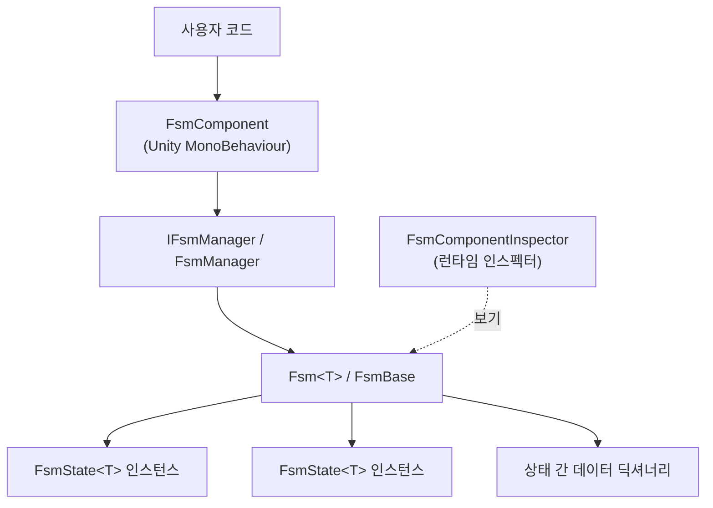

# GameFrameX FSM이란 무엇인가

GameFrameX FSM은 GameFrameX 프레임워크에서 제공하는 범용 유한 상태 머신(Finite State Machine) 모듈로, 타입 안전한 방식으로 Unity에서 객체의 상태 생성, 생명 주기 및 상태 전환을 관리하는 데 사용됩니다. GameFrameX 프레임워크의 하위 모듈이며, `FsmComponent`를 통해 GameFrameX 컴포넌트 시스템에 연결하여 사용해야 합니다.

## 빠른 시작

### 1. 패키지 설치

Unity 프로젝트의 `Packages/manifest.json`에 다음 `scopedRegistries`와 종속성을 추가합니다:

```json
{
  "scopedRegistries": [
    {
      "name": "GameFrameX",
      "url": "https://gameframex.upm.alianblank.uk",
      "scopes": [
        "com.gameframex"
      ]
    }
  ],
  "dependencies": {
    "com.gameframex.unity.fsm": "1.1.1"
  }
}
```

Source: [README.md](https://github.com/GameFrameX/com.gameframex.unity.fsm/blob/main/README.md#L44-L63)

Git URL(`https://github.com/gameframex/com.gameframex.unity.fsm.git`)을 통해 직접 설치하거나 `Packages` 디렉터리에 클론하여 설치할 수도 있습니다.

### 2. 상태 정의

`FsmState<T>`를 상속하고 생명 주기 메서드를 재정의합니다. 여기서 `T`는 상태 머신의 소유자 타입입니다:

```csharp
using GameFrameX.Fsm;

public class IdleState : FsmState<Player>
{
    protected override void OnEnter(IFsm<Player> fsm)
    {
        // Idle 진입 시 트리거됨
    }

    protected override void OnUpdate(IFsm<Player> fsm, float elapseSeconds, float realElapseSeconds)
    {
        // 매 프레임마다 폴링
        if (Input.GetKeyDown(KeyCode.W))
        {
            ChangeState<MoveState>(fsm);
        }
    }

    protected override void OnLeave(IFsm<Player> fsm, bool isShutdown)
    {
        // Idle 이탈 시 트리거됨
    }
}
```

Source: [README.md](https://github.com/GameFrameX/com.gameframex.unity.fsm/blob/main/README.md#L101-L123), [FsmState.cs](https://github.com/GameFrameX/com.gameframex.unity.fsm/blob/main/Runtime/Fsm/FsmState.cs#L41-L67)

### 3. FSM 생성 및 시작

`GameEntry.GetComponent<FsmComponent>()`로 컴포넌트를 가져온 다음, `CreateFsm`으로 상태 집합을 조립하고 `Start<TState>`로 시작합니다:

```csharp
var fsmComponent = GameEntry.GetComponent<FsmComponent>();
IFsm<Player> fsm = fsmComponent.CreateFsm(player, new IdleState(), new MoveState());
fsm.Start<IdleState>();
```

Source: [README.md](https://github.com/GameFrameX/com.gameframex.unity.fsm/blob/main/README.md#L127-L136), [FsmComponent.cs](https://github.com/GameFrameX/com.gameframex.unity.fsm/blob/main/Runtime/Fsm/FsmComponent.cs#L204-L222)

### 4. 상태 간 데이터 액세스(선택 사항)

`SetData` / `GetData<T>`를 사용하여 상태 간에 데이터를 공유합니다. 내부적으로 객체 풀을 사용하여 GC가 발생하지 않습니다:

```csharp
fsm.SetData("Health", 100);
int hp = fsm.GetData<int>("Health");

if (fsm.HasData("Health"))
{
    fsm.RemoveData("Health");
}
```

Source: [README.md](https://github.com/GameFrameX/com.gameframex.unity.fsm/blob/main/README.md#L140-L149)

## 작동 원리 개요

FSM 모듈은 세 개의 계층으로 구성됩니다. 컴포넌트 계층은 외부 API를 노출하고, 관리자 계층은 실행 중인 모든 FSM을 보유하며 `Update` / `FixedUpdate`를 구동하고, 상태 머신 계층은 구체적인 상태 집합과 상태 간 데이터를 관리합니다.



- `FsmComponent`는 `GameFrameworkComponent`를 상속하며 `GameFramework` 진입 객체에 마운트되고, 컴포넌트 우선순위는 `-6000`입니다([FsmComponent.cs#L46-L47](https://github.com/GameFrameX/com.gameframex.unity.fsm/blob/main/Runtime/Fsm/FsmComponent.cs#L46-L47)).
- `FsmManager`는 모든 FSM 인스턴스를 보유하고 폴링 스케줄링을 수행하며, `Update` / `FixedUpdate` 이중 경로는 `FsmComponent.FixedUpdate`에서 구동됩니다([FsmComponent.cs#L76-L84](https://github.com/GameFrameX/com.gameframex.unity.fsm/blob/main/Runtime/Fsm/FsmComponent.cs#L76-L84)).
- `FsmState<T>`는 6개의 생명 주기 후크를 노출합니다: `OnInit`, `OnEnter`, `OnUpdate`, `OnFixedUpdate`, `OnLeave`, `OnDestroy`.
- Editor 디렉터리의 `FsmComponentInspector`는 Play 모드에서 현재 상태와 실행 시간을 실시간으로 확인할 수 있는 인스펙터를 제공합니다.

## 다음 단계

- 첫 번째 상태 머신을 구현하는 방법: 작업 페이지 《FSM 생성 및 시작 방법》 참조
- 상태 간 값 전달 오류가 발생하면: 문제 해결 페이지의 관련 항목 참조
- 모든 API 빠른 참조: 참고 페이지 《IFsm / FsmState API 빠른 참조》 참조