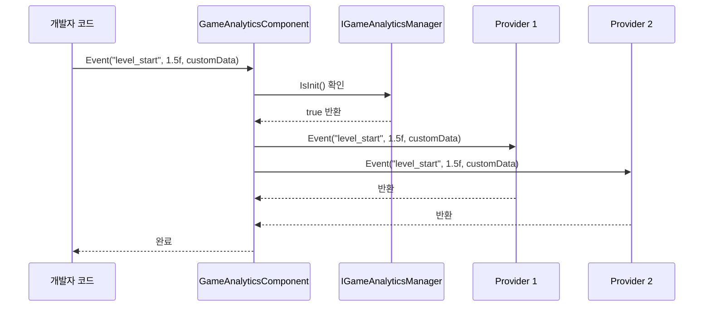
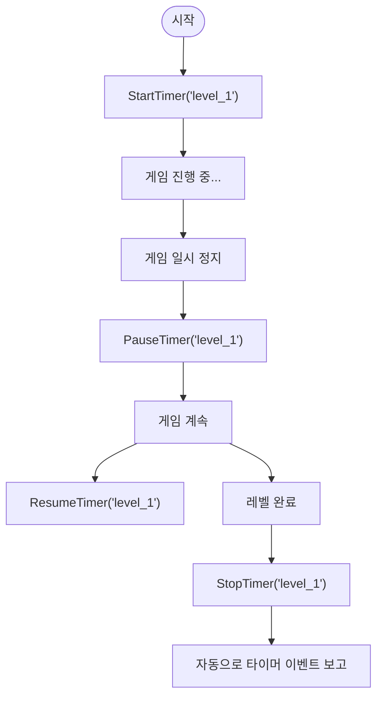

# 플러그인 소개

`GameFrameX.GameAnalytics`는 GameFrameX 게임 프레임워크의 게임 데이터 분석 컴포넌트로, Unity 게임 개발자에게 통일된 이벤트 보고 및 타이머 기능 인터페이스를 제공합니다. 이 플러그인은 모듈화 설계를 채택하여 다양한 서드파티 데이터 분석 백엔드를 유연하게 확장할 수 있습니다.

## 개요

GameAnalytics 컴포넌트는 게임 프레임워크의 핵심 모듈 중 하나로, 게임 데이터 분석 통합 문제를 전문적으로 해결합니다. 게임 개발에서 개발자들은 보통 여러 데이터 분석 플랫폼(유망, Firebase, Adjust 등)을 통합해야 하며, 각 플랫폼은 각각의 SDK와 API를 가지고 있어 코드 중복과 유지 관리 어려움으로 이어집니다.

GameAnalytics 컴포넌트는 통일된 인터페이스(`IGameAnalyticsManager`)와 추상 기본 클래스(`BaseGameAnalyticsManager`)를 정의하여 다양한 데이터 분석 플랫폼의 공통 기능을 추상화합니다. 개발자는 통일된 API를 호출하면 여러 데이터 분석 플랫폼에 동시에 이벤트를 보낼 수 있어, 다중 플랫폼 데이터 마킹 작업을 크게 단순화합니다.

### 핵심 기능

- **통일된 인터페이스**: 표준 API 세트를 제공하여 이벤트 보고, 타이머, 공통 속성 등의 기능 지원
- **다중 백엔드 지원**: 프로바이더 패턴을 통해 여러 데이터 분석 플랫폼에 동시 접속 가능
- **자동 초기화**: 컴포넌트 활성화 시 자동 초기화 지원, 수동 초기화 타이밍 제어 지원
- **장치 정보 수집**: 장치 모델, 운영 체제, 화면 해상도, 네트워크 유형 등 기본 정보 자동 수집
- **타이머 기능**: 게임 내 다양한 작업의 소요 시간을 분석하는 완전한 이벤트 타이밍 기능 제공

### 버전 정보

- 현재 버전: 1.2.0
- 첫 번째 출시: 2024년 4월 10일

## 아키텍처 설계

GameAnalytics 컴포넌트는 클래식한 계층화 아키텍처 설계를 채택하며, 상단부터 세 개의 레벨로 나뉩니다: 컴포넌트 레이어, 관리자 레이어 및 구현 레이어.

```mermaid
flowchart TD
    subgraph ComponentLayer["컴포넌트 레이어 (Unity Component)"]
        GAC[GameAnalyticsComponent]
    end

    subgraph ManagerLayer["관리자 레이어 (Manager Interface)"]
        IGAM[IGameAnalyticsManager]
        BGAM[BaseGameAnalyticsManager]
    end

    subgraph ImplementationLayer["구현 레이어 (Provider)"]
        Provider1[Analytics Provider 1]
        Provider2[Analytics Provider 2]
        ProviderN[Analytics Provider N]
    end

    subgraph GameFramework["GameFrameX 프레임워크"]
        GFM[GameFrameworkModule]
    end

    GAC --> IGAM
    IGAM <|.. BGAM
    BGAM --> GFM
    BGAM -.-> Provider1
    BGAM -.-> Provider2
    BGAM -.-> ProviderN
```

### 각 레이어 책임

**컴포넌트 레이어 (GameAnalyticsComponent)**

컴포넌트 레이어는 Unity层面的 진입점으로, `GameFrameworkComponent`를 상속합니다. 이 컴포넌트를 씬의 GameObject에 붙이면 사용할 수 있으며, 주요 책임은 다음과 같습니다:

- `OnEnable` 시 자동 초기화 메서드 호출
- 여러 `IGameAnalyticsManager` 인스턴스의 컬렉션 관리
- API 호출을 모든 등록된 분석 프로바이더에 분배
- 매개변수 검증 및 초기화 상태 확인

> Source: [GameAnalyticsComponent.cs](https://github.com/GameFrameX/com.gameframex.unity.gameanalytics/blob/main/Runtime/GameAnalytics/GameAnalyticsComponent.cs#L14-L80)

**관리자 레이어 (IGameAnalyticsManager / BaseGameAnalyticsManager)**

인터페이스 레이어는 모든 분석 기능의 표준 규범을 정의합니다:

- 초기화 메서드 (자동 초기화 및 수동 초기화)
- 이벤트 보고 메서드 (4가지 오버로드)
- 타이머 메서드 (시작, 일시 정지, 재개, 종료)
- 공통 속성 관리 (설정, 가져오기, 지우기)
- 플레이어 ID 설정

추상 기본 클래스 `BaseGameAnalyticsManager`는 `GameFrameworkModule`를 상속하며, 공통 속성 관리, 장치 정보 자동 수집 등 인터페이스의 일반적인 기능을 구현합니다.

> Source: [IGameAnalyticsManager.cs](https://github.com/GameFrameX/com.gameframex.unity.gameanalytics/blob/main/Runtime/GameAnalytics/IGameAnalyticsManager.cs#L8-L105)

> Source: [BaseGameAnalyticsManager.cs](https://github.com/GameFrameX/com.gameframex.unity.gameanalytics/blob/main/Runtime/GameAnalytics/BaseGameAnalyticsManager.cs#L10-L203)

**구현 레이어 (Analytics Provider)**

구현 레이어는 구체적인 데이터 분석 플랫폼 어댑터로, `BaseGameAnalyticsManager`를 상속합니다. 개발자는 자체 분석 프로바이더를 구현하거나 서드파티 SDK 어댑터를 통합할 수 있습니다. 각 프로바이더는 독립적으로运作하며, 컴포넌트 레이어는 모든 등록된 프로바이더에 동시에 이벤트를 보냅니다.

### 이벤트 흐름



이벤트는 개발자 코드에서 발생한 후 먼저 `GameAnalyticsComponent`에 도달하며, 컴포넌트는 초기화 상태를 확인한 후 이벤트를 모든 등록된 분석 프로바이더에 동시에分发하여, 한 번의 보고로 다중 터미널에서 수신하는 효과를 实现합니다.

## 핵심 기능

### 이벤트 보고

이벤트 보고는 데이터 분석의 기초이며, GameAnalytics 컴포넌트는 다양한 시나리오의 요구를 충족하기 위해 4가지 이벤트 보고 방식을 제공합니다:

**단순 이벤트**: 이벤트 이름만 포함하여,某个 동작의 발생을 기록하는 데 사용됩니다.

```csharp
gameAnalyticsComponent.Event("game_start");
```

**수치 이벤트**: 이벤트 이름的基础上에 수치를 추가하여, 횟수, 점수 등의 정량적 지표를 통계하는 데 사용할 수 있습니다.

```csharp
gameAnalyticsComponent.Event("level_complete", 5);
```

**사용자 정의 필드 이벤트**: 이벤트에 추가적인 키-값 쌍 정보를 첨부하여, 더 정밀한 데이터 분석에 사용됩니다.

```csharp
var customFields = new Dictionary<string, object>
{
    { "chapter", "chapter_1" },
    { "difficulty", "hard" }
};
gameAnalyticsComponent.Event("battle_end", customFields);
```

**수치+사용자 정의 필드 이벤트**: 수치와 사용자 정의 필드를 결합한 완전한 이벤트 형식입니다.

```csharp
gameAnalyticsComponent.Event("purchase", 99.99f, customFields);
```

### 타이머 기능

타이머 기능은 게임 내 다양한 작업의 소요 시간을 정밀하게 측정하는 데 사용되며, 일반적인 용도는 레벨 완료 시간, 인터페이스 로딩 시간, 작업 실행 시간 등입니다.



타이머는 일시 정지 및 재개 기능을 지원하여, 플레이어가 일시적으로 떠 나가더라도 타이밍이 손실되지 않습니다. 타이머 종료 후, 컴포넌트는 자동으로 소요 시간을 이벤트 값으로 데이터 분석 플랫폼에 보고합니다.

### 공통 속성

공통 속성은 모든 이벤트 보고 시 자동으로 함께 전송되는 기본 정보입니다. GameAnalytics 컴포넌트는 다음 장치 정보를 자동으로 수집합니다:

| 속성 이름 | 설명 | 예시 값 |
|---------|------|-------|
| device_id | 장치 고유 식별자 | ABC123... |
| device_model | 장치 모델 | iPhone 14 Pro |
| device_type | 장치 유형 | Handheld |
| os | 운영 체제 | iOS 17.0 |
| app_version | 앱 버전 번호 | 1.2.0 |
| unity_version | Unity 엔진 버전 | 2022.3.15f1 |
| platform | 실행 플랫폼 | iOS |
| processor_type | 프로세서 유형 | Apple A16 |
| processor_count | CPU 코어 수 | 6 |
| system_memory_size | 시스템 메모리 크기(MB) | 6144 |
| graphics_device_name | 그래픽 카드 이름 | Apple GPU |
| screen_width | 화면 너비(픽셀) | 1179 |
| screen_height | 화면 높이(픽셀) | 2556 |
| screen_dpi | 화면 DPI | 460 |
| network_type | 네트워크 유형 | WiFi |
| system_language | 시스템 언어 | Chinese |

> Source: [BaseGameAnalyticsManager.cs](https://github.com/GameFrameX/com.gameframex.unity.gameanalytics/blob/main/Runtime/GameAnalytics/BaseGameAnalyticsManager.cs#L88-L144)

개발자는 `SetPublicProperties` 메서드를 통해 사용자 정의 공통 속성을 추가할 수 있으며, 这些 속성은 매번 이벤트 보고 시 자동으로 첨부됩니다.

### 플레이어 ID 관리

`SetPlayerId` 메서드를 통해 플레이어 식별자를 설정할 수 있어,同一 플레이어가 게임에서 수행하는 모든 행동 데이터를 연결하는 데 사용됩니다. 이는 사용자 행동 분석, 잔존 통계 등의 시나리오에 매우 중요합니다.

```csharp
// 로그인 성공 후 플레이어 ID 설정
gameAnalyticsComponent.SetPlayerId(playerId);
```

## 사용 방식

### 설치

플러그인은 다양한 설치 방식을 지원합니다:

1. **manifest.json을 통해 종속성 추가**: 프로젝트의 `Packages/manifest.json` 파일의 `dependencies` 노드 아래에 추가:
   ```json
   {"com.gameframex.unity.gameanalytics": "https://github.com/GameFrameX/com.gameframex.unity.gameanalytics.git"}
   ```

2. **Unity Package Manager를 통해**: Unity 에디터에서 `Window > Package Manager`를 선택하고, `+` 버튼을 클릭한 후 `Add package from git URL`를 선택하고 입력: `https://github.com/GameFrameX/com.gameframex.unity.gameanalytics.git`

3. **소스 직접 배치**: 저장소를 다운로드 후 Unity 프로젝트의 `Packages` 디렉토리에 배치하면, 시스템이 자동으로 인식하고 로드합니다.

### 빠른 구성

1. Unity 씬에서 빈 GameObject 생성
2. 해당 GameObject에 `GameAnalyticsComponent` 컴포넌트 추가 (메뉴 경로: `Game Framework > GameAnalytics`)
3. Inspector 패널에서 분석 프로바이더 목록을 구성하고, 사용할 분석 플랫폼 추가
4. 각 프로바이더의 관련 매개변수 설정

> Source: [GameAnalyticsComponentInspector.cs](https://github.com/GameFrameX/com.gameframex.unity.gameanalytics/blob/main/Editor/Inspector/GameAnalyticsComponentInspector.cs#L18-L68)

### 기본 사용 예시

```csharp
using GameFrameX.GameAnalytics.Runtime;
using UnityEngine;

public class GameAnalyticsExample : MonoBehaviour
{
    private GameAnalyticsComponent _gameAnalytics;

    private void Awake()
    {
        // 컴포넌트 가져오기 (일반적으로 프레임워크를 통해 가져옴)
        _gameAnalytics = UnityEngine.Object.FindObjectOfType<GameAnalyticsComponent>();
    }

    private void Start()
    {
        // 게임 시작 이벤트 보고
        _gameAnalytics.Event("game_start");

        // 레벨 타이머 시작
        _gameAnalytics.StartTimer("level_1");
    }

    private void OnLevelComplete(int levelId)
    {
        // 레벨 완료 이벤트 보고
        _gameAnalytics.Event($"level_{levelId}_complete", 1.0f);

        // 레벨 타이머 종료
        _gameAnalytics.StopTimer($"level_{levelId}");
    }
}
```

## 관련 링크

- [설치 가이드](./02.installation.md)
- [빠른 시작](./03.getting-started.md)
- [핵심 아키텍처](./04.features.md)
- [API 참조](./06.api-reference.md)
- [에디터 구성](./05.configuration.md)
- [문제 해결](./07.troubleshooting.md)
- [GitHub 저장소](https://github.com/GameFrameX/com.gameframex.unity.gameanalytics.git)
- [GameFrameX 공식 웹사이트](https://gameframework.cn/)