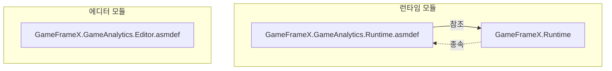
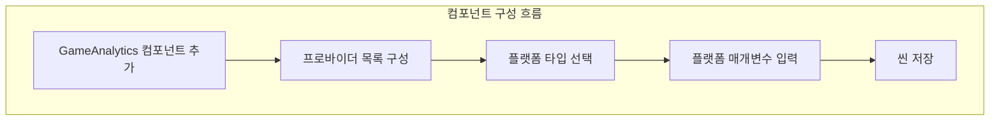

# 설치 가이드

이 문서는 GameFrameX GameAnalytics 게임 데이터 분석 컴포넌트를 Unity 프로젝트에 설치하는 방법을 상세히 소개합니다.

## 개요

GameFrameX GameAnalytics 컴포넌트는 Unity 게임 프레임워크의 핵심 모듈 중 하나로, 게임 데이터 분석 기능을 통합하는 데 사용됩니다. 이 컴포넌트는 여러 데이터 분석 플랫폼 접속을 지원하며, 통일된 이벤트 보고 인터페이스와 타이머 기능을 제공하여, 개발자가 서로 다른 데이터 분석 플랫폼 간 전환 또는 여러 플랫폼을 동시에 사용하는 것을 용이하게 합니다.

**사전 요구 사항:**
- Unity 2017.1 이상
- GameFrameX Runtime 핵심 라이브러리 설치됨

## 설치 방식

GameFrameX GameAnalytics 컴포넌트는 세 가지 설치 방식을 지원하며, 프로젝트 요구에 가장 적합한 방법을 선택할 수 있습니다.

### 방식 1: manifest.json을 통해 설치

Unity 프로젝트에서 `Packages` 폴더 아래의 `manifest.json` 파일을 찾고, `dependencies` 노드 아래에 다음 내용을 추가합니다:

```json
{
  "dependencies": {
    "com.gameframex.unity.gameanalytics": "https://github.com/GameFrameX/com.gameframex.unity.gameanalytics.git"
  }
}
```

> Source: [README.md](https://github.com/GameFrameX/com.gameframex.unity.gameanalytics/blob/main/README.md#L150-L156)

수정完成后, Unity가 자동으로 패키지를 다운로드하고 설치합니다.

### 방식 2: Unity Package Manager를 통해 설치

1. Unity 에디터를 엽니다
2. 메뉴 `Window` → `Package Manager`를 선택합니다
3. 좌측 상단의 `+` 버튼을 클릭합니다
4. `Add package from git URL...`를 선택합니다
5. 다음 Git URL을 입력합니다:
   ```
   https://github.com/GameFrameX/com.gameframex.unity.gameanalytics.git
   ```
6. `Add` 버튼을 클릭하여 설치가 완료될 때까지 기다립니다

> Source: [README.md](https://github.com/GameFrameX/com.gameframex.unity.gameanalytics/blob/main/README.md#L156)

### 방식 3: 직접 다운로드 설치

1. GitHub 저장소에서 최신 Release 버전을 다운로드하거나 전체 저장소를 클론합니다
2. 다운로드한 폴더를 Unity 프로젝트의 `Packages` 디렉토리에 복사합니다
3. Unity가 자동으로 패키지를 인식하고 로드합니다

## 설치 확인

설치完成后, 다음 방법으로 설치 성공 여부를 확인할 수 있습니다:

### Package Manager 확인

Unity Package Manager 창에서 `Game Frame X Game Analytics`가 패키지 목록에 나타나는지, 그리고 올바른 버전 번호가 표시되는지 확인합니다.

```json
{
  "name": "com.gameframex.unity.gameanalytics",
  "version": "1.2.0"
}
```

> Source: [package.json](https://github.com/GameFrameX/com.gameframex.unity.gameanalytics/blob/main/package.json#L1-L6)

### 어셈블리 정의 확인

다음 어셈블리 정의 파일이 올바르게 로드되었는지 확인합니다:



> Source: [GameFrameX.GameAnalytics.Runtime.asmdef](https://github.com/GameFrameX/com.gameframex.unity.gameanalytics/blob/main/Runtime/GameFrameX.GameAnalytics.Runtime.asmdef#L3-L5)

## 컴포넌트 구성

설치完成后, Unity 씬에 GameAnalytics 컴포넌트를 추가하여 구성해야 합니다.

### 컴포넌트 추가

1. Unity 에디터에서 씬을 생성하거나 엽니다
2. Hierarchy 패널에서 GameObject를 선택하거나(또는 새 객체를 생성합니다)
3. Inspector 패널에서 `Add Component` 버튼을 클릭합니다
4. `GameAnalytics` 컴포넌트를 검색하여 선택합니다
5. 컴포넌트가 선택된 GameObject에 자동으로 추가됩니다

> Source: [GameAnalyticsComponent.cs](https://github.com/GameFrameX/com.gameframex.unity.gameanalytics/blob/main/Runtime/GameAnalytics/GameAnalyticsComponent.cs#L13-L14)

### 분석 프로바이더 구성

GameAnalytics 컴포넌트는 여러 데이터 분석 프로바이더 구성을 지원합니다. Inspector 패널에서:

```csharp
[DisallowMultipleComponent]
[AddComponentMenu("Game Framework/GameAnalytics")]
public sealed class GameAnalyticsComponent : GameFrameworkComponent
```

> Source: [GameAnalyticsComponent.cs](https://github.com/GameFrameX/com.gameframex.unity.gameanalytics/blob/main/Runtime/GameAnalytics/GameAnalyticsComponent.cs#L12-L14)

1. **게임 데이터 분석 컴포넌트 목록** 속성을 찾습니다
2. `+` 버튼을 클릭하여 새 프로바이더를 추가합니다
3. 드롭다운 메뉴에서 사용할 데이터 분석 플랫폼 타입을 선택합니다
4. 선택한 플랫폼에 따라 corresponding 구성 매개변수를 입력합니다



## 종속 항목 설명

GameFrameX GameAnalytics 컴포넌트는 다음 모듈에 종속됩니다:

| 종속 항목 | 설명 | 필수 여부 |
|--------|------|------|
| GameFrameX.Runtime | 핵심 런타임 라이브러리 | 예 |

> Source: [GameFrameX.GameAnalytics.Runtime.asmdef](https://github.com/GameFrameX/com.gameframex.unity.gameanalytics/blob/main/Runtime/GameFrameX.GameAnalytics.Runtime.asmdef)

**중요:** GameFrameX Runtime 핵심 라이브러리를 먼저 설치했는지 확인하세요. 그렇지 않으면 컴포넌트가 정상 작동하지 않습니다.

## 빠른 검증

설치 및 구성이 완료되면, 다음 코드로 컴포넌트가 정상 작동하는지 검증할 수 있습니다:

```csharp
using GameFrameX.GameAnalytics.Runtime;

// 컴포넌트 인스턴스 가져오기
var gameAnalytics = UnityEngine.GameObject.FindObjectOfType<GameAnalyticsComponent>();

// 초기화 성공 여부 확인
if (gameAnalytics != null)
{
    // 테스트 이벤트 보고
    gameAnalytics.Event("test_event");
    UnityEngine.Debug.Log("GameAnalytics 컴포넌트 설치 성공!");
}
```

> Source: [GameAnalyticsComponent.cs](https://github.com/GameFrameX/com.gameframex.unity.gameanalytics/blob/main/Runtime/GameAnalytics/GameAnalyticsComponent.cs#L246-L265)

## 일반 문제

### 설치 후 컴파일 오류

컴파일 오류가 발생하면 다음을 확인하세요:
1. GameFrameX Runtime이 올바르게 설치되었는지
2. Unity 버전이 요구 사항을 충족하는지 (2017.1+)
3. manifest.json 문법이 올바른지

### 컴포넌트를 씬에 추가할 수 없음

확인 사항:
1. 패키지를 올바르게 가져왔는지
2. Runtime 폴더에 올바른 어셈블리 정의가 있는지
3. Unity 프로젝트가 새로 고침되었는지 (에디터 재시작이 필요할 수 있음)

### Inspector 패널 구성이 표시되지 않음

Inspector에서 GameAnalytics 컴포넌트의 구성 패널이 보이지 않으면:
1. 패키지를 다시 가져옵니다
2. Editor 어셈블리가 올바르게 로드되었는지 확인합니다
3. Unity Editor 버전 호환성을 확인합니다

## 관련 링크

- [플러그인 소개](./01.overview.md) - GameAnalytics 컴포넌트의 기능 특성에 대해 자세히 알아보기
- [빠른 시작](./03.getting-started.md) - GameAnalytics를 사용하여 데이터 보고 시작하기
- [핵심 아키텍처](./04.features.md) - 컴포넌트의 내부 아키텍처 설계 알아보기
- [에디터 구성](./05.configuration.md) - 에디터 구성 옵션 자세히 알아보기
- [문제 해결](./07.troubleshooting.md) - 일반 문제와 해결책