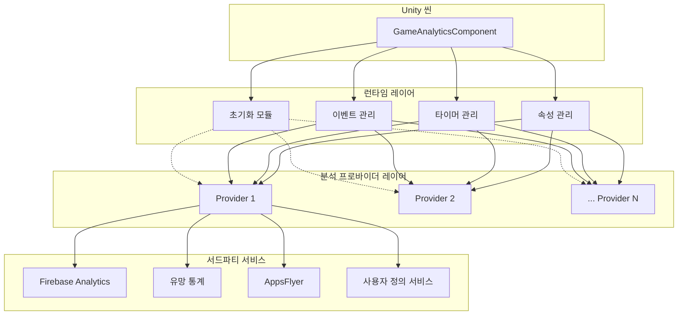
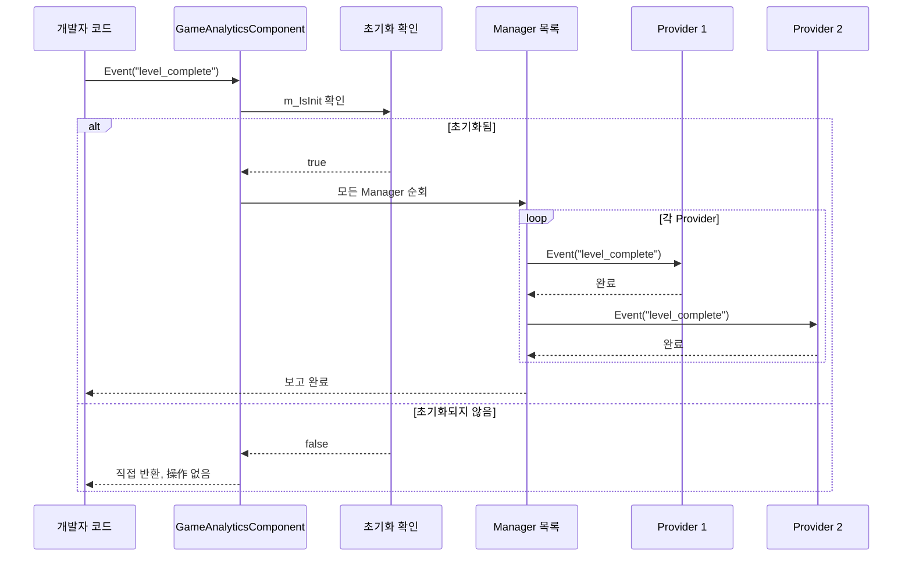

# 빠른 시작

이 가이드는 GameAnalytics 컴포넌트를 빠르게 통합하고 사용하여 게임 데이터 분석을 수행할 수 있도록 도와줍니다. 이 챕터를 통해 Unity 프로젝트에 컴포넌트를 추가하고, 분석 프로바이더를 구성하며, 핵심 기능을 사용하여 이벤트 보고와 타이밍을 수행하는 방법을 알게 될 것입니다.

## 개요

GameAnalytics 컴포넌트는 GameFrameX 프레임워크의 일부로, 게임 데이터 분석을 전문적으로 담당합니다. 이는 통일된 이벤트 보고 인터페이스를 제공하며, 여러 서드파티 분석 서비스(Firebase, UMeng, AppsFlyer 등)의 통합을 지원합니다.

이 컴포넌트는 다음 핵심 원칙을 따라 설계되었습니다:
- **다중 프로바이더 지원**: 목록을 통해 여러 분석 서비스를 구성하면, 데이터가 순서대로 모든 구성된 서비스에 보고됩니다
- **자동 초기화**: 컴포넌트가 씬에 붙으면 자동으로 초기화되어, 수동으로 호출할 필요가 없습니다
- **유연한 이벤트 보고**: 단순 이벤트, 수치 포함 이벤트, 사용자 정의 필드 포함 이벤트 등 다양한 형태 지원

## 아키텍처 개요



위는와 같이, GameAnalyticsComponent는 Unity 씬에 있는 핵심 컴포넌트로, 네 가지 주요 모듈을 관리합니다: 초기화, 이벤트 관리, 타이머 관리 및 속성 관리. 이러한 모듈은 통일된 인터페이스를 통해 여러 분석 프로바이더와 상호작용하여, 최종적으로 데이터를 다양한 서드파티 분석 서비스에 보고합니다.

## 핵심 흐름

### 이벤트 보고 흐름

Event 메서드를 호출하여 이벤트를 보고할 때, 데이터는 다음 흐름을 거칩니다:



이 흐름은 컴포넌트가 올바르게 초기화된 후에만 이벤트 보고가 실행되도록 보장하여,过早 호출로 인한 데이터 손실을 방지합니다.

## 사용 가이드

### 첫 번째 단계: 컴포넌트를 씬에 추가

Unity 에디터에서 다음 단계에 따라 GameAnalytics 컴포넌트를 추가합니다:

1. 씬에서 빈 GameObject를 생성하거나 기존 GameObject를 선택합니다
2. Inspector 패널에서 **Add Component** 버튼을 클릭합니다
3. 검색 상자에 "GameAnalytics" 또는 "게임 데이터 분석"을 입력합니다
4. **Game Framework > GameAnalytics** 컴포넌트를 선택합니다

> Source: [GameAnalyticsComponent.cs](https://github.com/GameFrameX/com.gameframex.unity.gameanalytics/blob/main/Runtime/GameAnalytics/GameAnalyticsComponent.cs#L14-L15)

컴포넌트를 추가하면 자동으로 `GameFrameworkComponent` 기본 클래스를 상속하며, 이는 GameFrameX 프레임워크의 표준 컴포넌트 기본 클래스입니다.

### 두 번째 단계: 분석 프로바이더 구성

컴포넌트를 추가한 후 Inspector 패널에서 분석 프로바이더를 구성해야 합니다:

1. 씬에서 GameAnalytics GameObject를 선택합니다
2. Inspector에서 **게임 데이터 분석 컴포넌트 목록** 속성을 찾습니다
3. 목록 왼쪽 하단의 **+** 버튼을 클릭하여 새 프로바이더를 추가합니다
4. **ComponentType** 드롭다운 메뉴에서 구체적인 분석 서비스 구현 클래스를 선택합니다
5. 선택한 분석 서비스에 따라相应 매개변수(App ID, App Key 등)를 구성합니다

```csharp
// 컴포넌트 구성 데이터 구조체 정의
[Serializable]
public class GameAnalyticsComponentProvider
{
    /// <summary>
    /// 구현 컴포넌트 타입
    /// </summary>
    public string ComponentType;

    /// <summary>
    /// 이것은 에디터용입니다
    /// </summary>
    public int ComponentTypeNameIndex = 0;

    /// <summary>
    /// 매개변수
    /// </summary>
    public List<GameAnalyticsComponentParamKV> Setting = new List<GameAnalyticsComponentParamKV>();
}
```

> Source: [GameAnalyticsComponent.cs](https://github.com/GameFrameX/com.gameframex.unity.gameanalytics/blob/main/Runtime/GameAnalytics/GameAnalyticsComponent.cs#L361-L378)

### 세 번째 단계: 코드에서 사용

게임 코드에서 GameAnalytics 컴포넌트를 사용하는 다양한方式是 다음과 같습니다:

#### 컴포넌트 인스턴스 가져오기

```csharp
using GameFrameX.GameAnalytics.Runtime;

// GameAnalyticsComponent 인스턴스 가져오기
var gameAnalytics = UnityEngine.GameObject.FindObjectOfType<GameAnalyticsComponent>();
```

> Source: [GameAnalyticsComponent.cs](https://github.com/GameFrameX/com.gameframex.unity.gameanalytics/blob/main/Runtime/GameAnalytics/GameAnalyticsComponent.cs#L14-L25)

#### 초기화 상태 확인

컴포넌트는 `OnEnable()` 시 자동으로 초기화됩니다. 초기화 완료 후 `m_IsInit` 플래그가 `true`로 설정됩니다. 모든 이벤트 보고 메서드는 이 플래그를 확인합니다:

```csharp
public void Event(string eventName)
{
    GameFrameworkGuard.NotNullOrEmpty(eventName, nameof(eventName));
    if (!m_IsInit)
    {
        return;  // 초기화되지 않았으면 직접 반환, 操作 없음
    }
    // ... 이벤트 보고 로직
}
```

> Source: [GameAnalyticsComponent.cs](https://github.com/GameFrameX/com.gameframex.unity.gameanalytics/blob/main/Runtime/GameAnalytics/GameAnalyticsComponent.cs#L246-L265)

이러한 설계는 컴포넌트가 올바르게 초기화되지 않았을 때 操作을 실행하지 않아, 잠재적인 null 참조 예외를 방지합니다.

## 기능 상세

### 이벤트 보고

GameAnalytics 컴포넌트는 다양한 시나리오의 요구를 충족하기 위해 4가지 이벤트 보고 메서드를 제공합니다:

#### 1. 단순 이벤트 보고

추가 데이터가 없는 단순 이벤트를 보고하는 데 사용되며, 예를 들어 사용자가 버튼을 클릭하거나某个 페이지에 진입하는 경우입니다:

```csharp
/// <summary>
/// 이벤트 보고
/// </summary>
/// <param name="eventName">이벤트 이름</param>
public void Event(string eventName)
```

**사용 예시:**

```csharp
// 플레이어가 레벨을 완료한 이벤트 보고
gameAnalytics.Event("level_complete");

// 플레이어가 상점을 진입한 이벤트 보고
gameAnalytics.Event("enter_shop");
```

> Source: [GameAnalyticsComponent.cs](https://github.com/GameFrameX/com.gameframex.unity.gameanalytics/blob/main/Runtime/GameAnalytics/GameAnalyticsComponent.cs#L242-L265)

#### 2. 수치를 포함한 이벤트 보고

점수, 레벨, 코인 수 등 수치를 기록해야 하는 이벤트에 사용됩니다:

```csharp
/// <summary>
/// 수치를 포함한 이벤트 보고
/// </summary>
/// <param name="eventName">이벤트 이름</param>
/// <param name="eventValue">이벤트 수치</param>
public void Event(string eventName, float eventValue)
```

**사용 예시:**

```csharp
// 플레이어 점수 보고
gameAnalytics.Event("score", 1500.5f);

// 플레이어 레벨 보고
gameAnalytics.Event("player_level", 10f);
```

> Source: [GameAnalyticsComponent.cs](https://github.com/GameFrameX/com.gameframex.unity.gameanalytics/blob/main/Runtime/GameAnalytics/GameAnalyticsComponent.cs#L267-L291)

#### 3. 사용자 정의 필드를 포함한 이벤트 보고

사용자 정의 차원을 포함해야 하는 이벤트에 사용되어, 이후 더 정밀한 데이터 분석을 용이하게 합니다:

```csharp
/// <summary>
/// 사용자 정의 필드 이벤트 보고
/// </summary>
/// <param name="eventName">이벤트 이름</param>
/// <param name="customF">사용자 정의 필드</param>
public void Event(string eventName, Dictionary<string, object> customF)
```

**사용 예시:**

```csharp
// 사용자 정의 필드를 포함한 레벨 완료 이벤트 보고
var customFields = new Dictionary<string, object>
{
    { "level_id", "level_05" },
    { "difficulty", "hard" },
    { "stars", 3 }
};
gameAnalytics.Event("level_complete", customFields);
```

> Source: [GameAnalyticsComponent.cs](https://github.com/GameFrameX/com.gameframex.unity.gameanalytics/blob/main/Runtime/GameAnalytics/GameAnalyticsComponent.cs#L293-L324)

#### 4. 수치와 사용자 정의 필드를 포함한 이벤트 보고

가장 완전한 기능의 이벤트 보고 메서드로, 수치와 사용자 정의 차원을 동시에 포함합니다:

```csharp
/// <summary>
/// 수치와 사용자 정의 필드를 포함한 이벤트 보고
/// </summary>
/// <param name="eventName">이벤트 이름</param>
/// <param name="eventValue">이벤트 수치</param>
/// <param name="customF">사용자 정의 필드</param>
public void Event(string eventName, float eventValue, Dictionary<string, object> customF)
```

**사용 예시:**

```csharp
// 소비 금액과 상품 정보를 포함한 구매 이벤트 보고
var purchaseInfo = new Dictionary<string, object>
{
    { "item_id", "gem_pack_100" },
    { "currency", "USD" }
};
gameAnalytics.Event("purchase", 0.99f, purchaseInfo);
```

> Source: [GameAnalyticsComponent.cs](https://github.com/GameFrameX/com.gameframex.unity.gameanalytics/blob/main/Runtime/GameAnalytics/GameAnalyticsComponent.cs#L326-L358)

### 타이머 기능

게임 분석에서 타이머 기능은 플레이어가 특정 작업이나 레벨을 완료하는 데 걸리는 시간을 측정하는 데 사용됩니다. 이는 게임 난이도와 플레이어 행동 분석에 매우 중요합니다.

#### 타이머 시작

```csharp
/// <summary>
/// 타이머 시작
/// </summary>
/// <param name="eventName">이벤트 이름</param>
public void StartTimer(string eventName)
```

**사용 예시:**

```csharp
// 플레이어가 새 레벨에 도전할 때 타이머 시작
gameAnalytics.StartTimer("level_05");
```

> Source: [GameAnalyticsComponent.cs](https://github.com/GameFrameX/com.gameframex.unity.gameanalytics/blob/main/Runtime/GameAnalytics/GameAnalyticsComponent.cs#L156-L179)

#### 타이머 일시 정지

```csharp
/// <summary>
/// 타이머 일시 정지
/// </summary>
/// <param name="eventName">이벤트 이름</param>
public void PauseTimer(string eventName)
```

플레이어가 게임을 일시 정지하거나 현재 씬을 떠날 때 사용됩니다:

```csharp
// 플레이어가 게임을 일시 정지할 때 타이머 일시 정지
gameAnalytics.PauseTimer("level_05");
```

> Source: [GameAnalyticsComponent.cs](https://github.com/GameFrameX/com.gameframex.unity.gameanalytics/blob/main/Runtime/GameAnalytics/GameAnalyticsComponent.cs#L181-L197)

#### 타이머 재개

```csharp
/// <summary>
/// 타이머 재개
/// </summary>
/// <param name="eventName">이벤트 이름</param>
public void ResumeTimer(string eventName)
```

플레이어가 게임을 재개한 후 타이머를 계속합니다:

```csharp
// 플레이어가 게임을 재개할 때 타이머 재개
gameAnalytics.ResumeTimer("level_05");
```

> Source: [GameAnalyticsComponent.cs](https://github.com/GameFrameX/com.gameframex.unity.gameanalytics/blob/main/Runtime/GameAnalytics/GameAnalyticsComponent.cs#L199-L215)

#### 타이머 종료 및 보고

```csharp
/// <summary>
/// 타이머 종료
/// </summary>
/// <param name="eventName">이벤트 이름</param>
public void StopTimer(string eventName)
```

플레이어가 레벨을 완료하거나 포기할 때 타이머를 중지합니다:

```csharp
// 플레이어가 레벨을 완료할 때 타이머 중지
gameAnalytics.StopTimer("level_05");
```

> Source: [GameAnalyticsComponent.cs](https://github.com/GameFrameX/com.gameframex.unity.gameanalytics/blob/main/Runtime/GameAnalytics/GameAnalyticsComponent.cs#L217-L240)

### 플레이어 관리

#### 플레이어 ID 설정

특정 플레이어의 모든 이벤트 데이터를 연결하는 데 사용됩니다:

```csharp
/// <summary>
/// 플레이어 ID 설정
/// </summary>
/// <param name="playerId">플레이어 ID</param>
public void SetPlayerId(string playerId)
```

**사용 예시:**

```csharp
// 플레이어 로그인 후 플레이어 ID 설정
gameAnalytics.SetPlayerId("player_12345");
```

> Source: [GameAnalyticsComponent.cs](https://github.com/GameFrameX/com.gameframex.unity.gameanalytics/blob/main/Runtime/GameAnalytics/GameAnalyticsComponent.cs#L32-L42)

### 공통 속성

공통 속성은 자동으로 모든 보고된 이벤트에 첨부되어, 다차원 분석을 용이하게 합니다.

#### 공통 속성 설정

```csharp
/// <summary>
/// 공통 속성 설정
/// </summary>
/// <param name="key">Key</param>
/// <param name="value">값</param>
public void SetPublicProperties(string key, object value)
```

**사용 예시:**

```csharp
// 플레이어의 VIP 레벨 설정
gameAnalytics.SetPublicProperties("vip_level", 5);

// 플레이어가 위치한 서버 설정
gameAnalytics.SetPublicProperties("server", "us_west");
```

> Source: [GameAnalyticsComponent.cs](https://github.com/GameFrameX/com.gameframex.unity.gameanalytics/blob/main/Runtime/GameAnalytics/GameAnalyticsComponent.cs#L102-L119)

#### 공통 속성 가져오기

```csharp
/// <summary>
/// 공통 속성 가져오기
/// </summary>
/// <returns></returns>
public Dictionary<string, object> GetPublicProperties()
```

#### 공통 속성 지우기

```csharp
/// <summary>
/// 공통 속성 지우기
/// </summary>
public void ClearPublicProperties()
```

> Source: [GameAnalyticsComponent.cs](https://github.com/GameFrameX/com.gameframex.unity.gameanalytics/blob/main/Runtime/GameAnalytics/GameAnalyticsComponent.cs#L120-L154)

### 자동 장치 정보 수집

컴포넌트는 다음 장치 정보를 자동으로 수집하여 공통 속성에 추가합니다:

| 속성 이름 | 설명 | 데이터 출처 |
|---------|------|---------|
| device_id | 장치 고유 식별자 | SystemInfo.deviceUniqueIdentifier |
| device_model | 장치 모델 | SystemInfo.deviceModel |
| device_type | 장치 유형 | SystemInfo.deviceType |
| os | 운영 체제 | SystemInfo.operatingSystem |
| app_version | 앱 버전 | Application.version |
| unity_version | Unity 버전 | Application.unityVersion |
| platform | 플랫폼 | Application.platform |
| processor_type | 프로세서 유형 | SystemInfo.processorType |
| processor_count | 프로세서 코어 수 | SystemInfo.processorCount |
| system_memory_size | 시스템 메모리 크기 | SystemInfo.systemMemorySize |
| graphics_device_name | 그래픽 카드 이름 | SystemInfo.graphicsDeviceName |
| screen_width | 화면 너비 | Screen.width |
| screen_height | 화면 높이 | Screen.height |
| screen_dpi | 화면 DPI | Screen.dpi |
| network_type | 네트워크 유형 | Application.internetReachability |
| system_language | 시스템 언어 | Application.systemLanguage |

> Source: [BaseGameAnalyticsManager.cs](https://github.com/GameFrameX/com.gameframex.unity.gameanalytics/blob/main/Runtime/GameAnalytics/BaseGameAnalyticsManager.cs#L85-L144)

## 완전한 사용 예시

다음은 실제 프로젝트에서 GameAnalytics 컴포넌트를 사용하는 방법을 보여주는 완전한 게임 스크립트 예시입니다:

```csharp
using System.Collections.Generic;
using UnityEngine;
using GameFrameX.GameAnalytics.Runtime;

public class GameAnalyticsExample : MonoBehaviour
{
    private GameAnalyticsComponent _gameAnalytics;

    private void Awake()
    {
        // GameAnalytics 컴포넌트 인스턴스 가져오기
        _gameAnalytics = GetComponent<GameAnalyticsComponent>();

        if (_gameAnalytics == null)
        {
            Debug.LogError("GameAnalyticsComponent not found!");
            return;
        }

        // 플레이어 ID 설정
        _gameAnalytics.SetPlayerId("player_10001");

        // 공통 속성 설정
        _gameAnalytics.SetPublicProperties("vip_level", 3);
        _gameAnalytics.SetPublicProperties("server", "asia_east");
    }

    private void Start()
    {
        // 플레이어가 게임에 진입했다고 보고
        _gameAnalytics.Event("game_start");
    }

    public void OnLevelStart(string levelId)
    {
        // 레벨 타이머 시작
        _gameAnalytics.StartTimer($"level_{levelId}");

        // 레벨 시작 이벤트 보고
        var customFields = new Dictionary<string, object>
        {
            { "level_id", levelId },
            { "difficulty", "normal" }
        };
        _gameAnalytics.Event("level_start", customFields);
    }

    public void OnLevelComplete(string levelId, int score, int stars)
    {
        // 레벨 타이머 중지
        _gameAnalytics.StopTimer($"level_{levelId}");

        // 수치와 사용자 정의 필드를 포함한 레벨 완료 이벤트 보고
        var customFields = new Dictionary<string, object>
        {
            { "level_id", levelId },
            { "stars", stars }
        };
        _gameAnalytics.Event("level_complete", score, customFields);
    }

    public void OnPurchase(string itemId, float price, string currency)
    {
        // 구매 이벤트 보고
        var customFields = new Dictionary<string, object>
        {
            { "item_id", itemId },
            { "currency", currency }
        };
        _gameAnalytics.Event("purchase", price, customFields);
    }

    public void OnPlayerLevelUp(int newLevel)
    {
        // VIP 레벨 공통 속성 업데이트
        _gameAnalytics.SetPublicProperties("player_level", newLevel);

        // 레벨업 이벤트 보고
        _gameAnalytics.Event("level_up", newLevel);
    }
}
```

이 예시는 컴포넌트의 전형적인 사용 패턴을 보여줍니다:
1. `Awake`에서 컴포넌트 참조를 가져오고 플레이어 ID와 공통 속성 설정
2. 게임 흐름의 핵심 지점(시작, 완료, 구매 등)에서 이벤트 보고
3. 레벨 완료 시간 측정을 위해 타이머 기능 사용

## 초기화 옵션

### 자동 초기화

기본적으로 컴포넌트는 `OnEnable()` 시 자동으로 초기화됩니다. 이것이 권장되는 초기화 방식입니다:

```csharp
private void OnEnable()
{
    Init();
}
```

> Source: [GameAnalyticsComponent.cs](https://github.com/GameFrameX/com.gameframex.unity.gameanalytics/blob/main/Runtime/GameAnalytics/GameAnalyticsComponent.cs#L27-L30)

### 수동 초기화

특정 타이밍에 초기화해야 하는 경우, 수동 초기화를 사용할 수 있습니다:

```csharp
/// <summary>
/// 수동 초기화
/// </summary>
/// <param name="extraArgs">추가 초기화 매개변수</param>
public void ManualInit(Dictionary<string, string> extraArgs)
```

**사용 예시:**

```csharp
// 플레이어 로그인 완료 후 수동 초기화
var extraArgs = new Dictionary<string, string>
{
    { "user_token", userToken },
    { "init_time", System.DateTime.Now.ToString() }
};
gameAnalytics.ManualInit(extraArgs);
```

> Source: [GameAnalyticsComponent.cs](https://github.com/GameFrameX/com.gameframex.unity.gameanalytics/blob/main/Runtime/GameAnalytics/GameAnalyticsComponent.cs#L82-L100)

## 모범 사례

### 1. 이벤트命名規範

데이터 분석의 정확성을 보장하기 위해 이벤트命名에 통일된命名規範을 사용하는 것을 권장합니다:

- 소문자와 밑줄 사용: `level_complete`, `purchase_success`
- 간결하면서 설명적 유지: `game_start`, `tutorial_finish`
- 특수 문자와 중국어避免

### 2. 공통 속성의 합리적 사용

공통 속성은 게임 세션 동안 변경되지 않는 정보 저장에 적합합니다:
- 플레이어 ID
- VIP 레벨
- 서버 영역
- 채널 정보

### 3. 타이머 사용 시나리오

타이머는 특히 다음 시나리오에 적합합니다:
- 레벨 완료 시간
- 튜토리얼 완료 시간
- 특정 操作 소요 시간
- 페이지 체류 시간

### 4. 초기화 확인

모든 이벤트 보고 메서드는 `m_IsInit` 상태를 확인합니다. 컴포넌트가 올바르게 초기화되지 않으면 메서드가 직접 반환하여 操作을 실행하지 않습니다. 이것은 초기화 전 호출에서도 예외가 발생하지 않도록 보장합니다.

## 관련 링크

- [플러그인 소개](./01.overview.md) - GameAnalytics 플러그인의 완전한 소개 알아보기
- [설치 가이드](./02.installation.md) - 자세한 설치 단계 보기
- [핵심 아키텍처](./04.features.md) - 프레임워크의 핵심 아키텍처 설계 자세히 알아보기
- [API 인터페이스](./06.api-reference.md) - 완전한 API 참조 문서
- [에디터 구성](./05.configuration.md) - 에디터 구성 설명
- [문제 해결](./07.troubleshooting.md) - 일반 문제와 해결책