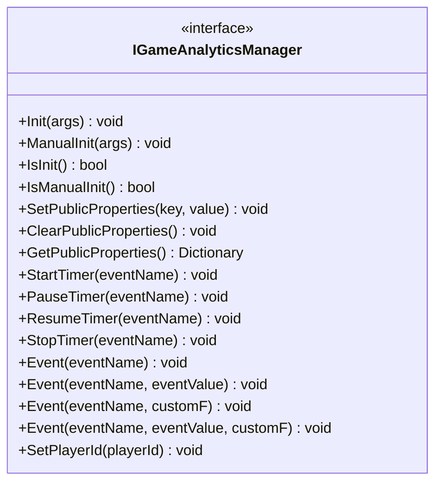
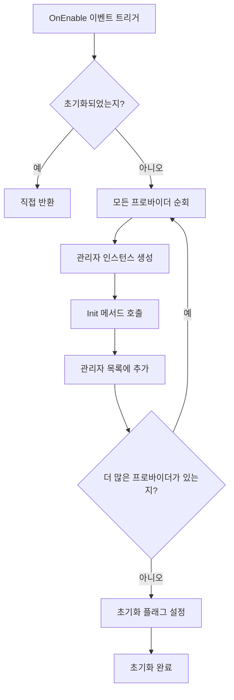
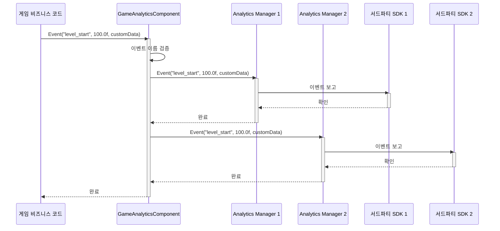
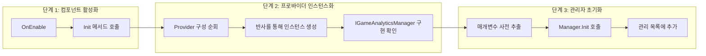

# 핵심 아키텍처

이 문서는 GameFrameX 게임 데이터 분석 플러그인의 핵심 아키텍처 설계를 상세히 소개하며, 주요 컴포넌트, 데이터 흐름 및 설계 패턴을 포함합니다.

## 개요

GameFrameX 게임 데이터 분석 플러그인(GameAnalytics)은 GameFrameX 프레임워크의 핵심 모듈 중 하나로, Unity 게임을 위한 통일된 이벤트 보고, 타이머 및 플레이어 데이터 분석 기능을 제공합니다. 이 플러그인은 모듈화 설계를 채택하여 다양한 서드파티 분석 서비스 통합을 지원하며, 공통 속성 관리 메커니즘을 제공하여 데이터 분석의 일관성과 확장성을 보장합니다.

## 아키텍처 설계

### 전체 아키텍처 다이어그램

```mermaid
flowchart TD
    subgraph UnityLayer["Unity 엔진 레이어"]
        GameObject[GameObject]
    end

    subgraph GameAnalyticsComponentLayer["컴포넌트 레이어 (GameAnalyticsComponent)"]
        GAComponent[GameAnalyticsComponent]
        Providers[GameAnalyticsComponentProvider]
    end

    subgraph ManagerLayer["관리자 레이어"]
        IManager[IGameAnalyticsManager]
        BaseManager[BaseGameAnalyticsManager]
    end

    subgraph ImplementationLayer["구현 레이어"]
        ImplA[Analytics Provider A]
        ImplB[Analytics Provider B]
        ImplC[Analytics Provider N]
    end

    GameObject --> GAComponent
    GAComponent --> Providers
    Providers -.->|구성| IManager
    IManager <|..| BaseManager
    BaseManager -->|상속| ImplA
    BaseManager -->|상속| ImplB
    BaseManager -->|상속| ImplC
```

### 아키텍처 계층 설명

| 계층 | 컴포넌트 | 책임 |
|------|------|------|
| **Unity 엔진 레이어** | GameObject | Unity 씬의 게임 객체 호스트 |
| **컴포넌트 레이어** | GameAnalyticsComponent | Unity 컴포넌트 인터페이스 제공,管理工作자 수명주기 |
| **관리자 레이어** | IGameAnalyticsManager / BaseGameAnalyticsManager | 통일 API 정의, 일반 기능 구현 |
| **구현 레이어** | 구체적 분석 서비스 구현 | 서드파티 분석 SDK 통합 (GameAnalytics, Firebase 등) |

## 핵심 컴포넌트

### 1. IGameAnalyticsManager 인터페이스

`IGameAnalyticsManager`는 플러그인의 핵심 인터페이스로, 모든 분석 기능의 표준 계약을 정의합니다. 이 인터페이스는，面向抽象 설계를 채택하여 상위 코드가 구체적인 구현 세부 정보에 대해 알 필요가 없도록 합니다.

> Source: [IGameAnalyticsManager.cs](https://github.com/GameFrameX/com.gameframex.unity.gameanalytics/blob/main/Runtime/GameAnalytics/IGameAnalyticsManager.cs#L1-L106)

**인터페이스 메서드 분류:**



### 2. BaseGameAnalyticsManager 추상 기본 클래스

`BaseGameAnalyticsManager`는 `GameFrameworkModule`를 상속하며, 모든 분석 관리자 구현의 기본 클래스입니다. 일반적인 기능을 캡슐화하며, 그 내용은 다음과 같습니다:

- **초기화 상태 관리** - 관리자가 초기화되었는지 추적
- **공통 속성 관리** - 공통 속성의 설정, 가져오기 및 지우기 기능 제공
- **장치 정보 수집** - 장치 관련 공통 속성 자동 수집

```csharp
public abstract class BaseGameAnalyticsManager : GameFrameworkModule, IGameAnalyticsManager
{
    protected bool m_IsInit = false;
    protected readonly Dictionary<string, object> m_PublicProperties = new Dictionary<string, object>();

    protected virtual void AddDeviceInfoToPublicProperties()
    {
        // 장치 기본 정보
        m_PublicProperties["device_id"] = SystemInfo.deviceUniqueIdentifier;
        m_PublicProperties["device_model"] = SystemInfo.deviceModel;
        // ... 더 많은 장치 정보
    }
}
```

> Source: [BaseGameAnalyticsManager.cs](https://github.com/GameFrameX/com.gameframex.unity.gameanalytics/blob/main/Runtime/GameAnalytics/BaseGameAnalyticsManager.cs#L10-L203)

**설계 의도:** 추상 기본 클래스 패턴을 사용하면 서로 다른 분석 서비스 제공자가 해당 클래스를 상속하여 특정 로직을 구현할 수 있으며, 동시에 공통 속성 관리 및 장치 정보 수집과 같은 일반적인 기능을 재활용할 수 있습니다.

### 3. GameAnalyticsComponent Unity 컴포넌트

`GameAnalyticsComponent`는 Unity 엔진의 컴포넌트 클래스로, 게임 씬에서 데이터 분석 기능을 제공합니다. `GameFrameworkComponent`를 상속하며, 개발자와 주로 상호작용하는 진입점입니다.

```csharp
[DisallowMultipleComponent]
[AddComponentMenu("Game Framework/GameAnalytics")]
public sealed class GameAnalyticsComponent : GameFrameworkComponent
{
    [SerializeField] private List<GameAnalyticsComponentProvider> m_gameAnalyticsComponentProviders = new List<GameAnalyticsComponentProvider>();
    private List<IGameAnalyticsManager> m_GameAnalyticsManager;
}
```

> Source: [GameAnalyticsComponent.cs](https://github.com/GameFrameX/com.gameframex.unity.gameanalytics/blob/main/Runtime/GameAnalytics/GameAnalyticsComponent.cs#L1-L386)

**핵심 책임:**

1. **다중 프로바이더 지원** - 여러 분석 서비스 프로바이더 동시 구성 지원
2. **자동 초기화** - `OnEnable` 시 모든 프로바이더 자동 초기화
3. **수동 초기화** - 특수 요구를 충족하기 위한 지연 수동 초기화 지원
4. **이벤트 브로드캐스트** - 이벤트를 모든 구성된 프로바이더에 동시에 전송



### 4. 구성 모델

플러그인은 분석 서비스 프로바이더 설정을 관리하기 위해 두 가지 구성 클래스를 사용합니다:

- **GameAnalyticsComponentProvider** - 프로바이더 구성으로, 컴포넌트 타입 및 매개변수 설정 포함
- **GameAnalyticsComponentParamKV** - 키-값 쌍 구성으로, 구체적인 매개변수 저장에 사용

```csharp
[Serializable]
public class GameAnalyticsComponentProvider
{
    public string ComponentType;
    public int ComponentTypeNameIndex;
    public List<GameAnalyticsComponentParamKV> Setting = new List<GameAnalyticsComponentParamKV>();
}

[Serializable]
public class GameAnalyticsComponentParamKV
{
    public string Key;
    public string Value;
}
```

> Source: [GameAnalyticsComponent.cs](https://github.com/GameFrameX/com.gameframex.unity.gameanalytics/blob/main/Runtime/GameAnalytics/GameAnalyticsComponent.cs#L361-L385)

## 데이터 흐름

### 이벤트 보고 흐름

게임 코드가 `GameAnalyticsComponent.Event()` 메서드를 호출하면 이벤트 데이터가 다음 흐름을 통해 전파됩니다:



### 초기화 흐름



## 공통 속성 메커니즘

### 개요

공통 속성(Public Properties)은 모든 이벤트에 자동으로 첨부되는 컨텍스트 데이터로, 플레이어 세션의 상세 정보를 제공합니다. 이러한 속성은 `BaseGameAnalyticsManager`에서 자동으로 수집되며, 장치 정보, 운영 체제 정보, 애플리케이션 정보 등을 포함합니다.

### 자동 수집 속성

| 분류 | 속성 키명 | 설명 |
|------|----------|------|
| 장치 정보 | `device_id` | 장치 고유 식별자 |
| 장치 정보 | `device_model` | 장치 모델 |
| 장치 정보 | `device_type` | 장치 유형 |
| 운영 체제 | `os` | 운영 체제 버전 |
| 애플리케이션 | `app_version` | 앱 버전 번호 |
| 애플리케이션 | `unity_version` | Unity 엔진 버전 |
| 애플리케이션 | `platform` | 실행 플랫폼 |
| 하드웨어 정보 | `processor_type` | 프로세서 유형 |
| 하드웨어 정보 | `processor_count` | 프로세서 코어 수 |
| 하드웨어 정보 | `system_memory_size` | 시스템 메모리 크기 |
| 그래픽 정보 | `graphics_device_name` | 그래픽 카드 이름 |
| 그래픽 정보 | `graphics_memory_size` | 비디오 메모리 크기 |
| 화면 정보 | `screen_width` | 화면 너비 |
| 화면 정보 | `screen_height` | 화면 높이 |
| 화면 정보 | `screen_dpi` | 화면 DPI |
| 네트워크 정보 | `network_type` | 네트워크 유형 (WiFi/Mobile Data) |

> Source: [BaseGameAnalyticsManager.cs](https://github.com/GameFrameX/com.gameframex.unity.gameanalytics/blob/main/Runtime/GameAnalytics/BaseGameAnalyticsManager.cs#L88-L144)

### 사용자 정의 공통 속성

개발자는 `SetPublicProperties` 메서드를 통해 사용자 정의 공통 속성을 추가할 수 있으며, 这些 속성은 후속 모든 이벤트에 자동으로 첨부됩니다:

```csharp
// 사용자 정의 공통 속성 설정
gameAnalyticsComponent.SetPublicProperties("player_level", 10);
gameAnalyticsComponent.SetPublicProperties("player_name", "Hero");
```

### 속성 우선순위

공통 속성의 우선순위 순서는 다음과 같습니다:
1. **시스템 자동 수집** - 장치 정보, 운영 체제 등 (가장 먼저 추가)
2. **개발자 사용자 정의** - `SetPublicProperties`를 통해 설정 (동일한 키 덮어쓰기)
3. **수동 지우기 후 재설정** - `ClearPublicProperties` 호출 후 시스템 속성 재수집

## 설계 패턴 상세

### 1. 인터페이스 추상 패턴

**적용 시나리오:** `IGameAnalyticsManager` 인터페이스 정의

**장점:**
- 상위 코드와 구체적 구현 분리
- 다중 프로바이더 병렬 실행 지원
- 단위 테스트 용이 (Mock 사용 가능)

### 2. 템플릿 메서드 패턴

**적용 시나리오:** `BaseGameAnalyticsManager` 기본 클래스

**장점:**
- 일반 로직 재활용 (초기화, 공통 속성 관리)
- 하위 클래스는 특정 구현에만 집중
- 통일된 코드 구조

### 3. 프로바이더 패턴

**적용 시나리오:** `GameAnalyticsComponent`가 여러 `IGameAnalyticsManager` 관리

**장점:**
- 다중 분석 서비스 동시 사용 지원
- 유연한 구성 메커니즘
- 새 서비스 제공자 확장 용이

### 4. 반사 인스턴스화

**적용 시나리오:** 에디터에서 동적으로 분석 관리자 타입 로드

```csharp
var gameAnalyticsComponentType = Utility.Assembly.GetType(gameAnalyticsComponentProvider.ComponentType);
if (Activator.CreateInstance(gameAnalyticsComponentType) is IGameAnalyticsManager gameAnalyticsManager)
{
    gameAnalyticsManager.Init(args);
    m_GameAnalyticsManager.Add(gameAnalyticsManager);
}
```

**장점:**
- 런타임에 동적으로 로드하여 컴파일 시 참조 불필요
- 플러그인화 아키텍처로 확장 용이

## 관련 링크

- [플러그인 소개](./01.overview.md) - 플러그인 개요 및 기능 소개
- [빠른 시작](./03.getting-started.md) - 빠른 시작 가이드
- [API 인터페이스](./06.api-reference.md) - 완전한 API 참조 문서
- [에디터 구성](./05.configuration.md) - 에디터 구성 설명
- [문제 해결](./07.troubleshooting.md) - 일반 문제와 해결책