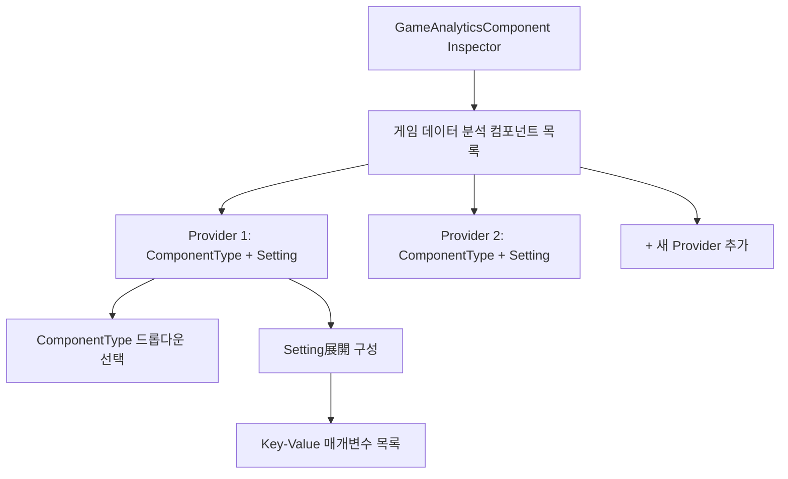
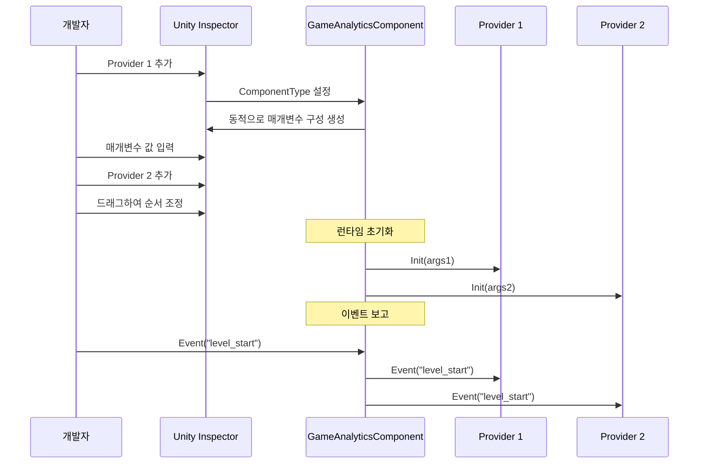

# 에디터 구성

이 문서는 Unity 에디터에서 GameAnalytics 플러그인을 구성하는 방법을 상세히 소개하며, 컴포넌트 추가, Provider 구성 및 매개변수 설정을 포함합니다.

## 개요

GameAnalytics 플러그인은 Provider 기반의 확장 가능한 아키텍처를 채택하여,同一个 프로젝트에서 여러 데이터 분석 서비스 제공자를 구성할 수 있습니다. 에디터 구성은 주로 Unity Inspector 패널을 통해 완료되며, 핵심 컴포넌트는 `GameAnalyticsComponent`입니다. 사용자 정의 Inspector 인터페이스를 통해 개발자는 여러 분석 서비스 제공자를 시각적으로 추가, 정렬 및 구성할 수 있습니다.

> 자세한 핵심 아키텍처 설계는 [핵심 아키텍처](./04.features.md) 문서를 참조하세요.

## 구성 흐름

### 컴포넌트 추가

Unity 씬에서 데이터 분석이 필요한 GameObject를 생성하거나 선택한 후, 다음 방식으로 `GameAnalyticsComponent`를 추가합니다:

1. Inspector 패널에서 **Add Component** 버튼을 클릭합니다
2. "GameAnalytics" 또는 "게임 데이터 분석"을 검색합니다
3. **Game Framework/GameAnalytics** 컴포넌트를 선택합니다

```csharp
// 컴포넌트 정의 - GameAnalyticsComponent.cs
[DisallowMultipleComponent]
[AddComponentMenu("Game Framework/GameAnalytics")]
public sealed class GameAnalyticsComponent : GameFrameworkComponent
{
    [SerializeField] private List<GameAnalyticsComponentProvider> m_gameAnalyticsComponentProviders = new List<GameAnalyticsComponentProvider>();
    // ... 이벤트 보고 메서드
}
```
> Source: [GameAnalyticsComponent.cs](https://github.com/GameFrameX/com.gameframex.unity.gameanalytics/blob/main/Runtime/GameAnalytics/GameAnalyticsComponent.cs#L12-L17)

### Inspector 인터페이스 설명

컴포넌트를 추가하면 Inspector 패널에 사용자 정의 구성 인터페이스가 표시되며, 주요 영역은 다음과 같습니다:



**주요 UI 요소:**

| 요소 | 설명 |
|------|------|
| 컴포넌트 목록 | 구성된 모든 데이터 분석 Provider 표시 |
| 추가 버튼 | 목록 끝에 새 Provider 추가 |
| 삭제 버튼 | 지정된 위치의 Provider 제거 |
| 드래그 핸들 | Provider 보고 순서 조정 |
| ComponentType | 구체적인 데이터 분석 서비스 구현 클래스 선택 |
| Setting | 해당 서비스에 필요한 매개변수展開 구성 |

## Provider 구성 상세

### 컴포넌트 타입 선택

각 Provider는 `IGameAnalyticsManager` 인터페이스를 구현한 구체적인 타입을 선택해야 합니다. Inspector는 사용 가능한 모든 분석 서비스 구현 클래스를 자동으로 스캔하여 드롭다운 메뉴에 표시합니다:

```csharp
// Inspector 코드 - 타입 새로고침 로직
protected override void RefreshTypeNames()
{
    List<string> managerTypeNameList = new List<string> { NoneOptionName };
    managerTypeNameList.AddRange(Type.GetRuntimeTypeNames(typeof(IGameAnalyticsManager)));
    m_ManagerTypeNames = managerTypeNameList.ToArray();
}
```
> Source: [GameAnalyticsComponentInspector.cs](https://github.com/GameFrameX/com.gameframex.unity.gameanalytics/blob/main/Editor/Inspector/GameAnalyticsComponentInspector.cs#L42-L50)

**선택 로직 설명:**
- 기본 옵션은 "None"(없음)입니다
- 드롭다운 메뉴는 `IGameAnalyticsManager`를 상속하는 모든 타입을 자동으로 나열합니다
- 타입을 선택한 후 Inspector는 동적으로 해당 매개변수 구성 인터페이스를 생성합니다

### 매개변수 구성

구체적인 ComponentType을 선택한 후 Inspector는 해당 구현 클래스의 필드 정의를 자동으로 읽고, 해당하는 매개변수 구성 항목을 생성합니다:

```csharp
// Provider 데이터 구조
[Serializable]
public class GameAnalyticsComponentProvider
{
    /// <summary>
    /// 구현 컴포넌트 타입
    /// </summary>
    public string ComponentType;

    /// <summary>
    /// 이것은 에디터용입니다
    /// </summary>
    public int ComponentTypeNameIndex = 0;

    /// <summary>
    /// 매개변수
    /// </summary>
    public List<GameAnalyticsComponentParamKV> Setting = new List<GameAnalyticsComponentParamKV>();
}

[Serializable]
public class GameAnalyticsComponentParamKV
{
    public string Key;
    public string Value;
}
```
> Source: [GameAnalyticsComponent.cs](https://github.com/GameFrameX/com.gameframex.unity.gameanalytics/blob/main/Runtime/GameAnalytics/GameAnalyticsComponent.cs#L361-L385)

### Provider 보고 순서

여러 Provider가 존재할 때 이벤트는 목록 순서대로 차례로 보고됩니다. 드래그하여 순서를 조정하여 데이터가 예상 우선순위로 전송되도록 보장할 수 있습니다.

## 구성 예시

### 기본 구성 단계

1. **게임 객체 생성**: 씬에서 빈 객체를 생성하거나 기존 객체를 선택합니다
2. **컴포넌트 추가**: Add Component → Game Framework/GameAnalytics
3. **Provider 구성**:
   - 목록 아래의 "+" 버튼을 클릭하여 Provider 추가
   - ComponentType 드롭다운 상자에서 분석 서비스 구현 클래스 선택
   - Setting展開하여 필요한 매개변수(AppId, AppKey 등) 입력

```csharp
// 초기화 시 매개변수 전달
public void Init()
{
    foreach (var gameAnalyticsComponentProvider in m_gameAnalyticsComponentProviders)
    {
        if (gameAnalyticsComponentProvider.ComponentType.IsNotNullOrWhiteSpace())
        {
            var gameAnalyticsComponentType = Utility.Assembly.GetType(gameAnalyticsComponentProvider.ComponentType);
            if (Activator.CreateInstance(gameAnalyticsComponentType) is IGameAnalyticsManager gameAnalyticsManager)
            {
                Dictionary<string, string> args = new Dictionary<string, string>();
                foreach (var param in gameAnalyticsComponentProvider.Setting)
                {
                    args[param.Key] = param.Value;
                }
                gameAnalyticsManager.Init(args);
                m_GameAnalyticsManager.Add(gameAnalyticsManager);
            }
        }
    }
}
```
> Source: [GameAnalyticsComponent.cs](https://github.com/GameFrameX/com.gameframex.unity.gameanalytics/blob/main/Runtime/GameAnalytics/GameAnalyticsComponent.cs#L47-L80)

### 다중 Provider 구성

여러 분석 서비스를 동시에 구성할 수 있으며, 이벤트가 모든 구성된 Provider에 순서대로 전송됩니다:



## 일반 구성 문제

### Provider가 목록에 표시되지 않음

드롭다운 메뉴에 필요한 분석 서비스 구현 클래스가 표시되지 않으면 다음을 확인하세요:

1. **어셈블리 정의**: 구현 클래스가 있는 어셈블리가 올바르게 참조되었는지 확인합니다
2. **인터페이스 상속**: 구현 클래스가 `BaseGameAnalyticsManager`를 올바르게 상속하고 `IGameAnalyticsManager`를 구현했는지 확인합니다
3. **어셈블리 스캔**: 에디터 어셈블리에서 새 타입을 감지하려면 새로고침이 필요할 수 있습니다

### 매개변수 구성无效

매개변수를 구성한 후 런타임에 효과가 없으면:

1. **필드 이름 확인**: 매개변수 Key는 구현 클래스의 필드 이름과 완전히 일치해야 합니다
2. **초기화 확인**: `Init()` 메서드가 올바르게 호출되었는지 확인합니다
3. **로그 확인**: Unity Console에 오류 메시지가 있는지 확인합니다

### 중복 컴포넌트 경고

컴포넌트를 추가할 때 중복 경고가 나타나면:

```csharp
[DisallowMultipleComponent]  // 이 속성은 동일한 GameObject에 여러 인스턴스 추가를 방지합니다
public sealed class GameAnalyticsComponent : GameFrameworkComponent
```

> 이것은 예상된 동작으로, 각 씬에 GameAnalyticsComponent 인스턴스가 하나만 있는지 보장합니다.

## 관련 링크

- [빠른 시작](./03.getting-started.md) - 빠르게 통합하는 방법 알아보기
- [핵심 아키텍처](./04.features.md) - 시스템 설계 자세히 알아보기
- [API 인터페이스](./06.api-reference.md) - 완전한 API 참조 문서
- [문제 해결](./07.troubleshooting.md) - 일반 문제와 해결책