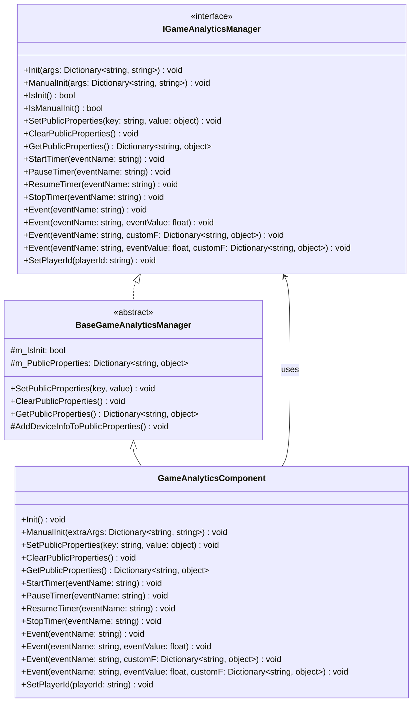
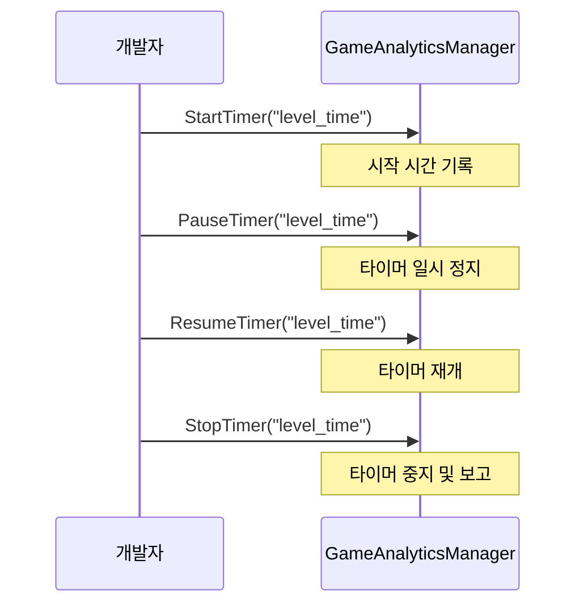

# API 인터페이스

이 문서는 GameAnalytics 플러그인이 제공하는 모든 프로그래밍 인터페이스를 상세히 소개하며, 인터페이스 정의, 매개변수 설명 및 사용 방식을 포함합니다.

## 개요

GameAnalytics 플러그인은 완전한 게임 데이터 분석 기능 인터페이스를 제공하며, `IGameAnalyticsManager` 인터페이스를 통해 표준화된 분석 메서드를 정의합니다. 플러그인은 모듈화 설계를 채택하여 다중 provider 확장을 지원하며, 개발자는 `GameAnalyticsComponent` 컴포넌트를 통해 또는 `IGameAnalyticsManager` 인터페이스를 직접 호출하여 기능을 사용할 수 있습니다.

> 네임스페이스: `GameFrameX.GameAnalytics.Runtime`

## 아키텍처



### 컴포넌트 계층 설명

| 계층 | 컴포넌트 | 설명 |
|------|------|------|
| 인터페이스 레이어 | `IGameAnalyticsManager` | 모든 데이터 분석 기능의 추상 인터페이스 정의 |
| 기본 클래스 레이어 | `BaseGameAnalyticsManager` | 공통 로직 및 장치 정보 수집 구현 |
| 컴포넌트 레이어 | `GameAnalyticsComponent` | Unity 컴포넌트로, 개발자에게 노출되는 진입점 |

## 초기화 인터페이스

### `Init(args: Dictionary<string, string>): void`

자동 초기화 메서드로, 컴포넌트 활성화 시 자동으로 호출되어 게임 데이터 분석 서비스를 구성합니다.

**매개변수:**
- `args` (Dictionary<string, string>): 초기화 매개변수 키-값 쌍으로, 서비스 구성 정보 포함

**예시:**
```csharp
var args = new Dictionary<string, string>
{
    { "AppId", "your_app_id" },
    { "ChannelId", "your_channel_id" }
};
gameAnalyticsManager.Init(args);
```
> Source: [IGameAnalyticsManager.cs](https://github.com/GameFrameX/com.gameframex.unity.gameanalytics/blob/main/Runtime/GameAnalytics/IGameAnalyticsManager.cs#L10-L13)

---

### `ManualInit(args: Dictionary<string, string>): void`

수동 초기화 메서드로, 개발자가 특정 타이밍에 초기화 프로세스를 수동으로トリ거할 수 있도록 합니다.

**매개변수:**
- `args` (Dictionary<string, string>): 초기화 매개변수 키-값 쌍

**설계 의도:**
이 메서드는 지연 초기화 또는 특정 조건에 따라 초기화를トリ거해야 하는 시나리오에 적합하며, 더 유연한 제어 방식을 제공합니다.

> Source: [IGameAnalyticsManager.cs](https://github.com/GameFrameX/com.gameframex.unity.gameanalytics/blob/main/Runtime/GameAnalytics/IGameAnalyticsManager.cs#L15-L18)

---

### `IsInit(): bool`

컴포넌트가 초기화되었는지 확인합니다.

**반환:**
- `bool`: 초기화 완료 시 true, 그렇지 않으면 false 반환

**예시:**
```csharp
if (gameAnalyticsManager.IsInit())
{
    gameAnalyticsManager.Event("level_complete");
}
```
> Source: [IGameAnalyticsManager.cs](https://github.com/GameFrameX/com.gameframex.unity.gameanalytics/blob/main/Runtime/GameAnalytics/IGameAnalyticsManager.cs#L20-L23)

---

### `IsManualInit(): bool`

컴포넌트가 수동 초기화 모드로 구성되었는지 확인합니다.

**반환:**
- `bool`: 수동 초기화 사용 시 true, 그렇지 않으면 false 반환

> Source: [IGameAnalyticsManager.cs](https://github.com/GameFrameX/com.gameframex.unity.gameanalytics/blob/main/Runtime/GameAnalytics/IGameAnalyticsManager.cs#L25-L28)

## 공통 속성 인터페이스

공통 속성은 모든 이벤트와 함께 자동 보고되는 일반 데이터로, 반복 데이터 전송을 줄입니다.

### `SetPublicProperties(key: string, value: object): void`

공통 속성을 설정하며, 이 속성은 모든 후속 보고 이벤트에 자동으로 첨부됩니다.

**매개변수:**
- `key` (string): 속성 키명, 비어 있을 수 없음
- `value` (object): 속성 값

**예시:**
```csharp
gameAnalyticsManager.SetPublicProperties("player_level", 10);
gameAnalyticsManager.SetPlayerId("player_123");
```
> Source: [IGameAnalyticsManager.cs](https://github.com/GameFrameX/com.gameframex.unity.gameanalytics/blob/main/Runtime/GameAnalytics/IGameAnalyticsManager.cs#L30-L35)

---

### `ClearPublicProperties(): void`

모든 공통 속성을 지웁니다. 지운 후 자동으로 장치 정보가 다시 추가됩니다.

> Source: [IGameAnalyticsManager.cs](https://github.com/GameFrameX/com.gameframex.unity.gameanalytics/blob/main/Runtime/GameAnalytics/IGameAnalyticsManager.cs#L37-L40)

---

### `GetPublicProperties(): Dictionary<string, object>`

현재 모든 공통 속성의 복사본을 가져옵니다.

**반환:**
- `Dictionary<string, object>`: 모든 공통 속성을 포함하는 사전

**예시:**
```csharp
var properties = gameAnalyticsManager.GetPublicProperties();
foreach (var prop in properties)
{
    Debug.Log($"{prop.Key}: {prop.Value}");
}
```
> Source: [IGameAnalyticsManager.cs](https://github.com/GameFrameX/com.gameframex.unity.gameanalytics/blob/main/Runtime/GameAnalytics/IGameAnalyticsManager.cs#L42-L46)

### 장치 정보 자동 수집

`BaseGameAnalyticsManager`는 다음 장치 정보를 공통 속성으로 자동 수집합니다:

| 속성 키 | 설명 | 데이터 출처 |
|--------|------|----------|
| device_id | 장치 고유 식별자 | SystemInfo.deviceUniqueIdentifier |
| device_model | 장치 모델 | SystemInfo.deviceModel |
| device_type | 장치 유형 | SystemInfo.deviceType |
| os | 운영 체제 | SystemInfo.operatingSystem |
| app_version | 앱 버전 | Application.version |
| unity_version | Unity 버전 | Application.unityVersion |
| platform | 실행 플랫폼 | Application.platform |
| processor_type | 프로세서 유형 | SystemInfo.processorType |
| processor_count | 프로세서 코어 수 | SystemInfo.processorCount |
| system_memory_size | 시스템 메모리 크기 | SystemInfo.systemMemorySize |
| graphics_device_name | 그래픽 장치 이름 | SystemInfo.graphicsDeviceName |
| graphics_memory_size | 비디오 메모리 크기 | SystemInfo.graphicsMemorySize |
| screen_width | 화면 너비 | Screen.width |
| screen_height | 화면 높이 | Screen.height |
| screen_dpi | 화면 DPI | Screen.dpi |
| network_type | 네트워크 유형 | Application.internetReachability |
| system_language | 시스템 언어 | Application.systemLanguage |
> Source: [BaseGameAnalyticsManager.cs](https://github.com/GameFrameX/com.gameframex.unity.gameanalytics/blob/main/Runtime/GameAnalytics/BaseGameAnalyticsManager.cs#L85-L143)

## 타이머 인터페이스

타이머 기능은 게임 내 특정 작업에 소요된 시간을 측정하는 데 사용되며, 레벨 통과 시간, 로딩 시간 등에 적합합니다.

### `StartTimer(eventName: string): void`

타이머를 시작하여 지정된 이벤트에 타이머를 시작합니다.

**매개변수:**
- `eventName` (string): 타이머를 식별하는 이벤트 이름, 비어 있을 수 없음

**예시:**
```csharp
// 플레이어가 새 레벨에 진입할 때 타이머 시작
gameAnalyticsManager.StartTimer("level_loading_time");
```
> Source: [IGameAnalyticsManager.cs](https://github.com/GameFrameX/com.gameframex.unity.gameanalytics/blob/main/Runtime/GameAnalytics/IGameAnalyticsManager.cs#L48-L52)

---

### `PauseTimer(eventName: string): void`

지정된 이벤트의 타이머를 일시 정지합니다.

**매개변수:**
- `eventName` (string): 일시 정지할 타이머의 이벤트 이름

> Source: [IGameAnalyticsManager.cs](https://github.com/GameFrameX/com.gameframex.unity.gameanalytics/blob/main/Runtime/GameAnalytics/IGameAnalyticsManager.cs#L54-L58)

---

### `ResumeTimer(eventName: string): void`

지정된 이벤트의 타이머를 재개합니다.

**매개변수:**
- `eventName` (string): 재개할 타이머의 이벤트 이름

> Source: [IGameAnalyticsManager.cs](https://github.com/GameFrameX/com.gameframex.unity.gameanalytics/blob/main/Runtime/GameAnalytics/IGameAnalyticsManager.cs#L60-L64)

---

### `StopTimer(eventName: string): void`

지정된 이벤트의 타이머를 중지하고 타이머 결과를 보고합니다.

**매개변수:**
- `eventName` (string): 중지할 타이머의 이벤트 이름

**예시:**
```csharp
// 레벨 로딩 완료 후 타이머 중지 및 보고
gameAnalyticsManager.StopTimer("level_loading_time");
```
> Source: [IGameAnalyticsManager.cs](https://github.com/GameFrameX/com.gameframex.unity.gameanalytics/blob/main/Runtime/GameAnalytics/IGameAnalyticsManager.cs#L66-L70)

### 타이머 사용 흐름



## 이벤트 보고 인터페이스

이벤트 보고는 게임 데이터 분석의 핵심 기능으로, 플레이어 행동 데이터를 수집하는 데 사용됩니다.

### `Event(eventName: string): void`

단순 이벤트를 보고하며, 이벤트 이름만 포함하고 데이터는携带하지 않습니다.

**매개변수:**
- `eventName` (string): 이벤트 이름, 비어 있을 수 없음

**예시:**
```csharp
// 플레이어 튜토리얼 완료
gameAnalyticsManager.Event("tutorial_complete");

// 플레이어 설정界面 열기
gameAnalyticsManager.Event("open_settings");
```
> Source: [IGameAnalyticsManager.cs](https://github.com/GameFrameX/com.gameframex.unity.gameanalytics/blob/main/Runtime/GameAnalytics/IGameAnalyticsManager.cs#L72-L76)

---

### `Event(eventName: string, eventValue: float): void`

수치를 포함한 이벤트를 보고하며, 수치 시나리오 통계에 사용됩니다.

**매개변수:**
- `eventName` (string): 이벤트 이름
- `eventValue` (float): 이벤트 수치

**예시:**
```csharp
// 점수 보고
gameAnalyticsManager.Event("score", 1500.5f);

// 코인 획득 수 보고
gameAnalyticsManager.Event("coins_earned", 100f);
```
> Source: [IGameAnalyticsManager.cs](https://github.com/GameFrameX/com.gameframex.unity.gameanalytics/blob/main/Runtime/GameAnalytics/IGameAnalyticsManager.cs#L78-L83)

---

### `Event(eventName: string, customF: Dictionary<string, object>): void`

사용자 정의 필드를 포함한 이벤트를 보고하며, 풍부한 컨텍스트 정보를 기록하는 데 사용됩니다.

**매개변수:**
- `eventName` (string): 이벤트 이름
- `customF` (Dictionary<string, object>): 사용자 정의 필드 사전

**예시:**
```csharp
// 사용자 정의 필드를 포함한 레벨 완료 이벤트 보고
var customFields = new Dictionary<string, object>
{
    { "level_id", 5 },
    { "difficulty", "hard" },
    { "stars_earned", 3 },
    { "time_taken", 120.5 }
};
gameAnalyticsManager.Event("level_complete", customFields);
```
> Source: [IGameAnalyticsManager.cs](https://github.com/GameFrameX/com.gameframex.unity.gameanalytics/blob/main/Runtime/GameAnalytics/IGameAnalyticsManager.cs#L85-L90)

---

### `Event(eventName: string, eventValue: float, customF: Dictionary<string, object>): void`

수치와 사용자 정의 필드를 동시에 포함한 이벤트를 보고하며, 수치와 컨텍스트를 동시에 기록해야 하는 시나리오에 적합합니다.

**매개변수:**
- `eventName` (string): 이벤트 이름
- `eventValue` (float): 이벤트 수치
- `customF` (Dictionary<string, object>): 사용자 정의 필드 사전

**예시:**
```csharp
// 유료 구매 이벤트 보고
var purchaseData = new Dictionary<string, object>
{
    { "item_id", "gem_pack_100" },
    { "payment_method", "alipay" },
    { "region", "CN" }
};
gameAnalyticsManager.Event("purchase", 9.99f, purchaseData);
```
> Source: [IGameAnalyticsManager.cs](https://github.com/GameFrameX/com.gameframex.unity.gameanalytics/blob/main/Runtime/GameAnalytics/IGameAnalyticsManager.cs#L92-L98)

### 이벤트 보고 유형 선택

```mermaid
flowchart TD
    A[이벤트 보고 필요?] --> B{데이터 첨부 필요?}
    B -->|아니오| C[Event(eventName)]
    B -->|예| D{데이터 유형?}
    D -->|수치만| E[Event(eventName, eventValue)]
    D -->|사용자 정의 필드만| F[Event(eventName, customF)]
    D -->|수치+사용자 정의 필드| G[Event(eventName, eventValue, customF)]

    C --> H[보고 완료]
    E --> H
    F --> H
    G --> H
```

## 플레이어 식별 인터페이스

### `SetPlayerId(playerId: string): void`

현재 플레이어의 고유 식별자를 설정하여, 플레이어 행동 데이터를 연결하는 데 사용됩니다.

**매개변수:**
- `playerId` (string): 플레이어 고유 식별자

**예시:**
```csharp
// 플레이어 로그인 후 플레이어 ID 설정
gameAnalyticsManager.SetPlayerId("player_882347");
```
> Source: [IGameAnalyticsManager.cs](https://github.com/GameFrameX/com.gameframex.unity.gameanalytics/blob/main/Runtime/GameAnalytics/IGameAnalyticsManager.cs#L100-L104)

## 완전한 사용 예시

다음 예시는 전형적인 게임 분석 통합 흐름을 보여줍니다:

```csharp
using GameFrameX.GameAnalytics.Runtime;
using UnityEngine;

public class GameAnalyticsExample : MonoBehaviour
{
    private IGameAnalyticsManager _gameAnalyticsManager;

    private void Start()
    {
        // Unity 컴포넌트를 통해 관리자 가져오기
        var component = GetComponent<GameAnalyticsComponent>();

        // 플레이어 ID 설정
        component.SetPlayerId("player_882347");

        // 공통 속성 설정
        component.SetPublicProperties("server_id", "server_01");
        component.SetPublicProperties("game_mode", "PvP");
    }

    private void OnLevelStart(int levelId)
    {
        // 레벨 타이머 시작
        GetComponent<GameAnalyticsComponent>().StartTimer($"level_{levelId}");

        // 레벨 시작 이벤트 보고
        GetComponent<GameAnalyticsComponent>().Event("level_start", new Dictionary<string, object>
        {
            { "level_id", levelId },
            { "difficulty", "normal" }
        });
    }

    private void OnLevelComplete(int levelId, float timeTaken, int stars)
    {
        // 레벨 타이머 중지
        GetComponent<GameAnalyticsComponent>().StopTimer($"level_{levelId}");

        // 수치와 사용자 정의 필드를 포함한 레벨 완료 이벤트 보고
        GetComponent<GameAnalyticsComponent>().Event("level_complete", timeTaken, new Dictionary<string, object>
        {
            { "level_id", levelId },
            { "stars", stars },
            { "time_taken", timeTaken }
        });
    }

    private void OnPurchase(string itemId, float price)
    {
        // 유료 이벤트 보고
        GetComponent<GameAnalyticsComponent>().Event("purchase", price, new Dictionary<string, object>
        {
            { "item_id", itemId },
            { "currency", "USD" }
        });
    }
}
```
> Source: [GameAnalyticsComponent.cs](https://github.com/GameFrameX/com.gameframex.unity.gameanalytics/blob/main/Runtime/GameAnalytics/GameAnalyticsComponent.cs#L36-L42)

## Unity 컴포넌트 인터페이스

`GameAnalyticsComponent`는 Unity 컴포넌트로, `IGameAnalyticsManager` 인터페이스와 동일한 메서드를 제공하여 Unity 씬에서 직접 사용할 수 있습니다.

### 컴포넌트 메서드 목록

| 메서드 | 설명 |
|------|------|
| `Init()` | 컴포넌트 초기화 |
| `ManualInit(extraArgs)` | 수동 초기화 |
| `SetPlayerId(playerId)` | 플레이어 ID 설정 |
| `SetPublicProperties(key, value)` | 공통 속성 설정 |
| `ClearPublicProperties()` | 공통 속성 지우기 |
| `GetPublicProperties()` | 공통 속성 가져오기 |
| `StartTimer(eventName)` | 타이머 시작 |
| `PauseTimer(eventName)` | 타이머 일시 정지 |
| `ResumeTimer(eventName)` | 타이머 재개 |
| `StopTimer(eventName)` | 타이머 중지 |
| `Event(eventName)` | 단순 이벤트 보고 |
| `Event(eventName, eventValue)` | 수치 이벤트 보고 |
| `Event(eventName, customF)` | 사용자 정의 필드 이벤트 보고 |
| `Event(eventName, eventValue, customF)` | 완전한 이벤트 보고 |

> Source: [GameAnalyticsComponent.cs](https://github.com/GameFrameX/com.gameframex.unity.gameanalytics/blob/main/Runtime/GameAnalytics/GameAnalyticsComponent.cs#L27-L358)

## 관련 링크

- [핵심 아키텍처](./04.features.md) - 플러그인의 전체 아키텍처 설계 알아보기
- [빠른 시작](./03.getting-started.md) - 플러그인 빠르게 통합하기
- [에디터 구성](./05.configuration.md) - GameAnalytics 컴포넌트 구성
- [문제 해결](./07.troubleshooting.md) - 일반 문제와 해결책