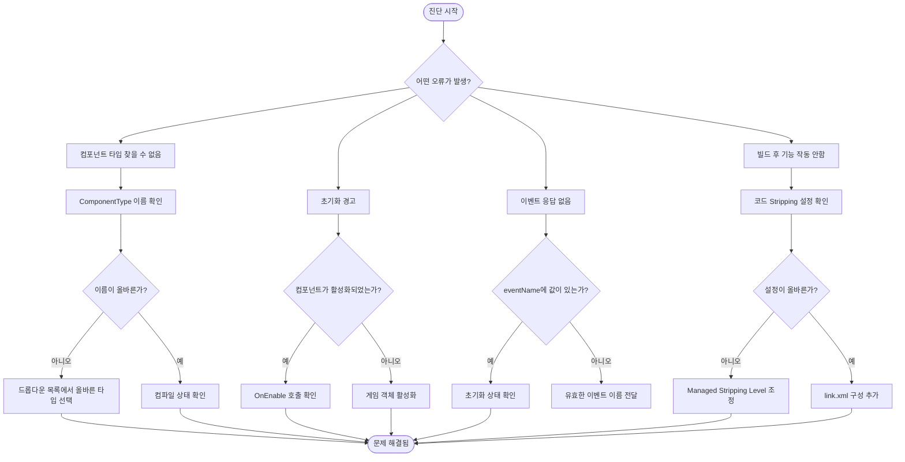

# 문제 해결

이 문서는 GameFrameX GameAnalytics 플러그인의 일반적인 문제 해결 가이드를 제공하여, 개발자가 통합 과정에서 겪는 문제를 빠르게 위치 지정하고 해결할 수 있도록 도와줍니다.

## 개요

GameAnalytics 컴포넌트는 Unity 프로젝트에서 여러 구성 및 런타임 문제를 직면할 수 있습니다. 이 문서는 설치 구성부터 런타임 오류까지 다양한 일반적인 문제를 다루며,詳細な 진단 단계와 해결책을 제공합니다.

## 일반 문제와 해결책

### 1. 컴포넌트 타입 찾을 수 없음

**오류 정보:**
```
Can not find component type 'XXX'.
```

**문제 원인:**
- Inspector 패널에서 구성된 컴포넌트 타입 이름의 철자가 잘못됨
- 지정된 분석 서비스 구현 클래스가 존재하지 않거나 올바르게 참조되지 않음
- 네임스페이스 불일치

**해결책:**

1. Unity 에디터를 엽니다
2. `GameAnalyticsComponent`가 붙은 게임 객체를 씬에서 선택합니다
3. Inspector 패널에서 **ComponentType** 드롭다운 메뉴를 확인합니다
4. 드롭다운 목록에서 올바른 분석 서비스 구현 타입을 선택합니다 (수동으로 입력하지 마세요)
5. 분석 서비스 구현 클래스가 올바르게 컴파일되었으며语法 오류가 없는지 확인합니다

> Source: [GameAnalyticsComponent.cs](https://github.com/GameFrameX/com.gameframex.unity.gameanalytics/blob/main/Runtime/GameAnalytics/GameAnalyticsComponent.cs#L58-L63)

### 2. 초기화 관련 경고

**경고 정보:**
```
GameAnalyticsManager is not init.
```

**문제 원인:**
- 분석 관리자 초기화 완료 전에 이벤트 보고 또는 타이머 메서드를 호출함
- `GameAnalyticsComponent`의 `Init()` 메서드가 아직 실행되지 않음

**해결책:**

GameAnalyticsComponent는 `OnEnable()` 시 자동으로 초기화됩니다. 이 경고가 표시되면 다음을 확인하세요:

1. `GameAnalyticsComponent`가 씬의 게임 객체에 올바르게 붙어 있는지 확인합니다
2. 게임 객체의 `OnEnable()`이 Unity 엔진에 의해 호출되었는지 확인합니다 (게임 객체가 비활성 상태일 수 있음)
3. 수동 초기화가 필요한 경우, `ManualInit()` 메서드 호출 전 자동 초기화가 완료되었는지 확인합니다

```csharp
// 올바른 방법: 컴포넌트가 활성화되었는지 확인
var analytics = gameObject.GetComponent<GameAnalyticsComponent>();
// 컴포넌트는 OnEnable 시 자동으로 초기화됨
```

> Source: [GameAnalyticsComponent.cs](https://github.com/GameFrameX/com.gameframex.unity.gameanalytics/blob/main/Runtime/GameAnalytics/GameAnalyticsComponent.cs#L170-L177)

### 3. 중복 컴포넌트 경고

**문제 설명:**
Unity가 여러 GameAnalyticsComponent를 추가할 수 없음을 알림

**문제 원인:**
- 씬에 이미 `GameAnalyticsComponent`가 존재하여, 다시 추가할 때 `[DisallowMultipleComponent]` 속성이トリ거됨

**해결책:**

1. 씬에 GameAnalytics 컴포넌트가 이미 존재하는지 확인합니다
2. 여러 구성方案이 필요한 경우, 컴포넌트 목록 기능(Inspector 패널의 `게임 데이터 분석 컴포넌트 목록`)을 사용합니다
3. 중복된 컴포넌트 인스턴스를 삭제합니다

```csharp
// 컴포넌트가 이미 존재하는지 확인
var existing = FindObjectsOfType<GameAnalyticsComponent>();
if (existing.Length > 0)
{
    // 기존 컴포넌트를 사용하고, 다시 추가하지 않음
}
```

> Source: [GameAnalyticsComponent.cs](https://github.com/GameFrameX/com.gameframex.unity.gameanalytics/blob/main/Runtime/GameAnalytics/GameAnalyticsComponent.cs#L12)

### 4. 코드가 Strip으로 인해 발생하는 문제

**문제 설명:**
- IL2CPP 프로젝트 빌드 후 분석 서비스 기능이 작동하지 않음
- 런타임에 특정 타입을 찾을 수 없음 오류 발생

**문제 원인:**
Unity의 코드 stripping 메커니즘이 직접 참조되지 않은 클래스를 제거할 수 있음

**해결책:**

플러그인에는 코드 제거를 방지하는 `GameFrameXGameAnalyticsCroppingHelper`가 포함되어 있습니다. 여전히 문제가 있으면:

1. `Project Settings > Player > Other Settings`를 엽니다
2. **Managed Stripping Level**을 **Minimal**로 설정합니다
3. 또는 `link.xml` 파일에 다음 구성을 추가합니다:

```xml
<linker>
    <assembly fullname="GameFrameX.GameAnalytics.Runtime" preserve="all"/>
</linker>
```

> Source: [GameFrameXGameAnalyticsCroppingHelper.cs](https://github.com/GameFrameX/com.gameframex.unity.gameanalytics/blob/main/Runtime/GameFrameXGameAnalyticsCroppingHelper.cs#L1-L17)

### 5. 매개변수 검증 오류

**오류 정보:**
- 빈 이벤트 이름 전달 시 메서드가 응답하지 않음

**문제 원인:**
- 이벤트 이름 매개변수가 빈 문자열이거나 null일 수 없음

**해결책:**

모든 이벤트 메서드와 타이머 메서드는 `GameFrameworkGuard.NotNullOrEmpty`를 사용하여 매개변수 검증을 수행합니다. 유효한 이벤트 이름을 전달해야 합니다:

```csharp
// ❌ 잘못된 예시
analytics.Event("");
analytics.StartTimer(null);

// ✅ 올바른 예시
analytics.Event("player_login");
analytics.StartTimer("level_loading");
```

> Source: [GameAnalyticsComponent.cs](https://github.com/GameFrameX/com.gameframex.unity.gameanalytics/blob/main/Runtime/GameAnalytics/GameAnalyticsComponent.cs#L160-L166)

### 6. 에디터 구성 문제

**문제 설명:**
- Inspector 패널에서 컴포넌트 타입을 선택할 수 없음
- 구성 매개변수가 표시되지 않음

**해결책:**

1. Unity가 모든 스크립트를 컴파일 완료했는지 확인합니다 (컴파일 오류 없음)
2. Editor 폴더의 Inspector 코드가 올바르게 작동하는지 확인합니다
3. 타입 목록 새로고침: Inspector 패널을 닫고 다시 엽니다
4. `GameAnalyticsComponentProvider` 클래스가 올바르게 직렬화되었는지 확인합니다

> Source: [GameAnalyticsComponentInspector.cs](https://github.com/GameFrameX/com.gameframex.unity.gameanalytics/blob/main/Editor/Inspector/GameAnalyticsComponentInspector.cs#L42-L50)

## 진단 흐름



## 디버깅 팁

### 디버그 로그 활성화

Unity 콘솔에서 다음 로그 카테고리를 확인합니다:

- **Error**: 컴포넌트 타입 찾을 수 없음 등 심각한 오류
- **Warning**: 초기화 미완료 등 경고 정보

### 초기화 상태 확인

```csharp
var analytics = gameObject.GetComponent<GameAnalyticsComponent>();
// 초기화 상태 확인
if (analytics.GetType().GetProperty("IsInit")?.GetValue(analytics) is bool isInit)
{
    Debug.Log($"Analytics initialized: {isInit}");
}
```

### 공통 속성 확인

컴포넌트는 자동으로 장치 정보를 수집합니다. 런타임에 이러한 속성이 올바르게 설정되었는지 확인할 수 있습니다:

```csharp
// 공통 속성 가져오기
var properties = analytics.GetPublicProperties();
foreach (var prop in properties)
{
    Debug.Log($"{prop.Key}: {prop.Value}");
}
```

> Source: [BaseGameAnalyticsManager.cs](https://github.com/GameFrameX/com.gameframex.unity.gameanalytics/blob/main/Runtime/GameAnalytics/BaseGameAnalyticsManager.cs#L88-L144)

## 관련 링크

- [빠른 시작](./03.getting-started.md) - 빠르게 통합하는 방법 알아보기
- [핵심 아키텍처](./04.features.md) - 컴포넌트 아키텍처 자세히 알아보기
- [API 인터페이스](./06.api-reference.md) - 완전한 API 참조 문서
- [에디터 구성](./05.configuration.md) - 에디터에서 컴포넌트 구성 방법 알아보기
- [플러그인 소개](./01.overview.md) - 플러그인 개요 및 기능 소개