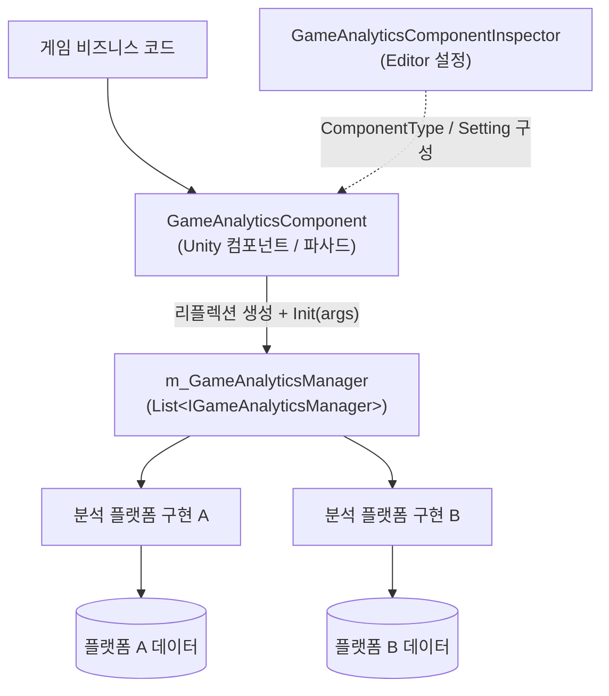

# 게임 데이터 분석 컴포넌트 소개

GameAnalytics 게임 데이터 분석 컴포넌트는 Unity 프로젝트에 통합된 게임 데이터 분석 전송 진입점을 제공합니다: Inspector에 `GameAnalyticsComponent`를 부착하고 데이터 분석 Provider를 구성하기만 하면, 동일한 API 세트로 이벤트를 전송하고, 타이머를 관리하며, 데이터를 여러 서드파티 분석 플랫폼에 동시에 보낼 수 있습니다. 컴포넌트는 외부 의존성이 전혀 없으며, Unity 2019.4 이상 버전을 지원합니다(현재 패키지 버전 1.2.1).

## 빠른 시작

### 1. 패키지 설치

아래 방법 중 하나를 선택하세요:

**방법 1: scopedRegistries(권장)** —— Unity 프로젝트의 `Packages/manifest.json`을 편집합니다:

```json
{
  "scopedRegistries": [
    {
      "name": "GameFrameX",
      "url": "https://gameframex.upm.alianblank.uk",
      "scopes": [
        "com.gameframex"
      ]
    }
  ],
  "dependencies": {
    "com.gameframex.unity.gameanalytics": "1.2.0"
  }
}
```

`scopes`는 이 레지스트리를 통해 어떤 패키지가 해석되는지 제어하며, `com.gameframex`로 시작하는 패키지만 이 레지스트리에서 가져옵니다.

Source: [README.zh-CN.md](https://github.com/GameFrameX/com.gameframex.unity.gameanalytics/blob/main/README.zh-CN.md#L34-L52)

**방법 2: Git URL** —— `manifest.json`의 `dependencies` 노드 아래에 추가합니다:

```json
{
   "com.gameframex.unity.gameanalytics": "https://github.com/gameframex/com.gameframex.unity.gameanalytics.git"
}
```

Unity의 `Package Manager`에서 `Git URL` 방식으로 추가할 수도 있으며, 주소는 `https://github.com/gameframex/com.gameframex.unity.gameanalytics.git`입니다. 또는 저장소를 Unity 프로젝트의 `Packages` 디렉터리에 직접 다운로드하면 자동으로 로드됩니다.

Source: [README.zh-CN.md](https://github.com/GameFrameX/com.gameframex.unity.gameanalytics/blob/main/README.zh-CN.md#L54-L61)

### 2. 컴포넌트 부착 및 Provider 구성

씬에 `Game Framework/GameAnalytics` 컴포넌트(`GameAnalyticsComponent`)를 생성합니다. 컴포넌트는 `Awake`에서 Provider를 수집하고, `OnEnable` 시점에 자동으로 `Init()`을 호출합니다: Inspector에 구성된 `ComponentType`에 따라 리플렉션으로 `IGameAnalyticsManager`를 구현한 인스턴스를 생성하고, 각 Provider의 `Setting` 키-값 쌍을 초기화 매개변수로 전달합니다.

```csharp
public void Init()
{
    if (m_IsInit)
    {
        return;
    }

    foreach (var gameAnalyticsComponentProvider in m_gameAnalyticsComponentProviders)
    {
        if (gameAnalyticsComponentProvider.ComponentType.IsNotNullOrWhiteSpace())
        {
            var gameAnalyticsComponentType = Utility.Assembly.GetType(gameAnalyticsComponentProvider.ComponentType);
            if (gameAnalyticsComponentType == null)
            {
                Log.Error($"Can not find component type '{gameAnalyticsComponentProvider.ComponentType}'.");
                continue;
            }

            if (Activator.CreateInstance(gameAnalyticsComponentType) is IGameAnalyticsManager gameAnalyticsManager)
            {
                Dictionary<string, string> args = new Dictionary<string, string>();
                foreach (var param in gameAnalyticsComponentProvider.Setting)
                {
                    args[param.Key] = param.Value;
                }

                gameAnalyticsManager.Init(args);
                m_GameAnalyticsManager.Add(gameAnalyticsManager);
            }
        }
    }

    m_IsInit = true;
}
```

Source: [GameAnalyticsComponent.cs](https://github.com/GameFrameX/com.gameframex.unity.gameanalytics/blob/main/Runtime/GameAnalytics/GameAnalyticsComponent.cs#L47-L80)

### 3. 첫 번째 이벤트 전송

초기화가 완료되면 이벤트 전송 및 타이머 API를 호출할 수 있습니다:

```csharp
// 간단한 이벤트 전송
public void Event(string eventName)
{
    if (!_isInit) return;
    _gameAnalyticsManager.Event(eventName);
}

// 값이 포함된 이벤트 전송
public void Event(string eventName, float eventValue)
{
    if (!_isInit) return;
    _gameAnalyticsManager.Event(eventName, eventValue);
}

// 타이머 시작 / 종료
public void StartTimer(string eventName)
{
    if (!_isInit) return;
    _gameAnalyticsManager.StartTimer(eventName);
}

public void StopTimer(string eventName)
{
    if (!_isInit) return;
    _gameAnalyticsManager.StopTimer(eventName);
}
```

Source: [README.zh-CN.md](https://github.com/GameFrameX/com.gameframex.unity.gameanalytics/blob/main/README.zh-CN.md#L76-L118)

참고: 컴포넌트의 어떤 메서드를 사용하기 전에 컴포넌트가 올바르게 초기화되었는지 확인하세요. 데이터 분석의 정확성을 보장하려면 전송하는 이벤트 이름이 대표성과 고유성을 갖추어야 합니다.

## 작동 원리 개요

컴포넌트는 "파사드(Facade) + 다중 Provider" 구조를 사용합니다: `GameAnalyticsComponent`는 외부에서 접근하는 유일한 진입점이며(`GameFrameworkComponent` 상속), 0개 이상의 `IGameAnalyticsManager`를 구현한 관리자 인스턴스를 보유하고, 모든 공개 메서드는 목록을 순회하며 구성된 각 분석 플랫폼에 브로드캐스트하므로 한 번의 호출로 여러 플랫폼에 동시에 전송할 수 있습니다.



각 타입의 역할은 다음과 같습니다:

| 타입 | 설명 |
|------|------|
| `GameAnalyticsComponent` | Unity 컴포넌트 파사드, `Awake`에서 Provider 수집, `OnEnable`에서 자동 `Init()`, 모든 메서드를 전체 Manager에 브로드캐스트 |
| `IGameAnalyticsManager` | 데이터 분석 관리자 인터페이스, 초기화, 공용 속성, 타이머, 이벤트 전송, 플레이어 ID 등의 API 정의 |
| `BaseGameAnalyticsManager` | 관리자 기본 클래스, 구체적인 플랫폼 구현이 상속하여 재사용 |
| `GameAnalyticsComponentInspector` | Editor 확장, Inspector에서 Provider와 Setting을 시각적으로 구성하는 데 사용 |
| `GameFrameXGameAnalyticsCroppingHelper` | 크로핑(모듈 제거) 헬퍼 클래스 |

`IGameAnalyticsManager`가 제공하는 핵심 API 개요(전체 시그니처는 인터페이스 파일 참조):

| 메서드 | 시그니처 | 설명 |
|------|------|------|
| 자동 초기화 | `void Init(Dictionary<string, string> args)` | 컴포넌트 활성화 시 자동 호출 |
| 수동 초기화 | `void ManualInit(Dictionary<string, string> args)` | `IsManualInit()`가 참일 때만 컴포넌트가 전달 |
| 공용 속성 설정 | `void SetPublicProperties(string key, object value)` | 모든 이벤트에 첨부되는 공용 필드 |
| 공용 속성 제거/조회 | `void ClearPublicProperties()` / `Dictionary<string, object> GetPublicProperties()` | 공용 속성을 비우거나 읽음 |
| 타이머 | `StartTimer` / `PauseTimer` / `ResumeTimer` / `StopTimer(string eventName)` | 이벤트 소요 시간의 시작/일시정지/재개/종료 |
| 이벤트 전송 | `Event(string eventName)` 및 `float` / `Dictionary<string, object>`를 포함한 오버로드 | 총 4개의 오버로드 |
| 플레이어 ID 설정 | `void SetPlayerId(string playerId)` | 현재 플레이어 식별 |

Source: [IGameAnalyticsManager.cs](https://github.com/GameFrameX/com.gameframex.unity.gameanalytics/blob/main/Runtime/GameAnalytics/IGameAnalyticsManager.cs#L8-L105)

## 다음 단계

- 이벤트 전송과 타이머의 구체적인 사용법은 《이벤트 전송 및 타이머 기능》 태스크 페이지를 참조하세요
- Inspector에서 데이터 분석 Provider와 Setting을 구성하는 방법은 《데이터 분석 Provider 구성》 태스크 페이지를 참조하세요
- 초기화 실패, `Can not find component type` 오류 등의 문제 해결은 《초기화 및 전송 실패 해결》 트러블슈팅 페이지를 참조하세요
- 버전 변경 이력은 저장소의 [CHANGELOG.md](https://github.com/GameFrameX/com.gameframex.unity.gameanalytics/blob/main/CHANGELOG.md)를 참조하세요