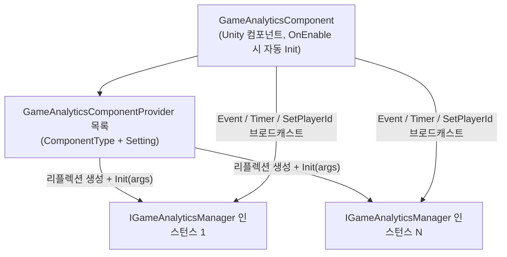

# 설치 및 빠른 시작

GameAnalytics 게임 데이터 분석 컴포넌트는 Unity 프로젝트에 이벤트 전송 및 타이머 기능의 통합 인터페이스를 제공합니다: 패키지를 설치하고 씬에 `GameAnalyticsComponent`를 부착하여 Provider를 구성하면, 한 줄의 `Event(...)`만으로 원하는 데이터 분석 SDK에 데이터를 전송할 수 있습니다. 이 페이지에서는 설치부터 첫 번째 전송까지의 과정을 안내합니다.

## 사전 조건

- Unity `2019.4` 이상 버전([package.json](https://github.com/GameFrameX/com.gameframex.unity.gameanalytics/blob/main/package.json#L7)의 `"unity": "2019.4"` 참조).
- 프로젝트에 GameFrameX 프레임워크 기본 컴포넌트가 이미 설치되어 있어야 합니다: `GameAnalyticsComponent` 컴포넌트는 `GameFrameworkComponent`를 상속하며, `GameFrameX.Runtime` 네임스페이스의 `Utility.Assembly`, `Log` 등의 인프라를 사용합니다([GameAnalyticsComponent.cs](https://github.com/GameFrameX/com.gameframex.unity.gameanalytics/blob/main/Runtime/GameAnalytics/GameAnalyticsComponent.cs#L1-L14) 참조).
- 본 패키지 자체는 `package.json`에 `"dependencies": {}`로 선언되어 있어 추가 서드파티 의존성이 없습니다.

## 빠른 시작

### 1단계: 패키지 설치

아래 방법 중 하나를 선택하세요(현재 저장소 버전은 `1.2.1`이며, README 예시에 작성된 `1.2.0`은 이전 버전 번호입니다):

1. Unity 프로젝트의 `Packages/manifest.json`을 편집하여 `scopedRegistries` 섹션을 추가합니다:

```json
{
  "scopedRegistries": [
    {
      "name": "GameFrameX",
      "url": "https://gameframex.upm.alianblank.uk",
      "scopes": [
        "com.gameframex"
      ]
    }
  ],
  "dependencies": {
    "com.gameframex.unity.gameanalytics": "1.2.0"
  }
}
```

`scopes`는 어떤 패키지가 이 레지스트리를 통해 확인되는지 제어하며, `com.gameframex`로 시작하는 패키지만 이 레지스트리에서 가져올 수 있습니다.

출처: [README.zh-CN.md](https://github.com/GameFrameX/com.gameframex.unity.gameanalytics/blob/main/README.zh-CN.md#L34-L52)

2. `manifest.json`의 `dependencies` 노드에 직접 Git 주소를 추가합니다:

```json
{
   "com.gameframex.unity.gameanalytics": "https://github.com/gameframex/com.gameframex.unity.gameanalytics.git"
}
```

출처: [README.zh-CN.md](https://github.com/GameFrameX/com.gameframex.unity.gameanalytics/blob/main/README.zh-CN.md#L54-L59)

3. Unity의 `Package Manager`에서 `Add package from git URL`을 선택하고 `https://github.com/gameframex/com.gameframex.unity.gameanalytics.git`를 입력합니다.
4. 저장소를 직접 다운로드하여 Unity 프로젝트의 `Packages` 디렉터리에 배치하면 Unity가 자동으로 로드하여 인식합니다.

### 2단계: 컴포넌트 부착

Unity 메뉴에서 `Component → Game Framework → GameAnalytics`를 선택하여 씬에 있는 GameFrameX 컴포넌트 담당 GameObject에 `GameAnalyticsComponent`를 추가합니다. 컴포넌트에 `[DisallowMultipleComponent]`가 지정되어 있어 동일한 GameObject에는 하나만 부착할 수 있습니다.

```csharp
[DisallowMultipleComponent]
[AddComponentMenu("Game Framework/GameAnalytics")]
public sealed class GameAnalyticsComponent : GameFrameworkComponent
```

출처: [GameAnalyticsComponent.cs](https://github.com/GameFrameX/com.gameframex.unity.gameanalytics/blob/main/Runtime/GameAnalytics/GameAnalyticsComponent.cs#L12-L14)

### 3단계: 데이터 분석 Provider 구성

Inspector(커스텀 에디터는 [GameAnalyticsComponentInspector.cs](https://github.com/GameFrameX/com.gameframex.unity.gameanalytics/blob/main/Editor/Inspector/GameAnalyticsComponentInspector.cs) 참조)에서 컴포넌트에 Provider 항목을 추가하고 다음을 입력합니다:

| 필드 | 설명 |
|------|------|
| `ComponentType` | `IGameAnalyticsManager`를 구현하는 타입의 전체 이름(문자열) |
| `Setting` | 해당 SDK에 전달할 키-값 쌍 구성(예: AppKey, SecretKey 등) |

컴포넌트가 활성화되면 `OnEnable()`에서 자동으로 `Init()`을 실행합니다: `ComponentType`에 따라 리플렉션으로 인스턴스를 생성하고, `Setting`을 `Dictionary<string, string>`으로 취합한 후 `gameAnalyticsManager.Init(args)`를 호출하며, 인스턴스를 관리 목록에 추가합니다 — 이후 모든 전송 호출이 등록된 각 Provider로 브로드캐스트됩니다.

```csharp
public void Init()
{
    if (m_IsInit)
    {
        return;
    }

    foreach (var gameAnalyticsComponentProvider in m_gameAnalyticsComponentProviders)
    {
        if (gameAnalyticsComponentProvider.ComponentType.IsNotNullOrWhiteSpace())
        {
            var gameAnalyticsComponentType = Utility.Assembly.GetType(gameAnalyticsComponentProvider.ComponentType);
            if (gameAnalyticsComponentType == null)
            {
                Log.Error($"Can not find component type '{gameAnalyticsComponentProvider.ComponentType}'.");
                continue;
            }

            if (Activator.CreateInstance(gameAnalyticsComponentType) is IGameAnalyticsManager gameAnalyticsManager)
            {
                Dictionary<string, string> args = new Dictionary<string, string>();
                foreach (var param in gameAnalyticsComponentProvider.Setting)
                {
                    args[param.Key] = param.Value;
                }

                gameAnalyticsManager.Init(args);
                m_GameAnalyticsManager.Add(gameAnalyticsManager);
            }
        }
    }

    m_IsInit = true;
}
```

출처: [GameAnalyticsComponent.cs](https://github.com/GameFrameX/com.gameframex.unity.gameanalytics/blob/main/Runtime/GameAnalytics/GameAnalyticsComponent.cs#L47-L80)

### 4단계: 첫 번째 이벤트 및 타이머 전송

초기화는 컴포넌트가 자동으로 수행하므로 비즈니스 코드에서 직접 호출하면 됩니다(네임스페이스 `GameFrameX.GameAnalytics.Runtime`):

```csharp
// 타이머 시작/종료
GameEntry.GameAnalytics.StartTimer("level_1");
GameEntry.GameAnalytics.StopTimer("level_1");

// 간단한 이벤트 전송
GameEntry.GameAnalytics.Event("level_complete");

// 숫자값이 포함된 이벤트 전송
GameEntry.GameAnalytics.Event("coin_gain", 100f);

// 커스텀 필드가 포함된 이벤트 전송
GameEntry.GameAnalytics.Event("purchase",
    new Dictionary<string, object> { { "sku", "gem_100" }, { "price", "0.99" } });

// 숫자값과 커스텀 필드가 포함된 이벤트 전송
GameEntry.GameAnalytics.Event("boss_kill", 1f,
    new Dictionary<string, object> { { "boss_id", "b_003" } });
```

출처: [README.zh-CN.md](https://github.com/GameFrameX/com.gameframex.unity.gameanalytics/blob/main/README.zh-CN.md#L80-L148)

> **참고:** 컴포넌트가 초기화되지 않은 경우(`m_IsInit == false`), `Init()`을 제외한 모든 메서드는 즉시 `return`되며 오류도 발생하지 않고 전송되지도 않습니다. 데이터 분석의 정확성을 위해 이벤트 이름은 대표성과 고유성을 갖추어야 합니다.

## 작동 원리 개요

컴포넌트는 "멀티 브로드캐스트" 셸이며, 실제 데이터 분석 로직은 사용자가 주입한 `IGameAnalyticsManager` 구현이 담당합니다(예: GA, Firebase 등 여러 플랫폼 동시 연동):



## 일반적인 오류

| 증상 | 원인 | 해결 방법 |
|------|------|------|
| `Event` / `StartTimer`를 호출해도 전송이 전혀 없고 오류도 발생하지 않음 | 컴포넌트가 초기화되지 않아 메서드 시작 부분의 `if (!_isInit) return;`에서 즉시 반환됨 | 컴포넌트가 GameObject 활성화와 함께 `OnEnable → Init()`이 트리거되었는지 확인; 또는 먼저 `Init()`을 호출 |
| Console에 `Can not find component type '...'.` 표시됨 | Provider의 `ComponentType` 타입 이름이 잘못 입력되었거나 해당 타입이 있는 어셈블리가 참조되지 않음 | 타입 전체 이름을 확인; 구현 클래스가 `public`이고 어셈블리가 로드되었는지 확인 |
| 동일한 GameObject에 두 번째 컴포넌트를 부착할 수 없음 | `[DisallowMultipleComponent]` 제한 | `GameAnalyticsComponent`를 하나만 유지하고, 멀티 플랫폼은 여러 Provider로 해결 |
| 로그인 후에만 사용 가능한 SDK가 매개변수를 받지 못함 | 해당 Provider가 수동 초기화로 표시되어 자동 `Init` 시 비즈니스 매개변수가 전달되지 않음 | 로그인 성공 후 `ManualInit(Dictionary<string, string> extraArgs)` 호출([GameAnalyticsComponent.cs](https://github.com/GameFrameX/com.gameframex.unity.gameanalytics/blob/main/Runtime/GameAnalytics/GameAnalyticsComponent.cs#L86-L100) 참조) |

## 다음 단계

- 전체 인터페이스 목록과 각 메서드 시그니처는 [IGameAnalyticsManager.cs](https://github.com/GameFrameX/com.gameframex.unity.gameanalytics/blob/main/Runtime/GameAnalytics/IGameAnalyticsManager.cs#L8-L105)를 참조하세요(`PauseTimer` / `ResumeTimer` / `SetPublicProperties` / `SetPlayerId` 등 포함).
- 기본 클래스의 기본 구현은 [BaseGameAnalyticsManager.cs](https://github.com/GameFrameX/com.gameframex.unity.gameanalytics/blob/main/Runtime/GameAnalytics/BaseGameAnalyticsManager.cs)를 참조하세요.
- Inspector 커스텀 에디터는 [GameAnalyticsComponentInspector.cs](https://github.com/GameFrameX/com.gameframex.unity.gameanalytics/blob/main/Editor/Inspector/GameAnalyticsComponentInspector.cs)를 참조하세요.
- 버전 기록은 저장소의 [CHANGELOG.md](https://github.com/GameFrameX/com.gameframex.unity.gameanalytics/blob/main/CHANGELOG.md)를 참조하세요.
- 공식 문서 사이트: https://gameframex.doc.alianblank.com ; 커뮤니티 QQ 그룹: 467608841 / 233840761.

## 배경

컴포넌트는 `Awake`에서 `IsAutoRegister = false`로 설정하고 빈 `IGameAnalyticsManager` 목록을 새로 생성하며, 실제 인스턴스화는 `OnEnable`이 트리거하는 `Init()`에서 수행되도록 지연됩니다. 따라서 Provider 타입은 컴포넌트가 활성화되는 시점에 `Utility.Assembly.GetType`으로 확인 가능해야 합니다. 이러한 "리플렉션 + 문자열 구성" 설계 덕분에 본 패키지의 소스 코드를 수정하지 않고도 `IGameAnalyticsManager`를 구현한 어떤 데이터 분석 SDK든 연동할 수 있습니다.

출처: [GameAnalyticsComponent.cs](https://github.com/GameFrameX/com.gameframex.unity.gameanalytics/blob/main/Runtime/GameAnalytics/GameAnalyticsComponent.cs#L20-L30)