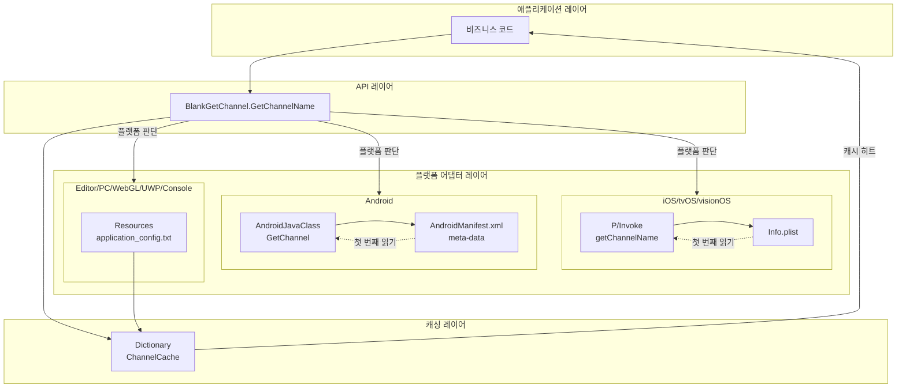
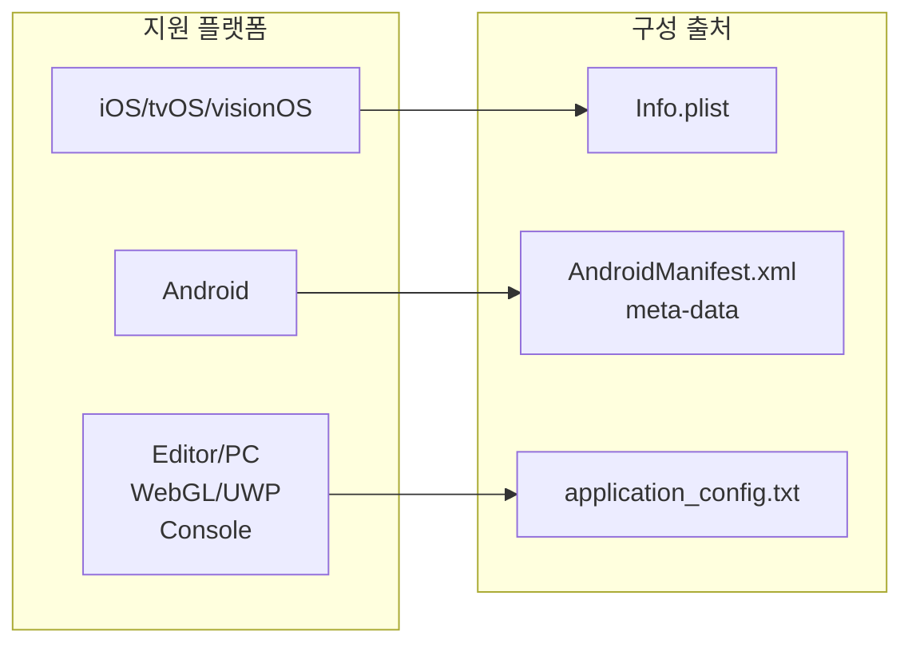
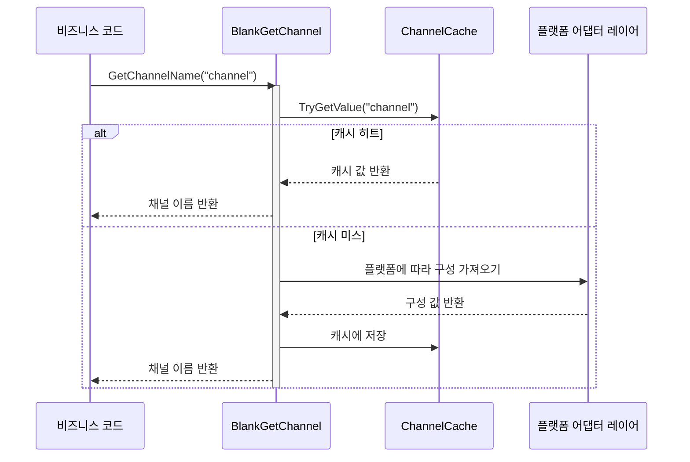

# 개요

Unity Get Channel은 Unity 프로젝트에서 다중 플랫폼 배포 채널 번호를 가져오는 플러그인으로, iOS, tvOS, visionOS, Android, Editor, PC(Windows/Mac/Linux), WebGL, UWP 및 주요 게임 콘솔 플랫폼(PS4, PS5, Xbox One, Nintendo Switch)을 지원합니다. 이 플러그인은 GameFrameX 프로젝트의 중요한 구성 부분으로, 게임 개발자에게 통일된 채널 정보 가져오기 솔루션을 제공합니다.

## 프로젝트 배경

게임 배포 과정에서 개발자들은 일반적으로 서로 다른 유통 채널(App Store, Google Play, 국내 안드로이드 마켓 등)에 대해 서로 다른 채널 식별자를 구성해야 합니다. 전통적인 방식은 각 플랫폼에 대해 독립적인 채널 가져오기 로직을 작성하여, 코드 중복과 유지 관리 어려움을 초래합니다. Unity Get Channel 플러그인은 추상화된 설계를 통해 각 플랫폼의 채널 가져오기 로직을 통일하게封装하고, 개발자는 간단한 API 하나만 호출하면 현재 플랫폼의 채널 정보를 가져올 수 있어, 다중 채널 게임 구성 작업을 크게 단순화합니다.

## 핵심 기능

이 플러그인은 다음 핵심 기능을 제공합니다:

- **다중 플랫폼 통일 인터페이스**: `BlankGetChannel.GetChannelName()` 메서드를 통해 모든 지원 플랫폼에서 채널 정보를 가져올 수 있어, 플랫폼 특정 코드를 작성할 필요가 없습니다.
- **다중 채널 지원**: 주 채널과 하위 채널 정보 가져오기를 지원하여, 비즈니스 요구에 따라 여러 채널 키를 유연하게 구성할 수 있습니다.
- **자동 구성**: iOS 빌드 시 Info.plist에 기본 채널 구성을 자동으로 추가하여, 수동 작업이 필요 없습니다.
- **캐싱 메커니즘**: 내장 캐싱 기능을 통해 반복적인 구성 파일 읽기를 피하여, 런타임 성능을 향상시킵니다.
- **코드裁剪 보호**: link.xml 파일을 제공하여 핵심 코드가 Unity 코드裁剪 기능에 의해 제거되는 것을 방지합니다.

## 아키텍처 설계



위의 다이어그램과 같이, 이 플러그인은 계층화 아키텍처 설계를 채택합니다. 애플리케이션 레이어는 API 레이어의 통일된 인터페이스를 호출하여 채널 정보를 가져오며, 플랫폼 어댑터 레이어는 현재 실행 중인 Unity 플랫폼에 따라 적절한 구성 읽기 방식을 자동으로 선택하고, 캐싱 레이어는 이미 읽은 채널 정보를 저장하여 후속 액세스의 성능을 향상시킵니다.

## 플랫폼 구성 방식

다양한 플랫폼에서 채널 정보를 가져오는 구성 방식이 서로 다르며, 다음은 각 플랫폼의 구성 개요입니다:



### iOS/tvOS/visionOS 플랫폼

iOS, tvOS 및 visionOS 플랫폼에서 채널 정보는 애플리케이션의 Info.plist 파일에 저장됩니다. 플러그인은 P/Invoke를 호출하여 네이티브 Objective-C 메서드를 통해 구성 값을 읽습니다. 빌드 시 Info.plist에 채널 정보가 아직 구성되지 않은 경우, 시스템은 자동으로 키가 "channel"이고 값이 "default"인 기본 항목을 추가합니다.

### Android 플랫폼

Android 플랫폼에서 채널 정보는 AndroidManifest.xml 파일의 `<meta-data>` 태그를 통해 정의됩니다. 플러그인은 Unity의 AndroidJavaClass를 사용하여 Android 네이티브 메서드를 호출하여 이러한 구성 값을 가져옵니다.

### Editor/PC/WebGL/UWP/콘솔 플랫폼

Editor, PC, WebGL, UWP 및 게임 콘솔 플랫폼을 위해, 플러그인은 Unity 프로젝트의 Resources 폴더 아래 `application_config.txt` 텍스트 파일에서 채널 구성을 읽습니다. 이러한 설계를 통해 개발자는 에디터 환경 및 기타 데스크톱 플랫폼에서 테스트 및 디버깅을 수행할 수 있습니다.

## 작업 흐름



채널 가져오기 메서드를 처음 호출하면, 플러그인은 캐시에 해당 키명이 있는지 확인합니다. 캐시가 히트하면 성능을 향상시키기 위해 캐시 값을 직접 반환합니다. 캐시가 미스하면 현재 Unity 플랫폼에 따라 해당 플랫폼 어댑터 레이어를 호출하여 구성을 가져오고, 결과를 캐시에 저장하여 후속 사용을 위해 제공합니다.

## 빠른 사용

C# 스크립트에서 한 줄의 코드만으로 채널 정보를 가져올 수 있습니다:

```csharp
using UnityEngine;

public class GameStartup : MonoBehaviour
{
    void Start()
    {
        // 기본 채널 가져오기 (키명이 "channel")
        string channel = BlankGetChannel.GetChannelName();
        Debug.Log("현재 채널: " + channel);

        // 사용자 정의 키명의 채널 가져오기
        string customChannel = BlankGetChannel.GetChannelName("channelName");
        Debug.Log("사용자 정의 채널: " + customChannel);

        // 채널 가져오기 및 기본값 지정
        string subChannel = BlankGetChannel.GetChannelName("sub_channel", "unknown");
        Debug.Log("하위 채널: " + subChannel);
    }
}
```

> Source: [BlankGetChannel.cs](https://github.com/GameFrameX/com.gameframex.unity.getchannel/blob/main/Runtime/BlankGetChannel.cs#L84-L96)

## 프로젝트 구조

```
com.gameframex.unity.getchannel/
├── Editor/
│   └── PostProcessBuildHandler.cs    # iOS 빌드 후处理器
├── Runtime/
│   └── BlankGetChannel.cs            # 핵심 채널 가져오기 클래스
├── Sample~/
│   └── BlankGetChannelExample.cs     # 사용 예시
├── README.md                          # 영어 문서
├── README.zh-CN.md                    #简体中文 문서
└── LICENSE.md                        # 라이선스
```

핵심 코드는 `Runtime/BlankGetChannel.cs` 파일에 있으며, 정적 메서드 `GetChannelName()`의 완전한 구현을 포함합니다. `Editor/PostProcessBuildHandler.cs`는 iOS 빌드 시 자동 구성을 담당하고, `Sample~/BlankGetChannelExample.cs`는 간단한 사용 예시를 제공합니다.

## 관련 링크

- [설치 가이드](./02.installation.md) - 플러그인을 Unity 프로젝트에 추가하는 방법 알아보기
- [빠른 시작](./03.getting-started.md) - 플러그인 빠르게 시작하기
- [플랫폼 구성](./04.platform-configuration.md) - 각 플랫폼의 상세 구성 방법
- [예제 코드](./05.samples.md) - 더 많은 사용 예시
- [API 참조](./06.api-reference.md) - 완전한 API 메서드 설명
- [자주 묻는 질문](./07.troubleshooting.md) - 자주 묻는 질문 답변
- [GitHub 저장소](https://github.com/GameFrameX/com.gameframex.unity.getchannel) - 최신 버전 보기