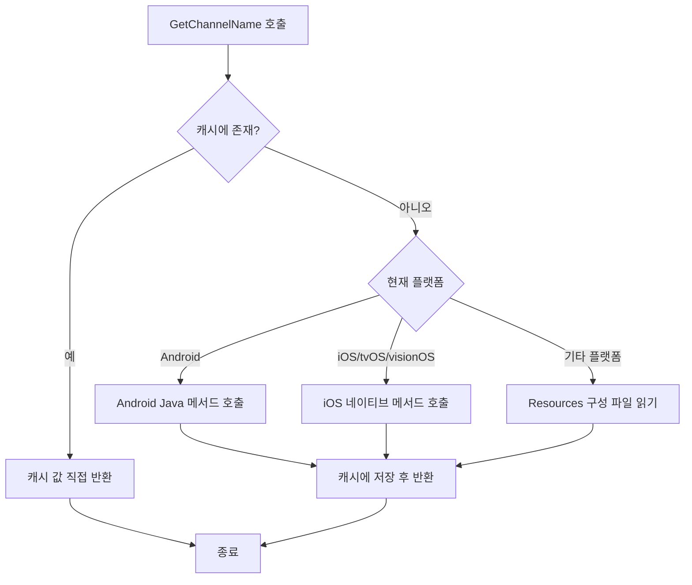

# 빠른 시작

이 섹션은 GameFrameX Get Channel 플러그인을 빠르게 시작하여, Unity 프로젝트에서 다중 플랫폼 채널 번호를 가져올 수 있도록 도와줍니다.

## 개요

GameFrameX Get Channel은 가벼운 Unity 플러그인으로, 게임 또는 애플리케이션 배포 시 채널 식별 정보를 가져오는 데 사용됩니다. 프로젝트가 iOS, Android 또는 PC, WebGL 등의 플랫폼에 배포되는 경우,统一的 API를 사용하여 채널 번호를 가져올 수 있어 플랫폼 특정 코드를 작성할 필요가 없습니다.

**전형적인 사용 시나리오:**
- 서로 다른 앱스토어 채널의 사용자 수 통계
- 서로 다른 채널에 대해 다른 게임 리소스 구성
- 정식 서버, 테스트 서버, 내부 채널 구분
- 서드파티 데이터 분석 플랫폼에 채널 정보 전달

## 핵심 기능

이 플러그인은 다음 핵심 기능을 제공합니다:

| 기능 | 설명 |
|------|------|
| 다중 플랫폼 통일 API | 한 번 작성하면 여러 플랫폼에서 실행 |
| 자동 캐싱 메커니즘 | 첫 번째 읽기 후 결과를 캐싱하여 반복 IO 피하기 |
| iOS 자동 구성 | 빌드 시 기본 채널 자동 추가 (구성되지 않은 경우) |
| 코드裁剪 보호 | link.xml을 포함하여 Unity 코드裁剪 방지 |

## 기본 사용법

### 첫 번째 단계: 플러그인 설치

다음 종속 항목을 프로젝트의 `Packages/manifest.json`에 추가합니다:

```json
{
  "dependencies": {
    "com.gameframex.unity.getchannel": "https://github.com/gameframex/com.gameframex.unity.getchannel.git"
  }
}
```

> **팁**: 상세한 설치 설명은 [설치](./02.installation.md) 문서를 참조하세요.

### 두 번째 단계: 채널 정보 구성

대상 플랫폼에 따라 해당 위치에서 채널 정보를 구성합니다:

| 대상 플랫폼 | 구성 파일 | 구성 방식 |
|----------|----------|----------|
| iOS / tvOS / visionOS | Info.plist | `channel` 키-값 쌍 추가 |
| Android | AndroidManifest.xml | application 태그에 meta-data 추가 |
| Editor / PC / WebGL / UWP | Resources/application_config.txt | 텍스트 파일 생성, 각 줄 `key=value` |

**상세 구성 방법은 [플랫폼 구성](./04.platform-configuration.md) 문서를 참조하세요.**

### 세 번째 단계: API를 호출하여 채널 번호 가져오기

임의의 C# 스크립트에서 `BlankGetChannel.GetChannelName()` 메서드를 호출합니다:

```csharp
using UnityEngine;

public class ChannelDemo : MonoBehaviour
{
    void Start()
    {
        // 기본 매개변수 사용 (key="channel", 기본값="default")
        string channel = BlankGetChannel.GetChannelName();
        Debug.Log("현재 채널 번호: " + channel);

        // 사용자 정의 키명
        string customChannel = BlankGetChannel.GetChannelName("channelName");
        Debug.Log("사용자 정의 채널: " + customChannel);

        // 기본값 지정 (구성되지 않은 경우 반환)
        string subChannel = BlankGetChannel.GetChannelName("sub_channel", "unknown");
        Debug.Log("하위 채널: " + subChannel);
    }
}
```
> Source: [Runtime/BlankGetChannel.cs](https://github.com/GameFrameX/com.gameframex.unity.getchannel/blob/main/Runtime/BlankGetChannel.cs#L88-L96)

### 네 번째 단계: 실행 및 확인

Unity 에디터에서 게임을 실행(Editor 플랫폼 사용)하거나, 대상 플랫폼으로 빌드하여, 로그에 채널 번호가 올바르게 표시되는지 확인합니다.

## 작업 원리

`GetChannelName()` 메서드를 호출하면, 플러그인은 다음 흐름으로 채널 정보를 가져옵니다:



**핵심 설계 설명:**
- **캐싱 메커니즘**: `Dictionary<string, string>`을 사용하여 이미 읽은 채널 정보를 저장하여, 매번 호출할 때마다 구성 파일을 읽는 것을 피하고 성능을 향상시킵니다
- **플랫폼 판단**: Unity 전처리기 지시문(`UNITY_ANDROID`, `UNITY_IOS` 등)을 통해 현재 플랫폼을 판단합니다
- **기본값 보호**: 지정된 키가 존재하지 않을 때 호출자가 지정한 기본값을 반환하여, 프로그램이 정상적으로 실행되도록 보장합니다

## 완전한 예시

다음은 게임 시작 시 채널 정보를 가져와 사용하는 방법을 보여주는 완전한 MonoBehaviour 예시입니다:

```csharp
using UnityEngine;

public class GameInitializer : MonoBehaviour
{
    private string channelId;
    private string subChannel;

    void Awake()
    {
        // 주 채널 가져오기
        channelId = BlankGetChannel.GetChannelName("channel", "default");

        // 하위 채널 가져오기 (선택사항)
        subChannel = BlankGetChannel.GetChannelName("sub_channel", "none");

        Debug.Log($"[GameInitializer] 채널: {channelId}, 하위 채널: {subChannel}");

        // 채널에 따라 다른 구성 로드
        InitializeForChannel(channelId);
    }

    void InitializeForChannel(string channel)
    {
        // 여기서 채널에 따라 다른 초기화 로직을 수행할 수 있습니다
        switch (channel)
        {
            case "ios_cn_taptap":
                Debug.Log("TapTap iOS 채널 감지");
                break;
            case "android_cn_taptap":
                Debug.Log("TapTap Android 채널 감지");
                break;
            default:
                Debug.Log($"기본/기타 채널 감지: {channel}");
                break;
        }
    }
}
```
> Source: [Sample~/BlankGetChannelExample.cs](https://github.com/GameFrameX/com.gameframex.unity.getchannel/blob/main/Sample~/BlankGetChannelExample.cs#L1-L15)

## 주의 사항

1. **키명 일관성**: 코드에서 사용하는 키명과 플랫폼 구성 파일의 키명이 완전히 일치하는지 확인합니다
2. **Android 네이티브 코드**: Android 플랫폼에서는 프로젝트에 `com.alianhome.getchannel` 네이티브 모듈이 통합되어야 합니다 (플러그인 패키지에 포함됨)
3. **iOS Info.plist**: iOS를 처음 빌드할 때, 수동으로 구성하지 않으면 플러그인이 자동으로 기본 채널 `channel=default`를 추가합니다

## 관련 링크

- [설치 가이드](./02.installation.md) - 상세한 플러그인 설치 방법
- [플랫폼 구성](./04.platform-configuration.md) - 각 플랫폼 상세 구성 설명
- [예제 프로젝트](./05.samples.md) - 더 많은 사용 예시
- [API 참조](./06.api-reference.md) - 완전한 API 메서드 설명
- [자주 묻는 질문](./07.troubleshooting.md) - 일반 문제와 해결책