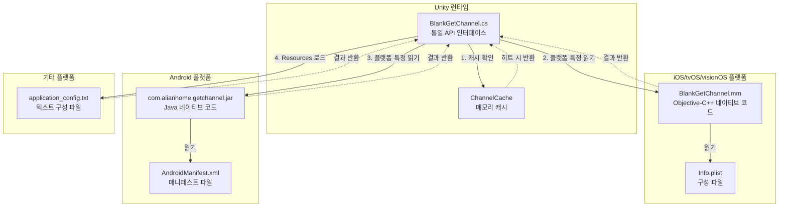
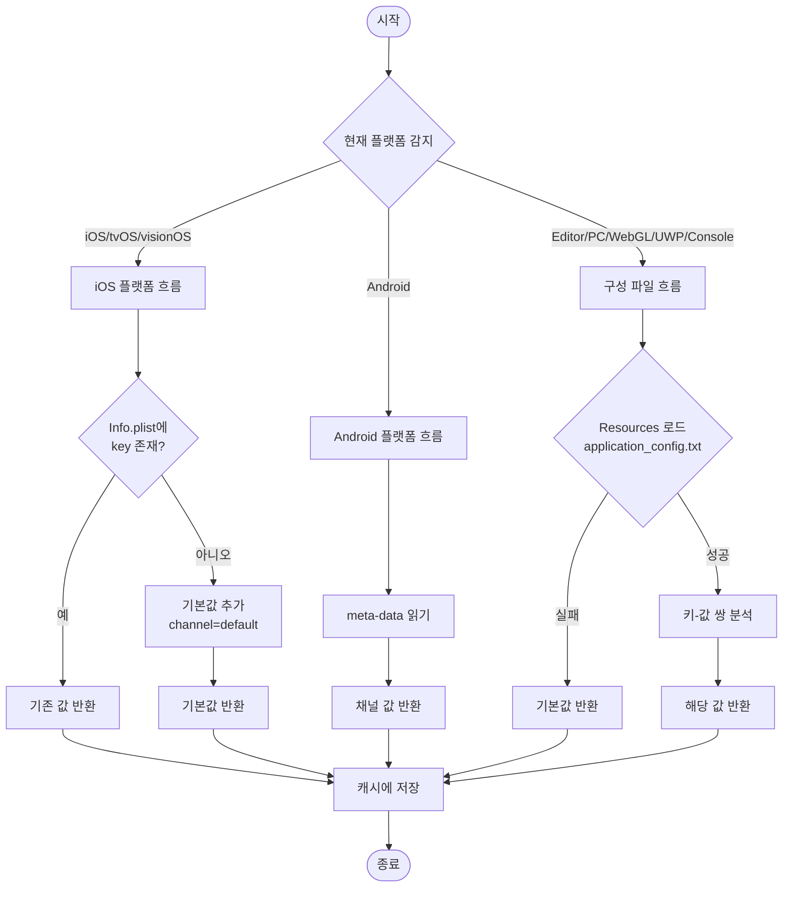
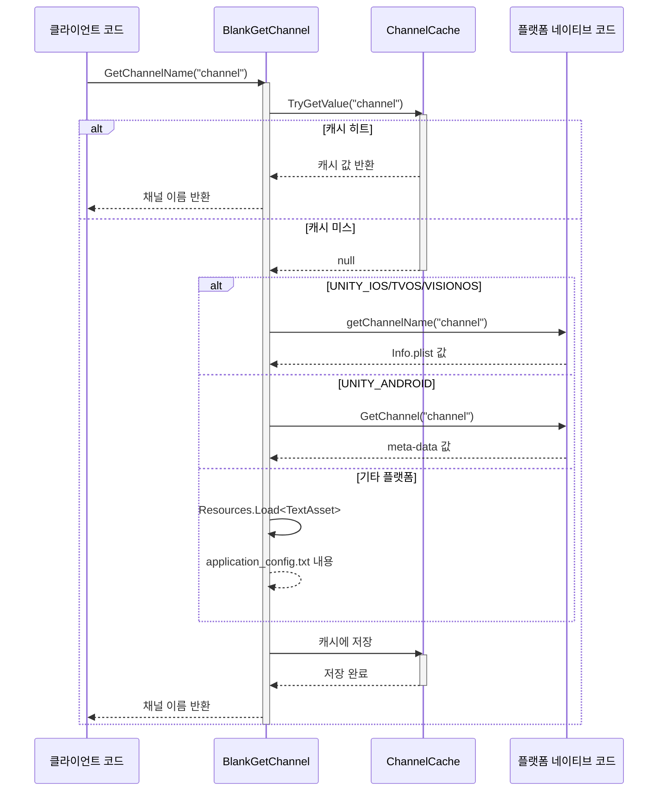

# 플랫폼 구성

이 섹션에서는 GameFrameX GetChannel 플러그인의 다양한 플랫폼에서의 구성 방법을 상세히 소개하며, iOS/tvOS/visionOS, Android, Editor, PC, WebGL, UWP 및 게임 콘솔 플랫폼(PS4, PS5, Xbox One, Nintendo Switch)의 구성 파일 설정을 포함합니다.

## 개요

GameFrameX GetChannel 플러그인은 통일된 API 인터페이스를 통해 각 플랫폼의 채널 정보를 가져옵니다. 크로스 플랫폼 지원을 위해 각 플랫폼에는 고유한 데이터 소스와 읽기 방식이 있습니다:

| 플랫폼 | 구성 소스 | 읽기 방식 |
|------|--------|----------|
| iOS/tvOS/visionOS | Info.plist | 네이티브 Objective-C++ 메서드 호출 |
| Android | AndroidManifest.xml | Android Java 리플렉션 호출 |
| Editor/PC/WebGL/UWP/Console | application_config.txt | Unity Resources 로드 |

## 아키텍처 설계



### 컴포넌트 설명

| 컴포넌트 | 위치 | 책임 |
|------|------|------|
| BlankGetChannel | Runtime/BlankGetChannel.cs | 통일 C# API 제공, 캐시 관리 및 플랫폼 분기 |
| PostProcessBuildHandler | Editor/PostProcessBuildHandler.cs | iOS 빌드 시 기본 채널 자동 추가 |
| BlankGetChannel.mm | Plugins/iOS/BlankGetChannel/ | iOS 플랫폼 네이티브 구현, Info.plist 읽기 |
| com.alianhome.getchannel.jar | Plugins/Android/ | Android 플랫폼 네이티브 구현, meta-data 읽기 |

## iOS/tvOS/visionOS 플랫폼 구성

### Info.plist 구성

Xcode 프로젝트의 `Info.plist` 파일에 채널 정보를 추가합니다. **String** 타입 키-값 쌍을 사용합니다:

```xml
<!-- 필수: 주 채널 -->
<key>channel</key>
<string>ios_cn_taptap</string>

<!-- 선택: 하위 채널 -->
<key>sub_channel</key>
<string>beta</string>

<!-- 선택: 기타 사용자 정의 키 -->
<key>app_id</key>
<string>123456789</string>
```
> Source: [README.md](https://github.com/GameFrameX/com.gameframex.unity.getchannel/blob/main/README.md#L96-L104)

### 자동 기본 구성

플러그인은 빌드 후 처리기 `PostProcessBuildHandler.cs`를 포함하며, iOS 빌드 시 다음 로직을 자동으로 실행합니다:

```csharp
// PostProcessBuildHandler.cs 핵심 로직
const string channelKey = "channel";
const string channelValue = "default";

string plistPath = path + "/Info.plist";
PlistDocument plist = new PlistDocument();
plist.ReadFromString(File.ReadAllText(plistPath));
if (!plist.root.values.TryGetValue(channelKey, out var value))
{
    plist.root.SetString(channelKey, channelValue);
    plist.WriteToFile(plistPath);
    Debug.Log("채널 구성 성공=>" + channelValue);
}
```
> Source: [PostProcessBuildHandler.cs](https://github.com/GameFrameX/com.gameframex.unity.getchannel/blob/main/Editor/PostProcessBuildHandler.cs#L31-L48)

**자동 구성 규칙:**
- `Info.plist`에 `channel` 키가 **존재하지 않으면** → `channel = "default"` 자동 추가
- `Info.plist`에 `channel` 키가 **이미 존재하면** → 수정 건너뛰고 원본 값 유지

### iOS 네이티브 구현

iOS 플랫폼은 Objective-C++로 채널 읽기를 구현합니다:

```cpp
// Plugins/iOS/BlankGetChannel/BlankGetChannel.mm
char * getChannelName(char * channel_name) {
    NSString* channel_name_String = [NSString stringWithUTF8String:channel_name];
    NSString* File = [[NSBundle mainBundle] pathForResource:@"Info" ofType:@"plist"];
    NSMutableDictionary* dict = [[NSMutableDictionary alloc] initWithContentsOfFile:File];
    NSString * channel_value = [dict objectForKey:channel_name_String];
    if (channel_value != nil) {
        return StringToCharArray(channel_value);
    }
    channel_value = @"unknown";
    return StringToCharArray(channel_value);
}
```
> Source: [BlankGetChannel.mm](https://github.com/GameFrameX/com.gameframex.unity.getchannel/blob/main/Plugins/iOS/BlankGetChannel/BlankGetChannel.mm#L25-L35)

## Android 플랫폼 구성

### AndroidManifest.xml 구성

`AndroidManifest.xml`의 `<application>` 태그 안에 `<meta-data>` 태그를 추가합니다:

```xml
<application ...>
    <activity ...>
        <!-- 활동 구성 -->
    </activity>

    <!-- 필수: 주 채널 -->
    <meta-data
        android:name="channel"
        android:value="android_cn_taptap" />

    <!-- 선택: 하위 채널 -->
    <meta-data
        android:name="sub_channel"
        android:value="beta" />

    <!-- 선택: 기타 사용자 정의 키 -->
    <meta-data
        android:name="app_id"
        android:value="123456789" />
</application>
```
> Source: [README.md](https://github.com/GameFrameX/com.gameframex.unity.getchannel/blob/main/README.md#L112-L128)

### Android 네이티브 구현

플러그인은 Android 네이티브 JAR 패키지(`com.alianhome.getchannel.jar`)를 내장하고, Android Java 리플렉션을 통해 호출합니다:

```csharp
// BlankGetChannel.cs의 Android 읽기 로직
#if UNITY_ANDROID
using (AndroidJavaClass androidJavaClass = new AndroidJavaClass("com.alianhome.getchannel.MainActivity"))
{
    channelName = androidJavaClass.CallStatic<string>("GetChannel", channelKey);
}
#endif
```
> Source: [BlankGetChannel.cs](https://github.com/GameFrameX/com.gameframex.unity.getchannel/blob/main/Runtime/BlankGetChannel.cs#L131-L135)

## Editor/PC/WebGL/UWP/콘솔 플랫폼 구성

### 구성 파일 생성

Unity 프로젝트의 `Assets/Resources` 폴더 아래에 `application_config.txt` 파일을 생성합니다:

**파일 위치:** `Assets/Resources/application_config.txt`

**파일 형식:**
```
# 각 줄마다 하나의 키-값 쌍, 형식: key=value
# #으로 시작하면 주석 처리

# 필수: 주 채널
channel=editor_cn_test

# 선택: 하위 채널
sub_channel=beta

# 선택: 기타 사용자 정의 키
app_id=123456789
```
> Source: [README.md](https://github.com/GameFrameX/com.gameframex.unity.getchannel/blob/main/README.md#L136-L142)

### 읽기 구현

```csharp
// BlankGetChannel.cs의 텍스트 구성 읽기 로직
var textAsset = Resources.Load<TextAsset>("application_config");
if (textAsset != null)
{
    var lines = textAsset.text.Split(new string[] { "\n", "\r", "\r\n" }, StringSplitOptions.RemoveEmptyEntries);
    foreach (var line in lines)
    {
        var split = line.Split(new string[] { "=" }, StringSplitOptions.RemoveEmptyEntries);
        if (split.Length > 1)
        {
            var key = split[0].Trim();
            var channelValue = split[1].Trim();
            ChannelCache[key] = channelValue;
        }
    }
}
```
> Source: [BlankGetChannel.cs](https://github.com/GameFrameX/com.gameframex.unity.getchannel/blob/main/Runtime/BlankGetChannel.cs#L106-L121)

### 지원 플랫폼

이 구성 방식은 다음 플랫폼에 적용됩니다:

| 플랫폼 | 매크로 정의 |
|------|--------|
| Unity Editor | `UNITY_EDITOR` |
| Windows PC | `UNITY_STANDALONE_WIN` |
| macOS PC | `UNITY_STANDALONE_OSX` |
| Linux PC | `UNITY_STANDALONE_LINUX` |
| WebGL | `UNITY_WEBGL` |
| UWP/WSA | `UNITY_WSA` |
| PlayStation 4 | `UNITY_PS4` |
| PlayStation 5 | `UNITY_PS5` |
| Xbox One | `UNITY_XBOXONE` |
| Nintendo Switch | `UNITY_SWITCH` |

## 구성 흐름도



## 채널 가져오기 흐름



## 구성 주의 사항

### 키명 일관성

**중요:** `BlankGetChannel.GetChannelName(string key)` 호출 시 사용하는 키명은 해당 플랫폼 구성 파일에 설정된 키명과 완전히 일치해야 합니다.

| 플랫폼 | 구성 키명 | 읽기 방식 |
|------|----------|----------|
| iOS/tvOS/visionOS | 대소문자 구분 | 직접 일치 |
| Android | 대소문자 구분 | 직접 일치 |
| 텍스트 파일 | 대소문자 구분 | 직접 일치 |

### 기본값 처리

지정된 키명이 존재하지 않을 때, API는 기본값을 반환합니다:

```csharp
// 기본 매개변수
BlankGetChannel.GetChannelName();  // key="channel", defaultValue="default"

// 기본값 지정
BlankGetChannel.GetChannelName("sub_channel", "unknown");
```
> Source: [BlankGetChannel.cs](https://github.com/GameFrameX/com.gameframex.unity.getchannel/blob/main/Runtime/BlankGetChannel.cs#L98)

### 캐싱 메커니즘

플러그인은 메모리 캐시를 사용하여 반복적인 구성 파일 읽기를 피합니다:

```csharp
private static readonly Dictionary<string, string> ChannelCache = new Dictionary<string, string>(32);
```
> Source: [BlankGetChannel.cs](https://github.com/GameFrameX/com.gameframex.unity.getchannel/blob/main/Runtime/BlankGetChannel.cs#L57)

**캐시 특징:**
- 첫 번째 호출 시 구성 파일 읽기
- 이후 호출은 메모리에서 직접 반환
- 프로세스 종료 시 캐시销毁
- 각 key별 별도 캐시

## 플랫폼 구성 빠른 참조표

| 플랫폼 | 구성 파일 | 키 타입 | 예시 키-값 |
|------|-----------|--------|----------|
| iOS/tvOS/visionOS | Info.plist | String | `<key>channel</key><string>ios_cn_taptap</string>` |
| Android | AndroidManifest.xml | meta-data | `android:name="channel" android:value="android_cn_taptap"` |
| 기타 플랫폼 | application_config.txt | key=value | `channel=editor_cn_test` |

## 자주 묻는 질문

### Q1: Android 플랫폼에서 "default" 반환

**원인:** Android 네이티브 JAR 패키지의 Java 클래스 경로가 실제 프로젝트와 일치하지 않을 수 있습니다.

**해결책:**
- AndroidManifest.xml의 `<meta-data>` 태그가 `<application>` 태그 안에 올바르게 구성되었는지 확인
- `android:name` 속성 값이 코드에서 전달된 키명과 일치하는지 확인
- Android Studio의 Logcat 출력을 통해 호출 결과 확인

### Q2: iOS 빌드 후 채널 값이 "unknown"

**원인:** iOS 네이티브 코드가 Info.plist 읽기에 실패하거나 키명이 일치하지 않습니다.

**해결책:**
- Info.plist에 해당 키명이 존재하는지 확인
- 키명 대소문자가 완전히 일치하는지 확인
- Info.plist가 Xcode 프로젝트에 올바르게 패키징되었는지 확인

### Q3: Editor 모드에서 구성 읽기 실패

**원인:** application_config.txt 파일 위치나 형식이 올바르지 않습니다.

**해결책:**
- 파일이 `Assets/Resources/application_config.txt`에 있는지 확인
- 파일 확장자가 `.txt`인지 확인 (`.json`이나其它이 아님)
- 파일 인코딩이 UTF-8 BOM 없음 형식인지 확인
- 파일 형식이 표준 `key=value` 형식이어야 함

### Q4: Unity 코드裁剪으로 채널 가져오기 실패

**원인:** Unity의 IL2CPP 코드裁剪이 플러그인 관련 코드를 제거했을 수 있습니다.

**해결책:**
- 플러그인에 `link.xml` 파일이 포함되어 코드裁剪 방지
- 문제가 지속되면 프로젝트의 `link.xml`에 추가:
```xml
<linker>
    <assembly fullname="BlankGetChannel.Runtime" preserve="all"/>
</linker>
```

## 관련 링크

- [빠른 시작](./03.getting-started.md) - 빠른 통합 가이드
- [예제](./05.samples.md) - 코드 예시
- [API 참조](./06.api-reference.md) - 완전한 API 문서
- [자주 묻는 질문](./07.troubleshooting.md) -故障排除
- [GitHub 저장소](https://github.com/GameFrameX/com.gameframex.unity.getchannel) - 공식 저장소