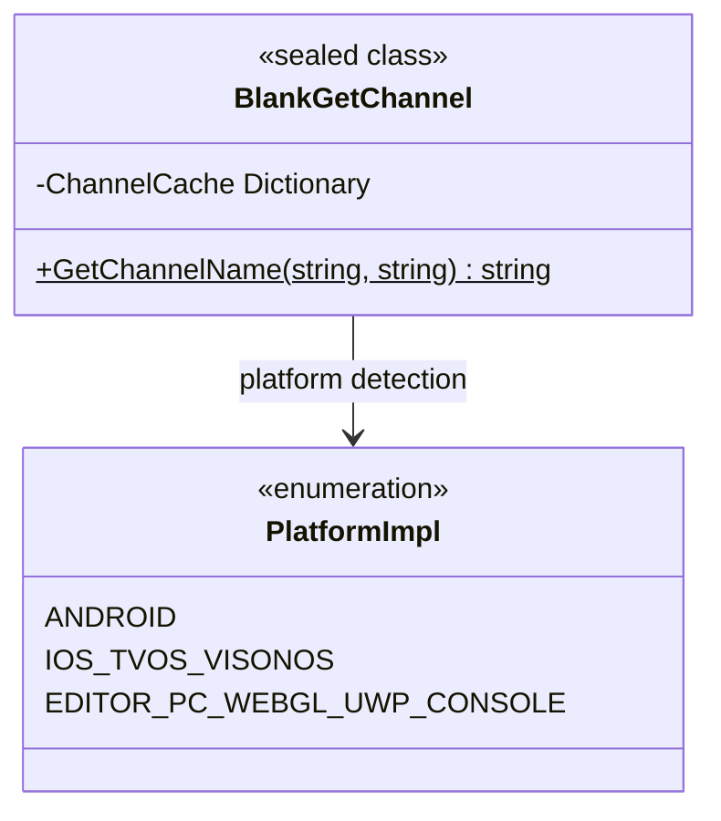

# API 참조

이 문서는 `BlankGetChannel` 클래스가 제공하는 모든 공개 API 메서드를 상세히 소개하며, 메서드 시그니처, 매개변수 설명, 반환값 및 플랫폼 동작 차이를 포함합니다.

## 개요

`BlankGetChannel`는 크로스 플랫폼 채널 정보 가져오기 유틸리티 클래스로, Unity 프로젝트에 통일된 인터페이스를 제공하여 서로 다른 플랫폼의 채널 식별자를 가져옵니다. 이 클래스는 iOS, tvOS, visionOS, Android, Editor, PC, WebGL, UWP 및 다양한 호스트 플랫폼(PS4, PS5, Xbox One, Nintendo Switch)을 지원합니다.

**설계 의도**: 통일된 API를 통해 하위 플랫폼 차이를 추상화하여, 개발자는 동일한 메서드를 호출하기만 하면 채널 정보를 가져올 수 있으며, 각 플랫폼의 구체적인 구현 세부 사항을 고려할 필요가 없습니다.



## API 참조

### `BlankGetChannel.GetChannelName(string channelKey = "channel", string defaultValue = "default"): string`

지정된 채널 키에 해당하는 채널 이름을 가져옵니다.

**메서드 시그니처:**
```csharp
[UnityEngine.Scripting.Preserve]
public static string GetChannelName(string channelKey = "channel", string defaultValue = "default")
```
> Source: [Runtime/BlankGetChannel.cs](https://github.com/GameFrameX/com.gameframex.unity.getchannel/blob/main/Runtime/BlankGetChannel.cs#L98-L141)

**기능 설명:**
현재 실행 플랫폼에 따라 대응하는 구성 소스에서 채널 정보를 읽어, 지정된 키명에 해당하는 값을 반환합니다. 이 메서드는 내부적으로 캐싱 메커니즘을 구현하며, 첫 번째 읽기 후 결과를 캐시하여, 후속 호출은 캐시 값을 직접 반환하여 반복적인 구성 파일 읽기로 인한 성능 오버헤드를 피합니다.

**매개변수 설명:**

| 매개변수명 | 타입 | 기본값 | 필수 여부 | 설명 |
|--------|------|--------|------|------|
| `channelKey` | `string` | `"channel"` | 아니오 | 채널 키명. 가져올 채널 구성 항목을 식별하는 데 사용됩니다. 기본값은 `"channel"`이며, 각 플랫폼의 주 채널 구성에 해당합니다. |
| `defaultValue` | `string` | `"default"` | 아니오 | 채널 구성을 찾지 못했을 때 반환되는 기본값. 플랫폼 구성 파일에 지정된 키가 존재하지 않을 때 이 기본값을 반환합니다. |

**반환값:**

| 타입 | 설명 |
|------|------|
| `string` | 채널 이름 문자열. 구성 소스에서 `channelKey`에 해당하는 값을 찾으면 해당 값을 반환하고, 그렇지 않으면 `defaultValue`를 반환합니다. |

**플랫폼 동작 차이:**

| 플랫폼 | 구성 소스 | 읽기 방식 |
|------|----------|----------|
| Android | `AndroidManifest.xml`의 `<meta-data>` 태그 | `AndroidJavaClass`를 통해 Java 네이티브 메서드 `GetChannel()` 호출 |
| iOS/tvOS/visionOS | `Info.plist`의 키-값 쌍 | P/Invoke를 통해 네이티브 메서드 `getChannelName()` 호출 |
| Editor/PC/WebGL/UWP/Console | `Resources/application_config.txt` 파일 | `Resources.Load<TextAsset>()`를 통해 텍스트 파일 읽기 및 파싱 |

**내부 구현 세부 사항:**

1. **캐싱 메커니즘**: 메서드는 정적 딕셔너리 `ChannelCache`를 사용하여 이미 읽은 채널 정보를 저장하여, 구성 파일을 반복적으로 읽는 것을 피합니다.

```csharp
private static readonly Dictionary<string, string> ChannelCache = new Dictionary<string, string>(32);
```
> Source: [Runtime/BlankGetChannel.cs](https://github.com/GameFrameX/com.gameframex.unity.getchannel/blob/main/Runtime/BlankGetChannel.cs#L57)

2. **조건부 컴파일**: 서로 다른 플랫폼은 `#if UNITY_ANDROID`, `#if UNITY_IOS || UNITY_TVOS || UNITY_VISIONOS` 등의 전처리기 지시문을 사용하여 플랫폼 분기 처리를 수행합니다.

3. **구성 파싱**: Editor/PC/WebGL/UWP/Console 플랫폼의 경우, 구성 파일 파싱 로직은 다음과 같습니다:

```csharp
var lines = textAsset.text.Split(new string[] { "\n", "\r", "\r\n" }, StringSplitOptions.RemoveEmptyEntries);
foreach (var line in lines)
{
    var split = line.Split(new string[] { "=" }, StringSplitOptions.RemoveEmptyEntries);
    if (split.Length > 1)
    {
        var key = split[0].Trim();
        var channelValue = split[1].Trim();
        ChannelCache[key] = channelValue;
    }
}
```
> Source: [Runtime/BlankGetChannel.cs](https://github.com/GameFrameX/com.gameframex.unity.getchannel/blob/main/Runtime/BlankGetChannel.cs#L110-L120)

**사용 예시:**

```csharp
// 기본 매개변수를 사용하여 주 채널 가져오기
string channel = BlankGetChannel.GetChannelName();
```
> Source: [Runtime/BlankGetChannel.cs](https://github.com/GameFrameX/com.gameframex.unity.getchannel/blob/main/Runtime/BlankGetChannel.cs#L91)

```csharp
// 지정된 키의 채널을 가져오고 기본값 설정
string subChannel = BlankGetChannel.GetChannelName("sub_channel", "unknown");
```
> Source: [Runtime/BlankGetChannel.cs](https://github.com/GameFrameX/com.gameframex.unity.getchannel/blob/main/Runtime/BlankGetChannel.cs#L94)

```csharp
// 실제 프로젝트에서의 사용 예시
string appChannel = BlankGetChannel.GetChannelName("appchannel");
Debug.Log("현재 채널: " + appChannel);
```
> Source: [Sample~/BlankGetChannelExample.cs](https://github.com/GameFrameX/com.gameframex.unity.getchannel/blob/main/Sample~/BlankGetChannelExample.cs#L12)

**예외 상황:**

| 시나리오 | 동작 |
|------|------|
| 구성 파일에서 지정된 키를 찾지 못함 | `defaultValue` 매개변수 값 반환 |
| Android 플랫폼 Java 클래스 호출 실패 | `defaultValue` 반환 (Java 계층에서 처리) |
| iOS/tvOS/visionOS 플랫폼 네이티브 메서드 호출 실패 | `defaultValue` 반환 (네이티브 계층에서 처리) |
| Resources 파일이 존재하지 않음 | `defaultValue` 반환, `defaultValue`를 캐시에 저장 |

## 내부 메서드

### iOS/tvOS/visionOS 네이티브 메서드 인터페이스

```csharp
#if UNITY_IOS || UNITY_TVOS || UNITY_VISIONOS
[DllImport("__Internal")]
private static extern string getChannelName(string channelKey);
#endif
```
> Source: [Runtime/BlankGetChannel.cs](https://github.com/GameFrameX/com.gameframex.unity.getchannel/blob/main/Runtime/BlankGetChannel.cs#L47-L48)

**설명:** 이 메서드는 비공개 메서드로, P/Invoke를 통해 iOS/tvOS/visionOS 플랫폼의 네이티브 코드를 호출하여 `Info.plist`에서 채널 정보를 읽습니다. 개발자는 이 메서드를 직접 호출할 필요가 없으며, 공개 메서드 `GetChannelName()`을 사용해야 합니다.

## 구성 요구 사항 요약

| 플랫폼 | 구성 파일 | 키명 설정 방식 |
|------|----------|--------------|
| Android | `AndroidManifest.xml` | `<meta-data android:name="channel" android:value="xxx" />` |
| iOS/tvOS/visionOS | `Info.plist` | `<key>channel</key><string>xxx</string>` |
| Editor/PC/WebGL/UWP/Console | `Resources/application_config.txt` | `channel=xxx` |

> 상세 구성 설명은 [플랫폼 구성](./04.platform-configuration) 문서를 참고하세요.

## 관련 링크

- [개요](./01.overview) - 프로젝트 전체 소개 및 기능 개요
- [설치](./02.installation) - 패키지 설치 및 환경 구성
- [빠른 시작](./03.getting-started) - 빠른 시작 가이드
- [플랫폼 구성](./04.platform-configuration) - 각 플랫폼 상세 구성 설명
- [예제](./05.samples) - 완전한 코드 예제
- [자주 묻는 질문](./07.troubleshooting) - 일반 문제와 해결책