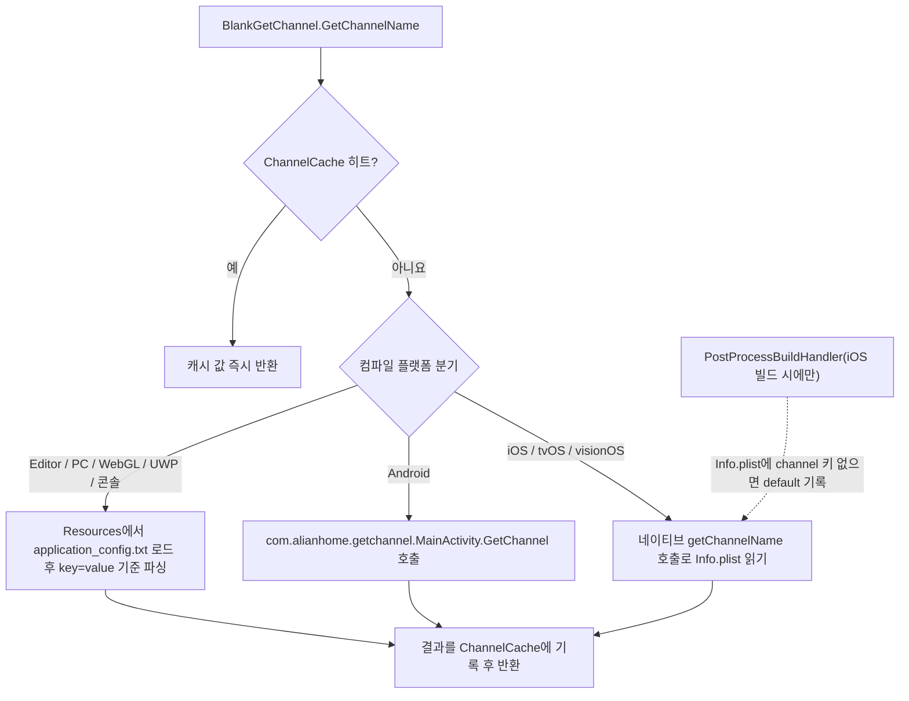

# 작동 원리: 채널 읽기 흐름

`BlankGetChannel.GetChannelName()`을 호출하면 컴포넌트는 먼저 프로세스 내 캐시 `ChannelCache`를 조회하고, 캐시 미스 시 현재 컴파일 플랫폼에 따라 세 가지 서로 다른 읽기 경로를 따릅니다(Android 네이티브 jar, iOS 네이티브 Info.plist, Editor/PC는 `Resources/application_config.txt` 읽기). 그 후 결과를 캐시에 기록하고 반환합니다. 전체 진입점은 단 하나의 정적 메서드이며, [Runtime/BlankGetChannel.cs](https://github.com/GameFrameX/com.gameframex.unity.getchannel/blob/main/Runtime/BlankGetChannel.cs#L98-L141)에 정의되어 있습니다.

## 읽기 흐름 개요



## 플랫폼별 읽기 소스

| 플랫폼(컴파일 매크로) | 설정 소스 | 코드 진입점 |
|------|------|------|
| `UNITY_ANDROID` | AndroidManifest.xml 메인 시작 Activity의 `meta-data android:name="channel"` | `new AndroidJavaClass("com.alianhome.getchannel.MainActivity")`로 정적 메서드 `GetChannel` 호출, 네이티브 구현은 [Plugins/Android/com.alianhome.getchannel.jar](https://github.com/GameFrameX/com.gameframex.unity.getchannel/blob/main/Plugins/Android/com.alianhome.getchannel.jar)에 패키지되어 있음 |
| `UNITY_IOS` / `UNITY_TVOS` / `UNITY_VISIONOS` | Info.plist의 String 키 `channel` | `[DllImport("__Internal")] getChannelName(channelKey)`, 네이티브 구현은 [Plugins/iOS/BlankGetChannel/BlankGetChannel.mm](https://github.com/GameFrameX/com.gameframex.unity.getchannel/blob/main/Plugins/iOS/BlankGetChannel/BlankGetChannel.mm) 참조 |
| `UNITY_STANDALONE` / `UNITY_EDITOR` / `UNITY_WEBGL` / `UNITY_WSA` / `UNITY_PS4` / `UNITY_PS5` / `UNITY_XBOXONE` / `UNITY_SWITCH` | `Resources/application_config.txt`(각 행 `key=value`) | `Resources.Load<TextAsset>("application_config")` 행 단위 파싱 |

메서드 시그니처의 기본값: 첫 번째 매개변수는 `channelKey = "channel"`, 두 번째 매개변수는 `defaultValue = "default"`이며, 즉 채널이 구성되지 않은 경우 문자열 `"default"`를 반환합니다.

## 1단계: 캐시 히트 확인

메서드 진입점에서는 먼저 정적 딕셔너리 `ChannelCache`(초기 용량 32)를 조회하며, 히트 시 즉시 반환하고 어떠한 플랫폼 읽기도 트리거하지 않습니다:

```csharp
private static readonly Dictionary<string, string> ChannelCache = new Dictionary<string, string>(32);

public static string GetChannelName(string channelKey = "channel", string defaultValue = "default")
{
    if (ChannelCache.TryGetValue(channelKey, out var value))
    {
        return value;
    }

    string channelName = defaultValue;
```

Source: [Runtime/BlankGetChannel.cs](https://github.com/GameFrameX/com.gameframex.unity.getchannel/blob/main/Runtime/BlankGetChannel.cs#L57-L105)

참고: 캐시에는 만료 메커니즘이 없어, 프로세스 수명 주기 동안 처음 읽은 값이 계속 사용됩니다.

## 2단계: Editor/PC 경로 — application_config.txt 파싱

Editor, Standalone, WebGL, UWP 및 각 콘솔 플랫폼은 `Resources.Load` 분기를 따릅니다. 파일 전체가 행 단위로 파싱되고 **모든 키-값**이 캐시에 기록됩니다(현재 요청한 키만이 아니라). 따라서 이후 다른 키(예: `sub_channel`)를 읽을 때도 캐시를 직접 사용합니다:

```csharp
var textAsset = Resources.Load<TextAsset>("application_config");
if (textAsset != null)
{
    var lines = textAsset.text.Split(new string[] { "\n", "\r", "\r\n" }, StringSplitOptions.RemoveEmptyEntries);
    foreach (var line in lines)
    {
        var split = line.Split(new string[] { "=" }, StringSplitOptions.RemoveEmptyEntries);
        if (split.Length > 1)
        {
            var key = split[0].Trim();
            var channelValue = split[1].Trim();
            ChannelCache[key] = channelValue;
        }
    }
}
else
{
    ChannelCache[channelKey] = defaultValue;
}
```

Source: [Runtime/BlankGetChannel.cs](https://github.com/GameFrameX/com.gameframex.unity.getchannel/blob/main/Runtime/BlankGetChannel.cs#L106-L125)

파일이 존재하지 않거나 해당 키가 구성되지 않은 경우 `defaultValue`를 캐시에 기록하고 반환합니다. 파싱은 첫 번째 `=`를 기준으로 분할하며, 등호 뒤의 내용 전체를 Trim한 값을 값으로 사용하므로 값에 `=` 이외의 일반 문자가 포함될 수 있습니다.

## 3단계: Android 경로 — 네이티브 jar 호출

```csharp
using (AndroidJavaClass androidJavaClass = new AndroidJavaClass("com.alianhome.getchannel.MainActivity"))
{
    channelName = androidJavaClass.CallStatic<string>("GetChannel", channelKey);
}
```

Source: [Runtime/BlankGetChannel.cs](https://github.com/GameFrameX/com.gameframex.unity.getchannel/blob/main/Runtime/BlankGetChannel.cs#L131-L135)

C# 측은 `channelKey`만 전달하며, 값을 가져오는 로직은 jar 내부에 있습니다(Manifest의 meta-data 읽기).

## 4단계: iOS/tvOS/visionOS 경로 — P/Invoke 네이티브 메서드

```csharp
[DllImport("__Internal")]
private static extern string getChannelName(string channelKey);
```

Source: [Runtime/BlankGetChannel.cs](https://github.com/GameFrameX/com.gameframex.unity.getchannel/blob/main/Runtime/BlankGetChannel.cs#L47-L48)

## 5단계: 결과를 캐시에 기록

세 분기의 반환값은 모두 메서드 끝의 다음 두 줄에 도달하며, 이후 동일한 키를 다시 호출해도 플랫폼 읽기가 반복 트리거되지 않습니다:

```csharp
ChannelCache[channelKey] = channelName;
return channelName;
```

Source: [Runtime/BlankGetChannel.cs](https://github.com/GameFrameX/com.gameframex.unity.getchannel/blob/main/Runtime/BlankGetChannel.cs#L139-L140)

## 함께 제공되는 빌드 후처리: iOS 폴백 기록

iOS 빌드 완료 후 에디터 스크립트 `PostProcessBuildHandler`(`[PostProcessBuild(99)]`, `BuildTarget.iOS` 전용)가 생성된 Info.plist를 읽습니다. `channel` 키가 없으면 `"default"`를 기록하고 파일에 다시 쓰며, 해당 키가 이미 있으면 건너뛰고 로그 `已有渠道,跳过设置=>`를 출력합니다:

```csharp
string plistPath = path + "/Info.plist";
PlistDocument plist = new PlistDocument();
plist.ReadFromString(File.ReadAllText(plistPath));
if (!plist.root.values.TryGetValue(channelKey, out var value))
{
    plist.root.SetString(channelKey, channelValue);
    plist.WriteToFile(plistPath);
    Debug.Log("配置渠道成功=>" + channelValue);
}
else
{
    Debug.Log("已有渠道,跳过设置=>" + value);
}
```

Source: [Editor/PostProcessBuildHandler.cs](https://github.com/GameFrameX/com.gameframex.unity.getchannel/blob/main/Editor/PostProcessBuildHandler.cs#L31-L49)

즉, iOS 실기기에서 런타임에 읽는 `channel` 키는 최소한 존재함이 보장되며(Info.plist에 수동으로 구성한 값이 우선), 예외는 `try/catch`로 감싸져 있어 실패 시 `Debug.LogException`만 호출되고 빌드가 중단되지 않습니다.

## 호출 예시

예시 컴포넌트는 버튼 클릭 시 사용자 지정 키 `appchannel`로 채널을 읽습니다:

```csharp
public class BlankGetChannelExample : MonoBehaviour
{
    private string value;
    void OnGUI()
    {
        GUILayout.Label(value);
        if (GUILayout.Button("GET", GUILayout.Width(200), GUILayout.Height(100)))
        {
            value = BlankGetChannel.GetChannelName("appchannel");
        }
    }
}
```

Source: [Sample~/BlankGetChannelExample.cs](https://github.com/GameFrameX/com.gameframex.unity.getchannel/blob/main/Sample~/BlankGetChannelExample.cs#L4-L15)

## 자주 발생하는 오류

| 증상 | 원인 | 회피 방법 |
|------|------|------|
| 항상 `"default"` 반환 | Editor/PC에서 Resources 디렉터리에 `application_config.txt`가 없거나 파일 내에 해당 키가 없음 | `Assets/Resources/`에 해당 파일을 배치하고 `channel=xxx` 작성. 파일명은 확장자 없이 로드되며 실제 파일은 `.txt`임에 유의 |
| Android에서 값을 가져오지 못함 | Manifest의 메인 시작 Activity에 `meta-data android:name="channel"`이 구성되지 않음 | 메인 Activity 내에 `<meta-data android:name="channel" android:value="android_cn_taptap" />` 추가 |
| iOS에서 값을 가져오지 못함 | Info.plist에 `channel` 키가 없으면 빌드 후처리에서 `"default"`가 기록되어 이후 런타임에 계속 `default`를 읽게 됨 | 빌드 전 Xcode 프로젝트의 Info.plist에 String 타입 `channel` 키 구성 |
| 구성 변경 후 런타임에 반영되지 않음 | `ChannelCache`는 프로세스 내 만료 메커니즘이 없어 최초 읽기 후 계속 재사용됨 | 앱 재시작/Play Mode 재진입 |

## 관련 링크

- 각 플랫폼 채널 구성 구체적인 방법: 저장소 내 [README.zh-CN.md](https://github.com/GameFrameX/com.gameframex.unity.getchannel/blob/main/README.zh-CN.md)
- 버전 이력: [CHANGELOG.md](https://github.com/GameFrameX/com.gameframex.unity.getchannel/blob/main/CHANGELOG.md)