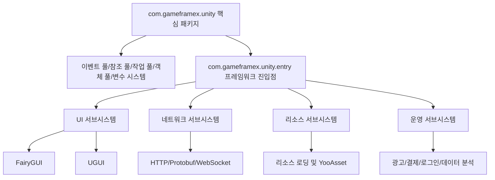

# 프로젝트 소개 및 특징

GameFrameX Unity는 GameFrameX 통합 솔루션의 Unity 클라이언트 구현으로, 핵심 프레임워크, 리소스 관리, UI 시스템, 네트워크 통신부터 광고, 결제, 로그인, 데이터 분석까지 게임 개발 및 운영 전 과정을 다루는 90개 이상의 모듈형 컴포넌트를 제공합니다. 본 프레임워크는 Unity 2019.4 이상 버전과 호환되며, "독립형 게임 프런트엔드/백엔드 통합 솔루션"으로 포지셔닝됩니다.

## 핵심 특징

- **모듈형 설계** — 각 컴포넌트는 독립 패키지로 구성되어 Unity 프로젝트의 `Packages/manifest.json`에 필요에 따라 도입 가능하며, 서로 간섭하지 않음
- **핫 업데이트 지원** — HybridCLR를 통합하여 C# 핫 업데이트를 지원하며, XLua 어댑터 패키지도 제공
- **다중 UI 솔루션** — FairyGUI와 UGUI를 동시에 지원하여 팀 기술 스택에 따라 자유롭게 선택 가능
- **비동기 우선** — UniTask 기반의 async/await 비동기 프로그래밍 모델
- **전 플랫폼 커버리지** — iOS, Android, WebGL, WeChat/Douyin/Alipay 미니게임
- **풍부한 운영 컴포넌트** — 광고(穿山甲, TopOn), 결제(Alipay, Apple, Google), 로그인(QQ, WeChat, Apple, Facebook, Google), 데이터 분석, 객체 스토리지 등을 바로 사용 가능

## 빠른 시작

### 1. Scoped Registry 설정

Unity 프로젝트의 `Packages/manifest.json`에 GameFrameX의 scoped registry를 추가합니다:

```json
{
  "scopedRegistries": [
    {
      "name": "GameFrameX",
      "url": "https://gameframex.upm.alianblank.uk",
      "scopes": [
        "com.gameframex"
      ]
    }
  ],
  "dependencies": {
    "com.gameframex.unity": "1.11.0"
  }
}
```

Source: [README.zh-CN.md](https://github.com/GameFrameX/GameFrameX.Unity/blob/main/README.zh-CN.md#L38-L57)

### 2. 필요한 컴포넌트 추가

`dependencies`에 필요에 따라 컴포넌트 패키지를 추가합니다. 버전 번호는 [Releases](https://github.com/GameFrameX/GameFrameX.Unity/releases) 페이지에서 확인할 수 있습니다. 일반적인 조합 예시:

```json
{
  "dependencies": {
    "com.gameframex.unity": "1.11.0",
    "com.gameframex.unity.asset": "2.0.0",
    "com.gameframex.unity.ui": "2.1.1",
    "com.gameframex.unity.ui.fairygui": "3.0.0",
    "com.gameframex.unity.procedure": "1.0.4",
    "com.gameframex.unity.event": "1.0.2",
    "com.gameframex.unity.fsm": "1.0.3",
    "com.gameframex.unity.network": "2.5.1",
    "com.gameframex.unity.sound": "1.0.6",
    "com.gameframex.unity.localization": "2.0.0"
  }
}
```

Source: [README.zh-CN.md](https://github.com/GameFrameX/GameFrameX.Unity/blob/main/README.zh-CN.md#L59-L82)

## 작동 원리 요약

GameFrameX의 핵심 패키지 `com.gameframex.unity`는 프레임워크 런타임과 에디터 기본 기능을 제공하며, 이벤트 풀, 참조 풀, 작업 풀, 객체 풀 및 변수 시스템을 포함합니다. 기타 컴포넌트(예: UI, 네트워크, 리소스 관리)는 이를 기반으로 독립 패키지 형태로 존재하며, Unity Package Manager의 scoped registry 메커니즘을 통해 필요에 따라 배포됩니다.



Source: [README.zh-CN.md](https://github.com/GameFrameX/GameFrameX.Unity/blob/main/README.zh-CN.md#L85-L113)

## 컴포넌트 개요

버전 번호는 [GameFrameX UPM Registry](https://gameframex.upm.alianblank.uk)에서 자동으로 가져옵니다. 아래 표는 각 그룹의 주요 컴포넌트를 요약한 것이며, 전체 목록은 [README.zh-CN.md](https://github.com/GameFrameX/GameFrameX.Unity/blob/main/README.zh-CN.md)에서 확인할 수 있습니다.

| 그룹 | 대표 컴포넌트 | 역할 |
|------|---------|------|
| 핵심 프레임워크 | com.gameframex.unity, entry, event, fsm, procedure | 런타임 골격, 이벤트 시스템, 상태 머신, 절차 관리 |
| 리소스 관리 | com.gameframex.unity.asset, download, builder | 리소스 로딩, 파일 다운로드, 빌드 파이프라인 |
| UI 프레임워크 | com.gameframex.unity.ui, ui.fairygui, ui.ugui | UI 기반 및 FairyGUI/UGUI 어댑터 |
| 네트워크 통신 | com.gameframex.unity.web, web.protobuff, psygames.unitywebsocket, webview | HTTP, Protobuf, WebSocket, WebView |
| 데이터 및 설정 | com.gameframex.unity.config, localization, focus-creative-games.luban | 설정 관리, 현지화, Luban 설정 생성 |
| 오디오 및 애니메이션 | com.gameframex.unity.sound, demigiant.dotween, esotericsoftware.spine | 오디오, DoTween 애니메이션, Spine 스켈레톤 애니메이션 |
| 씬 및 설정 | com.gameframex.unity.scene, setting | 씬 전환, 플레이어 설정 |
| 핫 업데이트 | com.gameframex.unity.tencent.xlua, xlua | XLua 핫 업데이트 솔루션 |
| 광고 | advertisement, advertisement.csj, advertisement.topon 및 미니게임 광고 | 穿山甲, TopOn, WeChat/Douyin/Alipay/Kuaishou 미니게임 광고 |
| 결제 | com.gameframex.unity.payment, payment.alipay, payment.apple, payment.google | 통합 결제 인터페이스 및 서드파티 구현 |
| 로그인 | login.apple, login.facebook, login.google, login.qq, login.wechat | 각 플랫폼 로그인 SDK |
| 데이터 분석 | gameanalytics, sentry, adjust 등 | 데이터 통계, 오류 추적, 어트리뷰션 분석 |
| 객체 스토리지 | objectstorage, objectstorage.aliyun, objectstorage.qiniu, objectstorage.tencent | Alibaba Cloud OSS, Qiniu, Tencent Cloud COS |
| 미니게임 | minigame.wechat, tuyoogame.yooasset.minigame.* | WeChat/YooAsset 미니게임 어댑터 |
| 플랫폼 도구 | getchannel, operationclipboard, systeminfo, sharesdk 등 | 채널 번호, 클립보드, 기기 식별, 공유 |

Source: [README.zh-CN.md](https://github.com/GameFrameX/GameFrameX.Unity/blob/main/README.zh-CN.md#L85-L239)

## 다음 단계

- 전체 컴포넌트 버전 및 설명 확인: [README.zh-CN.md](https://github.com/GameFrameX/GameFrameX.Unity/blob/main/README.zh-CN.md)
- 절차 관리 연동: [절차(Procedure) 컴포넌트](https://github.com/GameFrameX/GameFrameX.Unity/blob/main/README.zh-CN.md)
- 이벤트 시스템 연동: [이벤트(Event) 컴포넌트](https://github.com/GameFrameX/GameFrameX.Unity/blob/main/README.zh-CN.md)
- 네트워크 통신 연동: [네트워크(Network/Web) 컴포넌트](https://github.com/GameFrameX/GameFrameX.Unity/blob/main/README.zh-CN.md)
- 공식 문서 사이트: [GameFrameX 문서](https://gameframex.doc.alianblank.com)
- 커뮤니티 지원: QQ 그룹 467608841