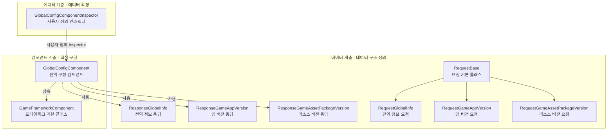

# GlobalConfig 컴포넌트 소개

GlobalConfig 컴포넌트는 GameFrameX 프레임워크의 핵심 구성 요소로, Unity 게임 프로젝트에서 전역 구성 관리 기능을 제공합니다. 이 컴포넌트는 애플리케이션 버전 확인, 리소스 버전 확인, AOT 코드 목록 등 전역 구성 정보를 중앙에서 관리하며, 에디터 시각화 구성과 코드 동적 설정 두 가지 방식을 지원합니다.

## 개요

GlobalConfig 컴포넌트는 게임 프로젝트에서 전역 구성이 분산되어 관리하기 어려운 문제를 해결하기 위해 설계되었습니다. 게임 개발 과정에서 서버 주소, 버전 확인 인터페이스, 앱 스토어 링크 등 전역적으로 접근해야 하는 구성 데이터가 많이 존재합니다. 전통적인 방식은 이러한 구성을 하드코딩하거나 여러 구성 파일에 분산시키는 것이므로, 유지 관리가 어렵고 오류가 발생하기 쉽습니다.

GlobalConfig 컴포넌트는 통일된 인터페이스와 표준화된 데이터 모델을 통해 모든 전역 구성을 중앙에서 관리합니다. 이 컴포넌트는 `GameFrameworkComponent`를 상속하며 Unity 컴포넌트로 씬에 직접 추가할 수 있고, GameFrameX 프레임워크의 컴포넌트 관리 시스템을 통해 전역적으로 접근할 수 있습니다. 이러한 설계는 구성 데이터의 설정과 가져오기를 간단하고 통일되게 만들며, 동시에 에디터 구성과 런타임 동적 설정 두 가지 모드를 지원합니다.

컴포넌트의 핵심 기능은 네 가지 측면을 포함합니다: 첫째, `CheckAppVersionUrl` 속성은 애플리케이션 버전 확인 URL 주소를 저장하여 게임이 새 버전 사용 가능 여부를 쿼리할 수 있게 합니다; 둘째, `CheckResourceVersionUrl` 속성은 리소스 버전 확인 URL 주소를 저장하여 핫 업데이트 기능의 리소스 관리를 지원합니다; 셋째, `AOTCodeList` 및 `AOTCodeLists` 속성은 AOT 보충 메타데이터 목록을 구성하여 IL2CPP 빌드 모드에서의 제네릭 문제를 해결합니다; 마지막으로 `Content` 속성은 임의의 추가 콘텐츠를 저장하여 비즈니스 확장 요구를 충족합니다.

## 아키텍처 설계

GlobalConfig 컴포넌트는 계층형 아키텍처 설계를 채택하며, 데이터 계층, 컴포넌트 계층, 에디터 계층 세 부분으로 나뉩니다. 데이터 계층은 서버와의 통신을 위한 데이터 구조를 정의하는 요청 클래스와 응답 클래스를 포함합니다; 컴포넌트 계층은 핵심 `GlobalConfigComponent` 클래스로 구성 데이터의 저장 및 접근을 담당합니다; 에디터 계층은 사용자 정의 Inspector를 제공하여 에디터에서의 구성 작업을 간소화합니다.

데이터 계층은 상속 구조를 사용하여 요청 클래스를 구성합니다. `RequestBase`는 모든 요청 클래스의 기본 클래스로, 언어(Language), 프로그램 버전(AppVersion), 실행 플랫폼(Platform), 패키지 이름(PackageName), 채널(Channel), 하위 채널(SubChannel)을 포함한 공통 속성을 정의합니다. 구체적인 요청 클래스인 `RequestGlobalInfo`, `RequestGameAppVersion`, `RequestGameAssetPackageVersion`은 이 기본 클래스를 상속하며, 필요에 따라 각각의 비즈니스 필드를 확장할 수 있습니다.

응답 클래스 역시 유사한 설계 패턴을 채택합니다. `ResponseGlobalInfo`는 CheckAppVersionUrl, CheckResourceVersionUrl, AOTCodeList, Content 등의 구성 정보를 포함합니다; `ResponseGameAppVersion`은 강제 업그레이드 여부, 다운로드 주소, 업데이트 필요 여부, 업데이트 공지, 업데이트 제목을 포함한 애플리케이션 버전 확인 결과를 포함합니다; `ResponseGameAssetPackageVersion`은 언어, 버전 번호, 리소스 패키지 이름, 경로, 플랫폼, 다운로드 루트 경로, 패키지 이름, 게임 버전, 채널 이름을 포함한 리소스 버전 정보를 포함합니다.

컴포넌트 계층의 `GlobalConfigComponent` 클래스는 `GameFrameworkComponent`를 상속하며, `[DisallowMultipleComponent]` 및 `[AddComponentMenu("Game Framework/Global Config")]` 속성으로 표시되어 씬에 하나의 인스턴스만 존재하도록 보장하고 에디터 메뉴에서 쉽게 찾을 수 있습니다. 이 클래스는 직렬화 필드를 통해 구성 데이터를 저장하고, 속성 접근자를 통해 런타임 수정을 지원합니다.

에디터 계층의 `GlobalConfigComponentInspector`는 `GameFrameworkInspector`를 상속하며, 컴포넌트에 사용자 정의 Inspector 인터페이스를 제공합니다. 이 인스펙터는 구성 항목을 분류하여 표시하고, 에디트 모드에서 각 속성을 시각적으로 구성할 수 있도록 지원하며, 런타임에는 데이터 일관성을 보장하기 위해 편집을 비활성화합니다.

## 핵심 기능 특징

GlobalConfig 컴포넌트는 다음과 같은 핵심 기능 특징을 제공합니다:

**버전 확인 인터페이스 관리** — 컴포넌트는 `CheckAppVersionUrl` 및 `CheckResourceVersionUrl` 두 가지 속성을 제공하여, 각각 애플리케이션 버전 확인 인터페이스와 리소스 버전 확인 인터페이스를 구성합니다. 이 두 인터페이스는 게임 핫 업데이트 시스템의 핵심 구성 요소로, 게임 시작 시 이러한 인터페이스를 통해 최신 버전 정보를 가져와 애플리케이션 업데이트 또는 새 리소스 패키지 다운로드 필요 여부를 판단합니다.

**AOT 코드 목록 구성** — IL2CPP를 사용하여 Unity 프로젝트를 빌드할 때 AOT 컴파일의 제한으로 인해 일부 제네릭 타입이 정상적으로 사용되지 않을 수 있습니다. 컴포넌트는 `AOTCodeList` 및 `AOTCodeLists` 속성을 제공하여 개발자가 보충이 필요한 AOT 메타데이터 목록을 구성할 수 있도록 하여, 런타임 제네릭 인스턴스화가 정상적으로 작동하도록 보장합니다.

**런타임 구성 업데이트** — 컴포넌트는 코드를 통한 동적 구성 데이터 업데이트를 지원합니다. `SetOriginalData` 메서드를 통해 원본 데이터 문자열을 설정할 수 있고, `SetGlobalConfig` 메서드를 통해 완전한 `ResponseGlobalInfo` 객체를 설정할 수 있습니다. 이를 통해 게임은 서버에서 최신 전역 구성을 가져와 재배포 없이 구성을 동적으로 업데이트할 수 있습니다.

**전역 구성 접근** — GameFrameworkComponent를 상속하는 컴포넌트는 프레임워크의 컴포넌트 관리 시스템을 통해 게임의 어느 위치에서나 편리하게 접근할 수 있습니다. 이는 구성 데이터의 일관성과 관리 가능성을 보장하며, 싱글톤이나 정적 변수 접근으로 인한 결합 문제를 방지합니다.

## 사용 시나리오

GlobalConfig 컴포넌트는 다음과 같은 전형적인 사용 시나리오에 적합합니다:

**게임 시작 구성** — 게임 시작 시 서버 주소, 버전 확인 인터페이스 등 기본 구성 정보를 가져와야 합니다. 이러한 구성을 GlobalConfig 컴포넌트에 저장하면 다른 시스템(예: 네트워크 모듈, 업데이트 모듈)이 컴포넌트에서 직접 필요한 정보를 가져올 수 있습니다.

**핫 업데이트 시스템 통합** — 핫 업데이트 시스템은 리소스 버전 확인 URL 주소를 알아야 합니다. GlobalConfig 컴포넌트를 통해 이러한 URL을 중앙에서 관리하면 핫 업데이트 시스템이 하드코딩 없이 구성에서 유연하게 읽어올 수 있습니다.

**다중 채널 빌드** — 채널마다 다른 서버 주소나 구성 매개변수가 필요할 수 있습니다. GlobalConfig 컴포넌트를 통해 채널에 따라 해당 구성 값을 동적으로 설정하여, 하나의 코드로 다중 채널을 지원할 수 있습니다.

**동적 구성 업데이트** — 게임 출시 후 특정 구성 매개변수를 조정해야 할 수 있습니다. `SetGlobalConfig` 메서드를 통해 서버에서 최신 구성을 가져와 동적 업데이트를 구현하면 플레이어가 설치 패키지를 다시 다운로드할 필요가 없습니다.

## 관련 링크

- [설치 방법](../2-installation.1-install-methods) - GlobalConfig 컴포넌트 설치 방법 알아보기
- [씬에 추가](../3-getting-started.1-add-to-scene) - Unity 씬에서 컴포넌트 사용 방법 알아보기
- [속성 구성](../3-getting-started.2-configure-properties) - 각 구성 속성의 역할 자세히 알아보기
- [코드 접근](../3-getting-started.3-code-access) - 코드에서 전역 구성에 접근하는 방법 알아보기
- [GlobalConfigComponent 상세](../4-core-component.1-global-config-component) - 핵심 컴포넌트 완전한 API 참조
- [요청 클래스 상세](../5-data-structures.1-request-classes) - 요청 데이터 구조 설명
- [응답 클래스 상세](../5-data-structures.2-response-classes) - 응답 데이터 구조 설명
- [사용자 정의 Inspector](../6-editor-configuration.1-custom-inspector) - 에디터 구성 상세
- [AOT 코드 목록 구성](../7-aot-configuration.1-aot-code-list) - AOT 구성 설명
- [FAQ](../8-troubleshooting.1-faq) - 자주 묻는 질문 답변
