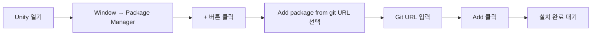
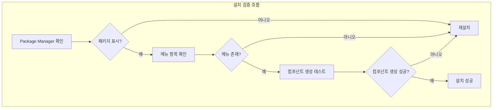

# 설치 방식

이 문서는 Unity 프로젝트에서 GlobalConfig全局 설정 컴포넌트를 설치하는 방법을 소개합니다.

## 개요

GlobalConfig는 GameFrameX 프레임워크의 핵심 컴포넌트 중 하나로, 게임의全局 설정 정보(애플리케이션 버전 검사 주소, 리소스 버전 검사 주소, 서버 주소 등)를 관리합니다. 이 컴포넌트는 Unity Package Manager (UPM)方式进行 관리하며 다양한 설치途径를 지원하여 서로 다른 개발 워크플로에 적응합니다.

## 설치 전제 조건

GlobalConfig 컴포넌트를 설치하기 전에 개발 환경이 다음 요구 사항을 충족하는지 확인하세요:

| 요구 사항 |最低版本 | 설명 |
|------|----------|------|
| Unity 에디터 | 2017.1 | 지원되는 Unity 버전 |
| 패키지 관리자 | 내장 | Unity 2017.1+ 내장 |

### 의존성 설명

GlobalConfig 컴포넌트는 다음 GameFrameX 핵심 패키지에 의존합니다:

| 의존 패키지 | 버전 요구 | 설명 |
|--------|----------|------|
| com.gameframex.unity | 1.1.1 | GameFrameX 핵심 프레임워크 |
| com.gameframex.unity.web | 1.1.2 | Web 네트워크 요청 컴포넌트 |

> **주의**: UPM 방식으로 설치할 때 의존성은 자동으로解析되고 설치됩니다. 수동으로 의존 관계를 처리할 필요가 없습니다.

## 설치 방식

GlobalConfig 컴포넌트는 세 가지 설치 방식을 제공하며 프로젝트 요구에 따라 가장 적합한 방식을 선택할 수 있습니다:

### 방식 1: manifest.json을 통한 설치 (권장)

가장 권장하는 설치 방식으로, 버전 관리와 팀 협업에 편리합니다.项目的 `Packages/manifest.json` 파일에 패키지 의존성을 추가해야 합니다.

**작업 단계:**

1. Unity 프로젝트의 `Packages` 폴더를 찾습니다
2. 텍스트 편집기로 `manifest.json` 파일을 엽니다
3. `dependencies` 노드 아래에 다음 내용을 추가합니다:

```json
{
  "dependencies": {
    "com.gameframex.unity.globalconfig": "https://github.com/GameFrameX/com.gameframex.unity.globalconfig.git"
  }
}
```

> **주의**: 이전 버전의 Git URL (`https://github.com/GameFrameX/com.gameframex.unity.globalconfig.git`)을 사용 중인 경우 계속 사용할 수 있지만 공식 저장소 주소로 업데이트하는 것을 권장합니다.

**완전한 manifest.json 예시:**

```json
{
  "dependencies": {
    "com.gameframex.unity.globalconfig": "https://github.com/GameFrameX/com.gameframex.unity.globalconfig.git",
    "com.unity.collab-proxy": "1.15.18",
    "com.unity.ide.rider": "3.0.15",
    "com.unity.ide.visualstudio": "2.0.16",
    "com.unity.ide.vscode": "1.2.5",
    "com.unity.test-framework": "1.1.31",
    "com.unity.textmeshpro": "3.0.6",
    "com.unity.timeline": "1.6.4",
    "com.unity.ugui": "1.0.0",
    "com.unity.modules.ai": "1.0.0",
    "com.unity.modules.androidjni": "1.0.0",
    "com.unity.modules.animation": "1.0.0",
    "com.unity.modules.assetbundle": "1.0.0",
    "com.unity.modules.audio": "1.0.0",
    "com.unity.modules.cloth": "1.0.0",
    "com.unity.modules.director": "1.0.0",
    "com.unity.modules.imageconversion": "1.0.0",
    "com.unity.modules.imgui": "1.0.0",
    "com.unity.modules.jsonserialize": "1.0.0",
    "com.unity.modules.particlesystem": "1.0.0",
    "com.unity.modules.physics": "1.0.0",
    "com.unity.modules.physics2d": "1.0.0",
    "com.unity.modules.screencapture": "1.0.0",
    "com.unity.modules.terrain": "1.0.0",
    "com.unity.modules.terrainphysics": "1.0.0",
    "com.unity.modules.tilemap": "1.0.0",
    "com.unity.modules.ui": "1.0.0",
    "com.unity.modules.uielements": "1.0.0",
    "com.unity.modules.umbra": "1.0.0",
    "com.unity.modules.unityanalytics": "1.0.0",
    "com.unity.modules.unitywebrequest": "1.0.0",
    "com.unity.modules.unitywebrequestassetbundle": "1.0.0",
    "com.unity.modules.unitywebrequestaudio": "1.0.0",
    "com.unity.modules.unitywebrequesttexture": "1.0.0",
    "com.unity.modules.unitywebrequestwww": "1.0.0",
    "com.unity.modules.vehicles": "1.0.0",
    "com.unity.modules.video": "1.0.0",
    "com.unity.modules.vr": "1.0.0",
    "com.unity.modules.wind": "1.0.0",
    "com.unity.modules.xr": "1.0.0"
  }
}
```

4. 파일을 저장하고 Unity 에디터로 돌아갑니다
5. 패키지 관리자가 자동으로 의존 패키지를 다운로드하고 가져올 때까지 기다립니다

### 방식 2: Unity Package Manager를 통한 설치

그래픽 인터페이스 사용을 선호하는 경우 Unity 내장 Package Manager를 통해 설치할 수 있습니다.

**작업 단계:**

1. Unity 에디터를 엽니다
2. 메뉴로 이동: **Window** → **Package Manager**
3. Package Manager 창에서 왼쪽 상단의 **+** 버튼을 클릭합니다
4. **Add package from git URL...** 옵션을 선택합니다
5. 입력 상자에 다음 Git URL을 붙여넣습니다:

```
https://github.com/GameFrameX/com.gameframex.unity.globalconfig.git
```

6. **Add** 버튼을 클릭하여 설치를 시작합니다
7. 다운로드와 가져오기가 완료될 때까지 기다립니다



### 방식 3: 수동 설치 (로컬 개발)

로컬 개발 버전을 사용해야 하거나 네트워크에 접근할 수 없는 경우 수동 설치 방식을 사용할 수 있습니다.

**작업 단계:**

1. GitHub 저장소에 접근하여 소스 코드를 다운로드합니다:

   ```
   https://github.com/GameFrameX/com.gameframex.unity.globalconfig.git
   ```

2. 다운로드한 폴더 내용을 Unity 프로젝트의 `Packages` 디렉토리에 복사합니다
3. Unity가 규격에 부합하는 패키지를 자동으로 인식하고 로드합니다
4. 버전을 업데이트해야 하는 경우 폴더 내용을 교체하기만 하면 됩니다

**주의 사항:**
- 패키지 폴더에는 `package.json` 파일이 있어야 Unity가 올바르게 인식합니다
- 의미 있는 폴더 이름을 사용할 것을 권장합니다 (예: `Packages/com.gameframex.unity.globalconfig/`)

## 설치 검증

설치 완료 후 다음 방식으로 성공 여부를 확인할 수 있습니다:

1. **Package Manager 확인**: Package Manager 창에서 `Game Frame X Global Config` 패키지가 표시되는지 확인합니다
2. **메뉴 항목 확인**: Unity 메뉴 막대에서 **Game Framework** → **Global Config** 메뉴 항목이 나타나는지 확인합니다
3. **컴포넌트 생성**: Scene에서 빈 객체를 생성하고 **Add Component**를 우클릭하여 "Global Config"를 검색하여 컴포넌트가 정상적으로 추가될 수 있는지 확인합니다



## 일반적인 문제

### Q1: 설치 실패, 네트워크 오류 표시

**솔루션**:
- 네트워크 연결이 정상인지 확인합니다
- 프록시 또는 VPN 사용을 시도합니다
- 방식 3을 사용하여 수동 설치를 진행합니다

### Q2: 의존성 버전 충돌

**솔루션**:
- 다른 패키지의 `com.gameframex.unity` 버전 요구 사항을 확인합니다
- manifest.json에서 호환되는 버전 번호를 명시적으로 지정합니다

### Q3: 패키지 버전 너무 오래됨

**솔루션**:
- Git URL 설치 방식은 기본적으로 최신 버전을 획득합니다
- 특정 버전이 필요한 경우 URL 뒤에 버전 태그를 추가할 수 있습니다:
  ```
  https://github.com/GameFrameX/com.gameframex.unity.globalconfig.git#1.3.0
  ```

## 관련 링크

- [GitHub 저장소](https://github.com/GameFrameX/com.gameframex.unity.globalconfig.git)
- [GameFrameX 공식 문서](https://gameframex.doc.alianblank.com)
- [Scene에 추가](./3-getting-started.1-add-to-scene)
- [설정 속성](./3-getting-started.2-configure-properties)
- [코드 접근](./3-getting-started.3-code-access)