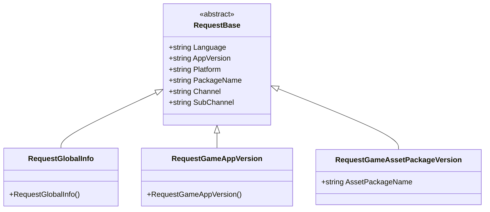
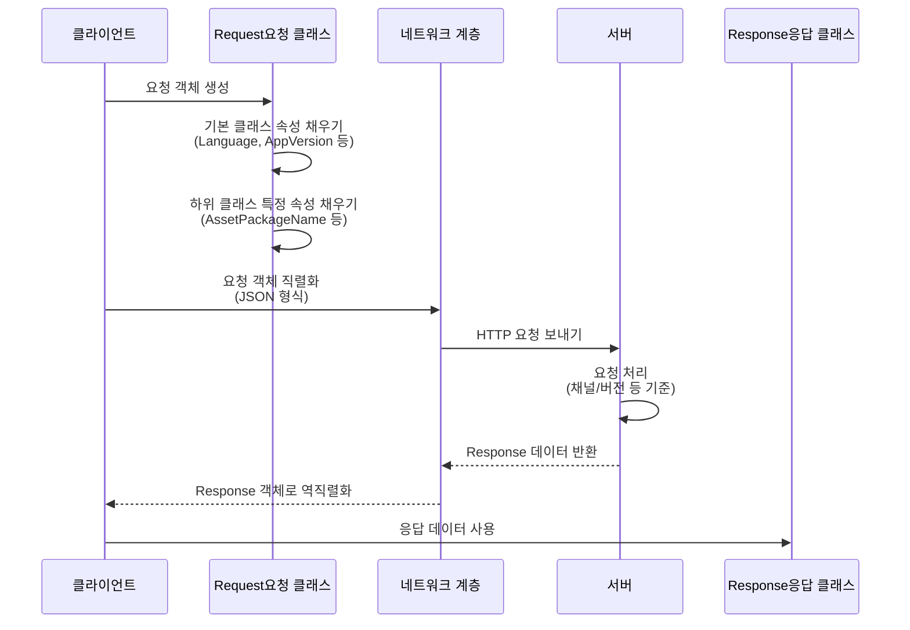

# 요청 클래스

요청 클래스는 GlobalConfig 시스템에서 클라이언트 요청 데이터를 캡슐화하는 DTO(Data Transfer Object) 클래스입니다. 클라이언트 환경 정보를携带하여 서버에 설정 데이터를 요청합니다.

## 개요

요청 클래스는 객체 지향 설계 패턴을 채택하여 `RequestBase` 기본 클래스를 상속하여 통일된 데이터 구조를 구현하고, 각 구체적인 요청 유형이 자신의 특정 필드를 확장할 수 있도록 허용합니다. 이러한 설계는 다음을 보장합니다:

- **코드 재사용**: 모든 요청에 공통적인 속성(언어, 버전, 플랫폼 등)은 기본 클래스에서 통일하여 관리
- **유형 안전성**: 각 요청 유형이 명확한 의미를 가지며 구별과 관리가 편리함
- **확장성**: 상속을 통해 새 요청 유형을 쉽게 추가하거나 기존 요청을 확장할 수 있음

### 핵심 설계 의도

GlobalConfig 시스템은 서버의 설정 데이터를 가져와야 하며, 클라이언트는 서버에 **누구인가**(채널, 패키지 이름), **어디에 있는가**(플랫폼), **버전은 무엇인가**(애플리케이션 버전) 등의 정보를 알려줘야 합니다. 요청 클래스는 바로 이 역할을 담당합니다—클라이언트 컨텍스트 정보를 직렬화하여 서버에 보냅니다.

## 클래스 계층 구조



이 클래스 다이어그램은 요청 클래스의 완전한 상속 관계를 보여줍니다. 모든 구체적인 요청 유형은 추상 기본 클래스 `RequestBase`를 상속하며, 후자는 모든 요청에 공통적인 속성을 정의합니다.

## RequestBase 기본 클래스

`RequestBase`는 모든 요청 클래스의 추상 기본 클래스로, 클라이언트 요청 시携带해야 하는 공통 정보를 정의합니다.

```csharp
namespace GameFrameX.GlobalConfig.Runtime
{
    /// <summary>
    /// 요청 기본 클래스
    /// </summary>
    public abstract class RequestBase
    {
        /// <summary>
        /// 언어
        /// </summary>
        public string Language { get; set; }

        /// <summary>
        /// 프로그램 버전
        /// </summary>
        public string AppVersion { get; set; }

        /// <summary>
        /// 실행 플랫폼
        /// </summary>
        public string Platform { get; set; }

        /// <summary>
        /// 패키지 이름
        /// </summary>
        public string PackageName { get; set; }

        /// <summary>
        /// 채널
        /// </summary>
        public string Channel { get; set; }

        /// <summary>
        /// 하위 채널
        /// </summary>
        public string SubChannel { get; set; }
    }
}
```

> Source: [RequestBase.cs](https://github.com/GameFrameX/com.gameframex.unity.globalconfig/blob/main/Runtime/GlobalConfig/RequestBase.cs#L1-L38)

### 속성 설명

| 속성 | 유형 | 설명 |
|------|------|------|
| Language | string | 클라이언트의 현재 사용 언어, 서버가 해당 언어의 설정 반환용 |
| AppVersion | string | 애플리케이션 버전 번호, 버전 검증 및 차별화 설정용 |
| Platform | string | 실행 플랫폼(iOS, Android, Windows 등) |
| PackageName | string | 애플리케이션 패키지 이름, 다른 애플리케이션 구별용 |
| Channel | string | 배포 채널 식별자, 채널별 설정용 |
| SubChannel | string | 하위 채널 식별자, 더 세밀한 채널 구별용 |

### 설계 의도

이러한 공통 속성은 게임 및 애플리케이션 설정 시스템에서 흔히 사용되는 파티션 차원입니다. 요청에 이러한 정보를携带함으로써 서버는:
- 버전에 따라 다른 설정 반환 가능(핫 업데이트)
- 플랫폼에 따라 다른 리소스 경로 반환 가능
- 채널에 따라 다른 활동 설정 반환 가능
- 언어에 따라 지역화된 콘텐츠 반환 가능

## 구체적인 요청 클래스

### RequestGlobalInfo

전역 정보 요청 클래스로, 게임의 전역 설정 정보를 가져오는 데 사용됩니다.

```csharp
namespace GameFrameX.GlobalConfig.Runtime
{
    /// <summary>
    /// 전역 정보 요청 객체, 자체 상속 구현으로 자신의 필드를 구현할 수 있음
    /// </summary>
    public class RequestGlobalInfo : RequestBase
    {
    }
}
```

> Source: [RequestGlobalInfo.cs](https://github.com/GameFrameX/com.gameframex.unity.globalconfig/blob/main/Runtime/GlobalConfig/RequestGlobalInfo.cs#L1-L9)

**설계 의도**: 이 클래스는 `RequestBase`를 상속하여 게임 전역 설정(서버 주소, 버전 확인 인터페이스 등)을 포함한 응답 데이터를 요청하는 데 사용됩니다. 문서 주석은 개발자가 이 클래스를 상속하여 사용자 정의 필드를 추가할 수 있음을 나타냅니다.

### RequestGameAppVersion

게임 버전 요청 클래스로, 애플리케이션에 새 버전이 있는지 확인하는 데 사용됩니다.

```csharp
namespace GameFrameX.GlobalConfig.Runtime
{
    /// <summary>
    /// 게임 버전 요청 객체, 자체 상속 구현으로 자신의 필드를 구현할 수 있음
    /// </summary>
    public class RequestGameAppVersion : RequestBase
    {
    }
}
```

> Source: [RequestGameAppVersion.cs](https://github.com/GameFrameX/com.gameframex.unity.globalconfig/blob/main/Runtime/GlobalConfig/RequestGameAppVersion.cs#L1-L9)

**설계 의도**: 이 클래스는 서버에 현재 애플리케이션 버전 상태를 쿼리하는 데 사용됩니다. 서버는 버전 비교 결과를 반환하여 사용자에게 업데이트 필요 여부를 알릴 수 있습니다.

### RequestGameAssetPackageVersion

게임 리소스 패키지 버전 요청 클래스로, 특정 리소스 패키지의 업데이트 필요 여부를 확인하는 데 사용됩니다.

```csharp
namespace GameFrameX.GlobalConfig.Runtime
{
    /// <summary>
    /// 게임 리소스 버전 요청 객체, 자체 상속 구현으로 자신의 필드를 구현할 수 있음
    /// </summary>
    public class RequestGameAssetPackageVersion : RequestBase
    {
        /// <summary>
        /// 리소스 패키지 이름
        /// </summary>
        public string AssetPackageName { get; set; }
    }
}
```

> Source: [RequestGameAssetPackageVersion.cs](https://github.com/GameFrameX/com.gameframex.unity.globalconfig/blob/main/Runtime/GlobalConfig/RequestGameAssetPackageVersion.cs#L1-L13)

**설계 의도**: `RequestGameAppVersion`과 달리, 이 클래스는 리소스 패키지의 버전 확인 전용입니다. `AssetPackageName` 속성을 통해 확인할 구체적인 리소스 패키지 이름을 지정합니다. 이는 게임 리소스 핫 업데이트 기능을 지원하며, 전체 애플리케이션가 아니라 변경된 부분만 업데이트할 수 있습니다.

## 요청 흐름



이 흐름 다이어그램은 요청 객체의 생성부터 서버 응답까지의 완전한 생명 주기를 보여줍니다. 요청 객체는 필요한 컨텍스트 정보를携带하여 서버가 정확한 응답 결정을 내릴 수 있도록 합니다.

## 요청 클래스 확장

내장된 요청 클래스로 요구 사항을 충족할 수 없는 경우, 개발자는 상속을 통해 확장할 수 있습니다:

```csharp
// 사용자 정의 요청 예시
public class RequestCustomConfig : RequestBase
{
    /// <summary>
    /// 사용자 정의 필드: 씬 ID
    /// </summary>
    public int SceneId { get; set; }

    /// <summary>
    /// 사용자 정의 필드: 플레이어 ID
    /// </summary>
    public string PlayerId { get; set; }
}
```

**확장 단계**:
1. `RequestBase`를 상속합니다
2. 비즈니스에 필요한 특정 속성을 추가합니다
3. 요청을 보낼 때 인스턴스를 생성하여 데이터를 채웁니다

## 관련 링크

- [응답 클래스](./5-data-structures.2-response-classes) - 요청에 대응하는 응답 데이터 구조 이해하기
- [GlobalConfigComponent](./4-core-component.1-global-config-component) - 요청을 사용하여 설정 가져오는 방법 이해하기
- [빠른 시작 - 코드 접근](./3-getting-started.3-code-access) - 코드에서 이러한 요청 클래스를 사용하는 방법 이해하기