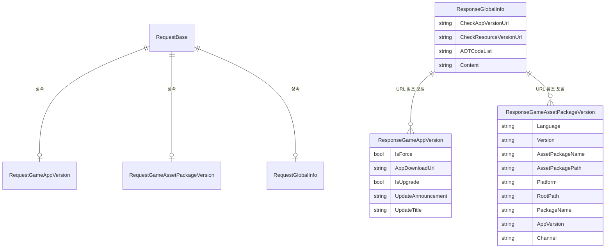

# 응답 클래스

응답 클래스(Response Classes)는 GlobalConfig 시스템에서 서버에서 반환된 설정 데이터를承载하는数据传输对象(DTO)입니다. 각 응답 클래스는 특정 유형의 설정 정보에 대응합니다.

## 개요

GlobalConfig 시스템에서 클라이언트가 서버에 요청을 보낸 후, 서버는 해당하는 설정 데이터를 반환합니다. 반환된 데이터는 응답 클래스를 통해 구조화되고 유형화되어, 코드가 유형 안전하게 설정 정보에 접근할 수 있습니다.

GlobalConfig는 세 가지 주요 응답 클래스를 제공합니다:

| 응답 클래스 | 용도 |
|--------|------|
| ResponseGameAppVersion | 게임 애플리케이션 버전 정보 |
| ResponseGameAssetPackageVersion | 게임 리소스 패키지 버전 정보 |
| ResponseGlobalInfo | 전역 설정 정보 |

### 설계 의도

응답 클래스의 설계는 다음 원칙을 따릅니다:

1. **간결성**: 간단한 POCO 클래스를 사용하여 추가 의존성을导入하지 않음
2. **유형 안전성**: 각 설정 유형이 전용 클래스를 가지며 강력한 유형 접근 제공
3. **확장성**: 상속 또는 조합을 통해 새 응답 유형 확장 가능

## 클래스 구조 상세

### ResponseGameAppVersion

게임 버전 정보 응답 클래스로, 앱 업그레이드 관련 모든 정보를 포함합니다.

```csharp
namespace GameFrameX.GlobalConfig.Runtime
{
    /// <summary>
    /// 게임 버전 정보
    /// </summary>
    public class ResponseGameAppVersion
    {
        /// <summary>
        /// 강제 업그레이드 여부
        /// </summary>
        public bool IsForce { get; set; }

        /// <summary>
        /// 프로그램 다운로드 주소
        /// </summary>
        public string AppDownloadUrl { get; set; }

        /// <summary>
        /// 업데이트 필요 여부
        /// </summary>
        public bool IsUpgrade { get; set; }

        /// <summary>
        /// 업데이트 공지
        /// </summary>
        public string UpdateAnnouncement { get; set; }

        /// <summary>
        /// 업데이트 제목
        /// </summary>
        public string UpdateTitle { get; set; }
    }
}
```

> Source: [ResponseGameAppVersion.cs](https://github.com/GameFrameX/com.gameframex.unity.globalconfig/blob/main/Runtime/GlobalConfig/ResponseGameAppVersion.cs#L1-L33)

**속성 설명:**

| 속성 | 유형 | 설명 |
|------|------|------|
| IsForce | bool | 강제 업그레이드 여부, true는 사용자가 게임을 계속하려면 반드시 업그레이드해야 함을 의미 |
| AppDownloadUrl | string | 새 버전 애플리케이션의 다운로드 URL 주소 |
| IsUpgrade | bool | 사용 가능한 업데이트 여부, true는 서버에 새 버전이 있음을 의미 |
| UpdateAnnouncement | string | 업데이트 공지 내용, 일반적으로 사용자에게 표시됨 |
| UpdateTitle | string | 업데이트 안내의 제목 |

### ResponseGameAssetPackageVersion

게임 리소스 패키지 버전 정보 응답 클래스로, 리소스 업데이트 관련 구성을 포함합니다.

```csharp
namespace GameFrameX.GlobalConfig.Runtime
{
    /// <summary>
    /// 게임 리소스 버전 정보
    /// </summary>
    public class ResponseGameAssetPackageVersion
    {
        /// <summary>
        /// 언어
        /// </summary>
        public string Language { get; set; }

        /// <summary>
        /// 리소스 버전
        /// </summary>
        public string Version { get; set; }

        /// <summary>
        /// 리소스 패키지 이름
        /// </summary>
        public string AssetPackageName { get; set; }

        /// <summary>
        /// 리소스 패키지 경로
        /// </summary>
        public string AssetPackagePath { get; set; }

        /// <summary>
        /// 플랫폼
        /// </summary>
        public string Platform { get; set; }

        /// <summary>
        /// 다운로드 루트 경로
        /// </summary>
        public string RootPath { get; set; }

        /// <summary>
        /// 패키지 이름
        /// </summary>
        public string PackageName { get; set; }

        /// <summary>
        /// 게임 버전
        /// </summary>
        public string AppVersion { get; set; }

        /// <summary>
        /// 채널 이름
        /// </summary>
        public string Channel { get; set; }
    }
}
```

> Source: [ResponseGameAssetPackageVersion.cs](https://github.com/GameFrameX/com.gameframex.unity.globalconfig/blob/main/Runtime/GlobalConfig/ResponseGameAssetPackageVersion.cs#L1-L53)

**속성 설명:**

| 속성 | 유형 | 설명 |
|------|------|------|
| Language | string | 현재 언어 설정 (예: "zh-CN", "en-US") |
| Version | string | 리소스 패키지 버전 번호 (예: "1.0.0") |
| AssetPackageName | string | 리소스 패키지 이름 |
| AssetPackagePath | string | 리소스 패키지 상대 경로 |
| Platform | string | 실행 플랫폼 (예: "Android", "iOS", "Windows") |
| RootPath | string | 리소스 다운로드의 루트 디렉토리 URL |
| PackageName | string | 애플리케이션 패키지 이름 |
| AppVersion | string | 애플리케이션 버전 번호 |
| Channel | string | 채널 식별자 |

### ResponseGlobalInfo

전역 정보 응답 클래스로, 시스템 수준의 설정 엔드포인트 및 전역 매개변수를 포함합니다.

```csharp
namespace GameFrameX.GlobalConfig.Runtime
{
    /// <summary>
    /// 전역 정보 응답 객체
    /// </summary>
    public class ResponseGlobalInfo
    {
        /// <summary>
        /// 프로그램 버전 확인 주소
        /// </summary>
        public string CheckAppVersionUrl { get; set; }

        /// <summary>
        /// 리소스 버전 확인 주소
        /// </summary>
        public string CheckResourceVersionUrl { get; set; }

        /// <summary>
        /// AOT 코드 목록
        /// </summary>
        public string AOTCodeList { get; set; }

        /// <summary>
        /// 확장 콘텐츠
        /// </summary>
        public string Content { get; set; }
    }
}
```

> Source: [ResponseGlobalInfo.cs](https://github.com/GameFrameX/com.gameframex.unity.globalconfig/blob/main/Runtime/GlobalConfig/ResponseGlobalInfo.cs#L1-L28)

**속성 설명:**

| 속성 | 유형 | 설명 |
|------|------|------|
| CheckAppVersionUrl | string | 애플리케이션 버전을 확인하는 서버 인터페이스 주소 |
| CheckResourceVersionUrl | string | 리소스 패키지 버전을 확인하는 서버 인터페이스 주소 |
| AOTCodeList | string | AOT 컴파일 코드 목록의 JSON 문자열 |
| Content | string | 추가 확장 콘텐츠, 사용자 정의 설정에 사용 가능 |

## 데이터 흐름 관계

다음 차트는 요청 클래스와 응답 클래스 간의 대응 관계를 보여줍니다:



## 사용 예시

### 기본 사용법

게임 시작 시 서버에서 전역 설정을 가져옵니다:

```csharp
using GameFrameX.GlobalConfig.Runtime;
using UnityEngine;

public class ConfigManager : MonoBehaviour
{
    public void LoadGlobalConfig(string jsonData)
    {
        // 전역 설정 응답 파싱
        var globalInfo = new ResponseGlobalInfo
        {
            CheckAppVersionUrl = "https://api.example.com/check-app-version",
            CheckResourceVersionUrl = "https://api.example.com/check-resource-version",
            AOTCodeList = "[\"Method1\", \"Method2\"]",
            Content = "{\"config\": \"value\"}"
        };

        Debug.Log($"App 버전 URL: {globalInfo.CheckAppVersionUrl}");
        Debug.Log($"리소스 버전 URL: {globalInfo.CheckResourceVersionUrl}");
    }
}
```

### 게임 버전 확인 응답 처리

```csharp
using GameFrameX.GlobalConfig.Runtime;
using UnityEngine;

public class VersionChecker
{
    public void HandleVersionResponse(ResponseGameAppVersion response)
    {
        if (response.IsUpgrade)
        {
            Debug.Log($"새 버전 발견: {response.UpdateTitle}");
            Debug.Log($"업데이트 공지: {response.UpdateAnnouncement}");

            if (response.IsForce)
            {
                Debug.LogWarning("현재 버전이 오래되었으므로 강제 업데이트가 필요합니다!");
                // 강제 업데이트 인터페이스 표시
            }
            else
            {
                // 선택적 업데이트 인터페이스 표시
            }

            // 다운로드 페이지 열기
            Application.OpenURL(response.AppDownloadUrl);
        }
        else
        {
            Debug.Log("현재 최신 버전입니다");
        }
    }
}
```

### 리소스 패키지 버전 응답 처리

```csharp
using GameFrameX.GlobalConfig.Runtime;
using UnityEngine;

public class AssetUpdater
{
    public void HandleAssetVersionResponse(ResponseGameAssetPackageVersion response)
    {
        Debug.Log($"리소스 버전: {response.Version}");
        Debug.Log($"리소스 패키지: {response.AssetPackageName}");
        Debug.Log($"플랫폼: {response.Platform}");
        Debug.Log($"채널: {response.Channel}");
        Debug.Log($"다운로드 루트 경로: {response.RootPath}");

        // 응답에 따라 리소스 다운로드 경로 구성
        string fullAssetPath = $"{response.RootPath}/{response.AssetPackagePath}";
        Debug.Log($"완전한 리소스 경로: {fullAssetPath}");
    }
}
```

## GlobalConfigComponent와의 통합

ResponseGlobalInfo는 GlobalConfigComponent에서 사용되며, 서버에서 가져온 전역 설정을 저장하는 데 사용됩니다:

```csharp
namespace GameFrameX.GlobalConfig.Runtime
{
    public sealed class GlobalConfigComponent : GameFrameworkComponent
    {
        /// <summary>
        /// 전역 설정 정보 가져오기
        /// </summary>
        /// <returns>전역 설정 정보 객체 반환</returns>
        public ResponseGlobalInfo GlobalInfo
        {
            get { return m_responseGlobalInfo; }
        }

        /// <summary>
        /// 전역 설정 정보 객체
        /// </summary>
        private ResponseGlobalInfo m_responseGlobalInfo;

        /// <summary>
        /// 전역 설정 정보 설정
        /// </summary>
        /// <param name="globalInfo">전역 설정 정보 객체</param>
        public void SetGlobalConfig(ResponseGlobalInfo globalInfo)
        {
            m_responseGlobalInfo = globalInfo;
        }
    }
}
```

> Source: [GlobalConfigComponent.cs](https://github.com/GameFrameX/com.gameframex.unity.globalconfig/blob/main/Runtime/GlobalConfig/GlobalConfigComponent.cs#L131-L158)

## 응답类和요청类的対応関係

| 요청 클래스 | 응답 클래스 | 용도 설명 |
|--------|--------|----------|
| RequestGameAppVersion | ResponseGameAppVersion | 클라이언트가 앱 정보를 보내고 서버가 버전 확인 결과 반환 |
| RequestGameAssetPackageVersion | ResponseGameAssetPackageVersion | 클라이언트가 리소스 패키지 이름을 보내고 서버가 리소스 버전 정보 반환 |
| RequestGlobalInfo | ResponseGlobalInfo | 클라이언트가 전역 설정을 요청하고 서버가 각 서비스 인터페이스 주소 반환 |

## 응답 클래스 확장

응답 클래스를 확장해야 하는 경우, 추가 서버 반환 데이터를 수신하는 사용자 정의 클래스를 정의할 수 있습니다:

```csharp
using GameFrameX.GlobalConfig.Runtime;

/// <summary>
/// 사용자 정의 전역 정보 응답 클래스
/// </summary>
[System.Serializable]
public class CustomResponseGlobalInfo : ResponseGlobalInfo
{
    /// <summary>
    /// 서버 타임스탬프
    /// </summary>
    public long ServerTimestamp { get; set; }

    /// <summary>
    /// 서버 영역
    /// </summary>
    public string ServerRegion { get; set; }

    /// <summary>
    /// 추가 설정 데이터
    /// </summary>
    public Dictionary<string, object> ExtraData { get; set; }
}
```

## Related Links

- [요청 클래스](./5-data-structures.1-request-classes) - 요청 클래스의 상세 문서
- [GlobalConfigComponent](./4-core-component.1-global-config-component) - 핵심 컴포넌트 문서
- [Scene에 추가](./3-getting-started.1-add-to-scene) - 컴포넌트를 Scene에 추가하는 방법
- [속성 구성](./3-getting-started.2-configure-properties) - 속성 구성 설명
- [코드 접근](./3-getting-started.3-code-access) - 코드를 통한 설정 접근