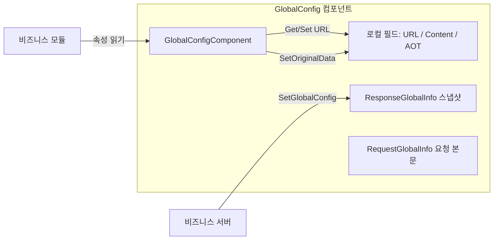

# 소개

GameFrameX GlobalConfig는 GameFrameX 프레임워크의 전역 설정 컴포넌트로, 서버에서下发(下发)되거나 로컬로 설정된 전역 매개변수를 중앙 관리하는 데 사용됩니다. 여기에는 앱 버전 검사 URL, 리소스 버전 검사 URL, 호스트 서비스 주소, AOT 메타데이터 목록 및 사용자 정의 확장 콘텐츠 등이 포함됩니다. 이 컴포넌트는 Unity MonoBehaviour 형태로 마운트되며, `GameFrameworkComponent`를 통해 프레임워크 생명주기에 연결되어 비즈니스 모듈이 필요에 따라 읽을 수 있도록 합니다.

## 빠른 시작

### 1. 설치

아래 방법 중 하나를 선택하여 컴포넌트를 Unity 프로젝트에 추가하세요.

1. `Packages/manifest.json`에 scoped registry를 추가합니다.

   ```json
   {
     "scopedRegistries": [
       {
         "name": "GameFrameX",
         "url": "https://gameframex.upm.alianblank.uk",
         "scopes": ["com.gameframex"]
       }
     ],
     "dependencies": {
       "com.gameframex.unity.globalconfig": "1.3.2"
     }
   }
   ```

2. `dependencies` 노드 아래에 직접 Git URL을 추가합니다.

   ```json
   {
     "com.gameframex.unity.globalconfig": "https://github.com/gameframex/com.gameframex.unity.globalconfig.git"
   }
   ```

3. Unity Package Manager에서 `Add package from git URL`을 통해 위의 주소를 추가합니다.

4. 저장소를 Unity 프로젝트의 `Packages/` 디렉터리에 직접 클론합니다.

### 2. 컴포넌트 마운트

씬에 있는 `GameFrameX` 프레임워크 진입 객체에 `Global Config` 컴포넌트를 추가합니다 (메뉴 경로: `Add Component → GameFrameX → Global Config`). 이 컴포넌트는 `GameFrameworkComponent`를 상속하며, `Awake`에서 자동 등록을 비활성화하고 프레임워크 진입점에서 통합 관리합니다.

Source: [GlobalConfigComponent.cs#L11-L13](https://github.com/GameFrameX/com.gameframex.unity.globalconfig/blob/main/Runtime/GlobalConfig/GlobalConfigComponent.cs#L11-L13)

### 3. 설정 필드

컴포넌트는 Inspector에서 다음 필드를 노출합니다. 에디터에서 직접 입력할 수도 있고, 런타임에 속성을 통해 값을 할당할 수도 있습니다.

| 필드 | 타입 | 설명 |
|------|------|------|
| `Check App Version Url` | string | 앱 버전 검사 인터페이스 주소 |
| `Check Resource Version Url` | string | 리소스 버전 검사 인터페이스 주소 |
| `AOT Code List` | string | AOT 보완 메타데이터 목록 (JSON 문자열). 할당 시 `AOTCodeLists`로 자동 파싱됨 |
| `Host Server Url` | string | 백엔드 연결용 호스트 서비스 주소 |
| `Content` | string | 사용자 정의 확장 콘텐츠 |
| `Original Data` | string (읽기 전용) | `SetOriginalData`를 통해 작성된 원본 데이터 |

Source: [GlobalConfigComponent.cs#L18-L134](https://github.com/GameFrameX/com.gameframex.unity.globalconfig/blob/main/Runtime/GlobalConfig/GlobalConfigComponent.cs#L18-L134)

### 4. 런타임 읽기

프레임워크 진입점에서 컴포넌트 인스턴스를 가져온 후 속성을 직접 읽으면 됩니다.

```csharp
var globalConfig = GameFrameXEntry.GetComponent<GlobalConfigComponent>();
string hostUrl = globalConfig.HostServerUrl;
string appVersionUrl = globalConfig.CheckAppVersionUrl;
string content = globalConfig.Content;
```

## 작업 원리 개요

컴포넌트 내부에는 서버에서下发(下发)된 전역 설정 스냅샷을 저장하기 위한 `ResponseGlobalInfo` 객체가 유지됩니다. 로컬 필드는 URL, 원본 데이터, AOT 목록 등의 확장 정보를 저장합니다. 요청과 응답 타입은 분리되어 정의되어 있어 비즈니스 측에서 상속하여 확장하기 편리합니다.



## 관련 링크

- [GlobalConfigComponent.cs](https://github.com/GameFrameX/com.gameframex.unity.globalconfig/blob/main/Runtime/GlobalConfig/GlobalConfigComponent.cs)
- [RequestGlobalInfo.cs](https://github.com/GameFrameX/com.gameframex.unity.globalconfig/blob/main/Runtime/GlobalConfig/RequestGlobalInfo.cs)
- [ResponseGlobalInfo.cs](https://github.com/GameFrameX/com.gameframex.unity.globalconfig/blob/main/Runtime/GlobalConfig/ResponseGlobalInfo.cs)
- [RequestBase.cs](https://github.com/GameFrameX/com.gameframex.unity.globalconfig/blob/main/Runtime/GlobalConfig/RequestBase.cs)
- [Editor/Inspector/GlobalConfigComponentInspector.cs](https://github.com/GameFrameX/com.gameframex.unity.globalconfig/blob/main/Editor/Inspector/GlobalConfigComponentInspector.cs)
- [README.zh-CN.md](https://github.com/GameFrameX/com.gameframex.unity.globalconfig/blob/main/README.zh-CN.md)