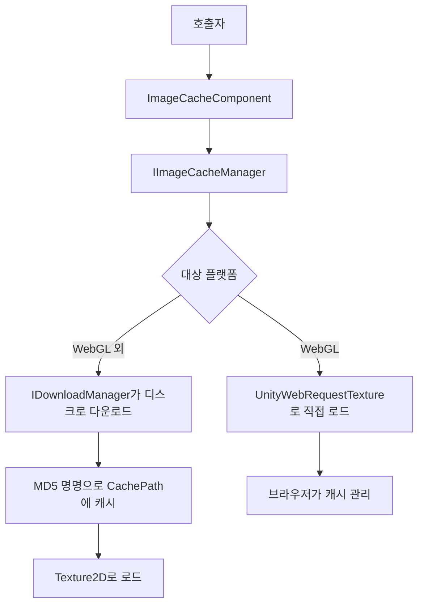

# 개요

GameFrameX.ImageCache는 GameFrameX 프레임워크의 이미지 캐시 컴포넌트로, 원격 이미지를 로컬로 다운로드하고 URL의 MD5로 명명하여 디스크에 저장한 후, 두 번째 로드 시 디스크에서 직접 `Texture2D`로 읽어들이는 역할을 담당합니다. 이를 통해 중복 다운로드를 방지하고 UI 이미지 표시 시간을 단축합니다.

## 빠른 시작

1. Unity 프로젝트의 `Packages/manifest.json`에 GameFrameX 레지스트리를 추가합니다:

```json
{
  "scopedRegistries": [
    {
      "name": "GameFrameX",
      "url": "https://gameframex.upm.alianblank.uk",
      "scopes": [
        "com.gameframex"
      ]
    }
  ]
}
```

2. `dependencies`에 의존성을 추가합니다:

```json
{
  "dependencies": {
    "com.gameframex.unity.imagecache": "0.0.1"
  }
}
```

3. 씬에 `ImageCacheComponent`를 추가하고(메뉴 `GameFrameX/Image Cache`), Inspector에서 필요에 따라 `CachePath`, `MaxDiskSize`, `ExpireDays`를 조정합니다. 컴포넌트는 `Awake` 시 설정을 `IImageCacheManager`에 동기화하며, 기본 캐시 경로는 `Application path + "/cache/images/"`입니다.

4. 인터페이스를 호출하여 원격 이미지를 로드합니다:

```csharp
// 이미지 캐시 컴포넌트 가져오기
var imageCache = GameEntry.GetComponent<ImageCacheComponent>();

// 원격 이미지 비동기 로드
Texture2D texture = await imageCache.LoadImageAsync("https://example.com/image.png");

// 이미지가 캐시되었는지 확인
bool cached = imageCache.IsCached("https://example.com/image.png");

// 지정된 캐시 제거
imageCache.RemoveCache("https://example.com/image.png");

// 모든 캐시 비우기
imageCache.ClearCache();
```

출처:[ImageCacheComponent.cs](https://github.com/GameFrameX/com.gameframex.unity.imagecache/blob/main/Runtime/ImageCache/ImageCacheComponent.cs#L73-L76)、[README.zh-CN.md](https://github.com/GameFrameX/com.gameframex.unity.imagecache/blob/main/README.zh-CN.md#L78-L93)

## 작동 원리 개요



- **WebGL 외 플랫폼**: `IDownloadManager`를 통해 이미지를 디스크로 다운로드하며, 파일은 URL의 MD5로 명명됩니다. 로드 시 캐시를 우선 확인하고, 캐시에 없으면 다운로드합니다.
- **WebGL 플랫폼**: `UnityWebRequestTexture`를 통해 이미지를 직접 로드하며, 캐시는 전적으로 브라우저가 관리합니다. 로컬 인터페이스 `IsCached` / `RemoveCache` / `ClearCache`는 적용되지 않습니다.

출처:[ImageCacheManager.cs](https://github.com/GameFrameX/com.gameframex.unity.imagecache/blob/main/Runtime/ImageCache/ImageCacheManager.cs)、[IImageCacheManager.cs](https://github.com/GameFrameX/com.gameframex.unity.imagecache/blob/main/Runtime/ImageCache/IImageCacheManager.cs#L26-L47)

## 다음 단계

- 캐시 매개변수 및 기본값:《reference/config》 참조
- Inspector에서 매개변수 조정:《tasks/configure-cache》 참조
- 이미지 로드 실패 문제 해결:《troubleshooting/load-failed》 참조
- 플랫폼 차이 및 WebGL 동작:《reference/platform-support》 참조