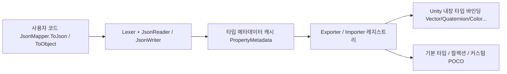

# 개요

GameFrameX.LitJSON은 Unity를 위한 JSON 직렬화 라이브러리로, [LitJSON](https://github.com/LitJSON/litjson)을 기반으로 2차 래핑하여 GameFrameX 생태계에 통합했습니다. Unity 내장 타입, `float`, 특성 기반 필드 제어, 그리고 IL2CPP 코드 스트리핑 보호에 대한 네이티브 지원을 제공하며, 네임스페이스는 `GameFrameX.LitJSON.Runtime`입니다.

## 빠른 시작

### 1. 설치

Unity 프로젝트의 `Packages/manifest.json`에 scoped registry를 통해 패키지를 추가합니다:

```json
{
  "scopedRegistries": [
    {
      "name": "GameFrameX",
      "url": "https://gameframex.upm.alianblank.uk",
      "scopes": ["com.gameframex"]
    }
  ],
  "dependencies": {
    "com.gameframex.unity.litjson": "1.1.3"
  }
}
```

다른 설치 방법(Git URL, 수동 클론)은 [README.md](https://github.com/GameFrameX/com.gameframex.unity.litjson/blob/main/README.md#L60-L96)를 참조하세요.

### 2. 직렬화와 역직렬화

```csharp
using GameFrameX.LitJSON.Runtime;

class PlayerData
{
    public int Id { get; set; }
    public string Name { get; set; }
    public float Hp { get; set; }
}

// 직렬화(기본적으로 포맷된 JSON 출력)
var player = new PlayerData { Id = 42, Name = "Blank", Hp = 100.5f };
string json = JsonMapper.ToJson(player);
// {"Id":42,"Name":"Blank","Hp":100.5}(false를 전달하면 압축된 출력)

// 역직렬화
PlayerData restored = JsonMapper.ToObject<PlayerData>(json);
```

Source: [README.md](https://github.com/GameFrameX/com.gameframex.unity.litjson/blob/main/README.md#L100-L128)

### 3. 필드 출력 제어

`[JsonIgnore]`로 멤버를 건너뛰고, `[JsonProperty("name")]`로 JSON 키 이름을 커스터마이즈합니다:

```csharp
class Account
{
    [JsonProperty("user_name")]
    public string UserName { get; set; }

    [JsonIgnore]
    public string Password { get; set; }
}
```

Source: [README.md](https://github.com/GameFrameX/com.gameframex.unity.litjson/blob/main/README.md#L131-L143)

## 작동 원리 요약



진입점 타입 [JsonMapper](https://github.com/GameFrameX/com.gameframex.unity.litjson/blob/main/Runtime/JsonMapper.cs)는 리더/라이터, 타입 캐시, 커스텀 컨버터 레지스트리 스케줄링을 담당합니다. 리플렉션으로 읽은 속성/필드는 [PropertyMetadata](https://github.com/GameFrameX/com.gameframex.unity.litjson/blob/main/Runtime/JsonMapper.cs#L31-L56)에 캐시됩니다. Unity 내장 값 타입 변환은 [UnityTypeBindings.cs](https://github.com/GameFrameX/com.gameframex.unity.litjson/blob/main/Runtime/UnityTypeBindings.cs)에서 일괄 등록됩니다. IL2CPP 스트리핑 보호는 [link.xml](https://github.com/GameFrameX/com.gameframex.unity.litjson/blob/main/link.xml)과 런타임 리플렉션에 의해 트리거되는 [LitJsonCroppingHelper](https://github.com/GameFrameX/com.gameframex.unity.litjson/blob/main/Runtime/LitJsonCroppingHelper.cs)가 함께 담당합니다.

## 다음 단계

- Unity 타입(예: `Vector3`, `Color`)을 JSON에 쓰는 방법은 《Unity 내장 타입 직렬화 방법》 참조
- 필드를 건너뛰거나 이름을 변경해야 할 때는 《필드 출력 제어 방법》 참조
- 패키징 후 역직렬화 시 `MissingMethodException`이 발생하면 《IL2CPP 스트리핑으로 인한 역직렬화 실패 해결 방법》 참조
- 전체 API 요약은 《API 참조》 참조
- 업그레이드 주의사항은 [CHANGELOG.md](https://github.com/GameFrameX/com.gameframex.unity.litjson/blob/main/CHANGELOG.md) 참조