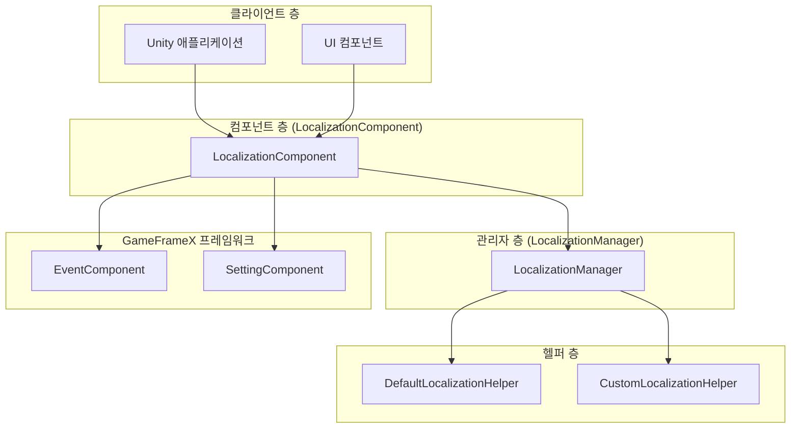
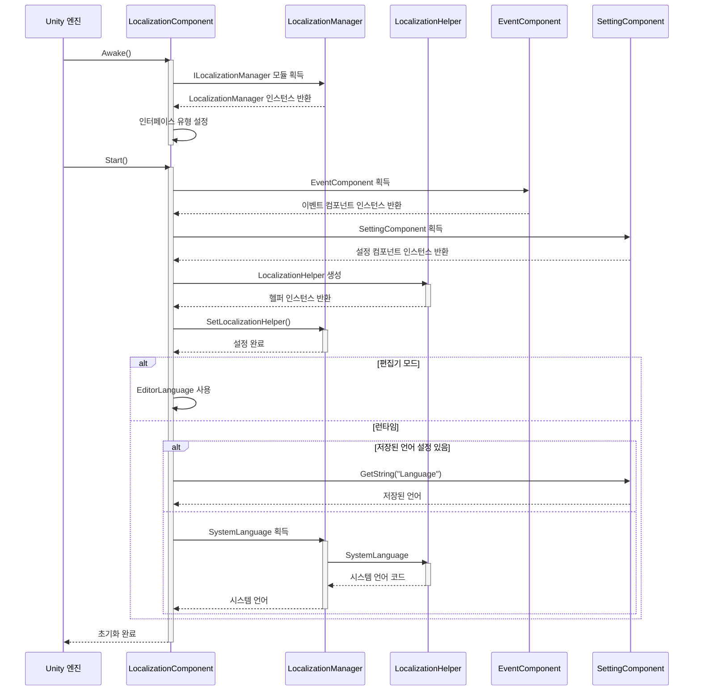
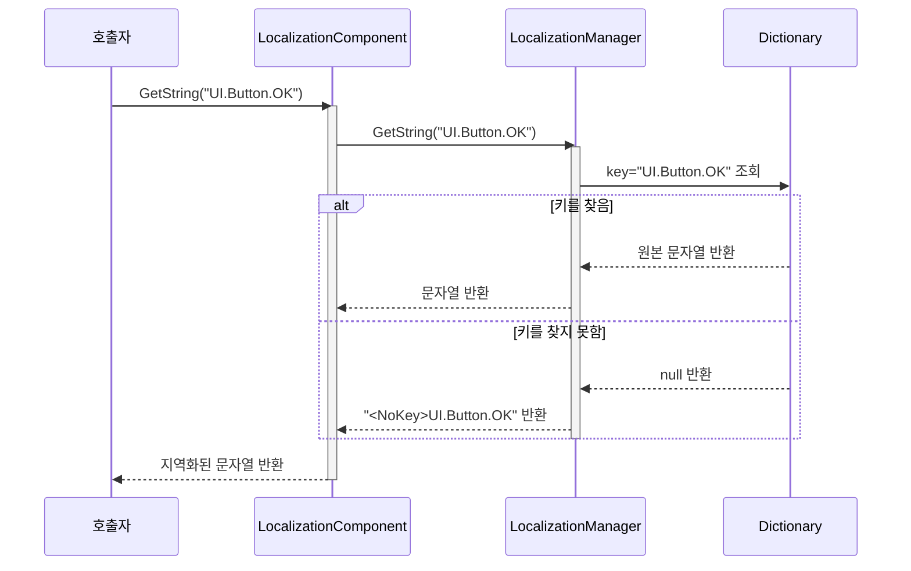
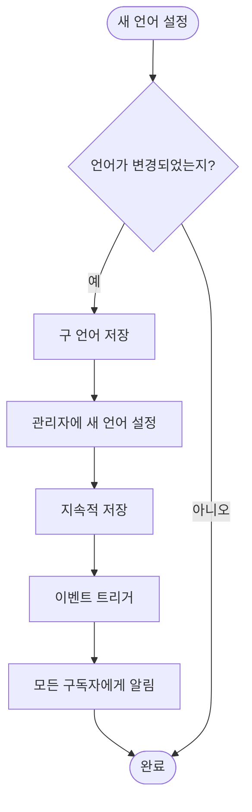
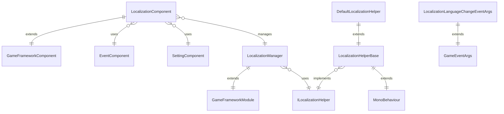

# 개요

GameFrameX Localization은 GameFrameX 게임 프레임워크의 핵심 컴포넌트 중 하나로, 완전한 Unity 지역화 솔루션을 제공합니다. 이 컴포넌트는 다국어 동적 전환, 문자열 포맷팅, 시스템 언어 감지 및 완전한 사전 관리 기능을 지원하여 개발자가 게임의 국제화 요구를 쉽게 구현할 수 있도록 합니다.

## 개요

GameFrameX Localization 컴포넌트는 Unity 게임 프레임워크에서 다국어 지역화를 전문으로 처리하는 모듈입니다. 컴포넌트-관리자-헬퍼 3층 아키텍처 설계를 채택하고, 인터페이스 분리 및 의존성 주입 등의 설계 패턴을 통해 유연하고 확장 가능한 지역화 솔루션을 제공합니다.

이 컴포넌트의 주요 역할은 다음과 같습니다: 다국어 사전 데이터 관리, 지역화 문자열 획득 인터페이스 제공, 런타임 언어 전환 처리, 시스템 언어 환경 감지, 그리고 이벤트 시스템을 통해 언어 변화 알림. 개발자는 간단한 API 호출로 복잡한 국제화 기능을 구현할 수 있으며, 하부 구현 세부 사항에 대해 걱정할 필요가 없습니다.

이 컴포넌트는 GameFrameX 프레임워크의 핵심 모듈 중 하나로, Event(이벤트 시스템), Setting(설정 관리), Asset(에셋 관리) 등의 모듈과 긴밀히 협력하여 완전한 게임 개발 인프라를 구축합니다.

## 시스템 아키텍처

GameFrameX Localization은 명확한 3층 아키텍처 설계를 채택하며, 각 층의 책임이 명확하고 층과 층 사이의 통신은 인터페이스를 통해 이루어져 높은 응집도와 낮은 결합도의 설계 목표를 실현합니다.



### 핵심 컴포넌트 설명

**LocalizationComponent**는 Unity 층의 컴포넌트로, GameFrameworkComponent를 상속하여 외부 서비스 제공의 진입점 역할을 합니다. Awake 및 Start 수명주기 메서드를 구현하여 초기화 시 지역화 헬퍼를 생성하고 관리자에 등록합니다. 컴포넌트는 다양한 GetString 오버로드 메서드를 제공하여 0개에서 16개 매개변수까지의 문자열 포맷팅을 지원합니다.

**LocalizationManager**는 핵심 비즈니스 로직 관리자로, GameFrameworkModule을 상속하고 ILocalizationManager 인터페이스를 구현합니다. Dictionary<string, string>类型的 사전 데이터 구조를 유지하여 문자열의 저장, 조회 및 포맷팅 작업을 담당합니다. 관리자는 Unity와 직접 상호작용하지 않으며, ILocalizationHelper 인터페이스를 통해 시스템 언어 정보를 획득합니다.

**ILocalizationHelper** 인터페이스는 지역화 헬퍼의 규격을 정의하며, 현재 SystemLanguage 속성 하나만 포함하여 현재 시스템의 언어 코드를 획득합니다. 이러한 설계를 통해 개발자는 사용자 정의 헬퍼를 구현하여 언어 감지 로직을 제어할 수 있습니다 (예: 서버에서 언어 설정 획득 또는 사용자 구성에 따른 초기 언어 결정).

**LocalizationHelperBase**는 헬퍼의 추상 기본 클래스로, MonoBehaviour를 상속하고 ILocalizationHelper 인터페이스를 구현합니다. 이를 통해 헬퍼가 Unity 게임 객체에 마운트되어 편집기에서 구성和管理할 수 있습니다.

**DefaultLocalizationHelper**는 기본 헬퍼 구현으로, .NET의 CultureInfo.CurrentCulture.Name을 통해 시스템 언어를 획득하고, 하이픈을 밑줄로 교체하여 RFC 5646 표준을 준수합니다 (예: zh-CN을 zh_CN으로 변환).

## 핵심 흐름

지역화 컴포넌트의 초기화와 문자열 획득 흐름은 프레임워크의 핵심 설계理念을 반영합니다. 다음 흐름도는 컴포넌트 시작부터 지역화 문자열 획득까지의 완전한 과정을 보여줍니다.



### 문자열 획득 흐름

애플리케이션이 지역화된 문자열을 획득해야 할 때, LocalizationComponent의 GetString 메서드를 호출합니다. 이 메서드는 요청을 LocalizationManager에 전달하여后者가 사전에서 대응하는 문자열을 조회하고 필요에 따라 포맷팅 작업을 실행합니다.



### 언어 전환 흐름

언어 전환은 지역화 시스템의 핵심 기능 중 하나입니다. 애플리케이션이 현재 언어를 변경해야 할 때, LocalizationComponent의 Language 속성을 통해 설정해야 합니다.



언어 전환 시 LocalizationLanguageChangeEventArgs 이벤트가 트리거되며, 애플리케이션은 이 이벤트를 구독하여 언어 변화를 응답할 수 있습니다 (예: UI 표시 새로고침 또는 게임 콘텐츠 업데이트).

## 의존 관계

GameFrameX Localization 컴포넌트는 GameFrameX 프레임워크의 다른 핵심 모듈에 의존하며, 이러한 의존 관계는 지역화 기능이正常运行하고 다른 시스템과 협력하여 작업할 수 있도록 보장합니다.



### 의존 모듈 설명

| 의존 모듈 | 설명 | 용도 |
|---------|------|------|
| GameFrameX.Runtime | 핵심 런타임 모듈 | 모듈 시스템, 객체 풀, 로깅 등 기초 프레임워크 기능 제공 |
| GameFrameX.Event.Runtime | 이벤트 시스템 모듈 | 언어 전환 이벤트 게시 및 구독 메커니즘 구현 |
| GameFrameX.Setting.Runtime | 설정 관리 모듈 | 사용자 언어 설정의 지속적 저장 |

## 주요 특성

GameFrameX Localization은 다양한 게임 개발의 지역화 요구를 충족하는 풍부한 기능 특성을 제공합니다.

**다국어 지원**: 컴포넌트는 언어 수를 제한하지 않으며, 개발자는 임의의 수의 언어 변형을 추가할 수 있습니다. 각 언어는 고유한 언어 코드(예: zh_CN(중국어 간체), en_US(미국 영어), ja_JP(일본어) 등)로 식별됩니다.

**동적 언어 전환**: 게임 실행 중 원활한 언어 전환을 지원하며, 전환 과정에서 자동으로 이벤트 알림이 트리거되어 애플리케이션이 실시간으로 언어 변화에 응답할 수 있습니다 (애플리케이션 재시작 불필요).

**매개변수화된 문자열**: 강력한 문자열 포맷팅 기능을 제공하여 최대 16개의 포맷팅 매개변수를 지원합니다. 개발자는 "플레이어 레벨: {0}, 경험치: {1}"과 같은 플레이스홀더가 포함된 템플릿 문자열을 사전에 정의할 수 있으며, 런타임에 매개변수 값을 동적으로 교체할 수 있습니다.

**시스템 언어 감지**: 기본적으로 컴포넌트가 운영 체제 언어를 자동으로 감지하여 해당 언어를 채택하며, 사용자 정의 헬퍼를 통해 사용자 정의 언어 감지 로직을 구현할 수 있습니다.

**사전 관리**: 완전한 사전 CRUD 작업을 제공하여 키 존재 여부 확인, 원본 값 획득, 새 사전 항목 추가, 사전 항목 제거, 모든 사전 비우기等功能을 포함합니다.

**편집기 지원**: 편집기 모드를 제공하여 Unity 편집기에서 다양한 언어의 표시 효과를 미리 볼 수 있어 개발 및 디버깅에 편리합니다.

## 빠른 사용

Unity 프로젝트에서 GameFrameX Localization을 사용하는 것은 매우 간단합니다. 다음은 기본적인 사용 흐름입니다.

먼저, Scene의 GameFrameX 관리자에 LocalizationComponent 컴포넌트를 추가해야 합니다. 컴포넌트가 자동으로 초기화되어 지역화 기능을 로드합니다.

```csharp
// 지역화 컴포넌트 획득
var localization = GameEntry.GetComponent<LocalizationComponent>();

// 언어 설정
localization.Language = "zh_CN"; // 중국어 간체
localization.Language = "en_US"; // 영어

// 지역화된 문자열 획득
string text = localization.GetString("UI.Button.OK");

// 매개변수가 있는 지역화된 문자열
string message = localization.GetString("UI.Message.Welcome", playerName);
string info = localization.GetString("UI.Info.Score", score, level);
```
> Source: [LocalizationComponent.cs](https://github.com/GameFrameX/com.gameframex.unity.localization/blob/main/Runtime/Localization/LocalizationComponent.cs#L246-L262)

### 사전 관리

애플리케이션은 런타임에 사전 데이터를 동적으로 관리할 수 있으며, 핫 업데이트 언어 리소스 기능을 구현할 수 있습니다.

```csharp
// 사전 존재 여부 확인
bool exists = localization.HasRawString("UI.Button.Cancel");

// 원본 문자열 획득
string rawText = localization.GetRawString("UI.Button.Cancel");

// 사전 항목 추가
localization.AddRawString("UI.Button.NewButton", "새 버튼");

// 사전 항목 제거
bool removed = localization.RemoveRawString("UI.Button.Cancel");

// 모든 사전 비우기
localization.RemoveAllRawStrings();
```
> Source: [LocalizationComponent.cs](https://github.com/GameFrameX/com.gameframex.unity.localization/blob/main/Runtime/Localization/LocalizationComponent.cs#L717-L758)

### 이벤트 감시

언어 변화 이벤트를 구독함으로써 애플리케이션은 언어 전환 시 사용자 정의 로직(예: UI 표시 새로고침)을 실행할 수 있습니다.

```csharp
// 언어 변화 이벤트 구독
GameEntry.GetComponent<EventComponent>().Subscribe(
    LocalizationLanguageChangeEventArgs.EventId, 
    OnLanguageChanged);

private void OnLanguageChanged(object sender, GameEventArgs e)
{
    var args = (LocalizationLanguageChangeEventArgs)e;
    Debug.Log($"언어가 {args.OldLanguage}에서 {args.Language}로 전환되었습니다");
    
    // UI 표시 새로고침
    RefreshUI();
}
```
> Source: [LocalizationLanguageChangeEventArgs.cs](https://github.com/GameFrameX/com.gameframex.unity.localization/blob/main/Runtime/EventArgs/LocalizationLanguageChangeEventArgs.cs#L52-L58)

## 언어 코드 규격

GameFrameX Localization은 RFC 5646 언어 태그 표준을 준수하며, 밑줄로 구분되는 언어 코드 형식을 사용합니다. 다음은 일반적으로 사용되는 언어 코드 예시입니다:

| 언어 코드 | 설명 |
|---------|------|
| zh_CN | 중국어 간체(중국) |
| zh_TW | 중국어 번체(대만) |
| en_US | 미국 영어(미국) |
| en_GB | 영국 영어(영국) |
| ja_JP | 일본어(일본) |
| ko_KR | 한국어(한국) |
| fr_FR | 프랑스어(프랑스) |
| de_DE | 독일어(독일) |
| es_ES | 스페인어(스페인) |
| ru_RU | 러시아어(러시아) |

개발자가 언어 코드를 정의할 때 주의해야 할 점: 언어 코드는 대소문자를 구분하므로 표준 명명 규범을 사용할 것을 권장합니다. 각 언어 코드는 언어와 선택적 지역两部分으로 구성되며, 하이픈이 아닌 밑줄로 구분됩니다.

## 관련 링크

- [설치 안내서](./2-installation)
- [빠른 시작](./3-getting-started)
- [핵심 기능 - 지역화된 문자열 획득](./4-core-features.get-string)
- [핵심 기능 - 사전 관리](./4-core-features.dictionary-management)
- [핵심 기능 - 언어 전환 및 이벤트](./4-core-features.language-switching)
- [API 참고](./5-api-reference)
- [구성](./6-configuration)
- [모범 사례](./7-best-practices)
- [GitHub 저장소](https://github.com/GameFrameX/com.gameframex.unity.localization.git)
- [공식 문서](https://gameframex.doc.alianblank.com/)