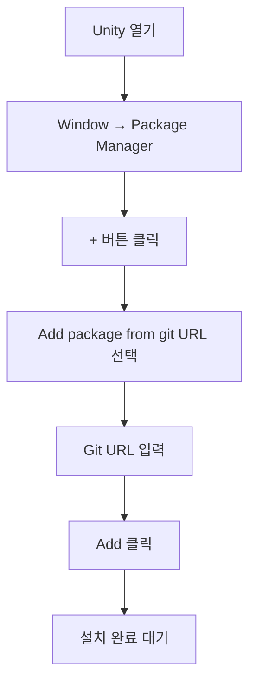
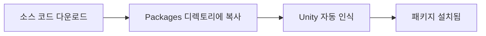
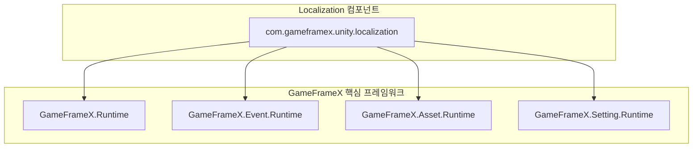

# 설치

이 문서는 GameFrameX Localization 지역화 컴포넌트를 Unity 프로젝트에 설치하는 방법을 소개합니다.

## 개요

GameFrameX Localization은 GameFrameX 게임 프레임워크의 지역화 기능 컴포넌트로, 완전한 다국어 지역화 솔루션을 제공합니다. 이 컴포넌트는 동적 언어 전환, 문자열 포맷팅, 시스템 언어 감지 등의 기능을 지원하여 개발자가 게임의 국제화를 빠르게 구현할 수 있도록 도와줍니다.

**버전 요구사항:**
- Unity 2019.4 이상

**패키지 정보:**
- 패키지명: `com.gameframex.unity.localization`
- 표시명: GameFrameX Localization
- 현재 버전: 2.2.1

## 설치 방식

### 방식 1: Unity Package Manager를 통한 설치 (권장)

가장 권장하는 설치 방식으로, 최신 버전을 쉽게 획득하고 의존성을 관리할 수 있습니다.

**작업 단계:**

1. Unity 편집기를 엽니다
2. 메뉴 **Window → Package Manager**로 이동합니다
3. 왼쪽 상단의 **+** 버튼을 클릭합니다
4. **Add package from git URL...**을 선택합니다
5. 입력 상자에 다음 Git URL을 입력합니다:

```
https://github.com/GameFrameX/com.gameframex.unity.localization.git
```

6. **Add** 버튼을 클릭하여 설치가 완료될 때까지 기다립니다



### 방식 2: manifest.json을 통한 설치

프로젝트의 `Packages/manifest.json` 파일을 직접 편집하여 의존성을 추가합니다.

**작업 단계:**

1. 프로젝트 루트 디렉토리 아래의 `Packages` 폴더를 찾습니다
2. 텍스트 편집기로 `manifest.json` 파일을 엽니다
3. `dependencies` 노드에 다음 내용을 추가합니다:

```json
{
  "dependencies": {
    "com.gameframex.unity.localization": "https://github.com/GameFrameX/com.gameframex.unity.localization.git"
  }
}
```

4. 파일을 저장하고 Unity로 돌아갑니다
5. Unity가 자동으로 의존성을解析하고 설치합니다

> 주의: 이 방식은 프로젝트를 열 때마다 Git에서 최신 버전을 가져오려 합니다. 버전을 잠그려면 다음 형식으로 버전 번호를 지정하세요:
> ```json
> "com.gameframex.unity.localization": "2.2.1"
> ```

### 방식 3: 로컬 소스 설치

소스 코드를 사용자 정의 수정해야 하거나 오프라인 환경에 있는 경우 로컬 설치 방식을 사용할 수 있습니다.

**작업 단계:**

1. GitHub 저장소에서 소스 코드를 클론하거나 다운로드합니다:
   ```bash
   https://github.com/GameFrameX/com.gameframex.unity.localization.git
   ```
2. 전체 저장소 폴더를 Unity 프로젝트의 `Packages` 디렉토리에 복사합니다
3. Unity가 해당 패키지를 자동으로 인식하고 로드합니다
4. 업데이트가 필요하면 폴더 내용을 교체하면 됩니다



## 의존성 설명

GameFrameX Localization 컴포넌트는 다음 GameFrameX 핵심 모듈에 의존합니다:

| 의존 패키지 | 버전 | 설명 |
|--------|------|------|
| com.gameframex.unity | 1.1.1 | 핵심 런타임 모듈 |
| com.gameframex.unity.asset | 1.0.6 | 에셋 관리 모듈 |
| com.gameframex.unity.event | 1.0.0 | 이벤트 시스템 모듈 |

**자동 의존성解析:**

Package Manager 또는 manifest.json을 사용하여 설치할 때, Unity가 자동으로 모든 의존 항목을解析하고 다운로드합니다.

로컬 설치 방식을 사용하는 경우, 다음 모듈도 설치되었는지 확인하세요:

| 모듈 | Assembly 정의 | 설명 |
|------|---------------|------|
| GameFrameX.Runtime | GameFrameX.Runtime | 핵심 프레임워크 |
| GameFrameX.Event.Runtime | GameFrameX.Event.Runtime | 이벤트 시스템 |
| GameFrameX.Asset.Runtime | GameFrameX.Asset.Runtime | 에셋 관리 |
| GameFrameX.Setting.Runtime | GameFrameX.Setting.Runtime | 설정 관리 |



## 설치 검증

설치 완료 후 다음 단계로 검증하세요:

### 1. Package Manager 확인

Package Manager 창에서 `GameFrameX Localization`이 목록에 나타나고 상태가 정상으로 표시되는지 확인합니다.

### 2. Assembly 확인

프로젝트 디렉토리에 다음 Assembly 정의 파일이 존재해야 합니다:

- `Packages/com.gameframex.unity.localization/Runtime/GameFrameX.Localization.Runtime.asmdef`
- `Packages/com.gameframex.unity.localization/Editor/GameFrameX.Localization.Editor.asmdef`

### 3. 테스트 Scene 생성

1. Unity Scene에서 빈 GameObject를 생성합니다
2. **LocalizationComponent** 컴포넌트를 추가합니다 (메뉴 경로: **Component → GameFrameX → Localization**)
3. 컴포넌트 Inspector 패널에서 구성 옵션이 정상적으로 표시되는지 확인합니다

> Source: [LocalizationComponent.cs](https://github.com/GameFrameX/com.gameframex.unity.localization/blob/main/Runtime/Localization/LocalizationComponent.cs#L44-L47)

### 4. 기본 코드 테스트 실행

```csharp
using GameFrameX.Runtime;

// 지역화 컴포넌트 획득
var localization = GameEntry.GetComponent<LocalizationComponent>();

// 시스템 언어 획득
Debug.Log($"시스템 언어: {localization.SystemLanguage}");

// 지역화 문자열 테스트 획득
string text = localization.GetString("Test.Key");
Debug.Log($"테스트 결과: {text}");
```

## 컴포넌트 구성

LocalizationComponent를 Scene에 추가한 후, Inspector 패널에서 다음 옵션을 구성할 수 있습니다:

| 구성 항목 | 유형 | 기본값 | 설명 |
|--------|------|--------|------|
| Editor Language | string | zh_CN | 편집기 모드에서 사용할 언어 |
| Default Language | string | zh_CN | 기본 언어 (로드 실패 시 폴백 언어) |
| Enable Load Dictionary Update Event | bool | false | 사전 로드 업데이트 이벤트 활성화 여부 |
| Is Enable Editor Mode | bool | false | 편집기 모드 활성화 여부 |
| Localization Helper Type Name | string | DefaultLocalizationHelper | 지역화 헬퍼 유형 이름 |
| Custom Localization Helper | LocalizationHelperBase | null | 사용자 정의 지역화 헬퍼 인스턴스 |

> 주의: Editor Language는 Unity 편집기에서만 유효하며, 빌드된 게임에는 영향을 미치지 않습니다.

## 일반적인 문제

### Q1: 설치 후 컴파일 오류 발생

**원인:** 의존 항목 누락

**솔루션:** 모든 GameFrameX 의존 항목이 올바르게 설치되었는지 확인하세요. Package Manager에서 의존 항목 상태를 확인하기 위해 다시 열어보세요.

### Q2: LocalizationComponent를 찾을 수 없음

**원인:** Assembly가 올바르게 로드되지 않음

**솔루션:**
1. Assembly Definition 파일이 존재하는지 확인합니다
2. 모든 에셋 다시 가져오기 시도: **Assets → Reimport All**
3. Console 창에서 오류 정보를 확인합니다

### Q3: 버전 호환성 문제

**원인:** Unity 버전이 너무 낮거나 의존 패키지 버전 충돌

**솔루션:**
1. Unity 버전이 2019.4 이상인지 확인합니다
2. 다른 패키지가 다른 버전의 GameFrameX 의존 항목을 선언하지 않았는지 확인합니다

## 관련 링크

- [빠른 시작](./3-getting-started) - 지역화 기능 사용 시작
- [핵심 기능](./4-core-features.get-string) - 핵심 기능 알아보기
- [API 참고](./5-api-reference) - 완전한 API 문서
- [GitHub 저장소](https://github.com/GameFrameX/com.gameframex.unity.localization.git) - 소스 코드 및 최신 버전 획득
- [공식 문서](https://gameframex.doc.alianblank.com/) - GameFrameX 완전한 문서