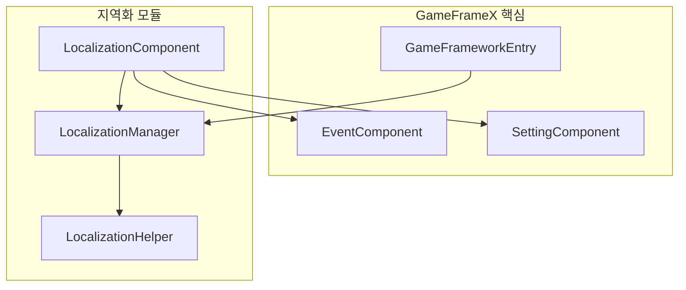
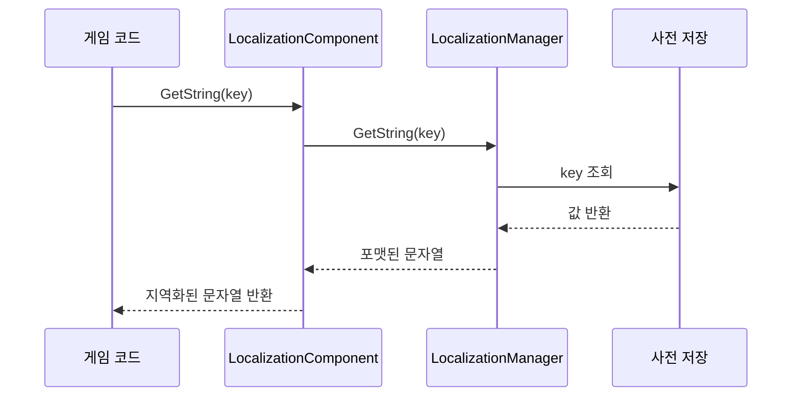
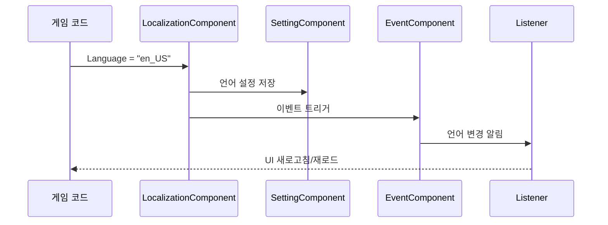

# 빠른 시작

이 가이드는 GameFrameX Localization 컴포넌트를 빠르게 시작하고 Unity 게임의 지역화 기능을 구현할 수 있도록 도와줍니다.

## 개요

GameFrameX Localization은 GameFrameX 게임 프레임워크의 지역화 컴포넌트로, 완전한 게임 지역화 솔루션을 제공합니다. 이 컴포넌트는 다음을 지원합니다:
- 다국어 문자열 관리 (사전 형식)
- 동적 매개변수 보간 (최대 16개 매개변수 지원)
- 런타임 언어 전환
- 시스템 언어 자동 감지
- 언어 설정 지속적 저장

## 아키텍처 개요



**컴포넌트 설명:**
- **LocalizationComponent**: Unity 컴포넌트로, Game Framework에 통합되어 초기화 및 조정 담당
- **LocalizationManager**: 핵심 관리자로, 사전 저장 및 문자열 획득 처리
- **LocalizationHelper**: 헬퍼로, 시스템 언어 감지에 사용
- **EventComponent**: 이벤트 시스템으로, 언어 전환 이벤트 게시용
- **SettingComponent**: 설정 시스템으로, 언어 기본 설정 지속적 저장용

## 핵심 흐름

### 문자열 획득 흐름



### 언어 전환 흐름



## 사용 예시

### 기본 사용법

LocalizationComponent 컴포넌트를 Unity Scene에 추가한 후, 다음 방식으로 지역화된 문자열을 획득할 수 있습니다:

```csharp
using GameFrameX.Localization.Runtime;

// LocalizationComponent 인스턴스 획득
var localization = GameEntry.GetComponent<LocalizationComponent>();

// 단순 문자열 획득
string greeting = localization.GetString("greeting"); // 출력: 안녕하세요

// 매개변수가 있는 문자열 획득
string playerName = localization.GetString("welcome_player", "김철수"); // 출력: 김철수님 환영합니다!
```

> Source: [LocalizationComponent.cs](https://github.com/GameFrameX/com.gameframex.unity.localization/blob/main/Runtime/Localization/LocalizationComponent.cs#L246-L262)

### 고급 사용법: 다중 매개변수 보간

컴포넌트는 최대 16개 매개변수의 문자열 보간을 지원합니다:

```csharp
// 두 개의 매개변수
string message = localization.GetString("level_complete", 5, "1000"); 
// 사전: level_complete = "제 {0} 스테이지 완료! 점수: {1}"
// 출력: 제 5 스테이지 완료! 점수: 1000

// 네 개의 매개변수
string complex = localization.GetString("battle_result", "승리", 1000, 500, 50);
// 사전: battle_result = "{0}! 경험치+{1}, 골드+{2}, 다이아+{3}"
// 출력: 승리! 경험치+1000, 골드+500, 다이아+50
```

> Source: [LocalizationManager.cs](https://github.com/GameFrameX/com.gameframex.unity.localization/blob/main/Runtime/Localization/Localization/LocalizationManager#L168-L311)

### 사전 관리

사전을 수동으로 추가하고 관리합니다:

```csharp
// 사전 추가
localization.AddRawString("game_title", "나의 게임");
localization.AddRawString("start_game", "게임 시작");

// 사전 존재 여부 확인
bool exists = localization.HasRawString("game_title"); // true

// 원본 값 획득 (포맷팅 없이)
string rawValue = localization.GetRawString("game_title"); // 나의 게임

// 사전 제거
localization.RemoveRawString("game_title");

// 모든 사전 비우기
localization.RemoveAllRawStrings();
```

### 언어 전환 및 이벤트 감시

언어 전환 이벤트를 감시합니다:

```csharp
using GameFrameX.Event.Runtime;

// 언어 전환 이벤트 구독
EventComponent eventComponent = GameEntry.GetComponent<EventComponent>();
eventComponent.Subscribe(LocalizationLanguageChangeEventArgs.EventId, OnLanguageChanged);

// 이벤트 처리 메서드
private void OnLanguageChanged(object sender, GameEventArgs e)
{
    var args = (LocalizationLanguageChangeEventArgs)e;
    Debug.Log($"언어가 {args.OldLanguage}에서 {args.Language}로 전환되었습니다");
    
    // 모든 UI 텍스트 새로고침
    RefreshAllUI();
}

// 언어 전환
localization.Language = "en_US";
```

> Source: [LocalizationLanguageChangeEventArgs.cs](https://github.com/GameFrameX/com.gameframex.unity.localization/blob/main/Runtime/EventArgs/LocalizationLanguageChangeEventArgs.cs#L52-L58)

## 구성 설명

Unity 편집기에서 LocalizationComponent를 구성합니다:

| 구성 항목 | 유형 | 기본값 | 설명 |
|--------|------|--------|------|
| EditorLanguage | string | "zh_CN" | 편집기에서 사용할 언어 |
| DefaultLanguage | string | "zh_CN" | 기본 언어 (로드 실패 시 사용) |
| EnableLoadDictionaryUpdateEvent | bool | false | 사전 로드 업데이트 이벤트 활성화 여부 |
| IsEnableEditorMode | bool | false | 편집기 모드 활성화 여부 |
| LocalizationHelperTypeName | string | "GameFrameX.Localization.Runtime.DefaultLocalizationHelper" | 지역화 헬퍼 유형 |

> Source: [LocalizationComponent.cs](https://github.com/GameFrameX/com.gameframex.unity.localization/blob/main/Runtime/Localization/LocalizationComponent.cs#L60-L69)

## 사전 형식 예시

일반적인 지역화 사전 형식은 다음과 같습니다:

```json
{
  "zh_CN": {
    "greeting": "你好",
    "welcome_player": "欢迎，{0}！",
    "level_complete": "第 {0} 关完成！得分：{1}",
    "battle_result": "{0}！经验+{1}，金币+{2}"
  },
  "en_US": {
    "greeting": "Hello",
    "welcome_player": "Welcome, {0}!",
    "level_complete": "Level {0} Complete! Score: {1}",
    "battle_result": "{0}! EXP+{1}, Gold+{2}"
  }
}
```

## 의존 항목

이 컴포넌트는 다음 GameFrameX 핵심 모듈에 의존합니다:
- `com.gameframex.unity` (>= 1.1.1)
- `com.gameframex.unity.asset` (>= 1.0.6)
- `com.gameframex.unity.event` (>= 1.0.0)

## 다음 단계

- 핵심 기능에 대해 더 알아보려면 [지역화된 문자열 획득](./4-core-features.get-string)을参阅하세요
- 사전 관리에 대해 알아보려면 [사전 관리](./4-core-features.dictionary-management)를参阅하세요
- 언어 전환 메커니즘에 대해 알아보려면 [언어 전환 및 이벤트](./4-core-features.language-switching)를参阅하세요
- 완전한 API를 보려면 [API 참고](./5-api-reference)를参阅하세요