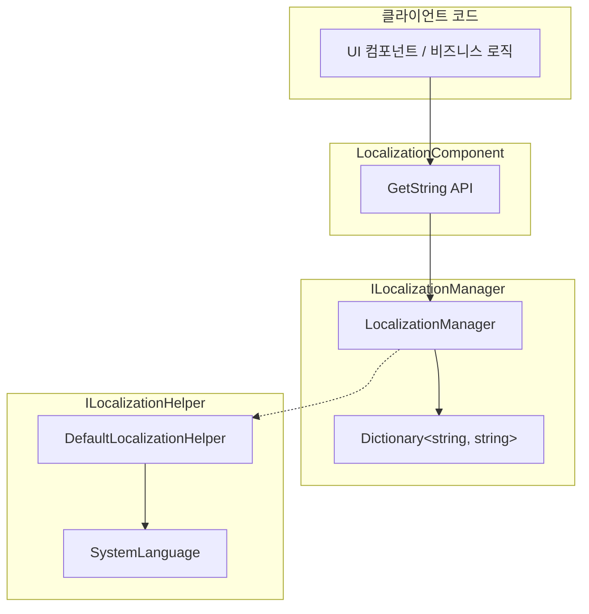

# 지역화된 문자열 획득

지역화된 문자열 획득은 GameFrameX Localization 모듈의 핵심 기능입니다. 사전 키(Key)를 통해 대응하는 언어의 문자열 내용을 획득하며, 동적 매개변수 교체 기능을 지원합니다.

## 개요

LocalizationComponent 컴포넌트는 지역화된 문자열을 획득하기 위해 다양한 `GetString` 메서드를 제공합니다. 이 메서드들은 다음을 지원합니다:

- **기본 획득**: 키를 통해 직접 문자열 획득
- **매개변수 교체**: 0-16개의 매개변수를 지원하여 동적 문자열 포맷팅
- **오류 처리**: 키가 존재하지 않거나 포맷팅 실패 시 의미 있는 오류 힌트 반환

설계 의도: 타입 안전한 매개변수화 문자열 획득 방식을 제공하여 런타임 문자열 연결 오류를 피하고, .NET string.Format과 유사한 사용법을 유지합니다.

## 아키텍처



### 컴포넌트 설명

| 컴포넌트 | 책임 |
|------|------|
| LocalizationComponent | Unity 컴포넌트 층,公共 API 노출 |
| ILocalizationManager | 지역화 관리의 인터페이스 계약 정의 |
| LocalizationManager | 사전 저장 및 문자열 포맷팅 로직 구현 |
| ILocalizationHelper | 시스템 언어 감지 인터페이스 |

## 핵심 흐름

```mermaid
sequenceDiagram
    participant Client as 클라이언트
    participant Comp as LocalizationComponent
    participant Mgr as LocalizationManager
    participant Dict as Dictionary

    Client->>Comp: GetString(key)
    Comp->>Mgr: GetString(key)
    Mgr->>Dict: TryGetValue(key)
    
    alt 키가 존재
        Dict-->>Mgr: rawString
        Mgr-->>Comp: rawString
        Comp-->>Client: 문자열
    else 키가 존재하지 않음
        Dict-->>Mgr: null
        Mgr-->>Comp: &lt;NoKey&gt;{key}
        Comp-->>Client: 오류 힌트 문자열
    end
```

```mermaid
sequenceDiagram
    participant Client as 클라이언트
    participant Comp as LocalizationComponent
    participant Mgr as LocalizationManager
    participant Dict as Dictionary
    participant Format as string.Format

    Client->>Comp: GetString(key, arg1, arg2)
    Comp->>Mgr: GetString(key, arg1, arg2)
    Mgr->>Dict: TryGetValue(key)
    
    alt 키가 존재
        Dict-->>Mgr: rawString
        Mgr->>Format: Format(rawString, arg1, arg2)
        
        alt 포맷팅 성공
            Format-->>Mgr: formattedString
            Mgr-->>Comp: formattedString
            Comp-->>Client: 포맷팅된 문자열
        else 포맷팅 실패
            Format-->>Mgr: Exception
            Mgr-->>Comp: &lt;Error&gt;{details}
            Comp-->>Client: 오류 힌트 문자열
        end
    else 키가 존재하지 않음
        Dict-->>Mgr: null
        Mgr-->>Comp: &lt;NoKey&gt;{key}
        Comp-->>Client: 오류 힌트 문자열
    end
```

## 사용 예시

### 기본 사용법

가장 간단한 사용법은 키를 통해 문자열을 획득하는 것입니다:

```csharp
using GameFrameX.Localization.Runtime;

// LocalizationComponent 인스턴스 획득
var localization = GameEntry.GetComponent<LocalizationComponent>();

// 단순 문자열 획득 (매개변수 없음)
string welcome = localization.GetString("UI_Welcome");
```

> Source: [LocalizationComponent.cs](https://github.com/GameFrameX/com.gameframex.unity.localization/blob/main/Runtime/Localization/LocalizationComponent.cs#L246-L249)

### 단일 매개변수 사용법

단일 매개변수를 사용하여 문자열의 플레이스홀더 `{0}`을 교체합니다:

```csharp
// 사전 내용: "Hello {0}, welcome to {1}!"
// 매개변수가 있는 문자열 획득
string message = localization.GetString<string>("UI_Greeting", "Player");
// 결과: "Hello Player, welcome to {1}!"
```

> Source: [LocalizationComponent.cs](https://github.com/GameFrameX/com.gameframex.unity.localization/blob/main/Runtime/Localization/LocalizationComponent.cs#L272-L275)

### 다중 매개변수 사용법

최대 16개의 매개변수를 지원하여 복잡한 메시지 포맷팅에 적합합니다:

```csharp
// 사전 내용: "{0} found {1} items in {2}"
// 두 개의 매개변수 사용
string result = localization.GetString<string, int, string>("UI_FindItems", "Player", 100);
// 결과: "Player found 100 items in {2}"

// 세 개의 매개변수 (완전한 포맷팅)
string fullResult = localization.GetString<string, int, string>("UI_FindItems", "Player", 100, "Dungeon");
// 결과: "Player found 100 items in Dungeon"
```

> Source: [LocalizationComponent.cs](https://github.com/GameFrameX/com.gameframex.unity.localization/blob/main/Runtime/Localization/LocalizationComponent.cs#L287-L290)

### 동적 매개변수 배열 사용법

`params` 방식을 사용하여数量的 매개변수를 전달합니다:

```csharp
// params 배열 사용
object[] args = new object[] { "Alice", 25, "Beijing" };
string message = localization.GetString("UI_UserInfo", args);
```

> Source: [LocalizationComponent.cs](https://github.com/GameFrameX/com.gameframex.unity.localization/blob/main/Runtime/Localization/LocalizationComponent.cs#L259-L262)

### 사전 조작

문자열을 획득하기 전에 사전에 데이터를 추가해야 합니다:

```csharp
// 사전 항목 추가
localization.AddRawString("UI_StartGame", "게임 시작");
localization.AddRawString("UI_Score", "점수: {0}");

// 키가 존재하는지 확인
if (localization.HasRawString("UI_StartGame"))
{
    // 문자열 획득
    string text = localization.GetString("UI_StartGame");
}

// 사전 항목 제거
localization.RemoveRawString("UI_StartGame");

// 모든 사전 비우기
localization.RemoveAllRawStrings();
```

> Source: [LocalizationComponent.cs](https://github.com/GameFrameX/com.gameframex.unity.localization/blob/main/Runtime/Localization/LocalizationComponent.cs#L737-L758)

## API 참고

### LocalizationComponent

#### `GetString(string key): string`

매개변수 없는 지역화된 문자열을 획득합니다.

**매개변수:**
- `key` (string): 사전 키

**반환:** 문자열 내용, 키가 존재하지 않으면 `<NoKey>{key}` 반환

**예시:**
```csharp
string text = localization.GetString("UI_Title");
```

---

#### `GetString<T>(string key, T arg): string`

단일 매개변수가 있는 지역화된 문자열을 획득합니다.

**매개변수:**
- `key` (string): 사전 키
- `arg` (T): 교체 매개변수

**반환:** 포맷팅된 문자열

**예시:**
```csharp
string text = localization.GetString<int>("UI_Score", 100);
// 사전: "Score: {0}" → 결과: "Score: 100"
```

---

#### `GetString<T1, T2>(string key, T1 arg1, T2 arg2): string`

두 개의 매개변수가 있는 지역화된 문자열을 획득합니다.

**매개변수:**
- `key` (string): 사전 키
- `arg1` (T1): 첫 번째 매개변수
- `arg2` (T2): 두 번째 매개변수

**반환:** 포맷팅된 문자열

---

#### `GetString(string key, params object[] args): string`

매개변수 배열을 사용하여 지역화된 문자열을 획득합니다.

**매개변수:**
- `key` (string): 사전 키
- `args` (object[]): 매개변수 배열

**반환:** 포맷팅된 문자열

---

#### `HasRawString(string key): bool`

사전에서 지정된 키가 존재하는지 확인합니다.

**매개변수:**
- `key` (string): 사전 키

**반환:** 존재하면 true, 그렇지 않으면 false

---

#### `GetRawString(string key): string`

원본 사전 값을 획득합니다 (포맷팅 거치지 않음).

**매개변수:**
- `key` (string): 사전 키

**반환:** 원본 문자열, 키가 존재하지 않으면 빈 문자열 반환

---

#### `AddRawString(string key, string value): void`

사전에 새 항목을 추가합니다.

**매개변수:**
- `key` (string): 사전 키
- `value` (string): 사전 값

---

#### `RemoveRawString(string key): bool`

지정된 항목을 사전에서 제거합니다.

**매개변수:**
- `key` (string): 사전 키

**반환:** 제거 성공 시 true, 키가 존재하지 않으면 false

---

#### `RemoveAllRawStrings(): void`

모든 사전 항목을 비웁니다.

---

### ILocalizationManager

ILocalizationManager 인터페이스는 핵심 지역화 관리 기능을 정의하며, 완전한 메서드 목록은 [API 참고](./5-api-reference) 문서를 참조하세요.

## 오류 처리

시스템은 오류 상황에 대해 우호적인 처리 메커니즘을 제공합니다:

| 오류 시나리오 | 반환값 예시 |
|---------|-----------|
| 키가 존재하지 않음 | `<NoKey>UI_MissingKey` |
| 포맷팅 매개변수 불일치 | `<Error>UI_Format,{0}실제 내용,arg,System.FormatException` |

이러한 설계는 다음을 보장합니다:
1. 개발 시 누락된 키를 빠르게 발견할 수 있음
2. 런타임 시 오류로 인해 애플리케이션이 충돌하지 않음
3. 오류 정보에 디버깅에 필요한 핵심 데이터가 포함됨

## 관련 링크

- [개요](./1-overview) - 지역화 모듈 전체 아키텍처 이해
- [설치](./2-installation) - 지역화 모듈 설치 및 구성
- [빠른 시작](./3-getting-started) - 지역화 기능 빠르게 시작
- [사전 관리](./4-core-features.dictionary-management) - 지역화 사전 관리
- [언어 전환 및 이벤트](./4-core-features.language-switching) - 언어 전환 및 이벤트 처리
- [API 참고](./5-api-reference) - 완전한 API 문서
- [구성](./6-configuration) - 모듈 구성 옵션
- [모범 사례](./7-best-practices) - 사용 제안 및 기술