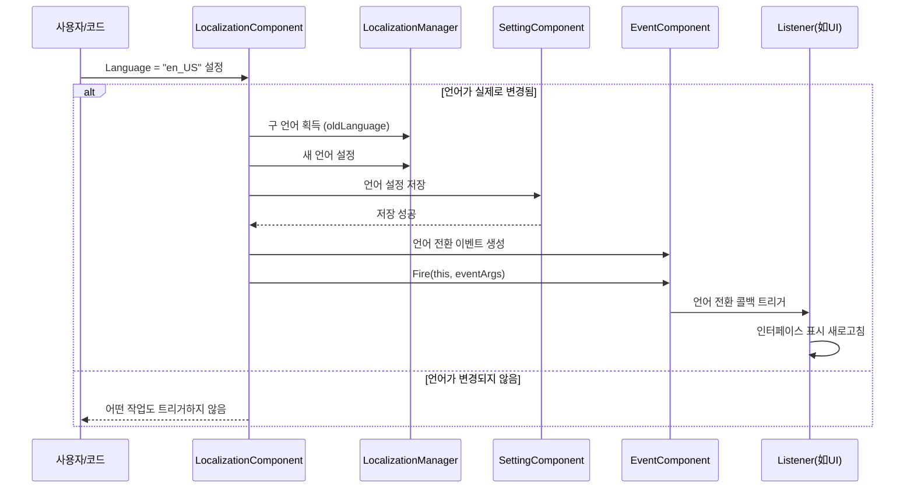

# 언어 전환 및 이벤트

언어 전환 및 이벤트는 GameFrameX 지역화 시스템의 핵심 기능 중 하나로, 개발자가 런타임에 애플리케이션 언어를 동적으로 전환하고 이벤트 메커니즘을 통해 모든 Listener에게 언어 변경 사실을 알릴 수 있어 UI, 텍스트 등의 콘텐츠가 자동으로 새로고침되도록 합니다.

## 개요

GameFrameX 지역화 시스템은 **이벤트 구동 아키텍처**를 채택하여 언어 전환 기능을 구현합니다. 애플리케이션의 언어 설정이 변경되면 시스템이 다음을 실행합니다:

1. 내부 언어 상태 업데이트
2. 새 언어 설정을 지속적 저장
3. 이벤트 시스템을 통해 언어 전환 이벤트 게시
4. Listener가 이벤트를 수신한 후相应操作 실행 (예: UI 표시 새로고침)

这种 설계는 **느슨한 결합**을 실현합니다: 언어 전환의发起者는誰が언어 변화에 응답할지 알 필요가 없으며, 응답자도 언어가 어떻게 전환되는지 걱정할 필요가 없습니다.

> **설계 의도**: 이벤트 메커니즘을 사용하여 언어 전환을 처리하면 여러 시스템(UI 시스템, 음향 시스템, 날짜 형식 시스템 등)이 독립적으로 언어 변화에 응답할 수 있어, 언어 전환 코드에서 직접 이러한 시스템에 의존할 필요가 없습니다. 이는 **관찰자 모드**의 설계理念을 따르며 시스템의 확장성과 유지보수성을 향상시킵니다.

## 아키텍처 설계

### 컴포넌트 관계도

```mermaid
flowchart TD
    subgraph GameFrameX["GameFrameX 핵심 프레임워크"]
        EventComp[EventComponent<br/>이벤트 컴포넌트]
        SettingComp[SettingComponent<br/>설정 컴포넌트]
    end

    subgraph Localization["지역화 모듈"]
        LocComp[LocalizationComponent<br/>지역화 컴포넌트]
        LocMgr[LocalizationManager<br/>지역화 관리자"]
        Helper[LocalizationHelper<br/>지역화 헬퍼]
    end

    subgraph Events["이벤트 시스템"]
        LangChangeEvent[LocalizationLanguageChangeEventArgs<br/>언어 전환 이벤트]
    end

    LocComp -->|"Language 획득/설정"| LocMgr
    LocComp -->|"Fire Event"| EventComp
    LocComp -->|"설정 저장"| SettingComp
    LocMgr -->|"Helper 설정"| Helper
    EventComp -->|"게시"| LangChangeEvent
    
    style LocComp fill:#e1f5fe
    style EventComp fill:#fff3e0
    style LangChangeEvent fill:#e8f5e9
```

### 언어 전환 흐름



## 언어 전환 상세

### 언어 설정

`LocalizationComponent`의 `Language` 속성을 통해 현재 언어를 설정할 수 있습니다:

```csharp
// 지역화 컴포넌트 획득
var localizationComponent = GameEntry.GetComponent<LocalizationComponent>();

// 영어로 설정
localizationComponent.Language = "en_US";

// 중국어로 설정
localizationComponent.Language = "zh_CN";

// 일어로 설정
localizationComponent.Language = "ja_JP";
```
> Source: [LocalizationComponent.cs](https://github.com/GameFrameX/com.gameframex.unity.localization/blob/main/Runtime/Localization/LocalizationComponent.cs#L116-L143)

**언어 전환의 내부 구현 로직:**

```csharp
public string Language
{
    get { /* ... */ }
    set
    {
        if (m_LocalizationManager.Language != value)  // 언어가 실제로 변경된 경우에만 처리
        {
            var oldLanguage = m_LocalizationManager.Language;  // 구 언어 기록
            m_LocalizationManager.Language = value;            // 새 언어 설정
            m_SettingComponent.SetString(...);                 // 지속적 저장
            m_SettingComponent.Save();
            
            // 언어 전환 이벤트 트리거
            var eventArgs = LocalizationLanguageChangeEventArgs.Create(oldLanguage, value);
            m_EventComponent.Fire(this, eventArgs);
        }
    }
}
```
> Source: [LocalizationComponent.cs](https://github.com/GameFrameX/com.gameframex.unity.localization/blob/main/Runtime/Localization/LocalizationComponent.cs#L131-L142)

### 현재 언어 획득

```csharp
var localizationComponent = GameEntry.GetComponent<LocalizationComponent>();

// 현재 언어 획득
string currentLanguage = localizationComponent.Language;

// 시스템 언어 획득
string systemLanguage = localizationComponent.SystemLanguage;

// 기본 언어 획득
string defaultLanguage = localizationComponent.DefaultLanguage;
```

### 시스템 언어 획득

시스템 언어란 장치의 현재 지역 언어 설정입니다:

```csharp
var localizationComponent = GameEntry.GetComponent<LocalizationComponent>();
string systemLang = localizationComponent.SystemLanguage;
```

## 이벤트 상세

### 언어 전환 이벤트

언어가 전환되면 시스템이 `LocalizationLanguageChangeEventArgs` 이벤트를 게시합니다.

#### 이벤트 매개변수 구조

```csharp
public sealed class LocalizationLanguageChangeEventArgs : GameEventArgs
{
    /// <summary>
    /// 이벤트 ID
    /// </summary>
    public static readonly string EventId = typeof(LocalizationLanguageChangeEventArgs).FullName;

    /// <summary>
    /// 현재 언어
    /// </summary>
    public string Language { get; set; }

    /// <summary>
    /// 구 언어
    /// </summary>
    public string OldLanguage { get; set; }
}
```
> Source: [LocalizationLanguageChangeEventArgs.cs](https://github.com/GameFrameX/com.gameframex.unity.localization/blob/main/Runtime/EventArgs/LocalizationLanguageChangeEventArgs.cs#L11-L33)

#### 언어 전환 이벤트 구독

```csharp
using GameFrameX.Event.Runtime;
using GameFrameX.Localization.Runtime;

public class MyLanguageListener : MonoBehaviour
{
    private EventComponent _eventComponent;

    private void Start()
    {
        _eventComponent = GameEntry.GetComponent<EventComponent>();
        
        // 언어 전환 이벤트 구독
        _eventComponent.Subscribe(LocalizationLanguageChangeEventArgs.EventId, OnLanguageChanged);
    }

    private void OnLanguageChanged(object sender, GameEventArgs e)
    {
        var args = e as LocalizationLanguageChangeEventArgs;
        Debug.Log($"언어가 {args.OldLanguage}에서 {args.Language}로 전환되었습니다");
        
        // 여기에서 UI 표시 새로고침, 지역화된 문자열 다시 로드 등 수행 가능
        RefreshUI();
    }

    private void OnDestroy()
    {
        // 구독 취소하여 메모리 누수 방지
        if (_eventComponent != null)
        {
            _eventComponent.Unsubscribe(LocalizationLanguageChangeEventArgs.EventId, OnLanguageChanged);
        }
    }

    private void RefreshUI()
    {
        // UI 새로고침 로직 구현
    }
}
```
> Source: [LocalizationLanguageChangeEventArgs.cs](https://github.com/GameFrameX/com.gameframex.unity.localization/blob/main/Runtime/EventArgs/LocalizationLanguageChangeEventArgs.cs#L52-L58)

### 사전 로드 이벤트

언어 전환 이벤트 외에 시스템은 사전 로드 관련 이벤트를 제공합니다 (현재 코드에서 주석 처리 상태이지만 클래스가 정의되어 있음):

| 이벤트 | 설명 |
|------|------|
| `LoadDictionarySuccessEventArgs` | 사전 로드 성공 이벤트 |
| `LoadDictionaryFailureEventArgs` | 사전 로드 실패 이벤트 |

```csharp
// 사전 로드 성공 이벤트 매개변수
public sealed class LoadDictionarySuccessEventArgs : GameEventArgs
{
    /// <summary>
    /// 이벤트 ID
    /// </summary>
    public static readonly string EventId = typeof(LoadDictionarySuccessEventArgs).FullName;

    /// <summary>
    /// 사전 에셋 이름
    /// </summary>
    public string DictionaryAssetName { get; private set; }

    /// <summary>
    /// 로드 지속 시간
    /// </summary>
    public float Duration { get; private set; }

    /// <summary>
    /// 사용자 정의 데이터
    /// </summary>
    public object UserData { get; private set; }
}
```
> Source: [LoadDictionarySuccessEventArgs.cs](https://github.com/GameFrameX/com.gameframex.unity.localization/blob/main/Runtime/EventArgs/LoadDictionarySuccessEventArgs.cs#L42-L85)

## 모범 사례

### 1. 언어 전환 시 UI 자동 새로고침 감시

通用的 언어 전환 Listener를 생성하여 자동刷新所有 지역화 UI 요소:

```csharp
using UnityEngine;
using GameFrameX.Event.Runtime;
using GameFrameX.Localization.Runtime;

public class LanguageChangedListener : MonoBehaviour
{
    private EventComponent _eventComponent;

    private void Awake()
    {
        _eventComponent = GameEntry.GetComponent<EventComponent>();
    }

    private void OnEnable()
    {
        _eventComponent.Subscribe(LocalizationLanguageChangeEventArgs.EventId, OnLanguageChanged);
    }

    private void OnDisable()
    {
        _eventComponent.Unsubscribe(LocalizationLanguageChangeEventArgs.EventId, OnLanguageChanged);
    }

    private void OnLanguageChanged(object sender, GameEventArgs e)
    {
        var args = e as LocalizationLanguageChangeEventArgs;
        Debug.Log($"언어가 전환되었습니다: {args.OldLanguage} → {args.Language}");
        
        // 새로고침이 필요한 모든 컴포넌트에 알림
        BroadcastMessage("OnLanguageChanged", SendMessageOptions.DontRequireReceiver);
    }
}
```

### 2. 사용자 언어 기본 설정 저장

언어 설정은 자동으로 로컬에 저장되지만, 저장 시점을 수동으로 제어할 수도 있습니다:

```csharp
var localizationComponent = GameEntry.GetComponent<LocalizationComponent>();

// 사용자가 이전에 저장한 언어 획득
string savedLanguage = localizationComponent.Language;

// 언어 수정 후 자동 저장됩니다 (Set 속성에 이미 자동 저장 로직 포함)
```

### 3. 언어 전환 시 리소스 처리

언어 전환 시 일부 언어 관련 리소스를 다시 로드해야 할 수 있습니다:

```csharp
private void OnLanguageChanged(object sender, GameEventArgs e)
{
    var args = e as LocalizationLanguageChangeEventArgs;
    
    // 구 사전 캐시 비우기
    var localizationComponent = GameEntry.GetComponent<LocalizationComponent>();
    localizationComponent.RemoveAllRawStrings();
    
    // 새 언어 사전 다시 로드
    // LoadNewLanguageDictionary(args.Language);
    
    // 인터페이스 새로고침
    RefreshAllLocalizedContent();
}
```

## 일반적인 문제

### Q: 언어 전환 후 UI가 자동으로 업데이트되지 않습니다?

**A**: 언어 전환 이벤트를 구독하고 UI 새로고침 로직을 구현해야 합니다. GameFrameX는 UI를 자동으로 새로고침하지 않으며, 개발자가 이벤트를 감시한 후 수동으로 새로고침해야 합니다.

### Q: 시스템 현재 언어는 어떻게 획득하나요?

```csharp
var localizationComponent = GameEntry.GetComponent<LocalizationComponent>();
string systemLang = localizationComponent.SystemLanguage;
```

### Q: 언어 전환 이벤트는 어디에서 트리거되나요?

**A**: 언어 전환 이벤트는 `LocalizationComponent.Language` 속성의 setter에서 트리거됩니다. 설정된 값이 현재 언어와 다를 경우에만 이벤트가 트리거됩니다.

### Q: 언어 전환 이벤트의 반복 트리거를 어떻게 방지하나요?

**A**: `LocalizationComponent` 내부에서 이미 처리가 되어 있으며, 새 언어와 현재 언어가 다를 경우에만 이벤트가 트리거됩니다:

```csharp
if (m_LocalizationManager.Language != value)
{
    // 값이 다를 때만 실행
}
```

## 관련 링크

- [지역화된 문자열 획득](./4-core-features.get-string) - 지역화된 텍스트를 획득하는 방법 알아보기
- [사전 관리](./4-core-features.dictionary-management) - 사전의 로드 및 관리 알아보기
- [API 참고](./5-api-reference) - 완전한 API 문서
- [구성](./6-configuration) - 지역화 시스템 구성 설명
- [모범 사례](./7-best-practices) - 더 많은 사용 기술