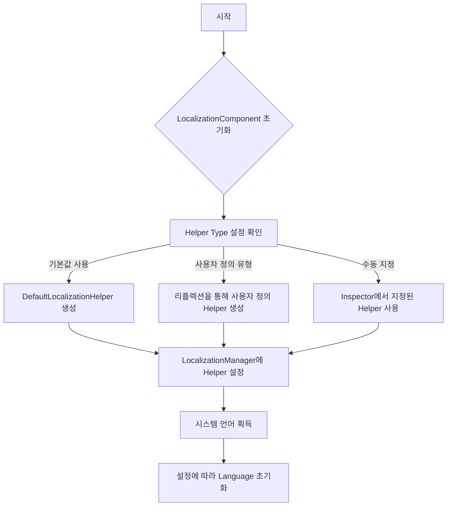
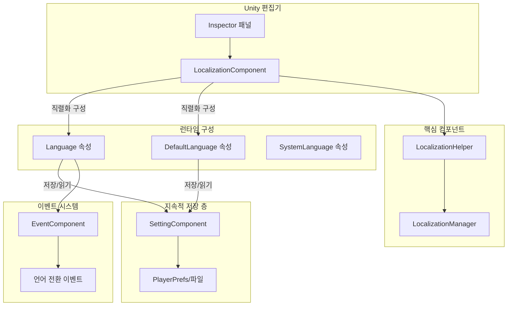

# 구성

이 문서는 GameFrameX Localization 컴포넌트의 각 구성 옵션을 상세히 소개하며, 편집기 구성과 런타임 구성을 포함합니다.

## 개요

GameFrameX Localization 컴포넌트는 유연한 지역화 구성 메커니즘을 제공하여 Unity 편집기 인터페이스 구성과 코드 런타임 구성 두 가지 방법을 지원합니다. 구성 시스템은 계층화 설계를 채택하여 개발자가 지역화 헬퍼 사용자 정의, 기본 언어 설정, 편집기 테스트 모드 활성화 등의 기능을 구성할 수 있도록 합니다.

LocalizationComponent는 Unity 엔진의 핵심 컴포넌트로, GameFrameworkComponent를 상속하며 직렬화 필드를 통해 구성 옵션을 제공합니다. 이러한 구성은 컴포넌트 초기화 시生效하여 지역화 시스템의 동작을 제어합니다.

> 소스 파일:
> - [LocalizationComponent.cs](https://github.com/GameFrameX/com.gameframex.unity.localization/blob/main/Runtime/Localization/LocalizationComponent.cs#L48-L777)
> - [LocalizationManager.cs](https://github.com/GameFrameX/com.gameframex.unity.localization/blob/main/Runtime/Localization/Localization/LocalizationManager.cs#L43-L937)

## 편집기 구성

### 지역화 컴포넌트 추가

Unity 편집기에서 다음 단계로 지역화 컴포넌트를 추가합니다:

1. Scene에서 빈 GameObject를 생성하거나 기존 객체를 선택합니다
2. 메뉴 **GameObject → GameFrameX → Localization**을 클릭합니다
3. 또는 Inspector 패널에서 **Add Component**를 클릭하고 "Localization"을 검색합니다

컴포넌트 추가 후, Inspector 패널에 구성 옵션이 표시됩니다.

### 구성 옵션 설명

```csharp
// LocalizationComponent 핵심 구성 필드
[SerializeField] private string m_EditorLanguage = "zh_CN";           // 편집기 언어
[SerializeField] private string m_DefaultLanguage = "zh_CN";         // 기본 언어
[SerializeField] private bool m_IsEnableEditorMode = false;          // 편집기 모드 활성화
[SerializeField] private string m_LocalizationHelperTypeName;        // 헬퍼 유형 이름
[SerializeField] private LocalizationHelperBase m_CustomLocalizationHelper; // 사용자 정의 헬퍼 인스턴스
```

> Source: [LocalizationComponentInspector.cs](https://github.com/GameFrameX/com.gameframex.unity.localization/blob/main/Editor/Inspector/LocalizationComponentInspector.cs#L42-L46)

다음 표는 각 구성 항목을 상세히 설명합니다:

| 구성 항목 | 유형 | 기본값 | 설명 |
|--------|------|--------|------|
| **Default Language** | string | "zh_CN" | 기본 언어 코드, 로컬라이제이션 로드 실패 시 이 언어 사용 |
| **Is Enable Editor Mode** | bool | false | 편집기 모드 활성화 여부, 활성화하면 편집기 언어가 아닌 런타임 언어 사용 |
| **Editor Language** | string | "zh_CN" | 편집기 모드에서 사용할 언어, 편집기에서만 유효 |
| **Localization Helper** | HelperInfo | DefaultLocalizationHelper | 지역화 헬퍼 유형, 사용자 정의 구현 가능 |

### 언어 코드 참조

언어 코드는 RFC 5646 표준을 따르며, 형식은 `[언어 코드]_[국가/지역 코드]`입니다, 예시:
- `zh_CN` - 중국어 간체 (중국)
- `zh_TW` - 중국어 번체 (대만)
- `en_US` - 영어 (미국)
- `ja_JP` - 일본어 (일본)
- `ko_KR` - 한국어 (한국)

시스템은 풍부한 언어 코드 상수를 미리 정의하였으며, `LocalizationCode` 클래스를 통해 직접 참조할 수 있습니다:

```csharp
// 미리 정의된 언어 코드 상수 사용
LocalizationComponent component = gameObject.GetComponent<LocalizationComponent>();
component.DefaultLanguage = LocalizationCode.Chinese;        // zh_CN
component.DefaultLanguage = LocalizationCode.English;         // en_US
component.DefaultLanguage = LocalizationCode.Japanese;        // ja_JP
```

> Source: [LocalizationCode.cs](https://github.com/GameFrameX/com.gameframex.unity.localization/blob/main/Runtime/Localization/LocalizationCode.cs#L45-L986)

## 런타임 구성

### 코드를 통한 언어 구성

게임 런타임에서 코드를 통해 동적으로 언어 설정을 구성할 수 있습니다:

```csharp
using GameFrameX.Localization.Runtime;

// 지역화 컴포넌트 획득
var localizationComponent = GameEntry.GetComponent<LocalizationComponent>();

// 현재 언어 설정
localizationComponent.Language = "en_US";

// 기본 언어 설정 (로드 실패 시 사용)
localizationComponent.DefaultLanguage = "zh_CN";

// 현재 언어 획득
string currentLanguage = localizationComponent.Language;

// 시스템 언어 획득
string systemLanguage = localizationComponent.SystemLanguage;
```

> Source: [LocalizationComponent.cs](https://github.com/GameFrameX/com.gameframex.unity.localization/blob/main/Runtime/Localization/LocalizationComponent.cs#L116-L143)

### 구성 지속적 저장 메커니즘

Language와 DefaultLanguage 설정은 자동으로 로컬 설정 시스템에 지속적으로 저장됩니다. 첫 실행 시 시스템 언어가 기본 언어로 사용됩니다:

```csharp
// 초기화 흐름 의사코드
if (Language == UnknownLocalization)
{
    Language = SystemLanguage;  // 시스템 언어 사용
}
DefaultLanguage = m_DefaultLanguage != UnknownLocalization ? m_DefaultLanguage : SystemLanguage;
```

> Source: [LocalizationComponent.cs](https://github.com/GameFrameX/com.gameframex.unity.localization/blob/main/Runtime/Localization/LocalizationComponent.cs#L232-L237)

### 구성 속성 상세

#### Language 속성

현재 지역화 언어를 획득하거나 설정합니다. 새 언어를 설정하면 언어 전환 이벤트가 트리거됩니다:

```csharp
public string Language
{
    get
    {
        if (m_LocalizationManager.Language == UnknownLocalization)
        {
            var value = m_SettingComponent.GetString(nameof(LocalizationComponent) + "." + nameof(Language));
            if (value.IsNotNullOrWhiteSpace())
            {
                m_LocalizationManager.Language = value;
            }
        }
        return m_LocalizationManager.Language;
    }
    set
    {
        if (m_LocalizationManager.Language != value)
        {
            var oldLanguage = m_LocalizationManager.Language;
            m_LocalizationManager.Language = value;
            m_SettingComponent.SetString(nameof(LocalizationComponent) + "." + nameof(Language), value);
            m_SettingComponent.Save();
            var localizationLanguageChangeEventArgs = LocalizationLanguageChangeEventArgs.Create(oldLanguage, value);
            m_EventComponent.Fire(this, localizationLanguageChangeEventArgs);
        }
    }
}
```

**설계 의도**: Language 속성은 지연 로드 메커니즘을 채택하여 지속적 저장에서 이전에 저장된 언어 설정을 읽어옵니다. 새 값을 설정하면 자동으로 저장하여 언어 기본 설정이 세션 간에 유지됩니다. 동시에 이벤트 알림을 트리거하여 다른 시스템에 언어 변경 사실을 알립니다.

#### DefaultLanguage 속성

기본 지역화 언어를 획득하거나 설정하며, 로컬라이제이션 로드 실패 시 사용됩니다:

```csharp
public string DefaultLanguage
{
    get
    {
        if (m_LocalizationManager.DefaultLanguage == UnknownLocalization)
        {
            var value = m_SettingComponent.GetString(nameof(LocalizationComponent) + "." + nameof(DefaultLanguage));
            if (value.IsNotNullOrWhiteSpace())
            {
                m_LocalizationManager.DefaultLanguage = value;
            }
        }
        return m_LocalizationManager.DefaultLanguage;
    }
    set
    {
        if (m_LocalizationManager.DefaultLanguage != value)
        {
            m_LocalizationManager.DefaultLanguage = value;
            m_SettingComponent.SetString(nameof(LocalizationComponent) + "." + nameof(DefaultLanguage), value);
            m_SettingComponent.Save();
        }
    }
}
```

**설계 의도**: DefaultLanguage는 폴백 메커니즘으로, 대상 언어 리소스가 누락된 경우에도 콘텐츠를 표시할 수 있어 사용자 경험을 향상시킵니다.

#### SystemLanguage 속성

장치 시스템 언어를 획득합니다:

```csharp
public string SystemLanguage
{
    get { return m_LocalizationManager.SystemLanguage; }
}
```

시스템 언어는 LocalizationHelper에서 제공되며, DefaultLocalizationHelper는 CultureInfo를 통해 획득합니다:

```csharp
public override string SystemLanguage
{
    get { return _regionName; }  // 예: "zh_CN", "en_US"
}
```

> Source: [DefaultLocalizationHelper.cs](https://github.com/GameFrameX/com.gameframex.unity.localization/blob/main/Runtime/Localization/DefaultLocalizationHelper.cs#L43-L57)

## 사용자 정의 지역화 헬퍼

### 왜 사용자 정의 헬퍼가 필요한가?

기본 LocalizationHelper는 `CultureInfo.CurrentCulture.Name`을 통해 시스템 언어를 획득합니다. 일부 시나리오에서는 사용자 정의 로직을 통해 시스템 언어를 결정해야 할 수 있습니다, 예를 들어:
- 서버에서 언어 설정 획득
- 플레이어 계정 설정에 따른 언어 결정
- 구성 파일의 언어 설정 사용

### 사용자 정의 헬퍼 생성

1. LocalizationHelperBase를 상속합니다:

```csharp
using GameFrameX.Localization.Runtime;
using UnityEngine;

public class CustomLocalizationHelper : LocalizationHelperBase
{
    // 사용자 정의 시스템 언어 획득 로직
    public override string SystemLanguage
    {
        get
        {
            // 서버 또는 구성에서 언어 획득
            return PlayerPrefs.GetString("Language", "zh_CN");
        }
    }
}
```

> Source: [LocalizationHelperBase.cs](https://github.com/GameFrameX/com.gameframex.unity.localization/blob/main/Runtime/Localization/LocalizationHelperBase.cs#L41-L48)

2. 편집기에서 사용자 정의 헬퍼 구성:

LocalizationComponent의 Inspector 패널에서 Helper Type을 사용자 정의 클래스로 설정하거나, 사용자 정의 헬퍼 컴포넌트를 Custom Localization Helper 필드에 직접 드래그합니다.

### 헬퍼 구성 흐름



> Source: [LocalizationComponent.cs](https://github.com/GameFrameX/com.gameframex.unity.localization/blob/main/Runtime/Localization/LocalizationComponent.cs#L214-L237)

## 구성 아키텍처 도



## 구성 옵션 종합표

### LocalizationComponent 구성

| 속성 | 유형 | 기본값 | 런타임 쓰기 가능 | 설명 |
|------|------|--------|------------|------|
| `EditorLanguage` | string | "zh_CN" | 아니오 (편집기만) | 편집기 테스트용 언어 |
| `DefaultLanguage` | string | "zh_CN" | 예 | 로드 실패 시 폴백 언어 |
| `IsEnableEditorMode` | bool | false | 아니오 | 편집기에서 EditorLanguage 사용 여부 |
| `Language` | string | 시스템 언어 | 예 | 현재 사용 중인 언어 |
| `SystemLanguage` | string | 장치 언어 | 읽기 전용 | 운영 체제 언어 |

### LocalizationManager 핵심 속성

| 속성 | 유형 | 설명 |
|------|------|------|
| `DefaultLanguage` | string | 기본 언어 |
| `Language` | string | 현재 언어 |
| `SystemLanguage` | string | 시스템 언어 |
| `DictionaryCount` | int | 현재 사전 수량 |

### 미리 정의된 언어 코드 (일반적인)

| 상수 | 값 | 설명 |
|------|-----|------|
| `LocalizationCode.Chinese` | "zh_CN" | 중국어 간체 |
| `LocalizationCode.ChineseTraditionalTW` | "zh_TW" | 중국어 번체 (대만) |
| `LocalizationCode.Japanese` | "ja_JP" | 일본어 |
| `LocalizationCode.Korean` | "ko_KR` | 한국어 |
| `LocalizationCode.English` | "en_US" | 영어 (미국) |
| `LocalizationCode.EnglishUK` | "en_GB" | 영어 (영국) |
| `LocalizationCode.French` | "fr_FR" | 프랑스어 |
| `LocalizationCode.German` | "de_DE" | 독일어 |
| `LocalizationCode.Spanish` | "es_ES" | 스페인어 |
| `LocalizationCode.Russian` | "ru_RU` | 러시아어 |

> Source: [LocalizationCode.cs](https://github.com/GameFrameX/com.gameframex.unity.localization/blob/main/Runtime/Localization/LocalizationCode.cs#L46-L148)

## 모범 사례

### 1. 게임 시작 시 언어 설정

게임 시작 흐름에서 가능한 한 빨리 언어를 설정하여 모든 UI 텍스트가 올바른 언어로 표시되도록 보장하는 것을 권장합니다:

```csharp
// 게임 초기화 단계에서 언어 설정
var localizationComponent = GameEntry.GetComponent<LocalizationComponent>();

// 방식 1: 저장된 언어 설정 사용
string savedLanguage = PlayerPrefs.GetString("GameLanguage");
if (!string.IsNullOrEmpty(savedLanguage))
{
    localizationComponent.Language = savedLanguage;
}
else
{
    // 방식 2: 시스템 언어를 기본으로 사용
    localizationComponent.Language = localizationComponent.SystemLanguage;
}
```

### 2. 언어 전환 감시

언어 전환 이벤트를 감시하여 UI를 업데이트합니다:

```csharp
// 언어 전환 이벤트 구독
EventComponent eventComponent = GameEntry.GetComponent<EventComponent>();
eventComponent.Subscribe(LocalizationLanguageChangeEventArgs.EventId, OnLanguageChanged);

private void OnLanguageChanged(object sender, GameEventArgs e)
{
    var args = (LocalizationLanguageChangeEventArgs)e;
    Debug.Log($"언어가 {args.OldLanguage}에서 {args.Language}로 전환되었습니다");
    
    // 지역화된 모든 UI 컴포넌트 새로고침
    // RefreshAllLocalizedUI();
}
```

> Source: [LocalizationLanguageChangeEventArgs.cs](https://github.com/GameFrameX/com.gameframex.unity.localization/blob/main/Runtime/EventArgs/LocalizationLanguageChangeEventArgs.cs#L52-L58)

### 3. 구성 검사 목록

게임 배포 전 다음 구성을 확인하세요:

- [ ] DefaultLanguage가 프로젝트 주요 언어로 설정됨
- [ ] 지원되는 모든 언어에 대응하는 사전 리소스가 있음
- [ ] 사용자 정의 LocalizationHelper가 올바르게 구현됨
- [ ] 언어 전환 이벤트가 올바르게 처리됨
- [ ] 시스템 언어가 지원 목록에 없을 때 폴백 동작 테스트됨

## 관련 링크

- [지역화된 문자열 획득](../4-core-features.get-string) - 지역화된 텍스트를 획득하는 방법 알아보기
- [사전 관리](../4-core-features.dictionary-management) - 사전 데이터 관리 알아보기
- [언어 전환 및 이벤트](../4-core-features.language-switching) - 언어 전환 메커니즘 알아보기
- [API 참고](../5-api-reference) - 완전한 API 문서
- [빠른 시작](../3-getting-started) - 빠르게 시작하기 가이드