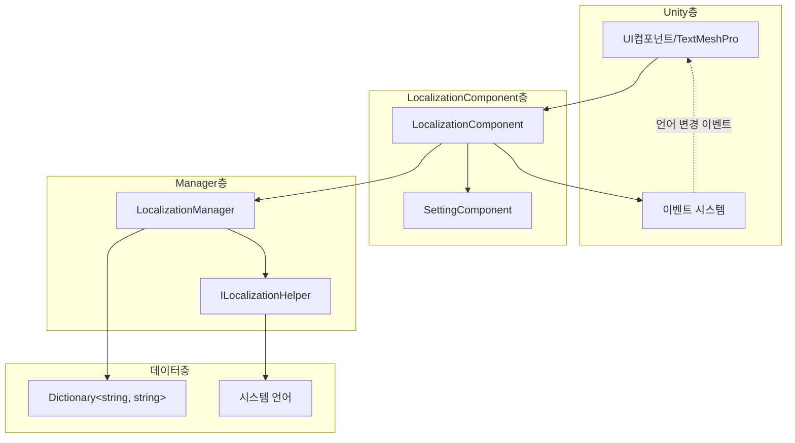

# 모범 사례

이 문서는 GameFrameX Localization 컴포넌트의 모범 사례 가이드를 제공하여 개발자가 다국어 기능을 효율적이고 규범적으로 구현할 수 있도록 도와줍니다.

## 개요

GameFrameX Localization 컴포넌트는 Unity 게임을 위해 완전한 지역화 솔루션을 제공합니다. 이 문서의 모범 사례를 따르면 유지보수 가능하고 확장 가능한 다국어 시스템을 구축할 수 있으며, 일반적인 함정과 반패턴을 피할 수 있습니다.

## 핵심 아키텍처 되짚기



### 컴포넌트 책임

| 컴포넌트 | 책임 |
|------|------|
| LocalizationComponent | Unity 컴포넌트 층, 초기화 및 이벤트 트리거 담당 |
| LocalizationManager | 핵심 관리자, 사전 저장 및 문자열 검색 처리 |
| ILocalizationHelper | 시스템 언어 감지 인터페이스, 사용자 정의 구현 가능 |
| SettingComponent | 언어 설정 지속적 저장 |

## 모범 사례

### 1. 키 명명 규범

계층화된 키 명명 전략을 채택하여 관리 및 검색을 용이하게 합니다.

**권장 형식:**

```csharp
// 형식: 기능 모듈_인터페이스 요소_구체적 설명
"main_menu_start_button"           // 메인 메뉴-시작 버튼
"main_menu_settings_button"        // 메인 메뉴-설정 버튼
"game_hud_score_label"             // 게임HUD-점수 레이블
"game_dialog_confirm_message"      // 게임 팝업-확인 메시지
"settings_audio_master_volume"     // 설정-오디오-메인 볼륨
```

**권장하지 않음:**

```csharp
// ❌ 규칙 없는 명명
"start"                            // 의미가 불명확함
"button1"                          // 맥락 없음
"msg_001"                          // 유지보수 어려움
```

**상수 클래스를 사용하여 키 관리:**

```csharp
// 전용 상수 클래스를 생성하여 키 관리 권장
public static class LocalizationKeys
{
    public const string MainMenuStart = "main_menu_start_button";
    public const string MainMenuSettings = "main_menu_settings_button";
    public const string GameHudScore = "game_hud_score_label";
}
```

> Source: [LocalizationManager.cs](https://github.com/GameFrameX/com.gameframex.unity.localization/blob/main/Runtime/Localization/Localization/LocalizationManager.cs#L168-L177)

### 2. 기본 언어 설정

합리적인 기본 언어를 항상 설정하고, `DefaultLanguage` 속성을 폴백 메커니즘으로 사용합니다.

**기본 설정:**

```csharp
var localizationComponent = GameEntry.GetComponent<LocalizationComponent>();
// 기본 언어를 중국어 간체로 설정
localizationComponent.DefaultLanguage = LocalizationCode.ChineseSimplified;
```

> Source: [LocalizationComponent.cs](parameterName=86-L110)

**다층 폴백 전략:**

```csharp
// 폴백 체인 설계: 사용자 설정 -> 시스템 언어 -> 기본 언어
// 1. 먼저 사용자가 저장한 언어 설정을 사용
// 2. 설정되지 않았으면 시스템 언어 사용
// 3. 시스템 언어가 지원되지 않으면 기본 언어로 폴백
if (string.IsNullOrEmpty(savedLanguage))
{
    localizationComponent.Language = localizationComponent.SystemLanguage;
}
```

### 3. 매개변수화된 문자열 처리

제네릭 메서드를 사용하여 동적 콘텐츠를 처리하며, 최대 16개의 매개변수를 지원합니다.

**단일 매개변수 사용:**

```csharp
// 단순 매개변수 교체
string welcome = localizationComponent.GetString("game_welcome_message", playerName);
// 템플릿: "돌아오신 것을 환영합니다, {0}!" -> "돌아오신 것을 환영합니다, 김철수!"
```

> Source: [LocalizationManager.cs](parameterName=205-L221)

**다중 매개변수 사용:**

```csharp
// 복잡한 포맷팅
string levelInfo = localizationComponent.GetString("game_level_info", 
    currentLevel,      // T1
    maxLevel,          // T2
    playerScore);      // T3
// 템플릿: "제 {0}关 / 전체 {1}关 - 점수: {2}"
```

> Source: [LocalizationManager.cs](parameterName=263-L279)

**params 배열 사용:**

```csharp
// 동적数量的 매개변수
object[] args = { itemName, itemCount, playerGold };
string message = localizationComponent.GetString("shop_purchase_info", args);
```

> Source: [LocalizationManager.cs](parameterName=186-L195)

### 4. 언어 변경 이벤트 처리

언어 변경 이벤트를 감시하여 UI의 자동 새로고침을 구현합니다.

**이벤트 구독:**

```csharp
private void OnLanguageChanged(object sender, LocalizationLanguageChangeEventArgs e)
{
    // 모든 지역화된 텍스트 새로고침
    RefreshAllLocalizedTexts();
    
    // 또는 현재 Scene 다시 로드
    // SceneManager.LoadScene(SceneManager.GetActiveScene().name);
}

private void Start()
{
    var eventComponent = GameEntry.GetComponent<EventComponent>();
    eventComponent.Subscribe(LocalizationLanguageChangeEventArgs.EventId, OnLanguageChanged);
}
```

> Source: [LocalizationLanguageChangeEventArgs.cs](https://github.com/GameFrameX/com.gameframex.unity.localization/blob/main/Runtime/EventArgs/LocalizationLanguageChangeEventArgs.cs#L52-L58)

**이벤트 트리거 메커니즘:**

```csharp
// LocalizationComponent에서 언어 설정 시 자동으로 이벤트 트리거
localizationComponent.Language = LocalizationCode.English; 
// LocalizationLanguageChangeEventArgs 이벤트 트리거
```

> Source: [LocalizationComponent.cs](parameterName=131-L143)

### 5. 사전 관리 전략

**기능 모듈별로 사전 구성:**

```csharp
// UI 사전
AddRawString("ui_main_menu_title", "메인 메뉴");
AddRawString("ui_main_menu_start", "게임 시작");
AddRawString("ui_main_menu_settings", "설정");

// 게임 내 사전
AddRawString("game_hud_health", "생명값");
AddRawString("game_hud_energy", "에너지값");
AddRawString("game_level_complete", "스테이지 완료!");
```

**동적 사전 추가:**

```csharp
// 게임 시작 시 언어팩 로드
public void LoadLanguagePack(string languageCode)
{
    // 리소스 시스템에서 언어팩 데이터 로드
    var languageData = Resources.Load<TextAsset>($"Languages/{languageCode}");
    var lines = languageData.text.Split('\n');
    
    foreach (var line in lines)
    {
        var parts = line.Split('=');
        if (parts.Length == 2)
        {
            localizationComponent.AddRawString(parts[0].Trim(), parts[1].Trim());
        }
    }
}
```

> Source: [LocalizationManager.cs](parameterName=899-L913)

### 6. 성능 최적화

**Update에서 GetString을 자주 호출하지 않기:**

```csharp
// ❌ 반패턴: 매 프레임 호출
void Update()
{
    text.text = localizationComponent.GetString("game_timer", currentTime);
}

// ✅ 올바른 패턴: 문자열 캐싱, 값이 변경될 때만 업데이트
private string _cachedTimeKey = "game_timer";
private float _lastUpdateTime;

void Update()
{
    if (Mathf.Abs(currentTime - _lastUpdateTime) > 0.1f)
    {
        text.text = localizationComponent.GetString(_cachedTimeKey, currentTime);
        _lastUpdateTime = currentTime;
    }
}
```

**HasRawString을 사용하여 존재성 확인:**

```csharp
// 키가 존재하는지 확인하여 오류 표시 방지
if (localizationComponent.HasRawString(key))
{
    var value = localizationComponent.GetString(key);
}
```

> Source: [LocalizationManager.cs](parameterName=862-L870)

### 7. 사용자 정의 언어 감지 헬퍼

기본 시스템 언어 감지가 요구사항을 충족하지 못하면 `ILocalizationHelper`를 확장할 수 있습니다.

**사용자 정의 헬퍼 구현:**

```csharp
public class CustomLocalizationHelper : LocalizationHelperBase
{
    public override string SystemLanguage
    {
        get 
        {
            // 사용자 정의 언어 감지 로직
            // 예: 플레이어 구성에서 언어 설정 읽기
            var config = PlayerPrefs.GetString("language_preference");
            return string.IsNullOrEmpty(config) 
                ? base.SystemLanguage 
                : config;
        }
    }
}
```

> Source: [DefaultLocalizationHelper.cs](https://github.com/GameFrameX/com.gameframex.unity.localization/blob/main/Runtime/Localization/DefaultLocalizationHelper.cs#L41-L58)

### 8. 표준 언어 코드 사용

`LocalizationCode` 클래스의 상수를 사용하여 언어 코드의 일관성을 보장합니다.

```csharp
// ✅ 권장: 미리 정의된 상수 사용
localizationComponent.Language = LocalizationCode.ChineseSimplified;  // "zh_CN"
localizationComponent.Language = LocalizationCode.English;             // "en_US"
localizationComponent.Language = LocalizationCode.Japanese;           // "ja_JP"

// ❌ 권장하지 않음: 문자열을 수동으로 입력
localizationComponent.Language = "zh-CN";  // 형식이 불일치
```

> Source: [LocalizationCode.cs](https://github.com/GameFrameX/com.gameframex.unity.localization/blob/main/Runtime/Localization/LocalizationCode.cs#L1-L986)

### 9. 오류 처리 및 폴백

**누락된 키 처리:**

```csharp
// GetString 메서드는 누락된 키를 자동으로 처리합니다
// 반환 형식: <NoKey>key_name
string result = localizationComponent.GetString("nonexistent_key");
// 반환: <NoKey>nonexistent_key>
```

> Source: [LocalizationManager.cs](parameterName=170-L177)

**사용자 정의 폴백 로직 추가:**

```csharp
public string GetStringSafe(string key, string fallback = "")
{
    if (localizationComponent.HasRawString(key))
    {
        return localizationComponent.GetString(key);
    }
    
    Log.Warning($"지역화 키를 찾을 수 없습니다: {key}");
    return fallback;
}
```

### 10. 편집기 모드 지원

편집기 모드를 활용하여 개발 및 테스트를 가속화합니다.

```csharp
// LocalizationComponent에서 편집기 모드 활성화
// m_IsEnableEditorMode = true;
// m_EditorLanguage = "zh_CN";

// 편집기에서 빠르게 언어 전환하여 표시 효과 미리보기 가능
// 런타임 동작에 영향 없음
```

> Source: [LocalizationComponent.cs](parameterName=227-L236)

## 일반적인 시나리오 실행

### 시나리오 1: 게임 내 언어 전환

```csharp
public class LanguageSwitcher : MonoBehaviour
{
    public void SwitchToChinese()
    {
        var loc = GameEntry.GetComponent<LocalizationComponent>();
        loc.Language = LocalizationCode.ChineseSimplified;
    }

    public void SwitchToEnglish()
    {
        var loc = GameEntry.GetComponent<LocalizationComponent>();
        loc.Language = LocalizationCode.English;
    }
}
```

### 시나리오 2: 지역화된 텍스트 컴포넌트

```csharp
public class LocalizedText : MonoBehaviour
{
    [SerializeField] private string _localizationKey;
    private TextMeshProUGUI _text;

    private void Start()
    {
        _text = GetComponent<TextMeshProUGUI>();
        RefreshText();
        
        // 언어 변경 이벤트 구독
        GameEntry.GetComponent<EventComponent>()
            .Subscribe(LocalizationLanguageChangeEventArgs.EventId, OnLanguageChanged);
    }

    private void RefreshText()
    {
        var loc = GameEntry.GetComponent<LocalizationComponent>();
        _text.text = loc.GetString(_localizationKey);
    }

    private void OnLanguageChanged(object sender, GameEventArgs e)
    {
        RefreshText();
    }
}
```

### 시나리오 3: 동적 포맷팅 텍스트

```csharp
// 아이템 정보 포맷팅
string itemDescription = localizationComponent.GetString(
    "game_item_description",
    itemName,      // 아이템 이름
    itemRarity,    // 희귀도
    itemLevel,     // 아이템 등급
    itemDamage     //攻击力
);
// 템플릿: "【{0}】\n희귀도: {1}\n등급: {2}\n攻击력: {3}"
```

## 요약

이상의 모범 사례를 따르면 고품질의 다국어 시스템을 구축할 수 있습니다:

1. **키 명명 규범화** - 계층화된 명명 사용으로 유지보수 및 검색 용이
2. **기본 언어 전략** - 합리적인 폴백 메커니즘 설정
3. **이벤트 구동 업데이트** - 언어 변경 이벤트를 활용하여 UI 새로고침
4. **성능 주의** - 불필요한 반복 호출 피하기
5. **확장성 설계** - 인터페이스 시스템을 활용하여 동작 사용자 정의
6. **표준화 코드** - `LocalizationCode` 상수 클래스 사용

---

## 관련 링크

- [핵심 기능 - 지역화된 문자열 획득](../4-core-features.get-string)
- [핵심 기능 - 사전 관리](../4-core-features.dictionary-management)
- [핵심 기능 - 언어 전환 및 이벤트](../4-core-features.language-switching)
- [API 참고](../5-api-reference)
- [구성](../6-configuration)