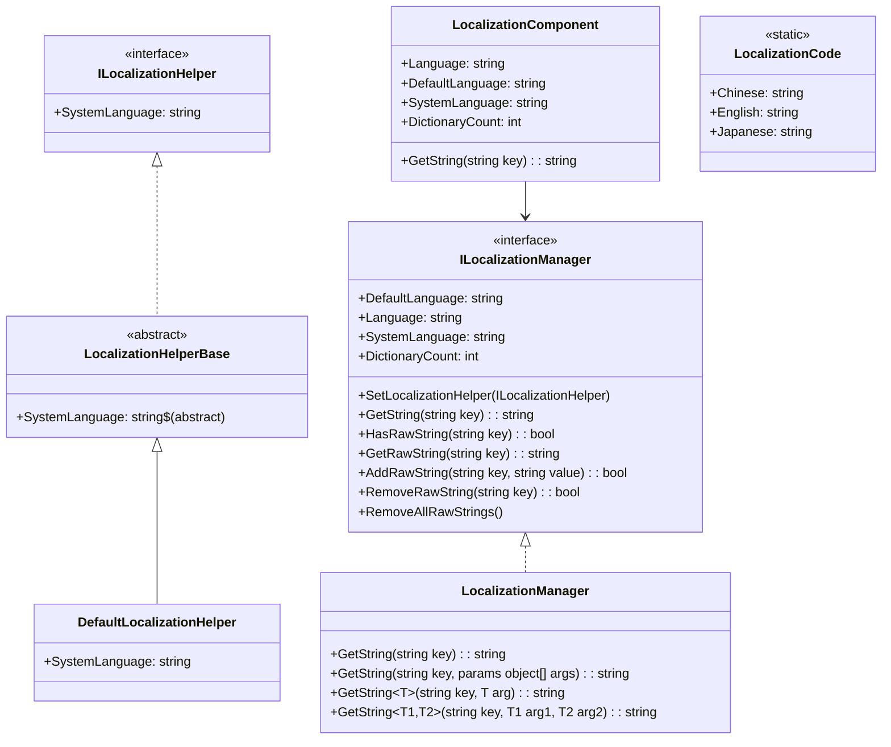
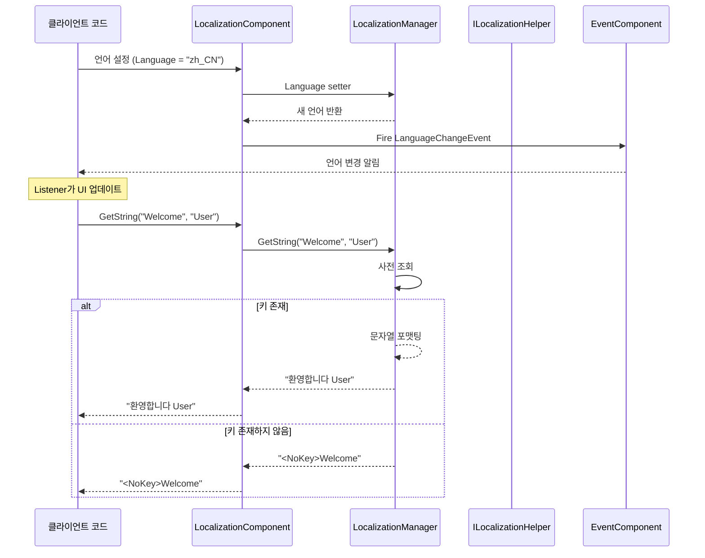

# API 참고

이 문서는 GameFrameX Localization 모듈이 제공하는 모든公共 API 인터페이스, 클래스 및 메서드를 상세히 소개합니다.

## 개요

GameFrameX Localization 모듈은 완전한 지역화 솔루션을 제공합니다:
- 다국어 문자열 관리
- 런타임 언어 전환
- 매개변수화된 문자열 포맷팅
- 시스템 언어 자동 감지
- 이벤트 구동 아키텍처

## 핵심 아키텍처



## ILocalizationManager 인터페이스

`ILocalizationManager`는 지역화 시스템의 핵심 인터페이스로, 지역화된 문자열 관리에 필요한 모든 작업을 정의합니다.

> Source: [ILocalizationManager.cs](https://github.com/GameFrameX/com.gameframex.unity.localization/blob/main/Runtime/Localization/Localization/ILocalizationManager.cs#L34-L529)

### 속성

| 속성 | 유형 | 설명 |
|------|------|------|
| `DefaultLanguage` | `string` | 기본 지역화 언어를 획득하거나 설정합니다. 로컬라이제이션 로드 실패 시 이 언어를 사용합니다. |
| `Language` | `string` | 현재 지역화 언어를 획득하거나 설정합니다. |
| `SystemLanguage` | `string` | 시스템 언어를 획득합니다. |
| `DictionaryCount` | `int` | 현재 로드된 사전 수량을 획득합니다. |

### 메서드

#### `SetLocalizationHelper`

```csharp
void SetLocalizationHelper(ILocalizationHelper localizationHelper)
```

지역화 헬퍼를 설정하여 시스템 언어 정보를 획득합니다.

**매개변수:**
- `localizationHelper` (ILocalizationHelper): 지역화 헬퍼 인스턴스.

> Source: [ILocalizationManager.cs](https://github.com/GameFrameX/com.gameframex.unity.localization/blob/main/Runtime/Localization/Localization/ILocalizationManager.cs#L71)

---

#### `GetString(string key): string`

사전 키에 따라 사전 내용 문자열을 획득합니다.

```csharp
string GetString(string key)
```

**매개변수:**
- `key` (string): 사전 키.

**반환:** 사전 내용 문자열, 키가 존재하지 않으면 `<NoKey>{key}` 형식의 오류 정보를 반환합니다.

> Source: [LocalizationManager.cs](https://github.com/GameFrameX/com.gameframex.unity.localization/blob/main/Runtime/Localization/Localization/LocalizationManager.cs#L168-L177)

---

#### `GetString(string key, params object[] args): string`

사전 키에 따라 사전 내용 문자열을 획득하고 매개변수 목록을 사용하여 포맷팅합니다.

```csharp
string GetString(string key, params object[] args)
```

**매개변수:**
- `key` (string): 사전 키.
- `args` (params object[]): 포맷팅 매개변수 목록.

**반환:** 포맷팅된 사전 내용 문자열.

> Source: [LocalizationManager.cs](https://github.com/GameFrameX/com.gameframex.unity.localization/blob/main/Runtime/Localization/Localization/LocalizationManager.cs#L186-L195)

---

#### 제네릭 GetString 메서드

시스템은 0개에서 16개까지의 타입 안전 매개변수를 지원하는 17개의 제네릭 오버로드 메서드를 제공합니다:

| 메서드 시그니처 | 설명 |
|----------|------|
| `GetString<T>(string key, T arg)` | 단일 매개변수 포맷팅 |
| `GetString<T1, T2>(string key, T1 arg1, T2 arg2)` | 이중 매개변수 포맷팅 |
| `GetString<T1, T2, T3>(string key, T1 arg1, T2 arg2, T3 arg3)` | 삼중 매개변수 포맷팅 |
| ... | ... |
| `GetString<T1, ..., T16>(string key, T1 arg1, ..., T16 arg16)` | 16중 매개변수 포맷팅 |

```csharp
// 제네릭 GetString을 사용하여 타입 안전한 포맷팅
string message = localizationManager.GetString("Welcome", "John", 25);
// 사전 내용: "환영합니다 {0}, 나이는 {1}살입니다"
// 결과: "환영합니다 John, 나이는 25살입니다"
```

> Source: [LocalizationManager.cs](https://github.com/GameFrameX/com.gameframex.unity.localization/blob/main/Runtime/Localization/Localization/LocalizationManager.cs#L205-L855)

---

#### `HasRawString(string key): bool`

지정된 키의 사전이 존재하는지 확인합니다.

```csharp
bool HasRawString(string key)
```

**매개변수:**
- `key` (string): 사전 키.

**반환:** 사전이 존재하면 true.

> Source: [LocalizationManager.cs](https://github.com/GameFrameX/com.gameframex.unity.localization/blob/main/Runtime/Localization/Localization/LocalizationManager.cs#L862-L870)

---

#### `GetRawString(string key): string`

사전 원본 값을 획득합니다 (포맷팅 처리 없음).

```csharp
string GetRawString(string key)
```

**매개변수:**
- `key` (string): 사전 키.

**반환:** 사전 원본 값, 키가 존재하지 않으면 빈 문자열 반환.

> Source: [LocalizationManager.cs](https://github.com/GameFrameX/com.gameframex.unity.localization/blob/main/Runtime/Localization/Localization/LocalizationManager.cs#L878-L891)

---

#### `AddRawString(string key, string value): bool`

새 사전 항목을 추가합니다.

```csharp
bool AddRawString(string key, string value)
```

**매개변수:**
- `key` (string): 사전 키.
- `value` (string): 사전 내용.

**반환:** 추가에 성공하면 true. 키가 이미 존재하면 false 반환.

> Source: [LocalizationManager.cs](https://github.com/GameFrameX/com.gameframex.unity.localization/blob/main/Runtime/Localization/Localization/LocalizationManager.cs#L899-L913)

---

#### `RemoveRawString(string key): bool`

지정된 사전 항목을 제거합니다.

```csharp
bool RemoveRawString(string key)
```

**매개변수:**
- `key` (string): 사전 키.

**반환:** 제거에 성공하면 true.

> Source: [LocalizationManager.cs](https://github.com/GameFrameX/com.gameframex.unity.localization/blob/main/Runtime/Localization/Localization/LocalizationManager.cs#L920-L928)

---

#### `RemoveAllRawStrings()`

모든 사전을 비웁니다.

```csharp
void RemoveAllRawStrings()
```

> Source: [LocalizationManager.cs](https://github.com/GameFrameX/com.gameframex.unity.localization/blob/main/Runtime/Localization/Localization/LocalizationManager.cs#L933-L936)

---

## ILocalizationHelper 인터페이스

`ILocalizationHelper` 인터페이스는 시스템 언어 감지 로직을 추상화하여 개발자가 사용자 정의 언어 감지 방식을 구현할 수 있도록 합니다.

> Source: [ILocalizationHelper.cs](https://github.com/GameFrameX/com.gameframex.unity.localization/blob/main/Runtime/Localization/Localization/ILocalizationHelper.cs#L34-L47)

### 속성

| 속성 | 유형 | 설명 |
|------|------|------|
| `SystemLanguage` | `string` | 시스템 언어를 획득합니다. |

```csharp
public interface ILocalizationHelper
{
    string SystemLanguage { get; }
}
```

---

## LocalizationHelperBase 추상 클래스

`LocalizationHelperBase`는 지역화 헬퍼의 추상 기본 클래스로, `MonoBehaviour`를 상속하고 `ILocalizationHelper` 인터페이스를 구현합니다.

> Source: [LocalizationHelperBase.cs](https://github.com/GameFrameX/com.gameframex.unity.localization/blob/main/Runtime/Localization/LocalizationHelperBase.cs#L35-L48)

```csharp
public abstract class LocalizationHelperBase : MonoBehaviour, ILocalizationHelper
{
    public abstract string SystemLanguage { get; }
}
```

---

## DefaultLocalizationHelper 클래스

`DefaultLocalizationHelper`는 기본 지역화 헬퍼 구현으로, .NET의 `CultureInfo`를 사용하여 시스템 지역 설정을 획득합니다.

> Source: [DefaultLocalizationHelper.cs](https://github.com/GameFrameX/com.gameframex.unity.localization/blob/main/Runtime/Localization/DefaultLocalizationHelper.cs#L36-L58)

```csharp
public class DefaultLocalizationHelper : LocalizationHelperBase
{
    readonly string _regionName = CultureInfo.CurrentCulture.Name.Replace("-", "_");

    public override string SystemLanguage
    {
        get { return _regionName; }
    }
}
```

**설계 설명:** 기본 구현은 시스템 지역 정보(예: `zh-CN`)를 밑줄 형식(`zh_CN`)으로 변환하여 `LocalizationCode`에 정의된 언어 코드와 일치시킵니다.

---

## LocalizationComponent 클래스

`LocalizationComponent`는 Unity 컴포넌트 래퍼 클래스로, `GameFrameworkComponent`를 상속하며 Unity 생태계와 완벽하게 통합된 지역화 기능을 제공합니다.

> Source: [LocalizationComponent.cs](https://github.com/GameFrameX/com.gameframex.unity.localization/blob/main/Runtime/Localization/LocalizationComponent.cs#L38-L777)

### 속성

| 속성 | 유형 | 설명 |
|------|------|------|
| `EditorLanguage` | `string` | 편집기 언어 (편집기 내에서만 유효). |
| `DefaultLanguage` | `string` | 기본 지역화 언어. |
| `Language` | `string` | 현재 지역화 언어. 이 속성을 설정하면 언어 전환 이벤트가 트리거됩니다. |
| `SystemLanguage` | `string` | 시스템 언어를 획득합니다. |
| `DictionaryCount` | `int` | 사전 수량을 획득합니다. |

### 메서드

`LocalizationComponent`는 `ILocalizationManager`와 완전하게 동일한 메서드 시그니처를 제공합니다:

- `GetString(string key)` - 지역화된 문자열 획득
- `GetString(string key, params object[] args)` - 매개변수와 함께 포맷팅
- `GetString<T>(string key, T arg)` - 제네릭 단일 매개변수
- `GetString<T1, T2>(string key, T1 arg1, T2 arg2)` - 제네릭 이중 매개변수
- ... (총 17개의 오버로드, 최대 16개 매개변수 지원)
- `HasRawString(string key)` - 키 존재 여부 확인
- `GetRawString(string key)` - 원본 값 획득
- `AddRawString(string key, string value)` - 사전 추가
- `RemoveRawString(string key)` - 사전 제거
- `RemoveAllRawStrings()` - 사전 비우기

### 사용 예시

```csharp
// LocalizationComponent 인스턴스 획득
var localization = GameEntry.GetComponent<LocalizationComponent>();

// 단순 문자열 획득
string greeting = localization.GetString("Greeting");

// 매개변수와 함께 문자열 포맷팅
string message = localization.GetString("PlayerInfo", "김철수", 100);
// 사전 내용: "플레이어 {0}, 레벨 {1}"
// 결과: "플레이어 김철수, 레벨 100"

// 언어 전환
localization.Language = "en_US";

// 사전 확인
if (localization.HasRawString("ImportantKey"))
{
    string value = localization.GetRawString("ImportantKey");
}
```

---

## LocalizationCode 정적 클래스

`LocalizationCode`는 표준화된 언어 코드 상수를 제공하며, ISO 639-1 언어 코드 및 ISO 3166-1 국가/지역 코드 표준을 준수합니다.

> Source: [LocalizationCode.cs](https://github.com/GameFrameX/com.gameframex.unity.localization/blob/main/Runtime/Localization/LocalizationCode.cs#L35-L985)

### 주요 언어 코드 상수

| 상수 | 코드 | 설명 |
|------|------|------|
| `Chinese` / `ChineseSimplified` | `zh_CN` | 중국어 간체 |
| `ChineseTraditionalTW` | `zh_TW` | 중국어 번체 (대만) |
| `ChineseTraditionalHK` | `zh_HK` | 중국어 번체 (홍콩) |
| `Japanese` | `ja_JP` | 일본어 |
| `Korean` | `ko_KR` | 한국어 |
| `English` | `en_US` | 영어 (미국) |
| `EnglishUK` | `en_GB` | 영어 (영국) |
| `French` | `fr_FR` | 프랑스어 |
| `German` | `de_DE` | 독일어 |
| `Spanish` | `es_ES` | 스페인어 |
| `Portuguese` | `pt_PT` | 포르투갈어 |
| `Russian` | `ru_RU` | 러시아어 |
| `Arabic` | `ar_SA` | 아랍어 |
| `Hindi` | `hi_IN` | 힌디어 |
| `Thai` | `th_TH` | 태국어 |
| `Vietnamese` | `vi_VN` | 베트남어 |
| `Indonesian` | `id_ID` | 인도네시아어 |

**사용 예시:**

```csharp
// 상수를 사용하여 언어 설정
LocalizationComponent localization = GameEntry.GetComponent<LocalizationComponent>();
localization.Language = LocalizationCode.Chinese;      // 중국어 간체로 설정
localization.Language = LocalizationCode.English;       // 영어로 설정
localization.Language = LocalizationCode.Japanese;      // 일본어로 설정
```

---

## 이벤트 시스템

### LocalizationLanguageChangeEventArgs

언어가 전환되면 트리거되는 이벤트 매개변수입니다.

> Source: [LocalizationLanguageChangeEventArgs.cs](https://github.com/GameFrameX/com.gameframex.unity.localization/blob/main/Runtime/EventArgs/LocalizationLanguageChangeEventArgs.cs#L5-L79)

```csharp
public sealed class LocalizationLanguageChangeEventArgs : GameEventArgs
{
    public static readonly string EventId = typeof(LocalizationLanguageChangeEventArgs).FullName;
    
    /// <summary>
    /// 현재 언어
    /// </summary>
    public string Language { get; set; }
    
    /// <summary>
    /// 구 언어
    /// </summary>
    public string OldLanguage { get; set; }
    
    public static LocalizationLanguageChangeEventArgs Create(string oldLanguage, string language);
    public override void Clear();
    public override string Id { get; }
}
```

### 언어 전환 이벤트 구독

```csharp
void OnLanguageChanged(object sender, LocalizationLanguageChangeEventArgs e)
{
    Debug.Log($"언어가 {e.OldLanguage}에서 {e.Language}로 전환되었습니다");
}

// 이벤트 구독
var eventComponent = GameEntry.GetComponent<EventComponent>();
eventComponent.Subscribe(LocalizationLanguageChangeEventArgs.EventId, OnLanguageChanged);

// 구독 취소
eventComponent.Unsubscribe(LocalizationLanguageChangeEventArgs.EventId, OnLanguageChanged);
```

---

## API 사용 흐름



---

## 오류 처리

### 오류 반환 값

오류 발생 시 시스템은 특정 형식의 오류 정보를 반환합니다:

| 오류 유형 | 반환 형식 | 예시 |
|----------|----------|------|
| 키 존재하지 않음 | `<NoKey>{key}` | `<NoKey>Welcome` |
| 포맷팅 오류 | `<Error>{key},{value},{args},{exception}` | `<Error>PlayerName,플레이어{0}...` |

### 예외 상황

| 시나리오 | 동작 |
|------|------|
| `Language`를 `zxx`(알 수 없는 언어)로 설정 | `GameFrameworkException` 발생 |
| `DefaultLanguage`를 `zxx`로 설정 | `GameFrameworkException` 발생 |
| `ILocalizationHelper`를 설정하지 않고 `SystemLanguage` 접근 | `GameFrameworkException` 발생 |

---

## 관련 링크

- [개요](./1-overview)
- [설치](./2-installation)
- [빠른 시작](./3-getting-started)
- [핵심 기능 - 지역화된 문자열 획득](./4-core-features.get-string)
- [핵심 기능 - 사전 관리](./4-core-features.dictionary-management)
- [핵심 기능 - 언어 전환 및 이벤트](./4-core-features.language-switching)
- [구성](./6-configuration)
- [모범 사례](./7-best-practices)