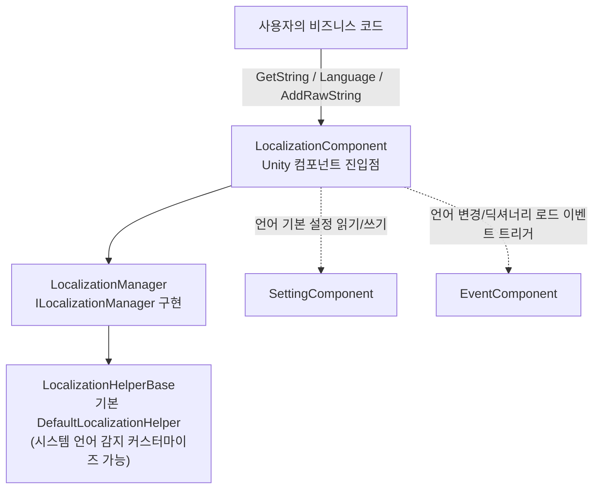

# 로컬라이제이션 패키지 개요: 무엇을 할 수 있나

Game Frame X Localization(`com.gameframex.unity.localization`)은 GameFrameX 프레임워크 기반의 Unity 로컬라이제이션 기능 패키지입니다: "딕셔너리 key → 번역 텍스트" 방식으로 다국어 문자열을 관리하며, 파라미터화된 포맷팅(최대 16개의 타입 파라미터), 런타임 언어 전환 및 이벤트 브로드캐스트, 시스템 언어 자동 감지, 그리고 언어 기본 설정을 Setting 시스템에 영속화하는 기능을 지원합니다. 핵심 진입점은 `LocalizationComponent` 컴포넌트로, 부착하기만 하면 바로 사용할 수 있습니다.

이 패키지는 게임에 다음과 같은 기능을 제공합니다:

- **딕셔너리 기반 로컬라이제이션** — 런타임에 번역 항목 추가, 조회, 삭제(`AddRawString` / `GetString` / `RemoveRawString`)
- **파라미터화된 문자열 포맷팅** — 1~16개 타입 파라미터를 지원하는 제네릭 `GetString` 오버로드, .NET 표준 플레이스홀더 `{0}`, `{1}`, `{2:P}` 등 지원
- **런타임 언어 전환** — `Language` 속성을 설정하면 변경 이벤트가 트리거되어 UI를 즉시 갱신할 수 있습니다
- **시스템 언어 감지 및 폴백** — `CultureInfo`를 통해 기기 언어를 감지하고, 로드 실패 시 기본 언어로 폴백합니다
- **언어 기본 설정 영속화** — 언어와 기본 언어가 `SettingComponent`를 통해 자동 저장됩니다
- **에디터 모드** — Play Mode에서 지정한 언어로 시스템 언어를 덮어써 테스트에 편리합니다
- **180+ 언어 코드 상수** — `LocalizationCode` 정적 클래스, 예: `ChineseSimplified`(`zh_CN`), `Japanese`(`ja_JP`)
- **교체 가능한 Helper** — `LocalizationHelperBase`를 상속하면 시스템 언어 감지를 커스터마이즈할 수 있습니다

## 빠른 시작

1. Unity 프로젝트의 `Packages/manifest.json`을 편집하여 GameFrameX scoped registry와 의존성을 추가합니다:

```json
{
  "scopedRegistries": [
    {
      "name": "GameFrameX",
      "url": "https://gameframex.upm.alianblank.uk",
      "scopes": [
        "com.gameframex"
      ]
    }
  ],
  "dependencies": {
    "com.gameframex.unity.localization": "2.3.0"
  }
}
```

출처: [README.zh-CN.md](https://github.com/GameFrameX/com.gameframex.unity.localization/blob/main/README.zh-CN.md#L68-L84)

   `dependencies`에 Git URL(`https://github.com/gameframex/com.gameframex.unity.localization.git`)을 직접 작성하거나, 저장소를 다운로드하여 `Packages` 디렉터리에 넣어도 됩니다.

2. 씬 오브젝트에 컴포넌트를 부착합니다: 메뉴 경로는 `GameFrameX/Localization`입니다(`LocalizationComponent`에는 `[AddComponentMenu("GameFrameX/Localization")]`가 있으며, `GameFrameXLocalizationCroppingHelper`에 자동으로 의존합니다). Inspector에서 Helper, `Default Language`(기본값 `zh_CN`), 에디터 모드 등을 설정할 수 있으며, 컴포넌트의 직렬화 기본값은 소스 코드에서 확인할 수 있습니다:

```csharp
[SerializeField] private string m_EditorLanguage = "zh_CN";

[SerializeField] private string m_DefaultLanguage = "zh_CN";

[SerializeField] private bool m_EnableLoadDictionaryUpdateEvent = false;
[SerializeField] private bool m_IsEnableEditorMode = false;

[SerializeField] private string m_LocalizationHelperTypeName = "GameFrameX.Localization.Runtime.DefaultLocalizationHelper";
```

출처: [LocalizationComponent.cs](https://github.com/GameFrameX/com.gameframex.unity.localization/blob/main/Runtime/Localization/LocalizationComponent.cs#L66-L75)

3. 코드에서 컴포넌트를 가져와 사용합니다:

```csharp
using GameFrameX.Localization.Runtime;

// 표준 방식: GameEntry를 통해 가져오기
var localization = GameEntry.GetComponent<LocalizationComponent>();
```

출처: [README.zh-CN.md](https://github.com/GameFrameX/com.gameframex.unity.localization/blob/main/README.zh-CN.md#L100-L105)

4. 번역 항목을 추가하고, 언어를 전환하고, 문자열을 가져와 첫 번째 기능을 실행해 봅니다:

```csharp
// 새 항목 추가(key가 이미 존재하거나 null/빈 문자열이면 false 반환)
bool added = localization.AddRawString("UI.Button.NewButton", "新按钮");

// 현재 언어 설정(변경 이벤트 트리거, 자동 영속화)
localization.Language = "zh_CN";
localization.Language = "en_US";

// 간단한 키 조회; key가 없으면 "<NoKey>{key}" 반환
string okText = localization.GetString("UI.Button.OK");
```

출처: [README.zh-CN.md](https://github.com/GameFrameX/com.gameframex.unity.localization/blob/main/README.zh-CN.md#L110-L116) · [README.zh-CN.md](https://github.com/GameFrameX/com.gameframex.unity.localization/blob/main/README.zh-CN.md#L134-L143) · [README.zh-CN.md](https://github.com/GameFrameX/com.gameframex.unity.localization/blob/main/README.zh-CN.md#L174-L179)

## 작동 원리 한눈에 보기



컴포넌트의 역할이 한눈에 보입니다: `LocalizationComponent`([LocalizationComponent.cs](https://github.com/GameFrameX/com.gameframex.unity.localization/blob/main/Runtime/Localization/LocalizationComponent.cs#L51-L56))는 `ILocalizationManager`, `EventComponent`, `SettingComponent` 세 가지 의존성을 가집니다. `Language`를 읽을 때 값이 Unknown이면 먼저 Setting에서 복원하고; `Language`에 쓸 때는 순서대로 영속화한 뒤 세 개의 이벤트(Before / Change / After)를 연달아 발생시킵니다:

```csharp
var localizationLanguageChangeBeforeEventArgs = LocalizationLanguageChangeBeforeEventArgs.Create(oldLanguage, value);
m_EventComponent.Fire(this, localizationLanguageChangeBeforeEventArgs);
var localizationLanguageChangeEventArgs = LocalizationLanguageChangeEventArgs.Create(oldLanguage, value);
m_EventComponent.Fire(this, localizationLanguageChangeEventArgs);
var localizationLanguageChangeAfterEventArgs = LocalizationLanguageChangeAfterEventArgs.Create(oldLanguage, value);
m_EventComponent.Fire(this, localizationLanguageChangeAfterEventArgs);
```

출처: [LocalizationComponent.cs](https://github.com/GameFrameX/com.gameframex.unity.localization/blob/main/Runtime/Localization/LocalizationComponent.cs#L155-L169)

## 자주 사용하는 기능 빠른 참조

| 기능 | 핵심 API(`LocalizationComponent`) | 설명 |
|------|----------------------------------|------|
| 현재 언어 | `Language` | get 시 설정되지 않았으면 Setting→시스템 언어로 폴백; set 시 이벤트 트리거 및 영속화 |
| 기본 언어 | `DefaultLanguage` | 로드 실패 시 폴백 언어, Setting에 영속화 |
| 시스템 언어 | `SystemLanguage` | 기기에서 감지된 언어 코드 |
| 번역 가져오기 | `GetString(key)` / `GetString<T1..T16>(key, ...)` | key가 없으면 `<NoKey>{key}` 반환; 제네릭 오버로드는 박싱 방지 |
| 확인/원문 가져오기 | `HasRawString(key)` / `GetRawString(key)` | 포맷팅되지 않은 원본 값, 찾지 못하면 `null` 반환 |
| 항목 추가/삭제 | `AddRawString` / `RemoveRawString` / `RemoveAllRawStrings` | 런타임 딕셔너리 관리 |
| 항목 수 | `DictionaryCount` | 로드된 항목 총 개수 |
| 언어 코드 | `LocalizationCode.ChineseSimplified` 등 | 180+ 상수, 형식 `语言_地区` |

파라미터화 예시(딕셔너리 값은 `{0}`, `{1}` 등 .NET 플레이스홀더 사용; 파라미터가 일치하지 않으면 결과가 `<Error>`로 시작합니다):

```csharp
// 제네릭 오버로드(권장 — 값 타입의 박싱 방지)
string info = localization.GetString<string, int, int>("UI.Info.Score", playerName, score, level);
```

출처: [README.zh-CN.md](https://github.com/GameFrameX/com.gameframex.unity.localization/blob/main/README.zh-CN.md#L156-L167)

## 이벤트 한눈에 보기

| 이벤트 클래스 | 트리거 조건 | 핵심 필드 |
|--------|----------|----------|
| `LocalizationLanguageChangeEventArgs` | `Language` 속성 설정 시 | `OldLanguage`, `Language` |
| `LoadDictionarySuccessEventArgs` | 딕셔너리 리소스 로드 완료 | `DictionaryAssetName`, `Duration`, `UserData` |
| `LoadDictionaryFailureEventArgs` | 딕셔너리 리소스 로드 실패 | `DictionaryAssetName`, `ErrorMessage`, `UserData` |
| `LoadDictionaryUpdateEventArgs` | 딕셔너리 로드 진행률 갱신 | `DictionaryAssetName`, `Progress`, `UserData` |

(쌍을 이루는 `LocalizationLanguageChangeBeforeEventArgs` / `LocalizationLanguageChangeAfterEventArgs`도 있으며, [Runtime/EventArgs](https://github.com/GameFrameX/com.gameframex.unity.localization/blob/main/Runtime/EventArgs/LocalizationLanguageChangeBeforeEventArgs.cs)를 참고하세요. 모든 이벤트 클래스는 GameFrameX 참조 풀을 사용하여 제로 할당으로 트리거됩니다.)

## 다음 단계

- 설치 세부 사항과 컴포넌트 Inspector 필드 설명(`Enable Editor Mode`, `Editor Language` 등): 저장소의 [README.zh-CN.md](https://github.com/GameFrameX/com.gameframex.unity.localization/blob/main/README.zh-CN.md) 참고
- 언어 변경을 감지하고 UI를 갱신하는 완전한 예시: [README.zh-CN.md #언어 변경 감지](https://github.com/GameFrameX/com.gameframex.unity.localization/blob/main/README.zh-CN.md#L198-L244)
- 언어 코드 상수 전체 목록: [LocalizationCode.cs](https://github.com/GameFrameX/com.gameframex.unity.localization/blob/main/Runtime/Localization/LocalizationCode.cs)
- 시스템 언어 감지 커스터마이즈(`LocalizationHelperBase` 상속): [LocalizationHelperBase.cs](https://github.com/GameFrameX/com.gameframex.unity.localization/blob/main/Runtime/Localization/LocalizationHelperBase.cs)
- 매니저 인터페이스와 구현: [ILocalizationManager.cs](https://github.com/GameFrameX/com.gameframex.unity.localization/blob/main/Runtime/Localization/Localization/ILocalizationManager.cs) · [LocalizationManager.cs](https://github.com/GameFrameX/com.gameframex.unity.localization/blob/main/Runtime/Localization/Localization/LocalizationManager.cs)
- 버전 이력: [CHANGELOG.md](https://github.com/GameFrameX/com.gameframex.unity.localization/blob/main/CHANGELOG.md)