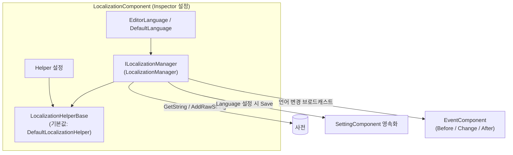

# 설치 및 첫 실행: 패키지 설치, 컴포넌트 추가, Inspector 설정

이 페이지에서는 GameFrameX Localization을 실행하는 전체 과정을 안내합니다: UPM 패키지 설치, 씬에 `LocalizationComponent` 추가, Inspector에서 언어 및 Helper 필드 설정, 마지막으로 코드로 첫 번째 번역 텍스트가 정상적으로 가져와지는지 검증합니다. 전체 과정은 몇 분이면 충분합니다.

## 빠른 시작

### 1. 패키지 설치

아래 방식 중 하나를 선택하세요(방식 1 권장, GameFrameX 시리즈 패키지를 일괄 업그레이드하기 편리합니다):

- Unity 프로젝트의 `Packages/manifest.json`을 편집하여 `scopedRegistries`를 추가하고 의존성을 선언합니다:

```json
{
  "scopedRegistries": [
    {
      "name": "GameFrameX",
      "url": "https://gameframex.upm.alianblank.uk",
      "scopes": [
        "com.gameframex"
      ]
    }
  ],
  "dependencies": {
    "com.gameframex.unity.localization": "2.3.0"
  }
}
```

`scopes`는 어떤 패키지가 이 레지스트리를 통해 해석되는지 제어하며, `com.gameframex`로 시작하는 패키지만 이 레지스트리에서 가져옵니다.

출처: [README.zh-CN.md](https://github.com/GameFrameX/com.gameframex.unity.localization/blob/main/README.zh-CN.md#L68-L86)

- `manifest.json`의 `dependencies` 노드 아래에 Git 주소를 직접 추가합니다:

```json
{
   "com.gameframex.unity.localization": "https://github.com/gameframex/com.gameframex.unity.localization.git"
}
```

출처: [README.zh-CN.md](https://github.com/GameFrameX/com.gameframex.unity.localization/blob/main/README.zh-CN.md#L88-L93)

- 또는 Unity `Package Manager`에서 `Git URL` 방식으로 추가합니다: `https://github.com/gameframex/com.gameframex.unity.localization.git`.
- 또는 리포지토리를 직접 다운로드하여 Unity 프로젝트의 `Packages` 디렉터리에 넣으면 Unity가 자동으로 로드하여 인식합니다.

버전 요구 사항: Unity 2019.4 이상([README.zh-CN.md](https://github.com/GameFrameX/com.gameframex.unity.localization/blob/main/README.zh-CN.md#L9) 참조). 이 컴포넌트는 GameFrameX의 Event, Setting 및 핵심 런타임 어셈블리에 의존합니다.

### 2. 컴포넌트 추가

시작 씬의 GameFrameX 컴포넌트 호스트 오브젝트에서 `Add Component` 메뉴를 통해 `GameFrameX/Localization`를 선택하여 `LocalizationComponent`를 추가합니다:

```csharp
[DisallowMultipleComponent]
[AddComponentMenu("GameFrameX/Localization")]
[HelpURL("https://datatracker.ietf.org/doc/html/rfc5646")]
[Preserve]
[RequireComponent(typeof(GameFrameXLocalizationCroppingHelper))]
public sealed class LocalizationComponent : GameFrameworkComponent
```

출처: [LocalizationComponent.cs](https://github.com/GameFrameX/com.gameframex.unity.localization/blob/main/Runtime/Localization/LocalizationComponent.cs#L46-L51)

요점:

- `[RequireComponent(typeof(GameFrameXLocalizationCroppingHelper))]`: 이 컴포넌트를 추가하면 크로핑 헬퍼 컴포넌트가 자동으로 함께 추가되므로 수동으로 추가할 필요가 없습니다.
- `[DisallowMultipleComponent]`: 동일한 오브젝트에는 하나만 추가할 수 있으며, 중복 추가는 Unity에서 차단됩니다.

### 3. Inspector 설정

컴포넌트의 직렬화 필드와 기본값은 다음과 같으며, 모두 Inspector에서 직접 수정할 수 있습니다:

| Inspector 필드 | 기본값 | 설명 |
|------|------|------|
| EditorLanguage | `zh_CN` | 에디터 언어, 에디터 내에서만 유효하며 Play 모드에서 다양한 언어를 테스트하기 편리합니다 |
| DefaultLanguage | `zh_CN` | 기본 현지화 언어, 현지화 로드 실패 시 폴백으로 사용됩니다 |
| EnableLoadDictionaryUpdateEvent | `false` | 사전 로드 진행률 업데이트 이벤트 활성화 여부 |
| IsEnableEditorMode | `false` | 에디터 모드 활성화 여부 |
| LocalizationHelperTypeName | `GameFrameX.Localization.Runtime.DefaultLocalizationHelper` | 현지화 Helper 타입 이름 |
| CustomLocalizationHelper | `null` | 사용자 지정 Helper, 비워 두면 위의 기본 Helper가 사용됩니다 |

필드 정의 소스 코드:

```csharp
[SerializeField] private string m_EditorLanguage = "zh_CN";
[SerializeField] private string m_DefaultLanguage = "zh_CN";
[SerializeField] private bool m_EnableLoadDictionaryUpdateEvent = false;
[SerializeField] private bool m_IsEnableEditorMode = false;
[SerializeField] private string m_LocalizationHelperTypeName = "GameFrameX.Localization.Runtime.DefaultLocalizationHelper";
[SerializeField] private LocalizationHelperBase m_CustomLocalizationHelper = null;
```

출처: [LocalizationComponent.cs](https://github.com/GameFrameX/com.gameframex.unity.localization/blob/main/Runtime/Localization/LocalizationComponent.cs#L66-L75)

언어 코드는 `zh_CN`, `en_US`, `ja_JP`와 같이 RFC 5646 스타일을 사용합니다(컴포넌트의 `HelpURL`이 바로 RFC 5646 사양을 가리킵니다).

### 4. 첫 실행 검증

Play 모드에 진입한 뒤, 먼저 번역을 하나 등록하고 코드로 가져옵니다:

```csharp
using GameFrameX.Localization.Runtime;

// 표준 방식: GameEntry를 통해 가져오기
var localization = GameEntry.GetComponent<LocalizationComponent>();

// 런타임에 번역 하나 추가(key가 이미 존재하거나 null/빈 값이면 false 반환)
bool added = localization.AddRawString("UI.Button.NewButton", "新按钮");

// 번역 가져오기; key가 존재하지 않으면 "<NoKey>{key}" 반환
string text = localization.GetString("UI.Button.NewButton");
```

출처: [README.zh-CN.md](https://github.com/GameFrameX/com.gameframex.unity.localization/blob/main/README.zh-CN.md#L100-L105) · [README.zh-CN.md](https://github.com/GameFrameX/com.gameframex.unity.localization/blob/main/README.zh-CN.md#L173-L176) · [README.zh-CN.md](https://github.com/GameFrameX/com.gameframex.unity.localization/blob/main/README.zh-CN.md#L134-L137)

`text`가 "新按钮"(새 버튼)를 출력하면 설치에 성공한 것입니다. 참고: key가 존재하지 않을 때 반환되는 값은 `<NoKey>{key}`이며, 포맷팅 매개변수가 일치하지 않으면 결과가 `<Error>`로 시작합니다. 이 두 가지 접두사는 모두 사전 내용 또는 매개변수에 문제가 있음을 나타냅니다.

## 작동 원리 요약

컴포넌트는 "컴포넌트 셸 + 매니저 + Helper"의 계층 구조를 채택하며, Inspector 설정은 최종적으로 `LocalizationManager`에 전달되어 실행됩니다. 언어 전환 시 Setting에 자동으로 기록되고 이벤트가 브로드캐스트됩니다:



컴포넌트는 `Language`를 설정할 때 먼저 `SettingComponent`에 쓰고 `Save()`를 호출한 뒤, `LocalizationLanguageChangeBeforeEventArgs`, `LocalizationLanguageChangeEventArgs`, `LocalizationLanguageChangeAfterEventArgs` 세 이벤트를 순서대로 트리거합니다. `Language`/`DefaultLanguage`를 가져올 때 값이 알려지지 않은 경우 먼저 Setting에서 읽어옵니다.

출처: [LocalizationComponent.cs](https://github.com/GameFrameX/com.gameframex.unity.localization/blob/main/Runtime/Localization/LocalizationComponent.cs#L140-L171)

## 일반적인 오류

| 현상 | 원인 | 해결 방법 |
|------|------|------|
| 가져온 텍스트가 `<NoKey>{key}`임 | 사전에 해당 key가 없음 | 먼저 `AddRawString`으로 항목을 등록하거나, `HasRawString`으로 먼저 확인 |
| 포맷팅 결과가 `<Error>`로 시작함 | 플레이스홀더와 제공된 매개변수가 일치하지 않음 | 사전 값의 `{0}`, `{1}`과 전달된 매개변수의 개수/타입을 확인하세요 |
| 컴포넌트가 의존성 누락을 보고함 | Event/Setting 등 의존성 패키지가 설치되지 않음 | scoped registry를 통해 `com.gameframex` 시리즈 패키지를 함께 설치 |
| 동일한 오브젝트에 두 번째 추가 불가 | `[DisallowMultipleComponent]` | 하나의 씬 호스트에는 하나의 `LocalizationComponent`만 추가 |

오류 동작의 근거는 [README.zh-CN.md](https://github.com/GameFrameX/com.gameframex.unity.localization/blob/main/README.zh-CN.md#L167) 및 [LocalizationComponent.cs](https://github.com/GameFrameX/com.gameframex.unity.localization/blob/main/Runtime/Localization/LocalizationComponent.cs#L46-L51)를 참조하세요.

## 다음 단계

- 런타임 언어 전환 및 이벤트 리스닝 예제: [README.zh-CN.md](https://github.com/GameFrameX/com.gameframex.unity.localization/blob/main/README.zh-CN.md#L194-L236) 참조
- 매개변수화된 포맷팅(타입화된 매개변수 최대 16개를 지원하는 `GetString` 오버로드): [README.zh-CN.md](https://github.com/GameFrameX/com.gameframex.unity.localization/blob/main/README.zh-CN.md#L146-L165) 참조
- 언어 코드 상수 `LocalizationCode`(180개 이상 언어): [LocalizationCode.cs](https://github.com/GameFrameX/com.gameframex.unity.localization/blob/main/Runtime/Localization/LocalizationCode.cs) 참조
- 사용자 지정 Helper(`LocalizationHelperBase`를 상속하여 시스템 언어 감지 재정의): [LocalizationHelperBase.cs](https://github.com/GameFrameX/com.gameframex.unity.localization/blob/main/Runtime/Localization/LocalizationHelperBase.cs) 참조
- Inspector 커스텀 인터페이스 구현: [LocalizationComponentInspector.cs](https://github.com/GameFrameX/com.gameframex.unity.localization/blob/main/Editor/Inspector/LocalizationComponentInspector.cs) 참조
- 공식 문서: <https://gameframex.doc.alianblank.com/>