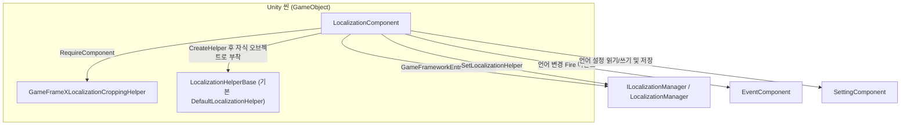

# 작동 원리: 컴포넌트, Manager와 Helper의 역할 분담

이 패키지는 3개 레이어로 구성되어 있습니다. `LocalizationComponent`는 Unity 씬에 부착되는 Mono 파사드이며, `ILocalizationManager` / `LocalizationManager`는 프레임워크 핵심 모듈(사전 데이터와 언어 상태 담당)이고, `ILocalizationHelper` / `LocalizationHelperBase`는 교체 가능한 헬퍼(시스템 언어 등의 기능 담당)입니다. 비즈니스 코드는 `LocalizationComponent`와만 상호작용하며, 나머지 두 레이어는 시작 시 이 컴포넌트가 자동으로 조립합니다.

## 3개 레이어 역할 분담 요약

| 레이어 | 실제 타입 | 파일 | 역할 |
|------|----------|------|------|
| 컴포넌트 레이어 | `LocalizationComponent : GameFrameworkComponent` | `Runtime/Localization/LocalizationComponent.cs` | Unity 파사드: Inspector 설정 항목 보유, Manager/Helper 초기화, `GetString` / `Language` 등의 호출을 Manager로 전달, 언어 설정을 `SettingComponent`에 영속화 |
| 매니저 레이어 | `ILocalizationManager` / `LocalizationManager` | `Runtime/Localization/Localization/` | 프레임워크 핵심 모듈: `GameFrameworkEntry.GetModule<ILocalizationManager>()`로 획득하며, 사전 데이터, 현재 언어, 기본 언어 및 시스템 언어를 보유하고 상수 `UnknownLocalization`을 정의 |
| 헬퍼 레이어 | `ILocalizationHelper` / `LocalizationHelperBase` / `DefaultLocalizationHelper` | `Runtime/Localization/` | 교체 가능한 구현: 컴포넌트가 `Helper.CreateHelper`를 통해 생성하여 Manager에 주입; 인터페이스는 `SystemLanguage`만 선언 |

3개 레이어의 관계와 협력 컴포넌트(모든 화살표는 소스 코드에서 확인 가능한 호출입니다):



헬퍼 인터페이스는 매우 간결하며, 시스템 언어만 선언합니다:

```csharp
public interface ILocalizationHelper
{
    string SystemLanguage { get; }
}
```

출처: [ILocalizationHelper.cs](https://github.com/GameFrameX/com.gameframex.unity.localization/blob/main/Runtime/Localization/Localization/ILocalizationHelper.cs#L40-L47)

## 시작 시 초기화 흐름

`LocalizationComponent`는 두 개의 라이프사이클 메서드를 통해 구성을 완료하며, 순서는 다음과 같습니다:

1. **`Awake()` — 핵심 모듈 획득**. 구현 타입과 인터페이스 타입을 설정한 뒤, 프레임워크 엔트리에서 `ILocalizationManager`를 가져옵니다. 실패 시 `Log.Fatal("Localization manager is invalid.")`를 호출하고 중단합니다.

```csharp
protected override void Awake()
{
    ImplementationComponentType = Utility.Assembly.GetType(componentType);
    InterfaceComponentType = typeof(ILocalizationManager);
    base.Awake();
    m_LocalizationManager = GameFrameworkEntry.GetModule<ILocalizationManager>();
    if (m_LocalizationManager == null)
    {
        Log.Fatal("Localization manager is invalid.");
        return;
    }
}
```

출처: [LocalizationComponent.cs](https://github.com/GameFrameX/com.gameframex.unity.localization/blob/main/Runtime/Localization/LocalizationComponent.cs#L211-L222)

2. **`Start()` — 의존 컴포넌트 검증**. `GameEntry.GetComponent<T>()`를 통해 `BaseComponent`, `EventComponent`, `SettingComponent`를 차례로 획득하며, 하나라도 없으면 `Log.Fatal("Base component is invalid." / "Event component is invalid." / "Setting component is invalid.")`를 호출합니다.

3. **`Start()` — Helper 생성 및 주입**. Inspector의 `m_LocalizationHelperTypeName`(기본값 `"GameFrameX.Localization.Runtime.DefaultLocalizationHelper"`) 또는 `m_CustomLocalizationHelper` 참조를 사용해 헬퍼를 생성하고, 이름을 `"Localization Helper"`로 지정하여 본 컴포넌트의 자식 오브젝트로 부착한 다음, `SetLocalizationHelper`를 호출하여 Manager에 주입합니다.

```csharp
LocalizationHelperBase localizationHelper = Helper.CreateHelper(m_LocalizationHelperTypeName, m_CustomLocalizationHelper);
if (localizationHelper == null)
{
    Log.Fatal("Can not create localization helper.");
    return;
}

localizationHelper.name = "Localization Helper";
Transform localizationHelperTransform = localizationHelper.transform;
localizationHelperTransform.SetParent(this.transform);
localizationHelperTransform.localScale = Vector3.one;
m_LocalizationManager.SetLocalizationHelper(localizationHelper);
```

출처: [LocalizationComponent.cs](https://github.com/GameFrameX/com.gameframex.unity.localization/blob/main/Runtime/Localization/LocalizationComponent.cs#L249-L260)

4. **`Start()` — 언어 초기화**. 에디터 모드에서 `m_IsEnableEditorMode`가 체크되어 있으면 `EditorLanguage`(기본값 `"zh_CN"`)를 사용합니다. 런타임 시 `Language`가 여전히 `UnknownLocalization`이면 `SystemLanguage`로 폴백하며, `DefaultLanguage`의 폴백 로직도 동일합니다.

```csharp
#if UNITY_EDITOR
    if (m_IsEnableEditorMode)
    {
        Language = EditorLanguage != UnknownLocalization ? EditorLanguage : m_LocalizationManager.SystemLanguage;
    }
#else
    if (Language == UnknownLocalization)
    {
        Language = m_LocalizationManager.SystemLanguage;
    }
#endif
    DefaultLanguage = m_DefaultLanguage != UnknownLocalization ? m_DefaultLanguage : m_LocalizationManager.SystemLanguage;
```

출처: [LocalizationComponent.cs](https://github.com/GameFrameX/com.gameframex.unity.localization/blob/main/Runtime/Localization/LocalizationComponent.cs#L261-L272)

### 컴포넌트의 직렬화 설정 항목

| 설정 항목 | 기본값 | 역할 |
|--------|--------|------|
| `m_EditorLanguage` | `"zh_CN"` | 에디터 내 언어(에디터 모드에서만 적용) |
| `m_DefaultLanguage` | `"zh_CN"` | 기본 로컬라이제이션 언어, 로드 실패 시 폴백 |
| `m_EnableLoadDictionaryUpdateEvent` | `false` | 사전 로드 진행률 업데이트 이벤트 활성화 여부 |
| `m_IsEnableEditorMode` | `false` | 에디터 모드 언어 활성화 여부 |
| `m_LocalizationHelperTypeName` | `"GameFrameX.Localization.Runtime.DefaultLocalizationHelper"` | 헬퍼 타입 전체 이름 |
| `m_CustomLocalizationHelper` | `null` | 커스텀 헬퍼 참조(타입 이름보다 우선) |

출처: [LocalizationComponent.cs](https://github.com/GameFrameX/com.gameframex.unity.localization/blob/main/Runtime/Localization/LocalizationComponent.cs#L66-L75)

컴포넌트 선언 자체도 크로핑 헬퍼에 대한 하드 의존성을 보여줍니다: `[RequireComponent(typeof(GameFrameXLocalizationCroppingHelper))]`, `[DisallowMultipleComponent]`, `[AddComponentMenu("GameFrameX/Localization")]`([LocalizationComponent.cs](https://github.com/GameFrameX/com.gameframex.unity.localization/blob/main/Runtime/Localization/LocalizationComponent.cs#L46-L51) 참조).

## 언어 전환의 데이터 흐름

`Language` 속성의 setter는 컴포넌트 레이어가 Manager, Setting, Event 3자를 조율하는 전형적인 예입니다. 값이 변경되면 다음 네 가지 작업을 순서대로 수행합니다: Manager의 언어를 업데이트하고 `SettingComponent`에 기록하여 저장함으로써 영속화합니다. 그다음 고정된 순서대로 세 개의 언어 변경 이벤트를 브로드캐스트합니다(Before → Change → After).

```csharp
set
{
    if (m_LocalizationManager.Language != value)
    {
        var oldLanguage = m_LocalizationManager.Language;
        m_LocalizationManager.Language = value;
        m_SettingComponent.SetString(nameof(LocalizationComponent) + "." + nameof(Language), value);
        m_SettingComponent.Save();
        var localizationLanguageChangeBeforeEventArgs = LocalizationLanguageChangeBeforeEventArgs.Create(oldLanguage, value);
        m_EventComponent.Fire(this, localizationLanguageChangeBeforeEventArgs);
        var localizationLanguageChangeEventArgs = LocalizationLanguageChangeEventArgs.Create(oldLanguage, value);
        m_EventComponent.Fire(this, localizationLanguageChangeEventArgs);
        var localizationLanguageChangeAfterEventArgs = LocalizationLanguageChangeAfterEventArgs.Create(oldLanguage, value);
        m_EventComponent.Fire(this, localizationLanguageChangeAfterEventArgs);
    }
}
```

출처: [LocalizationComponent.cs](https://github.com/GameFrameX/com.gameframex.unity.localization/blob/main/Runtime/Localization/LocalizationComponent.cs#L155-L170)

getter는 지연 로딩 방식입니다. Manager의 언어가 여전히 `UnknownLocalization`이면, 먼저 `SettingComponent`에서 마지막으로 저장된 값을 읽은 뒤(키 이름은 `LocalizationComponent.Language`) Manager에 다시 채워 넣습니다.

세 개의 언어 변경 이벤트에 해당하는 이벤트 인자 클래스는 모두 `Runtime/EventArgs/`에 위치합니다:

| 이벤트 인자 클래스 | 파일 | 트리거 시점 |
|------------|------|----------|
| `LocalizationLanguageChangeBeforeEventArgs` | `Runtime/EventArgs/LocalizationLanguageChangeBeforeEventArgs.cs` | 언어가 곧 변경될 때(가장 먼저) |
| `LocalizationLanguageChangeEventArgs` | `Runtime/EventArgs/LocalizationLanguageChangeEventArgs.cs` | 언어가 변경됨 |
| `LocalizationLanguageChangeAfterEventArgs` | `Runtime/EventArgs/LocalizationLanguageChangeAfterEventArgs.cs` | 변경 후 마무리(가장 마지막) |
| `LoadDictionaryFailureEventArgs` | `Runtime/EventArgs/LoadDictionaryFailureEventArgs.cs` | 사전 로드 실패 |
| `LoadDictionarySuccessEventArgs` | `Runtime/EventArgs/LoadDictionarySuccessEventArgs.cs` | 사전 로드 성공 |
| `LoadDictionaryUpdateEventArgs` | `Runtime/EventArgs/LoadDictionaryUpdateEventArgs.cs` | 사전 로드 진행률 업데이트(`m_EnableLoadDictionaryUpdateEvent`로 제어) |

## 비즈니스 호출이 3개 레이어를 관통하는 방식

비즈니스 코드가 `LocalizationComponent.GetString(...)`를 호출하면, 컴포넌트는 이를 그대로 `m_LocalizationManager`로 전달하고, Manager는 사전에서 값을 가져와 파라미터에 맞춰 포맷합니다. 컴포넌트는 0개부터 6개까지 파라미터를 갖는 `GetString` 오버로드를 제공하며, 전부 순수 전달입니다:

```csharp
public string GetString(string key)
{
    return m_LocalizationManager.GetString(key);
}

public string GetString(string key, params object[] args)
{
    return m_LocalizationManager.GetString(key, args);
}
```

출처: [LocalizationComponent.cs](https://github.com/GameFrameX/com.gameframex.unity.localization/blob/main/Runtime/Localization/LocalizationComponent.cs#L284-L303)

따라서 런타임에는 `LocalizationComponent`는 단지 파사드일 뿐입니다. 실제 사전 데이터, 언어 상태, 로드 콜백은 모두 `LocalizationManager`에 있으며, Manager는 다시 "시스템 언어는 무엇인가"와 같은 플랫폼 관련 문제를 자신이 보유한 `LocalizationHelperBase` 구현에 위임합니다. Helper를 교체하는 것(예: 커스텀 시스템 언어 판정으로 변경)은 Inspector의 헬퍼 타입이나 참조만 바꾸면 되며, 컴포넌트나 비즈니스 코드를 수정할 필요가 없습니다.

## 자주 발생하는 오류

| 증상(Log.Fatal 원문) | 근본 원인 | 해결 방법 |
|------|------|------|
| `Localization manager is invalid.` | `GameFrameworkEntry.GetModule<ILocalizationManager>()`가 null을 반환 | 프레임워크 핵심이 초기화되었는지, 패키지가 올바르게 임포트되었는지 확인 |
| `Base component is invalid.` | 씬에 `BaseComponent`가 없음 | GameEntry에 `BaseComponent`를 추가 |
| `Event component is invalid.` | 씬에 `EventComponent`가 없음 | `EventComponent` 추가(언어 변경 이벤트가 이에 의존) |
| `Setting component is invalid.` | 씬에 `SettingComponent`가 없음 | `SettingComponent` 추가(언어 영속화가 이에 의존) |
| `Can not create localization helper.` | `m_LocalizationHelperTypeName` 타입 이름이 잘못되었고 `m_CustomLocalizationHelper`도 제공되지 않음 | 헬퍼 타입 전체 이름을 확인하거나 커스텀 Helper 참조를 직접 드래그해 넣기 |

위 메시지 원문은 모두 `Start()`/`Awake()`의 검증 로직에서 비롯됩니다([LocalizationComponent.cs](https://github.com/GameFrameX/com.gameframex.unity.localization/blob/main/Runtime/Localization/LocalizationComponent.cs#L217-L253)).

## 관련 링크

- [LocalizationComponent.cs](https://github.com/GameFrameX/com.gameframex.unity.localization/blob/main/Runtime/Localization/LocalizationComponent.cs) — 컴포넌트 레이어 파사드 및 초기화 흐름
- [ILocalizationManager.cs](https://github.com/GameFrameX/com.gameframex.unity.localization/blob/main/Runtime/Localization/Localization/ILocalizationManager.cs) — 매니저 인터페이스
- [LocalizationManager.cs](https://github.com/GameFrameX/com.gameframex.unity.localization/blob/main/Runtime/Localization/Localization/LocalizationManager.cs) — 매니저 구현
- [ILocalizationHelper.cs](https://github.com/GameFrameX/com.gameframex.unity.localization/blob/main/Runtime/Localization/Localization/ILocalizationHelper.cs) — 헬퍼 인터페이스
- [LocalizationHelperBase.cs](https://github.com/GameFrameX/com.gameframex.unity.localization/blob/main/Runtime/Localization/LocalizationHelperBase.cs) — 헬퍼 베이스 클래스
- [DefaultLocalizationHelper.cs](https://github.com/GameFrameX/com.gameframex.unity.localization/blob/main/Runtime/Localization/DefaultLocalizationHelper.cs) — 기본 헬퍼
- [LocalizationComponentInspector.cs](https://github.com/GameFrameX/com.gameframex.unity.localization/blob/main/Editor/Inspector/LocalizationComponentInspector.cs) — 에디터 Inspector