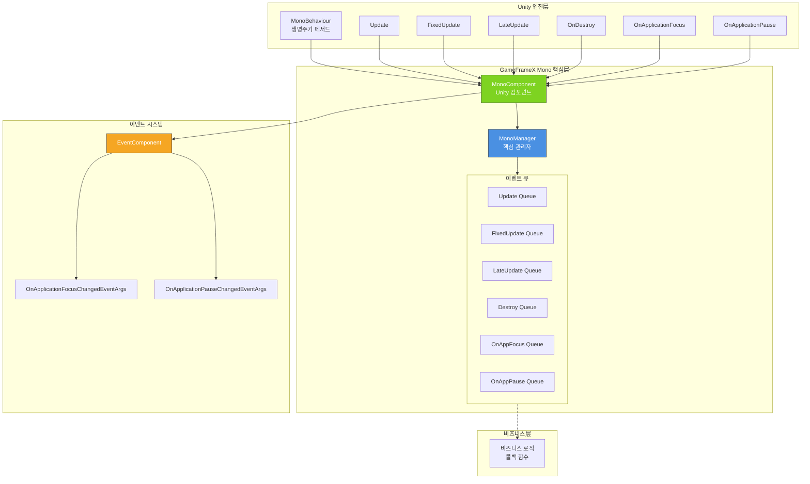

# 플러그인 소개

GameFrameX Unity Mono 컴포넌트는 GameFrameX 게임 프레임워크의 핵심 모듈 중 하나로, Unity에서 MonoBehaviour의 생명주기 이벤트를 통합 관리하고 편리한 이벤트 리스닝 메커니즘을 제공합니다.

## 개요

Unity 개발에서 MonoBehaviour의 생명주기 메서드(예: `Update`, `FixedUpdate`, `LateUpdate`, `OnDestroy` 등)는 게임 로직의 핵심载体입니다. 그러나 전통적인 작성 방식에는 다음과 같은 문제가 있습니다:

- **결합도 높음**: 비즈니스 로직이 MonoBehaviour에 직접 작성되어 재사용 및 테스트가 어려움
- **관리 혼란**: 여러 스크립트가 동일한 생명주기 이벤트에 접근해야 할 수 있어 통합 관리가 부족
- **성능 문제**: 빈번한 MonoBehaviour 생성 및 파괴가 성능에 영향

GameFrameX Mono 컴포넌트는 다음 설계를 통해这些问题를 해결합니다:

- **통합 관리**: MonoManager를 통해 모든 생명주기 이벤트 리스너를 집중 관리
- **옵저버 패턴**: 콜백 함수를 사용하여 이벤트 구독/구독 취소, 비즈니스 로직 분리
- **스레드 안전성**: 잠금 메커니즘을 사용하여 다중 스레드 환경에서 안전성 보장
- **이벤트 통합**: Event 컴포넌트와 통합되어 전역 이벤트 시스템 지원

## 아키텍처 설계



### 핵심 컴포넌트

| 컴포넌트 | 설명 | 책임 |
|------|------|------|
| **MonoManager** | 핵심 관리자 | 모든 생명주기 이벤트 리스너의 관리 및 배포 통합 |
| **MonoComponent** | Unity 컴포넌트 | Unity 层의 이벤트 진입점 제공, 생명주기 이벤트 자동 전달 |
| **IMonoManager** | 인터페이스 정의 | MonoManager의 표준 인터페이스 정의, 테스트 및 확장 용이 |

### 이벤트 흐름

```mermaid
sequenceDiagram
    participant Unity as Unity 엔진
    participant MC as MonoComponent
    participant MM as MonoManager
    participant EC as EventComponent
    participant BL as 비즈니스 로직

    Unity->>MC: Unity 생명주기 메서드 호출
    activate MC
    MC->>MM: 이벤트 전달
    activate MM
    MM->>BL: 콜백 큐 순회 호출
    BL-->>MM: 콜백 실행
    deactivate BL
    
    MM-->>MC: 반환
    deactivate MM
    
    alt 앱焦点/일시정지 이벤트
        MC->>EC: Fire 이벤트
        activate EC
        EC-->>MC: 이벤트 배포
        deactivate EC
    end
    
    MC-->>Unity: 반환
    deactivate MC
```

## 기능 특성

### 1. 생명주기 이벤트 관리

MonoManager는 다음과 같은 생명주기 이벤트 통합 관리를 지원합니다:

| 이벤트 | 설명 | 콜백 파라미터 |
|------|------|----------|
| **Update** | 매 프레임 호출 | `(float elapseSeconds, float realElapseSeconds)` |
| **FixedUpdate** | 고정 프레임레이트 호출 | `(float elapseSeconds, float fixedElapseSeconds)` |
| **LateUpdate** | 모든 Update 후 호출 | `(float elapseSeconds, float fixedElapseSeconds)` |
| **OnDestroy** | 객체 파괴 시 호출 | `()` |
| **OnApplicationFocus** | 앱焦点 변화 | `(bool focusStatus)` |
| **OnApplicationPause** | 앱일시정지 변화 | `(bool pauseStatus)` |

### 2. 스레드 안전성

모든 이벤트 큐 작업은 `lock` 메커니즘을 사용하여 스레드 안전성 보장:

```csharp
// 스레드 안전한 리스너 추가 예시
public void AddUpdateListener(Action<float, float> action)
{
    if (action == null)
    {
        throw new ArgumentNullException(nameof(action));
    }

    lock (Lock)
    {
        _updateQueue.AddLast(action);
    }
}
```
> Source: [MonoManager.cs](https://github.com/GameFrameX/com.gameframex.unity.mono/blob/main/Runtime/Mono/MonoManager.cs#L176-L187)

### 3. 예외 처리

각 리스너 호출은 try-catch 블록에 포함되어 단일 콜백의 예외가 다른 콜백 실행에 영향 주지 않도록 보장:

```csharp
private static void QueueInvoking(LinkedList<Action<float, float>> list, float elapseSeconds, float fixedElapseSeconds)
{
    lock (Lock)
    {
        foreach (var action in list)
        {
            try
            {
                action.Invoke(elapseSeconds, fixedElapseSeconds);
            }
            catch (Exception e)
            {
                Log.Error(e);
            }
        }
    }
}
```
> Source: [MonoManager.cs](https://github.com/GameFrameX/com.gameframex.unity.mono/blob/main/Runtime/Mono/MonoManager.cs#L364-L380)

### 4. 성능 최적화

- Unity Profiler를 사용한 성능 분석 지원
- 리소스主动释放 지원 (`Release()` 메서드)
- LinkedList를 사용하여 O(1)의 추가/제거 복잡도 제공

## 빠른 시작

### 기본 사용 흐름

1. **MonoComponent 생성**: 장면에 `MonoComponent`가 있는 GameObject 생성
2. **관리자获取**: `MonoComponent`를 통해 이벤트 리스닝 기능 획득
3. **리스너 등록**: 해당 생명주기 이벤트 리스너 추가
4. **비즈니스 실행**: 콜백 함수에서 비즈니스 로직 작성
5. **리스너 등록 해제**: 적절한 시점에 리스너 제거 (메모리 누수 방지)

### 코드 예시

```csharp
public class MyGameController : MonoBehaviour
{
    private MonoComponent _monoComponent;

    private void Start()
    {
        // MonoComponent获取
        _monoComponent = GetComponent<MonoComponent>();
        
        // Update 리스너 등록
        _monoComponent.AddUpdateListener(OnUpdate);
        
        // FixedUpdate 리스너 등록
        _monoComponent.AddFixedUpdateListener(OnFixedUpdate);
        
        // 앱 일시정지 리스너 등록
        _monoComponent.AddOnApplicationPauseListener(OnApplicationPause);
    }

    private void OnUpdate(float elapseSeconds, float realElapseSeconds)
    {
        // 매 프레임 실행할 로직
    }

    private void OnFixedUpdate(float elapseSeconds, float fixedElapseSeconds)
    {
        // 고정 프레임레이트로 실행할 로직 (예: 물리 계산)
    }

    private void OnApplicationPause(bool pauseStatus)
    {
        Debug.Log($"앱 일시정지 상태: {pauseStatus}");
    }

    private void OnDestroy()
    {
        // 모든 리스너 제거
        if (_monoComponent != null)
        {
            _monoComponent.RemoveUpdateListener(OnUpdate);
            _monoComponent.RemoveFixedUpdateListener(OnFixedUpdate);
            _monoComponent.RemoveOnApplicationPauseListener(OnApplicationPause);
        }
    }
}
```
> Source: [MonoComponent.cs](https://github.com/GameFrameX/com.gameframex.unity.mono/blob/main/Runtime/Mono/MonoComponent.cs#L186-L210)

## 의존성 관계

GameFrameX Mono 컴포넌트는 다음 모듈에 의존합니다:

| 의존 모듈 | 버전 요구사항 | 설명 |
|----------|----------|------|
| GameFrameX.Runtime | ≥1.0.0 | 핵심 프레임워크, 기본 서비스 제공 |
| GameFrameX.Event | ≥1.0.0 | 이벤트 시스템, 전역 이벤트 지원 |

```json
{
  "dependencies": {
    "com.gameframex.unity.runtime": ">=1.0.0",
    "com.gameframex.unity.event": ">=1.0.0"
  }
}
```
> Source: [GameFrameX.Mono.Runtime.asmdef](https://github.com/GameFrameX/com.gameframex.unity.mono/blob/main/Runtime/GameFrameX.Mono.Runtime.asmdef#L3-L6)

## 버전 정보

| 버전 | 업데이트 내용 |
|------|----------|
| 1.1.0 | 현재 버전 |
| 1.0.0 | 초기 버전 |

- **Unity 버전 지원**: 2017.1+
- **라이선스**: MIT + Apache License 2.0 이중 라이선스

## 관련 링크

- [설치 가이드](./2-installation.1-installation-methods)
- [기초 사용](./3-getting-started.1-basic-usage)
- [MonoManager 상세](./4-core-components.1-monomanager)
- [MonoComponent 상세](./4-core-components.2-monocomponent)
- [이벤트 타입](./5-events.1-event-types)
- [이벤트 파라미터](./5-events.2-event-args)
- [자주 묻는 질문](./6-troubleshooting.1-faq)
- [GitHub 저장소](https://github.com/GameFrameX/com.gameframex.unity.mono.git)
- [공식 문서](https://gameframex.doc.alianblank.com/)