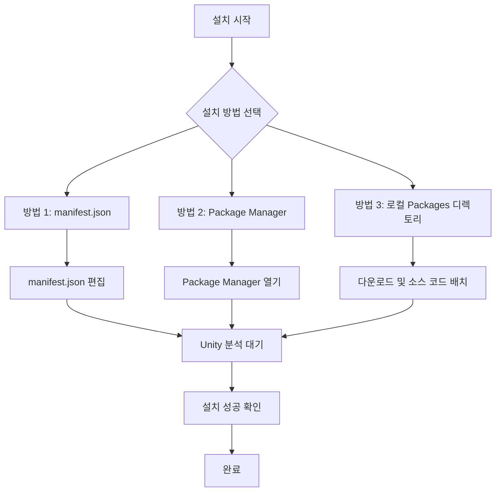

# 설치 방법

이 문서는 GameFrameX Mono 컴포넌트를 Unity 프로젝트에 설치하는 방법을 설명합니다.

## 개요

**GameFrameX Mono**는 GameFrameX 프레임워크의 MonoBehaviour 수명 주기 관리 컴포넌트로, Unity 수명 주기 이벤트(Update, FixedUpdate, LateUpdate, OnDestroy 등)를 감시하고 관리하는 편리한 방법을 제공합니다.

### 사전 요구 사항

| 요구 사항 | 최소 버전 |
|------|----------|
| Unity | 2017.1+ |
| GameFrameX.Runtime | 최신 버전 |
| GameFrameX.Event.Runtime | 최신 버전 |

> **참고**: Mono 컴포넌트는 Event 컴포넌트에 종속되므로 [com.alianblank.gameframex.unity.event](https://github.com/GameFrameX/com.alianblank.gameframex.unity.event)가 설치되어 있는지 확인하십시오.

### 설치 방법 개요



---

## 설치 방법

### 방법 1: manifest.json을 통한 설치 (권장)

가장 권장되는 설치 방법으로, 버전 관리와 팀 협업에 편리합니다.

**단계:**

1. Unity 프로젝트의 `Packages/manifest.json` 파일을 찾습니다
2. `dependencies` 노드에 다음 내용을 추가합니다:

```json
{
  "dependencies": {
    "com.gameframex.unity.mono": "https://github.com/GameFrameX/com.gameframex.unity.mono.git"
  }
}
```

> Source: [README.md](https://github.com/GameFrameX/com.gameframex.unity.mono/blob/main/README.md#L46-L50)

3. 파일을 저장하면 Unity가 자동으로 패키지를 분석하고 다운로드합니다

**장점:**
- 버전 관리가 편리합니다
- 팀 멤버가 자동으로 동기화됩니다
- 특정 버전을 잠글 수 있습니다

---

### 방법 2: Unity Package Manager를 통한 설치

GUI를 선호하는 개발자에게 적합합니다.

**단계:**

1. Unity 에디터를 엽니다
2. **Window → Package Manager**로 이동합니다
3. 좌측 상단의 **+** 버튼을 클릭합니다
4. **Add package from git URL**를 선택합니다
5. 다음 주소를 입력합니다:

```
https://github.com/GameFrameX/com.gameframex.unity.mono.git
```

6. **Add** 버튼을 클릭하고 설치가 완료될 때까지 기다립니다

> Source: [README.md](https://github.com/GameFrameX/com.gameframex.unity.mono/blob/main/README.md#L50)

**장점:**
- 조작이 간단하고 직관적입니다
- 파일을 수동으로 편집할 필요가 없습니다

---

### 방법 3: 로컬 Packages 디렉토리 설치

오프라인 환경이나 소스 코드를 심층적으로 사용자 정의해야 하는 시나리오에 적합합니다.

**단계:**

1. GitHub 저장소를 복제하거나 다운로드합니다:

```bash
git clone https://github.com/GameFrameX/com.gameframex.unity.mono.git
```

2. 다운로드한 폴더를 Unity 프로젝트의 `Packages` 디렉토리에 복사합니다
3. Unity가 자동으로 패키지를 인식하고 로드합니다

> Source: [README.md](https://github.com/GameFrameX/com.gameframex.unity.mono/blob/main/README.md#L52)

**장점:**
- 네트워크 연결이 필요하지 않습니다
- 소스 코드를 직접 수정하여 디버깅할 수 있습니다

**주의 사항:**
- 패키지 내용을 수동으로 업데이트해야 합니다
- Unity의 자동 정리 기능의 영향을 받을 수 있습니다

---

## 설치 확인

설치가 완료되면 다음 방법으로 성공 여부를 확인할 수 있습니다:

### 방법 1: Package Manager 확인

Unity에서 **Window → Package Manager**를 열고 `GameFrameX Mono`가 설치된 패키지 목록에 나타나는지 확인합니다.

### 방법 2: 어셈블리 정의 확인

다음 어셈블리 정의 파일이 존재하는지 확인합니다:
- `Packages/com.gameframex.unity.mono/Runtime/GameFrameX.Mono.Runtime.asmdef`
- `Packages/com.gameframex.unity.mono/Editor/GameFrameX.Mono.Editor.asmdef`

### 방법 3: 코드 참조 테스트

프로젝트에서 Mono 컴포넌트 네임스페이스를 참조해 봅니다:

```csharp
using GameFrameX.Mono.Runtime;

// IMonoManager 및 MonoComponent 사용 가능 확인
public class TestComponent : MonoBehaviour
{
    private void Start()
    {
        var monoManager = MonoManager.Instance;
        Debug.Log("GameFrameX Mono가 성공적으로 설치되었습니다!");
    }
}
```

---

## 패키지 정보

| 속성 | 값 |
|------|-----|
| 패키지 이름 | com.gameframex.unity.mono |
| 표시 이름 | Game Frame X Mono |
| 버전 | 1.1.0 |
| Unity 최소 버전 | 2017.1 |
| 분류 | Game Framework X |

> Source: [package.json](https://github.com/GameFrameX/com.gameframex.unity.mono/blob/main/package.json#L1-L10)

---

## 관련 링크

- [플러그인 소개](../1-overview.1-introduction)
- [기본 사용](../3-getting-started.1-basic-usage)
- [MonoManager 문서](../4-core-components.1-monomanager)
- [MonoComponent 문서](../4-core-components.2-monocomponent)
- [GitHub 저장소](https://github.com/GameFrameX/com.gameframex.unity.mono.git)
- [종속 컴포넌트: Event](https://github.com/GameFrameX/com.alianblank.gameframex.unity.event)
